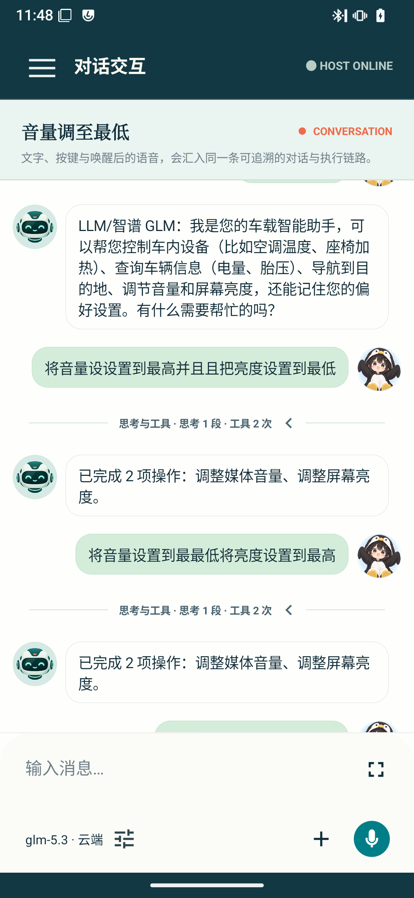
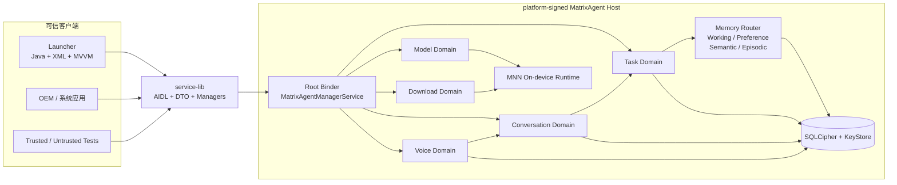

<div align="center">

# MatrixAgent

### 面向 Android 系统镜像的本地智能 Agent 运行时

把身份、调度、模型、记忆、语音、下载与审计收敛到可信系统进程，<br>
让应用只通过稳定 SDK 使用 Agent 能力。

<p>
  
  
  
  
  
</p>

[界面预览](#界面预览) · [功能概览](#功能概览) · [对话与语音](#对话与语音) · [分层记忆](#分层记忆) · [系统架构](#系统架构) · [快速开始](#快速开始) · [SDK 接入](#sdk-接入) · [质量验证](#质量验证)

</div>

> [!IMPORTANT]
> MatrixAgent 面向定制 Android ROM 和系统镜像集成。Host 依赖 platform 签名、system UID 与系统服务能力，不是一个下载后即可在任意手机上独立运行的普通 APK。

## 为什么是 MatrixAgent

MatrixAgent 将 Agent 的执行能力放在系统 Host 中统一管理。Host 是唯一执行权威，Launcher、OEM 应用和其他可信客户端通过版本化 SDK 使用模型、对话、任务与语音能力。

| 设计目标 | MatrixAgent 的做法 |
|---|---|
| **系统级可信执行** | 调用方身份、用户、音区、车辆状态与策略判断均由 Host 生成，客户端不能伪造 |
| **稳定客户端边界** | AIDL、DTO、错误码与五个 Manager 独立发布，使用契约哈希和版本协商保护兼容性 |
| **统一模型入口** | 云端 API、局域网服务与 MNN 端侧模型共享同一模型域和生命周期 |
| **对话与语音闭环** | 文字、PTT 与唤醒后的语音最终转写进入同一对话执行链；Host 管理录音、模型、焦点与播报 |
| **可控的分层记忆** | 按用户与音区隔离；偏好、事实显式保存，事件摘要自动保存，支持精确读取、逐条删除与清除恢复 |
| **默认安全失败** | 签名权限、调用方复验、受控网络端点、SQLCipher 与 KeyStore 共同构成安全边界 |

## 界面预览

以下为 **v0.6.14 · Mi 9 SE · Android 15 / LineageOS 22.2** 真机截图，更新于 **2026-09-25**。点击图片可查看原图；页面中的模型、会话和安装状态为采集时的设备状态。

<table>
  <tr>
    <th align="center">对话交互</th>
    <th align="center">任务工作台</th>
    <th align="center">语音会话</th>
  </tr>
  <tr>
    <td align="center"><a href="docs/images/launcher-conversation.png"></a></td>
    <td align="center"><a href="docs/images/launcher-tasks.png"></a></td>
    <td align="center"><a href="docs/images/launcher-voice.png"></a></td>
  </tr>
  <tr>
    <td align="center"><sub>多轮消息 · 执行反馈 · 模型胶囊</sub></td>
    <td align="center"><sub>提交意图 · 取消任务 · 查看轨迹</sub></td>
    <td align="center"><sub>录音状态 · 打断 · TTS 配置</sub></td>
  </tr>
  <tr>
    <th align="center">模型接入</th>
    <th align="center">模型市场</th>
    <th align="center">工作区导航</th>
  </tr>
  <tr>
    <td align="center"><a href="docs/images/launcher-models.png"></a></td>
    <td align="center"><a href="docs/images/launcher-downloads.png"></a></td>
    <td align="center"><a href="docs/images/launcher-drawer.png"></a></td>
  </tr>
  <tr>
    <td align="center"><sub>云端 · 局域网 · MNN 端侧</sub></td>
    <td align="center"><sub>浏览目录 · 下载与安装 · 本地库存</sub></td>
    <td align="center"><sub>五个工作区入口 · Host 连接状态</sub></td>
  </tr>
</table>

[截图来源与更新方式](docs/images/README.md)。车辆控制的集成范围见[当前边界](#当前边界)。

## 功能概览

| | |
|---|---|
| **01 · 任务运行时**<br><br>自然语言任务、订阅、取消、追加指令与进程重启恢复；支持主驾优先仲裁、会话隔离、总 deadline、工具策略检查和 readback 验证。 | **02 · 持久化对话**<br><br>文字、PTT、唤醒三种输入统一入链；同一会话串行执行，消息、状态、幂等键和任务关联均可恢复。 |
| **03 · 语音闭环**<br><br>端侧 Vosk / Sherpa ASR、实时转写、唤醒、PTT、VAD、音频焦点和前台麦克风服务；状态明确呈现等待、录音、思考、播报与打断。 | **04 · 模型运行时**<br><br>统一接入 OpenAI Chat、Anthropic Messages、Gemini、Ollama 与 MNN 端侧协议；API Key 仅通过一次性 Binder 管道进入 Host。 |
| **05 · 模型市场与语音资源**<br><br>目录缓存、Range 断点续传、暂停、恢复、取消、删除和原子安装；识别与 Piper 语音模型同样具有安装事实与可见进度。 | **06 · 数据、安全与 SDK**<br><br>Room + SQLCipher、Android KeyStore、敏感字段脱敏、epoch gate、签名权限和逐事务调用方校验；Launcher 只依赖 AAR。 |
| **07 · 四层记忆**<br><br>Working 核验状态、Preference 偏好、Semantic 事实与 Episodic 事件协同召回；相关性过滤、分层预算与统一安全投影控制进入模型的内容。 | **08 · 用户数据控制**<br><br>偏好目录、历史 key 安全别名、逐条忘记与事务化清除；清除后拒绝旧请求写回，恢复失败时保留待清理标记并使用易失存储。 |

### 模型接入矩阵

| 运行位置 | 已支持入口 |
|---|---|
| 云端 | 智谱 GLM、DeepSeek、通义千问、Moonshot Kimi、火山方舟 / 豆包、Anthropic Claude、Google Gemini |
| 局域网 | Ollama、LM Studio、vLLM |
| 自定义 | OpenAI-Compatible Endpoint |
| 端侧 | 已下载并安装的 MNN-LLM 模型 |

### 语音模型管理

- 首次使用前由用户显式下载中英文 Vosk 或 Sherpa 端侧识别资源，并查看实时下载进度；启动录音不会隐式拉取大文件。
- 已安装资源展示语言、版本与占用空间，可独立删除；删除后相应下载入口自动恢复。
- 下载具备校验、版本指针、安装锁与失败回滚，模型“已安装”只在有效版本指针切换后成立。
- `RECORD_AUDIO` 未授权、前台服务被拒或模型未就绪时返回明确状态，不降级为隐形后台录音。

## 对话与语音

### 一个执行入口，三类输入

文字、按住说话（PTT）和“唤醒词后的最终转写”都由 `ConversationCoordinator` 接收。输入先完成校验与持久化，再按 `conversationId` 进入串行执行 lane：同一对话能看到前一轮的已完成上下文，不同对话互不阻塞。语音 partial 仅在内存和订阅中传递，用于实时 UI；只有最终接受的文本才成为用户消息并触发 Agent。

每次接受会原子写入用户消息、顺序号、幂等键、任务关联与只读提示。执行过程使用以下状态，进程终止后不会遗留伪“进行中”结果：

| 状态 | 含义 |
|---|---|
| `ACCEPTED` / `RUNNING` | 已持久化，或已进入该对话的执行 lane |
| `COMPLETED` / `FAILED` / `CANCELLED` / `REJECTED` | 可确定的终态 |
| `EXECUTION_UNKNOWN` | 写操作在进程中断、超时或取消后无法确认；绝不伪装成“已撤销” |

应用重启会对未收敛记录进行对账。对话正文按产品数据处理，存放在 SQLCipher 数据库并纳入清除用户数据路径；日志和审计投影保持脱敏。

### 对话工作区

- 支持多行输入、全屏编辑、模型状态胶囊和文本附件；运行中的补充输入由 Host 判断追加到当前任务还是创建新轮次。
- 草稿由 Host 加密持久化，保存与提交按会话排序，避免迟到的保存重新生成已提交草稿。
- 消息可引用、复制、从已完成的用户消息创建分支；会话标题可重命名。运行阶段和工具执行反馈来自 Host 订阅。

### 语音会话与播报

- PTT 的“松开”与“取消”是不同意图：前者冲刷 ASR final，后者终止本轮；endpoint 与手动冲刷共享幂等保护，不能双投递。
- 唤醒、PTT 和文字输入最终使用同一对话任务链。语音桥以 `voiceSessionId` / task 关联和响应 token 防止迟到结果污染新会话。
- `THINKING` 有独立 watchdog；任务订阅丢失、执行超时或进程死亡都会收敛到可解释状态，不会永久停在“思考中”。
- 录音期间由按需的 microphone 前台服务维持合规性，Audio Focus、打断与 TTS 的唯一权威仍是语音会话控制器。

### TTS 路由

播报引擎按“已配置腾讯云 TTS → 已安装 Piper 端侧 TTS → Android 系统 TTS”选择。腾讯云凭证通过一次性 Binder 管道进入 Host，并由 Android KeyStore 加密保存；配置投影和日志均不返回密钥。单次云端失败会在同一 utterance 上自动交给本地引擎，只有两者均失败才向上报告 `VOICE_OUTPUT_UNAVAILABLE`。

腾讯云接入是可选增强：网络、地域、账号权限和设备音频链路仍需要在目标 ROM 真机完成端到端认证，凭证不得写入仓库、截图或 issue。

## 分层记忆

对话正文提供连续交流所需的上下文；记忆模块按当前问题，从用户与音区所属范围内选取可复用的信息。所有持久化入口在 Host 内校验请求身份，`zone` 统一使用小写规范值。

### 四层各自保存什么

| 层 | 写入来源与内容 | 召回与保留范围 |
|---|---|---|
| **Working · 会话状态** | 仅由成功且经过核验的工具回读更新空调温度，绑定会话、用户与音区 | 温控相关问题最多召回 1 条；内存会话默认 30 分钟 TTL、最多 32 个会话 |
| **Preference · 长期偏好** | 用户明确指定要记住的偏好及值，例如温度、座椅加热与媒体音量 | 按当前问题相关性排序；每用户 / 音区最多 1024 条，达到上限仍可更新已有条目 |
| **Semantic · 长期事实** | 用户明确要求保存的事实，key 使用 `family.*`、`allergy.*`、`work.*` 或 `fact.*` 命名空间 | 无相关匹配时不召回；每用户 / 音区最多 1024 条，正文通过 `memory.semantic.get` 精确读取 |
| **Episodic · 事件摘要** | 自动记录 `SUCCEEDED` / `FAILED` 任务的终态与有限事实；每条最多 3 个已核验事实 | 仅历史意图触发召回；每用户 / 音区保留最近 100 条、30 天内事件，每条摘要最多 2048 UTF-8 字节 |

Episodic v2 的事实范围包括导航目的地、空调温度、座椅加热、媒体音量与屏幕亮度；目的地还必须字面出现于当轮用户请求。事件摘要不保存用户原文、模型回复、工具参数或完整轨迹，旧版摘要也无法还原这些细节。

### 召回、读取与忘记

- **相关性与预算**：Router 优先为偏好保留名额，分别限制 Working、Semantic 和 Episodic 的数量；Prompt 记忆区最多 8 条、1024 UTF-8 字节。
- **统一投影**：`MemoryKeyCatalog` 集中管理 key 规范、意图词、匹配规则和安全投影。Prompt 仅直接展示受控范围内的温度、座椅、音量偏好值及 Working 温控状态；Semantic 只展示 key，Episodic 展示类别、终态与事件编号，详情按工具读取。
- **逐条控制**：Preference 提供 `save / get / list / delete`，Semantic 提供 `save / get / delete`，Episodic 提供 `get / delete`。历史非法 Preference key 可通过分页目录中的稳定别名读取、删除，原始 key 不进入 Prompt。
- **明确删除目标**：保存和删除均校验用户意图及指定内容；事件删除要求用户明确选择完整事件编号。模型发现某条历史事件不意味着获得删除授权。
- **清除与恢复**：记忆表删除和 epoch 自增在同一事务完成，旧请求不能写回已清除的数据。数据库不可用时保留待清理标记；恢复完成前使用易失存储，避免旧持久化数据重新进入业务域。

实现入口：[记忆模块](matrix-agent-service/src/main/java/com/matrix/agent/data/memory)、[事件摘要](matrix-agent-service/src/main/java/com/matrix/agent/task/persistence/EpisodicSummary.java)、[完整评审与实施记录](docs/记忆模块问题与修复方案.md)。

## 系统架构



客户端先连接 Root Binder，再取得任务、对话、模型、下载和语音五个类型安全的域 Manager。Host 通过 `ServiceManager.addService()` 注册系统服务，同时保留签名权限保护的显式绑定入口；Binder 死亡后，SDK 会重连并恢复活动订阅。

记忆模块由 Host 内部的任务链和 Capability 调用，身份从当前请求派生；客户端通过现有任务 / 对话入口使用记忆能力。

### 边界原则

1. **Host 拥有事实**：身份、调度状态、密钥、模型文件、录音和持久化数据均由 Host 管理。
2. **SDK 拥有契约**：客户端只看到稳定 DTO、错误码和 Manager，不依赖 Host 内部包结构。
3. **Launcher 只负责呈现**：页面状态来自 SDK 投影，UI 不绕过契约读取数据库或文件系统。
4. **失败必须可见**：权限、版本、网络、模型与执行错误均映射为显式状态，不静默降级。

### 模块划分

| 模块 | 交付物 | 主要职责 |
|---|---|---|
| `matrix-agent-service` | `com.matrix.agent` APK | system UID Host、五域 Stub、任务引擎、对话协调、分层记忆、模型、语音、下载、持久化与审计 |
| `matrix-agent-service-lib` | AAR | AIDL、Parcelable DTO、常量、`MatrixAgent` 门面与五个客户端 Manager |
| `matrix-agent-launcher` | `com.matrix.agent.launcher` APK | SDK-only 工作区，展示任务、对话、语音、模型接入与模型市场 |
| `matrix-agent-test` | trusted / untrusted APK | 跨 APK 权限、身份、契约与 Binder 行为验证 |
| `ondevice` | Android Library + JNI | MNN-LLM Java 边界与 native 生命周期管理，不暴露给客户端 |

## 快速开始

### 环境要求

- macOS 或 Linux、JDK 17
- Android SDK 36、Build Tools 与 Platform Tools
- Android NDK、CMake 3.22.1
- Gradle Wrapper 9.3.1、Android Gradle Plugin 9.0.1
- `arm64-v8a` 目标设备
- 与目标 ROM 匹配的 platform 证书和同一 ROM 产出的 framework compile stub

当前认证基线为 Mi 9 SE（`grus`）、Android 15、LineageOS 22.2。Host 使用 `android:sharedUserId="android.uid.system"` 和 hidden `ServiceManager` API，不能使用另一套 ROM 的签名或普通 `android.jar` 替代。

### 1. 获取源码与子模块

```bash
git clone --recurse-submodules https://github.com/Zcorpius/MatrixAgentProject.git
cd MatrixAgentProject
```

已经 clone 的工作区可单独初始化 MNN：

```bash
git submodule update --init --recursive
```

`ondevice/src/main/cpp/MNN` 固定为上游提交 `18759c835f7c36d3fcaec25f6d9a029386e802f8`。

### 2. 配置本机 Android SDK

在根目录创建不提交到仓库的 `local.properties`：

```properties
sdk.dir=/absolute/path/to/Android/sdk
```

### 3. 准备系统构建材料

三个 APK 模块分别从自己的 `tools/key/` 目录读取：

```text
platform.p12
platform.x509.pem
signing.properties
```

Service 还需要目标 ROM 生成的 framework compile stub：

```text
matrix-agent-service/tools/framework/framework-lineage-grus.jar
```

更新方法见 [`matrix-agent-service/tools/framework/README.md`](matrix-agent-service/tools/framework/README.md)。生产 platform 私钥不得提交到公共仓库，也不要在不同 ROM 间复用。

### 4. 构建

```bash
./buildTool.sh all debug
```

也可以按模块和变体构建：

```bash
./buildTool.sh service release
./buildTool.sh launcher debug
./buildTool.sh test release
```

脚本会执行 clean、构建、签名指纹校验与原子归档。产物位于 `outputs/`，版本统一读取根目录的 `gradle.properties`：

```properties
MATRIX_VERSION_NAME=0.6.14
MATRIX_VERSION_CODE=6014
```

### 5. 安装与启动

目标设备必须使用与 APK 相同的 platform 证书：

```bash
adb install -r outputs/matrix-agent-service-debug-v0.6.14-6014-*.apk
adb install -r outputs/matrix-agent-launcher-debug-v0.6.14-6014-*.apk
adb shell am start -n com.matrix.agent.launcher/.LauncherActivity
```

系统镜像集成时，将 release APK 作为 `priv-app` 预埋，通过 `android_app_import` 加入产品包，并同步维护产品 makefile、默认权限与 SELinux 策略。平台证书、framework stub、预埋 APK 和设备 ROM 必须来自同一构建基线。

## SDK 接入

发布本地 Maven 版本：

```bash
./gradlew :matrix-agent-service-lib:publishToMavenLocal
```

可信客户端声明签名权限并依赖 AAR：

```xml
<uses-permission android:name="com.matrix.agent.permission.ACCESS_AGENT" />
```

```kotlin
dependencies {
    implementation("com.matrix.agent:matrix-agent-service-lib:0.6.14")
}
```

Java 客户端使用异步连接，不阻塞主线程：

```java
MatrixAgent agent = MatrixAgent.createAsyncHandle(context, (client, state) -> {
    if (state != ConnectionState.CONNECTED) return;

    MatrixAgentManager tasks = client.getAgentManager();
    AgentRequest request = new AgentRequest(
            UUID.randomUUID().toString(),
            "launcher-session",
            "把主驾温度调到 24 度，然后导航回家",
            AgentRequest.INPUT_TEXT,
            "zh-CN");

    tasks.submit(request, event -> {
        // SDK 已将回调投递到事件 Handler；这里只更新调用方状态。
    });
});

// 页面或进程组件销毁时释放连接。
agent.release();
```

`MatrixAgent` 提供 `getAgentManager()`、`getConversationManager()`、`getModelManager()`、`getDownloadManager()` 和 `getVoiceManager()`。订阅接口返回 `AutoCloseable`，调用方必须在生命周期结束时关闭。

对话接口同样只经 SDK 使用；不要让客户端直接访问 Host 数据库：

```java
ConversationManager conversations = client.getConversationManager();
ConversationInfo conversation = conversations.createConversation(
        new CreateConversationRequest("回家路上", "zh-CN"),
        UUID.randomUUID().toString());

conversations.sendText(new SendTextRequest(
        conversation.conversationId, "把屏幕亮度调低一点", "zh-CN"),
        UUID.randomUUID().toString());
```

PTT 绑定通过 `createVoiceBinding()` 创建一次性关联，再由语音域开始会话；语音 partial 通过 `ConversationManager.subscribeConversation()` 订阅，客户端应在生命周期结束时关闭返回的 `AutoCloseable`。

## 质量验证

不连接设备即可运行完整质量门禁：

```bash
./gradlew verifyArchitecture
```

该任务覆盖五个模块的单元测试、lint、架构边界检查，并验证发布 SDK 的元数据不携带 Kotlin runtime。

连接正确签名的真机后，按验证目标选择：

| 目标 | 命令 |
|---|---|
| Host 与 trusted / untrusted 跨 APK | `./gradlew :matrix-agent-test:connectedLocalHostIntegrationAndroidTest` |
| Vosk / Sherpa、麦克风、TTS、焦点与前台服务 | `./gradlew :matrix-agent-service:connectedVoiceCertificationAndroidTest` |
| MNN 模型与 native tool-call | `./gradlew :matrix-agent-service:connectedOnDeviceCertificationAndroidTest` |

### 记忆模块验收记录

以下为 **2026-09-25 记忆修复阶段的已有验收结果**，范围为 Host 单元测试与相关设备测试；详细用例及阶段记录见[实施文档 §27–§28](docs/记忆模块问题与修复方案.md)。

| 验收范围 | 结果 |
|---|---|
| Host JVM 全套 `:matrix-agent-service:testDebugUnitTest` | 1281 项通过，失败 / 错误 / 跳过均为 0 |
| Host `assembleDebug` / `assembleDebugAndroidTest` | 构建通过 |
| A–K 修复阶段真机测试 | 9 个测试类、45 项通过，覆盖迁移、事务清除、恢复、目录与 SQLCipher |
| 后续 P3 增量真机回归 | 2 个相关测试类、12 项通过，覆盖空音区、中文历史意图和目录冲突等 |

两批真机结果分别记录，不合并为一次测试数量。仪器测试使用独立数据库和隔离环境；本次 README 更新重新采集了六个真机页面，未重跑上述测试集。

## 当前边界

- 车辆 Capability 默认装配仍是 emulator / demo Provider；接入真实车辆前需实现 OEM/VHAL Provider，并复用现有策略、参数校验与 readback 契约。
- Working 当前仅支持已核验温控状态；Episodic 仅支持上述事实白名单，尚无联系人或拨号历史。旧事件的未保存信息无法补回。
- 事件逐条删除仍使用完整 32 位十六进制编号；短编号确认与可视化记忆管理页尚未实现。记忆检索使用受控词表和关键词评分，尚无向量检索。
- `ondevice` 首发为 arm64 CPU 路径，GPU 后端关闭；模型体积和峰值内存需按目标硬件验证。
- 当模型市场上游目录没有发布者签名或逐文件摘要时，Host 只能提供固定 HTTPS 来源、大小限制、结构校验和最后一次可用缓存，不能将其描述为独立可信根。
- 系统语音、端侧推理和跨 APK 权限属于真机能力；普通 JVM 测试通过不代表真机认证已经通过。
- 腾讯云 TTS 的凭证配置、云端返回、Piper/系统 TTS 回退和实际扬声器输出必须一起做真机闭环验收；仅配置成功不等于已验证播报成功。

## 设计文档

- [记忆模块问题与修复方案](docs/记忆模块问题与修复方案.md)：逐项评审、修复方案、实施记录、真机验收与产品边界
- [MatrixAgent 项目详细评审报告](docs/MatrixAgent项目详细评审报告.md)：项目架构与各模块评审；阅读时结合后续专项实施记录
- [`MatrixAgent对话交互与统一语音架构设计.md`](MatrixAgent对话交互与统一语音架构设计.md)：对话持久化、语音 ingress、TTS 回注与恢复语义
- [Matrix 对话输入交互增强任务设计](Matrix对话输入交互增强任务设计.md)：全屏编辑、运行状态、加密草稿、模型胶囊与上下文附件
- [Framework 编译桩说明](matrix-agent-service/tools/framework/README.md)：目标 ROM 的 framework stub 更新与核对
- [界面截图说明](docs/images/README.md)：真机图片来源、页面清单与采集方式

---

<div align="center">
  <sub>MatrixAgent · System-owned intelligence for Android</sub>
</div>
