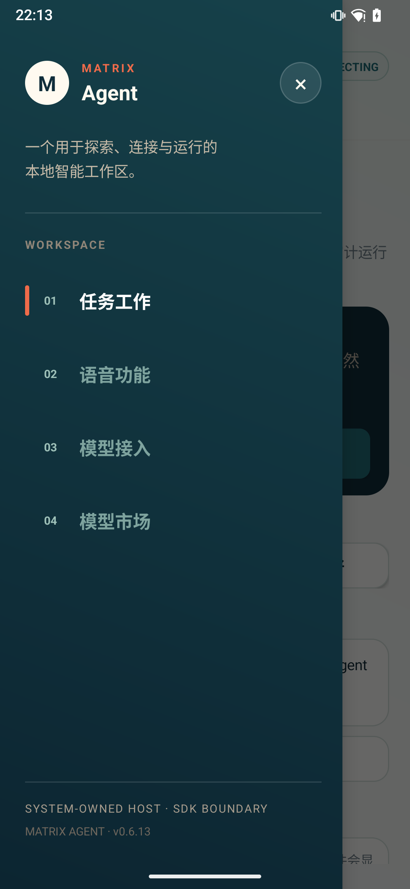
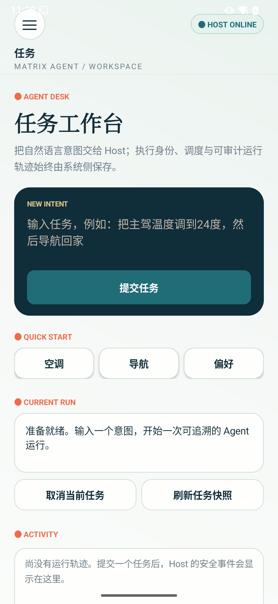
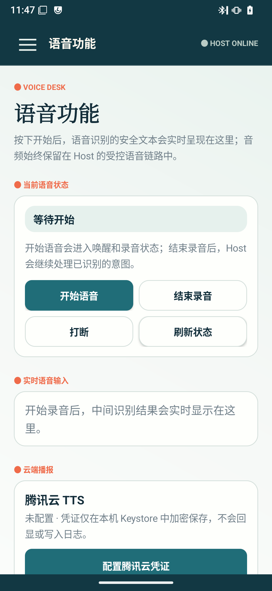
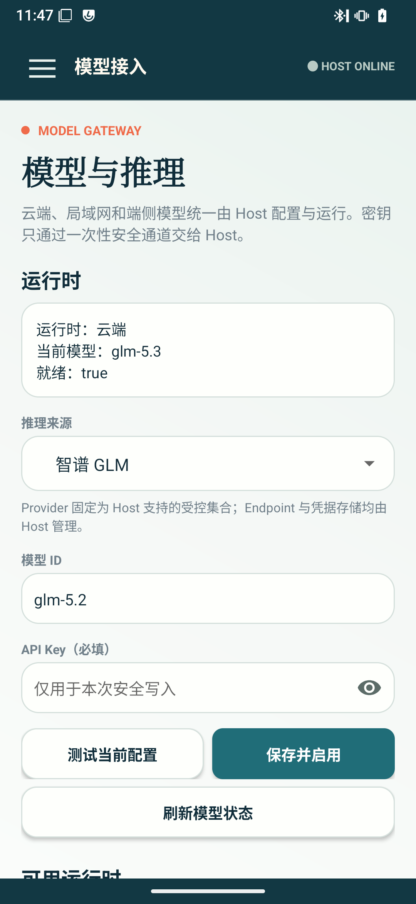
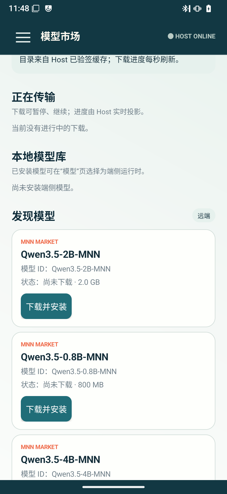
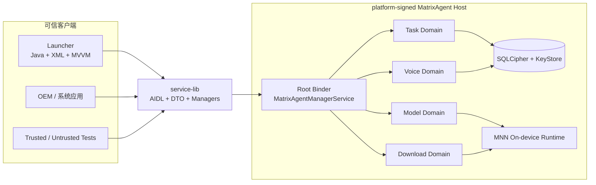

<div align="center">

# MatrixAgent

### 面向 Android 系统镜像的本地智能 Agent 运行时

把身份、调度、模型、记忆、语音、下载与审计收敛到可信系统进程，<br>
让应用只通过稳定 SDK 使用 Agent 能力。

<p>
  
  
  
  
  
</p>

[功能概览](#功能概览) · [界面预览](#界面预览) · [系统架构](#系统架构) · [快速开始](#快速开始) · [SDK 接入](#sdk-接入) · [质量验证](#质量验证)

</div>

> [!IMPORTANT]
> MatrixAgent 面向定制 Android ROM 和系统镜像集成。Host 依赖 platform 签名、system UID 与系统服务能力，不是一个下载后即可在任意手机上独立运行的普通 APK。

## 为什么是 MatrixAgent

普通聊天应用把 UI、密钥、模型调用和工具执行放在同一进程里；MatrixAgent 则把 Agent 设计成系统基础设施。Host 是唯一执行权威，Launcher、OEM 应用和其他可信客户端都只能通过版本化 SDK 与它交互。

| 设计目标 | MatrixAgent 的做法 |
|---|---|
| **系统级可信执行** | 调用方身份、用户、音区、车辆状态与策略判断均由 Host 生成，客户端不能伪造 |
| **稳定客户端边界** | AIDL、DTO、错误码与四个 Manager 独立发布，使用契约哈希和版本协商保护兼容性 |
| **统一模型入口** | 云端 API、局域网服务与 MNN 端侧模型共享同一模型域和生命周期 |
| **离线语音闭环** | Host 管理录音、Vosk ASR、实时转写、模型下载、音频焦点与 Android TTS |
| **默认安全失败** | 签名权限、调用方复验、受控网络端点、SQLCipher 与 KeyStore 共同构成安全边界 |

## 界面预览

以下截图来自 Mi 9 SE（`grus`）真机上的 v0.6.13 Launcher。界面为系统状态栏保留安全区域，并将主要能力收敛为四个对称入口。

<table>
  <tr>
    <td align="center"></td>
    <td align="center"></td>
    <td align="center"></td>
    <td align="center"></td>
    <td align="center"></td>
  </tr>
  <tr>
    <td align="center"><sub>工作区导航</sub></td>
    <td align="center"><sub>任务工作</sub></td>
    <td align="center"><sub>语音功能</sub></td>
    <td align="center"><sub>模型接入</sub></td>
    <td align="center"><sub>模型市场</sub></td>
  </tr>
</table>

## 功能概览

| | |
|---|---|
| **01 · 任务运行时**<br><br>自然语言任务、事件订阅、取消、追加指令与进程重启恢复；支持主驾优先仲裁、会话隔离、总 deadline、工具策略检查和 readback 验证。 | **02 · 离线语音**<br><br>PTT 会话状态机、Vosk 实时与最终转写、Android TTS 和音频焦点；页面明确展示等待、录音、处理与打断等状态。 |
| **03 · 模型运行时**<br><br>统一接入 OpenAI Chat、Anthropic Messages、Gemini、Ollama 与 MNN 端侧协议；API Key 仅通过一次性 Binder 管道进入 Host。 | **04 · 数据与安全**<br><br>Room + SQLCipher、Android KeyStore、敏感字段脱敏、epoch gate、签名权限和逐事务调用方校验。 |
| **05 · 模型市场**<br><br>目录缓存、Range 断点续传、暂停、恢复、取消、删除和原子安装；传输队列、本地模型与远端模型分开展示。 | **06 · 可发布 SDK**<br><br>Launcher 只依赖 AAR，不接触 Host 实现、原始 Binder、模型真实 URL 或本地文件路径。 |

### 模型接入矩阵

| 运行位置 | 已支持入口 |
|---|---|
| 云端 | 智谱 GLM、DeepSeek、通义千问、Moonshot Kimi、火山方舟 / 豆包、Anthropic Claude、Google Gemini |
| 局域网 | Ollama、LM Studio、vLLM |
| 自定义 | OpenAI-Compatible Endpoint |
| 端侧 | 已下载并安装的 MNN-LLM 模型 |

### 语音模型管理

- 首次使用前可显式下载中英文 Vosk 离线识别模型，并查看实时下载进度。
- 已安装模型展示语言、版本与占用空间，可独立删除；删除后下载入口会自动恢复。
- 下载过程具备 SHA-256 校验、版本指针、安装锁和失败回滚，不会在启动录音时隐式触发大文件下载。
- `RECORD_AUDIO` 未授权、前台服务被拒或模型未就绪时均返回明确状态，不转为隐形后台录音。

## 系统架构



客户端先连接 Root Binder，再取得任务、模型、下载和语音四个类型安全的域 Manager。Host 通过 `ServiceManager.addService()` 注册系统服务，同时保留签名权限保护的显式绑定入口；Binder 死亡后，SDK 会重连并恢复活动订阅。

### 边界原则

1. **Host 拥有事实**：身份、调度状态、密钥、模型文件、录音和持久化数据均由 Host 管理。
2. **SDK 拥有契约**：客户端只看到稳定 DTO、错误码和 Manager，不依赖 Host 内部包结构。
3. **Launcher 只负责呈现**：页面状态来自 SDK 投影，UI 不绕过契约读取数据库或文件系统。
4. **失败必须可见**：权限、版本、网络、模型与执行错误均映射为显式状态，不静默降级。

### 模块划分

| 模块 | 交付物 | 主要职责 |
|---|---|---|
| `matrix-agent-service` | `com.matrix.agent` APK | system UID Host、四域 Stub、任务引擎、模型、语音、下载、持久化与审计 |
| `matrix-agent-service-lib` | AAR | AIDL、Parcelable DTO、常量、`MatrixAgent` 门面与四个客户端 Manager |
| `matrix-agent-launcher` | `com.matrix.agent.launcher` APK | SDK-only 工作区，展示任务、语音、模型接入与模型市场 |
| `matrix-agent-test` | trusted / untrusted APK | 跨 APK 权限、身份、契约与 Binder 行为验证 |
| `ondevice` | Android Library + JNI | MNN-LLM Java 边界与 native 生命周期管理，不暴露给客户端 |

## 快速开始

### 环境要求

- macOS 或 Linux、JDK 17
- Android SDK 36、Build Tools 与 Platform Tools
- Android NDK、CMake 3.22.1
- Gradle Wrapper 9.3.1、Android Gradle Plugin 9.0.1
- `arm64-v8a` 目标设备
- 与目标 ROM 匹配的 platform 证书和同一 ROM 产出的 framework compile stub

当前认证基线为 Mi 9 SE（`grus`）、Android 15、LineageOS 22.2。Host 使用 `android:sharedUserId="android.uid.system"` 和 hidden `ServiceManager` API，不能使用另一套 ROM 的签名或普通 `android.jar` 替代。

### 1. 获取源码与子模块

```bash
git clone --recurse-submodules https://github.com/Zcorpius/MatrixAgentProject.git
cd MatrixAgentProject
```

已经 clone 的工作区可单独初始化 MNN：

```bash
git submodule update --init --recursive
```

`ondevice/src/main/cpp/MNN` 固定为上游提交 `18759c835f7c36d3fcaec25f6d9a029386e802f8`。

### 2. 配置本机 Android SDK

在根目录创建不提交到仓库的 `local.properties`：

```properties
sdk.dir=/absolute/path/to/Android/sdk
```

### 3. 准备系统构建材料

三个 APK 模块分别从自己的 `tools/key/` 目录读取：

```text
platform.p12
platform.x509.pem
signing.properties
```

Service 还需要目标 ROM 生成的 framework compile stub：

```text
matrix-agent-service/tools/framework/framework-lineage-grus.jar
```

更新方法见 [`matrix-agent-service/tools/framework/README.md`](matrix-agent-service/tools/framework/README.md)。生产 platform 私钥不得提交到公共仓库，也不要在不同 ROM 间复用。

### 4. 构建

```bash
./buildTool.sh all debug
```

也可以按模块和变体构建：

```bash
./buildTool.sh service release
./buildTool.sh launcher debug
./buildTool.sh test release
```

脚本会执行 clean、构建、签名指纹校验与原子归档。产物位于 `outputs/`，版本统一读取根目录的 `gradle.properties`：

```properties
MATRIX_VERSION_NAME=0.6.13
MATRIX_VERSION_CODE=6013
```

### 5. 安装与启动

目标设备必须使用与 APK 相同的 platform 证书：

```bash
adb install -r outputs/matrix-agent-service-debug-v0.6.13-6013-*.apk
adb install -r outputs/matrix-agent-launcher-debug-v0.6.13-6013-*.apk
adb shell am start -n com.matrix.agent.launcher/.LauncherActivity
```

系统镜像集成时，将 release APK 作为 `priv-app` 预埋，通过 `android_app_import` 加入产品包，并同步维护产品 makefile、默认权限与 SELinux 策略。平台证书、framework stub、预埋 APK 和设备 ROM 必须来自同一构建基线。

## SDK 接入

发布本地 Maven 版本：

```bash
./gradlew :matrix-agent-service-lib:publishToMavenLocal
```

可信客户端声明签名权限并依赖 AAR：

```xml
<uses-permission android:name="com.matrix.agent.permission.ACCESS_AGENT" />
```

```kotlin
dependencies {
    implementation("com.matrix.agent:matrix-agent-service-lib:0.6.13")
}
```

Java 客户端使用异步连接，不阻塞主线程：

```java
MatrixAgent agent = MatrixAgent.createAsyncHandle(context, (client, state) -> {
    if (state != ConnectionState.CONNECTED) return;

    MatrixAgentManager tasks = client.getAgentManager();
    AgentRequest request = new AgentRequest(
            UUID.randomUUID().toString(),
            "launcher-session",
            "把主驾温度调到 24 度，然后导航回家",
            AgentRequest.INPUT_TEXT,
            "zh-CN");

    tasks.submit(request, event -> {
        // SDK 已将回调投递到事件 Handler；这里只更新调用方状态。
    });
});

// 页面或进程组件销毁时释放连接。
agent.release();
```

`MatrixAgent` 提供 `getAgentManager()`、`getModelManager()`、`getDownloadManager()` 和 `getVoiceManager()`。订阅接口返回 `AutoCloseable`，调用方必须在生命周期结束时关闭。

## 质量验证

不连接设备即可运行完整质量门禁：

```bash
./gradlew verifyArchitecture
```

该任务覆盖五个模块的单元测试、lint、架构边界检查，并验证发布 SDK 的元数据不携带 Kotlin runtime。

连接正确签名的真机后，按验证目标选择：

| 目标 | 命令 |
|---|---|
| Host 与 trusted / untrusted 跨 APK | `./gradlew :matrix-agent-test:connectedLocalHostIntegrationAndroidTest` |
| Vosk、麦克风、TTS 与音频焦点 | `./gradlew :matrix-agent-service:connectedVoiceCertificationAndroidTest` |
| MNN 模型与 native tool-call | `./gradlew :matrix-agent-service:connectedOnDeviceCertificationAndroidTest` |

## 当前边界

- 车辆 Capability 默认装配仍是 emulator / demo Provider；接入真实车辆前需实现 OEM/VHAL Provider，并复用现有策略、参数校验与 readback 契约。
- `ondevice` 首发为 arm64 CPU 路径，GPU 后端关闭；模型体积和峰值内存需按目标硬件验证。
- 当模型市场上游目录没有发布者签名或逐文件摘要时，Host 只能提供固定 HTTPS 来源、大小限制、结构校验和最后一次可用缓存，不能将其描述为独立可信根。
- 系统语音、端侧推理和跨 APK 权限属于真机能力；普通 JVM 测试通过不代表真机认证已经通过。

## 设计文档

- [`MatrixAgent架构重构实施方案.md`](MatrixAgent架构重构实施方案.md)：当前重构落地结果、包结构和验证标准
- [`MatrixAgent重构架构设计与功能实现-重整版.md`](MatrixAgent重构架构设计与功能实现-重整版.md)：目标架构、契约与阶段设计
- [`matrix-agent-service代码架构评审.md`](matrix-agent-service代码架构评审.md)：源码评审、已修复项与剩余边界
- [`MatrixAgent当前架构与功能实现.md`](MatrixAgent当前架构与功能实现.md)：迁移前单 APK 历史基线，仅用于追溯

---

<div align="center">
  <sub>MatrixAgent · System-owned intelligence for Android</sub>
</div>
