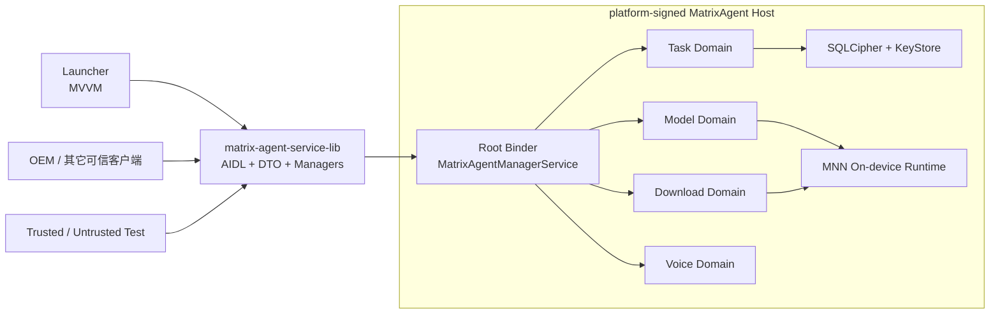

<div align="center">

# MatrixAgent

**面向 Android 系统镜像的本地智能 Agent 运行时**

系统侧负责身份、调度、模型、记忆、下载与审计；应用侧只通过稳定 SDK 发起请求。

`v0.6.13` · `Java 17` · `Android 15 / LineageOS 22.2` · `arm64-v8a`

</div>

<p align="center">
  
</p>

## 项目简介

MatrixAgent 不是把 UI、模型密钥和执行逻辑塞进同一个 APK 的聊天 Demo。它由系统级 Host、
客户端 SDK、Launcher、跨 APK 测试客户端和端侧推理适配层组成：

- **Host 是唯一执行权威**：可信身份、任务调度、模型调用、持久化、语音和文件下载全部在系统进程完成。
- **Launcher 是纯 SDK 客户端**：采用 Java + XML + MVVM，只渲染状态，不接触 Host 实现、原始 Binder 或模型文件路径。
- **契约可独立发布**：AIDL、DTO、错误码与四个 Manager 位于 `matrix-agent-service-lib`，带确定性的契约哈希和版本协商。
- **安全默认失败**：签名权限、调用方校验、SQLCipher、Android KeyStore、受控网络端点和显式错误状态共同组成边界。
- **云端、局域网与端侧统一**：同一模型域可管理云端 API、Ollama / LM Studio / vLLM 和 MNN 端侧模型。

## Launcher

Launcher 用一套克制的工作区界面承载三个页面：任务、模型与模型市场。以下截图来自
Mi 9 SE（`grus`）真机上的 v0.6.13 Launcher。

<table>
  <tr>
    <td align="center"></td>
    <td align="center"></td>
    <td align="center"></td>
  </tr>
  <tr>
    <td align="center"><sub>任务工作台</sub></td>
    <td align="center"><sub>模型与推理</sub></td>
    <td align="center"><sub>模型市场与本地模型库</sub></td>
  </tr>
</table>

## 架构



外部客户端先连接 Root Binder，再取得四个类型安全的域 Manager。Host 同时通过
`ServiceManager.addService()` 注册系统服务，并保留签名权限保护的显式绑定入口，供不使用
hidden API 的普通可信 APK 连接。Binder 死亡后 SDK 会重连并恢复活动订阅。

### 模块

| 模块 | 交付物 | 职责 |
|---|---|---|
| `matrix-agent-service` | `com.matrix.agent` APK | system UID Host、Root Binder、四域 Stub、任务引擎、模型、下载、语音、持久化与审计 |
| `matrix-agent-service-lib` | `com.matrix.agent:matrix-agent-service-lib` AAR | AIDL、Parcelable DTO、常量、`MatrixAgent` 门面和四个客户端 Manager |
| `matrix-agent-launcher` | `com.matrix.agent.launcher` APK | SDK-only MVVM 工作区，提供任务、模型与下载页面 |
| `matrix-agent-test` | trusted / untrusted APK | 跨 APK 权限、身份、契约与 Binder 行为验证 |
| `ondevice` | Android Library + JNI | MNN-LLM Java 边界和 native 生命周期管理；不暴露给客户端 |

## 已实现能力

### 任务运行时

- 自然语言任务提交、快照、事件订阅、取消、追加指令和恢复入口。
- Host 生成可信 actor、用户、音区、仲裁键和车辆状态；客户端不能伪造这些字段。
- 主驾优先仲裁、会话隔离、有界线程池、取消令牌、总 deadline 和写操作未知态保护。
- Capability 注册、参数校验、策略前置检查、工具执行与 readback 验证。
- 持久任务在进程重启后恢复；恢复完成前以 `SERVICE_NOT_READY` 明确拒绝新请求。

### 模型运行时

| 类型 | 当前入口 |
|---|---|
| 云端 | 智谱 GLM、DeepSeek、通义千问、Moonshot Kimi、火山方舟 / 豆包、Anthropic Claude、Google Gemini |
| 局域网 | Ollama、LM Studio、vLLM |
| 自定义 | OpenAI-Compatible Endpoint |
| 端侧 | 已下载的 MNN-LLM 模型 |

Host 统一实现 OpenAI Chat、Anthropic Messages、Gemini Generate Content、Ollama Chat 和
MNN 端侧协议。API Key 通过一次性 Binder 管道进入 Host，并以 Android KeyStore 保护；
Launcher 不保存密钥，也不把密钥写入页面状态或日志。

### 模型市场与下载

- 从受控 HTTPS 来源刷新模型目录，并缓存最后一次可用目录。
- WorkManager 负责持久 admission，前台 Service 负责用户可见的长时传输。
- 支持 Range 断点续传、暂停、继续、取消、删除、落盘恢复和 `.tmp` 原子晋升。
- Launcher 分开展示正在传输、本地模型库与远端可发现模型。
- 下载路径、真实 URL 与本地文件位置仅存在于 Host，不进入客户端 UI 状态。

### 语音

- Host-owned `AudioRecord`、Vosk ASR、Android TTS、音频焦点和 PTT 会话状态机。
- Launcher 页面入口与系统 VoiceInteractionService 共用唯一 VoiceRuntime，避免双重采音。
- Vosk 模型下载带 SHA-256 校验、版本指针、安装锁和失败回滚。
- RECORD_AUDIO 未授权、前台服务被拒或模型未就绪时均显式失败，不转为隐形后台录音。

### 数据与安全

- Room + SQLCipher 4.6.1，兼容 16 KB page size；密钥由 Android KeyStore 派生。
- Memory、Audit 与 Steer 使用 epoch gate，清空用户数据后旧异步任务不能写回陈旧内容。
- 模型输入和审计落盘分别经过脱敏边界，日志只记录长度、类别和受控标识。
- `com.matrix.agent.permission.ACCESS_AGENT` 为 signature 权限；服务端每次 Binder 事务重新捕获并校验调用方。
- 契约哈希由 AIDL 与公开 API 确定性生成；版本或 hash 不匹配时拒绝业务调用。

## 环境要求

- macOS 或 Linux
- JDK 17
- Android SDK 36、Build Tools、Platform Tools
- Android NDK 与 CMake 3.22.1
- Gradle Wrapper 9.3.1 / Android Gradle Plugin 9.0.1
- `arm64-v8a` 目标设备
- 与目标 ROM 匹配的 platform 证书，以及同一 ROM 产出的 framework compile stub

当前真机基线为 Mi 9 SE（`grus`）、Android 15、LineageOS 22.2。Host 使用
`android:sharedUserId="android.uid.system"` 和 hidden `ServiceManager` API，因此不能直接拿另一套
ROM 的签名或 `android.jar` 代替。

## 构建

### 1. 配置 Android SDK

在根目录创建本机专用的 `local.properties`：

```properties
sdk.dir=/absolute/path/to/Android/sdk
```

### 2. 初始化 MNN 子模块

首次 clone 或切换到包含子模块的提交后，执行：

```bash
git submodule update --init --recursive
```

`ondevice/src/main/cpp/MNN` 固定为上游 `18759c835f7c36d3fcaec25f6d9a029386e802f8`；它是 native
MNN-LLM 编译输入，不以普通源码副本重复提交到本仓库。

### 3. 准备系统构建材料

三个 APK 模块分别从自己的 `tools/key/` 读取：

```text
platform.p12
platform.x509.pem
signing.properties
```

Service 还需要：

```text
matrix-agent-service/tools/framework/framework-lineage-grus.jar
```

该 jar 必须来自目标 LineageOS 构建的 `framework-minus-apex` turbine 产物；更新方式见
[`matrix-agent-service/tools/framework/README.md`](matrix-agent-service/tools/framework/README.md)。
生产 platform 私钥不得提交到公共仓库，也不要在不同 ROM 间复用。

### 4. 构建 APK

```bash
./buildTool.sh all debug
```

也可以按模块和变体构建：

```bash
./buildTool.sh service release
./buildTool.sh launcher debug
./buildTool.sh test release
```

脚本会执行 clean、构建、签名指纹校验和原子归档。成功产物位于 `outputs/`，文件名包含统一版本号和
精确到分钟的时间戳。Service、Launcher 和 Test 共用根目录 `gradle.properties` 中的版本：

```properties
MATRIX_VERSION_NAME=0.6.13
MATRIX_VERSION_CODE=6013
```

## 安装与启动

目标设备必须使用与 APK 相同的 platform 证书。开发机覆盖安装：

```bash
adb install -r outputs/matrix-agent-service-debug-v0.6.13-6013-*.apk
adb install -r outputs/matrix-agent-launcher-debug-v0.6.13-6013-*.apk
adb shell am start -n com.matrix.agent.launcher/.LauncherActivity
```

系统镜像集成时，将 release APK 作为 `priv-app` 放入 `vendor/matrix`，通过
`android_app_import` 加入产品包，并同步维护产品 makefile、privapp permission 与 SELinux
策略。平台证书、framework stub、预埋 APK 和设备 ROM 必须来自同一套构建基线。

## SDK 接入

发布本地 Maven 版本：

```bash
./gradlew :matrix-agent-service-lib:publishToMavenLocal
```

可信客户端声明签名权限并依赖 AAR：

```xml
<uses-permission android:name="com.matrix.agent.permission.ACCESS_AGENT" />
```

```kotlin
dependencies {
    implementation("com.matrix.agent:matrix-agent-service-lib:0.6.13")
}
```

Java 客户端使用异步连接，不在主线程阻塞：

```java
MatrixAgent agent = MatrixAgent.createAsyncHandle(context, (client, state) -> {
    if (state != ConnectionState.CONNECTED) return;

    MatrixAgentManager tasks = client.getAgentManager();
    AgentRequest request = new AgentRequest(
            UUID.randomUUID().toString(),
            "launcher-session",
            "把主驾温度调到 24 度，然后导航回家",
            AgentRequest.INPUT_TEXT,
            "zh-CN");

    tasks.submit(request, event -> {
        // 回调已由 SDK 投递到事件 Handler；这里只更新调用方状态。
    });
});

// 页面或进程组件销毁时：
agent.release();
```

`MatrixAgent` 提供 `getAgentManager()`、`getModelManager()`、`getDownloadManager()` 和
`getVoiceManager()`。订阅接口返回 `AutoCloseable`，调用方必须在生命周期结束时关闭。

## 验证

不需要设备的完整质量门禁：

```bash
./gradlew verifyArchitecture
```

它会运行五个模块的单测、lint、架构边界检查，并验证发布的 SDK 元数据不携带 Kotlin runtime。

连接正确签名的真机后，可运行：

```bash
# 当前 Host + trusted / untrusted 跨 APK 验证
./gradlew :matrix-agent-test:connectedLocalHostIntegrationAndroidTest

# 真实 Vosk 模型、麦克风、TTS 与音频焦点认证
./gradlew :matrix-agent-service:connectedVoiceCertificationAndroidTest

# 真实 MNN 模型与 native tool-call 认证
./gradlew :matrix-agent-service:connectedOnDeviceCertificationAndroidTest
```

## 当前边界

- 当前车辆 Capability 默认装配仍是 emulator / demo Provider；接入真实车辆前需要实现
  OEM/VHAL Provider，并继续复用现有策略、参数校验与 readback 契约。
- `ondevice` 首发为 arm64 CPU 路径，GPU 后端关闭；模型体积和峰值内存需按目标硬件验证。
- 模型市场上游目录本身没有发布者签名或逐文件摘要时，Host 只能提供固定 HTTPS 来源、大小限制、
  结构校验和最后一次可用缓存，不能把它描述成独立可信根。
- 系统语音、端侧推理和跨 APK 权限都属于真机能力；普通 JVM 测试通过不代表这些认证已经通过。
- 项目仍在架构收敛阶段，剩余边界债与校正记录见
  [`matrix-agent-service代码架构评审.md`](matrix-agent-service代码架构评审.md)。

## 设计文档

- [`MatrixAgent重构架构设计与功能实现-重整版.md`](MatrixAgent重构架构设计与功能实现-重整版.md)：目标架构、契约与阶段设计
- [`matrix-agent-service代码架构评审.md`](matrix-agent-service代码架构评审.md)：当前源码评审、已修复项与剩余问题
- [`MatrixAgent当前架构与功能实现.md`](MatrixAgent当前架构与功能实现.md)：迁移前旧单 APK 的历史基线，仅用于追溯
