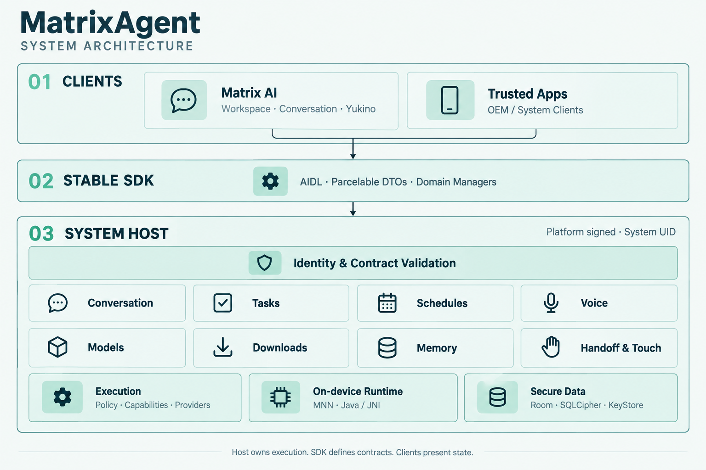

<div align="center">
  
  <h1>MatrixAgent</h1>
  <p><strong>面向 Android 系统镜像的 Agent 运行时</strong></p>
  <p>在系统中执行任务，在应用间延续对话。<br />通过 Matrix AI 工作区与可切换的悬浮角色，连接模型、语音、记忆和日程。</p>
  <p>
    
    
    
    
  </p>
  <p>
    <a href="#screenshots">界面</a> &nbsp;·&nbsp;
    <a href="#overview">能力</a> &nbsp;·&nbsp;
    <a href="#architecture">架构</a> &nbsp;·&nbsp;
    <a href="#quickstart">上手</a> &nbsp;·&nbsp;
    <a href="#verification">文档</a>
  </p>
</div>

> **适用环境**：定制 Android ROM。Host 需要匹配的 platform 签名、system UID、framework 接口与系统权限；当前真机基线为 Mi 9 SE / LineageOS 22.2 / Android 15。

<a id="screenshots"></a>

## 从对话到行动

**Matrix AI** 是面向用户的工作区：在对话里提出需求，在任务中心安排执行，在其他应用中继续查看结果。

<p align="center">
  <a href="docs/images/2026-09-27/launcher-conversation.png"></a>
  &nbsp;
  <a href="docs/images/2026-09-27/launcher-workflows.png"></a>
  &nbsp;
  <a href="docs/images/2026-09-27/overlay-conversation.png"></a>
</p>
<p align="center"><sub>对话与确认 &nbsp; / &nbsp; 日程与工作流 &nbsp; / &nbsp; 跨应用会话</sub></p>

<sub>v0.7.1 · 2026-09-27 真机原图。点击查看完整图片；会话与模型状态为采集时的实际状态。<a href="docs/images/README.md">查看全部截图与来源 →</a></sub>

<details>
<summary>更多工作区：语音、模型接入与模型市场</summary>

<p align="center">
  <a href="docs/images/2026-09-27/launcher-voice.png"></a>
  &nbsp;
  <a href="docs/images/2026-09-27/launcher-models.png"></a>
  &nbsp;
  <a href="docs/images/2026-09-27/launcher-downloads.png"></a>
</p>

模型接入图中的当前运行时为 `glm-5.3`，下方 `glm-5.2` 为未提交配置。语音截图处于等待状态，模型市场尚无本地模型；图片展示界面，不替代对应功能的真机认证。

</details>

<a id="overview"></a>

## 核心能力

<a id="conversation"></a>

### 连贯的对话与跨应用执行

文字、PTT 和唤醒后的最终转写进入同一会话链路。消息、草稿与执行状态由 Host 保存，全屏和小窗共享同一会话；支持历史翻页、引用、分支与运行中补充输入。

媒体请求由当前模型理解，Host 核对真实搜索候选。QQ 音乐找到歌曲后，等待用户在下一轮确认或选择，再执行播放并回读结果。 [交互规则 →](docs/功能与交互.md#conversation)

<a id="overlay"></a>

### 四位角色，跟随会话的悬浮入口

在「设置 → 外观 → 悬浮形象」中，可选择雪之下雪乃、绫波丽、宁姚或鲸鱼娘；默认是雪乃。选择会保存，并立即更新已显示的悬浮角色，设置页保持原来的滚动位置。

透明角色保留在其他应用上方，点击展开会话，拖动切换左右跑步。触碰屏幕时，角色按 **16 个方向**看向第一根手指，抬手 **800ms** 后恢复任务动作；会话首次可见，或离开至少 **5 分钟**后返回时，在不抢占结果提示的条件下挥手问候。

完成、失败与结果不确定各有对应动作和角标。角色交互不改变任务事实；全屏注视需要 Android 15+ 的平台输入观察能力。 [动作、截图与生命周期 →](docs/功能与交互.md#overlay)

<details>
<summary>查看向左跑步、向右跑步与挥手</summary>

<p align="center">
  <a href="docs/verification/matrix-ai-drag-2026-09-27/screenshots/01-drag-left.png"></a>
  &nbsp;
  <a href="docs/verification/matrix-ai-drag-2026-09-27/screenshots/02-drag-right.png"></a>
  &nbsp;
  <a href="docs/verification/yukino-interaction-2026-09-27/screenshots/04-wave.png"></a>
</p>

静态截图展示动作中的一帧。触点注视、底层手势传递和松手恢复见[真机验证](docs/verification/yukino-interaction-2026-09-27/README.md)。

</details>

<a id="scheduling"></a>

### 交给系统管理的计划

支持一次性、相对延迟、每天、每周与日历实例绑定，提供预览、编辑、暂停、恢复和运行记录。关闭页面后，Host 继续管理计划。

内置“每日行程提醒”和“Agent 日程简报”两个模板，分别生成确定性摘要与模型摘要；步骤支持依赖、并行只读查询、有界重试和独立交付状态。 [计划与授权 →](docs/功能与交互.md#scheduling)

<a id="model-voice"></a>

### 统一的模型与语音入口

云端 API、Ollama / LM Studio / vLLM 与 MNN 端侧模型共用 Host 运行时管理。模型市场提供目录、断点续传与原子安装；Vosk / Sherpa 负责端侧识别，腾讯云、Piper 与 Android TTS 提供播报及回退路径。 [接入矩阵与语音规则 →](docs/功能与交互.md#model-voice)

<a id="memory"></a>

### 可读取、可删除的分层记忆

Working、Preference、Semantic 与 Episodic 分别管理核验状态、明确偏好、长期事实和有限事件摘要。数据按用户与音区隔离，召回受相关性与预算约束；支持精确读取、逐条删除和事务化清除。 [记忆范围与数据控制 →](docs/功能与交互.md#memory)

<a id="intelligence"></a>

### 智能上下文与长程任务

云端与 MNN 端侧模型可逐段输出正文；全屏和小窗会话共享流式状态，取消后停止继续投影。附件以分块索引保存，提交问题时冻结可引用来源，再用 BM25 挑选相关片段进入模型上下文。语义记忆可选用打包的 BGE 模型与词面召回融合；未安装或无法运行向量模型时回退到词面检索。

研究工作流只在明确授权联网后检索多个来源，核对摘要时要求可追溯的来源编号，并说明片段与摘要不等于阅读全文。失败反思只保存受控证据，生产默认关闭，待证明稳定收益后再启用。[实施与启用边界 →](docs/智能层实施记录-2026-09-27.md)

<a id="architecture"></a>

## 系统架构

**Host 管理执行与事实，SDK 定义契约，客户端呈现状态。**

[](docs/architecture/matrix-agent-architecture.png)

客户端只能通过版本化 AIDL、DTO 与域 Manager 使用能力。Host 在入口核验身份与契约，统一管理策略、持久化、模型文件和生命周期。调用方不能伪造用户、音区或绕过执行策略。

<sub>图为逻辑分层概览。<a href="docs/开发与验证.md#architecture">模块职责与 Mermaid 源图</a> · <a href="docs/architecture/imagegen-prompt.md">图像生成记录</a></sub>

<a id="quickstart"></a>

## 开始使用

### 1. 获取源码

```bash
git clone --recurse-submodules https://github.com/Zcorpius/MatrixAgentProject.git
cd MatrixAgentProject
```

### 2. 准备构建环境

需要 **JDK 17+、Android SDK 36、NDK、CMake 3.22.1**。配置本机 `local.properties`，准备与目标 ROM 一致的平台签名和 framework 编译桩。文件位置、版本与系统集成步骤见[构建指南](docs/开发与验证.md#quickstart)。

### 3. 构建并启动

```bash
./buildTool.sh all debug
adb install -r matrix-agent-service/build/outputs/apk/debug/matrix-agent-service-debug.apk
adb install -r matrix-agent-launcher/build/outputs/apk/debug/matrix-agent-launcher-debug.apk
adb shell am start -n com.matrix.agent.launcher/.LauncherActivity
```

等待 `HOST ONLINE`，在“模型接入”启用可用运行时，再尝试文字对话。使用语音前准备识别资源和麦克风权限；使用跨应用操作前配置悬浮窗访问与 Host 的媒体无障碍服务。

<a id="sdk"></a>

### 接入自己的客户端

```kotlin
implementation("com.matrix.agent:matrix-agent-service-lib:0.7.1")
```

SDK 面向符合签名权限要求的可信客户端。连接可异步开始，同步 Binder 调用仍需放在后台线程。发布到本机 Maven、连接管理、请求幂等与完整示例见 [SDK 接入](docs/开发与验证.md#sdk)。

<a id="verification"></a>

## 验证与文档

**2026-09-28 智能层整改版本**已通过 `verifyArchitecture`：离线固定语料 110 场景重复两遍，**220/220** 通过；JVM 测试 **1,610 项执行通过、2 项按设计跳过**，无失败或错误。debug/release APK 构建与 Lint 通过。Mi 9 SE / Android 15 上的合成隔离探针 **11/11** 通过，覆盖 Room 16→20、研究提示词预算、流式 JSON、附件检索、记忆与反思生命周期以及 BGE/JNI。 [逐项验证、构建摘要和源码哈希 →](docs/verification/intelligence-2026-09-28/README.md)

真实模型修复前的 440 例基线已归档；修复后完成了兼容 JSON 模式 220 例和原生工具模式前 160 例，有效样本中未观察到错误计划参数实际写入。模型服务随后持续返回 HTTP 429，因此**修复后的双模式完整真实模型复测尚未完成**。逐版本 Room `androidTest` 已编译，仍需在专用设备执行；当前有用户数据的 system-UID 联调机只运行隔离探针。报告采样时工作区尚未提交，详细边界与源码哈希见[整改验证记录](docs/verification/intelligence-2026-09-28/README.md)。

**2026-09-28 限流提示修正**：云端模型返回 HTTP 429 时，旧版把模型异常误归为安全策略拒绝，显示“该请求因安全策略未执行”。现按模型限流、其他模型失败、真实策略拒绝分别归类并显示；本地执行队列满也有独立的繁忙终态。全量门禁重新通过，JVM 测试为 **1,616 项通过、2 项按设计跳过**；Mi 9 SE 隔离探针 **12/12** 通过，其中合成 429 经真实执行器归为 `MODEL_RATE_LIMITED`，并生成非安全策略拒绝文案。[真机报告](docs/verification/intelligence-2026-09-28/model-rate-limit-device.json)。HTTP 429 的服务端原因仍需按模型账户的限流和额度状态排查；代码修正仅纠正终态与提示，不会绕过服务端限制。

同一设备切到已安装的 `Qwen3-0.6B-MNN` 后，真实问候请求另因“端侧 system prompt 独自超出 token 预算”失败。该错误来自当前端侧模型上下文与 48 个工具定义的组合，现归为模型调用失败；它与云端 429 和安全策略拒绝分别独立，仍需调整端侧工具投影及预算才能让这一路径稳定执行。

**GLM 入口对照验证**：同一电脑凭据和 `glm-5.3` 对 `/api/anthropic/v1/messages` 返回 HTTP 200，对原 `/api/paas/v4/chat/completions` 返回 HTTP 429、业务码 `1113`（[智谱错误码](https://docs.bigmodel.cn/cn/api/api-code)：“账户已欠费”）；后者响应恰为 54 字符，与真机此前日志的 54 字符一致。现新增可选的「智谱 GLM（Anthropic 接口）」配置，保留原入口不变。Mi 9 SE 上新入口连接测试 HTTP 200，真实 Agent 问候请求 `SUCCEEDED / NO_TOOL_CALL`。[脱敏验证记录](docs/verification/intelligence-2026-09-28/glm-anthropic-endpoint.json)。智谱将该地址列为 [Coding Plan 的 Anthropic 入口](https://docs.bigmodel.cn/cn/coding-plan/quick-start)，但[套餐仅限指定工具与环境](https://docs.bigmodel.cn/cn/coding-plan/tool/others)；选择入口本身不保证 MatrixAgent 可使用套餐额度。

**模型连接测试与端侧下载复验**：GLM 的 Anthropic 响应可先返回 `thinking` 块，旧连接测试因此把 HTTP 200 的空文本误判为成功；现按协议提取正文，并拒绝空答复。测试按钮只验证 Host 已启用的云端模型。Mi 9 SE 上还复现了模型市场按钮因连接状态重绘遗漏而置灰，以及系统把可用 Wi-Fi 标为部分连通、阻止 WorkManager 下载启动。修复后 `Qwen3.5-2B-MNN` 在真机完成下载并进入本地模型库；未切换当前推理模型。[真机验证记录](docs/verification/intelligence-2026-09-28/model-download-2b.json)。

此前 **2026-09-27 · v0.7.1** 基线的 1,516 项 JVM 测试与 47 项真机联合套件结果仍单独保留，不能与本轮采样混算。[原基线报告与 APK 摘要](docs/verification/yukino-interaction-2026-09-27/README.md) · [复验方法](docs/开发与验证.md#verification)

<a id="boundaries"></a>

### 当前支持范围

车辆控制默认使用 demo Provider；计划首期面向已解锁的前台 user 0，并开放两个固定模板；MNN 当前为 arm64 CPU 路径。QQ 音乐已有独立确认后的播放回读验证，B 站本轮核验到搜索候选。多 ROM、分屏、长期压力及其他未覆盖项目见[完整边界](docs/开发与验证.md#boundaries)。

### 按需要继续阅读

| 想了解什么 | 从这里开始 |
|---|---|
| 动作、会话、计划、模型与记忆怎么工作 | [功能与交互](docs/功能与交互.md) |
| 怎样构建、接入 SDK、理解架构与复验 | [开发与验证](docs/开发与验证.md) |
| 每张图片展示什么、来自哪次验证 | [真机图片与来源](docs/images/README.md) |
| 触点观察、动作优先级与租约如何实现 | [注视与挥手验证](docs/verification/yukino-interaction-2026-09-27/README.md) |
| 定时任务怎样授权、编排和恢复 | [定时任务设计](docs/Agent定时任务与子任务编排专题.md) · [实施记录](docs/Agent定时任务实施记录.md) |
| 智能层如何评测、追溯来源及处理已知限制 | [评估计划](docs/Agent智能层评估与改进计划-2026-09-27.md) · [实施记录](docs/智能层实施记录-2026-09-27.md) · [整改验证](docs/verification/intelligence-2026-09-28/README.md) |

<details>
<summary>更多专题设计</summary>

- [桌面图标](docs/Matrix-AI-桌面图标.md)：实心矩阵标志与自适应资源。
- [雪乃角色接入](docs/雪乃悬浮入口接入与验证.md)：动画、解码、缓存与恢复。
- [跨应用浮层](docs/Agent跨应用悬浮球与小窗模式技术执行方案.md)：交接、窗口所有权与输入规则。
- [对话与统一语音](MatrixAgent对话交互与统一语音架构设计.md)：持久化、语音入口、播报与恢复。
- [对话输入增强](Matrix对话输入交互增强任务设计.md)：全屏编辑、草稿、模型胶囊与附件。
- [媒体语义验证](docs/verification/media-model-understanding-2026-09-27/README.md)：模型搜索、独立确认与播放回读。

</details>

---

<p align="center"><sub>MatrixAgent · System-owned intelligence for Android</sub></p>
