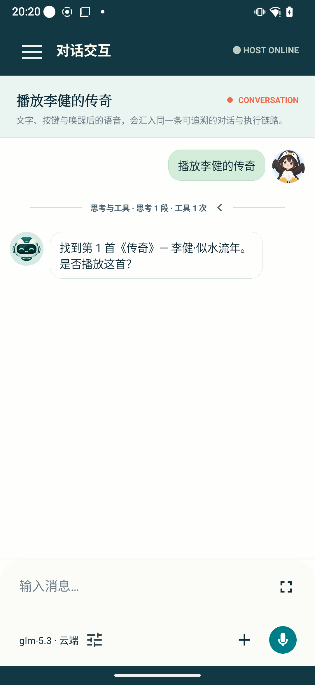
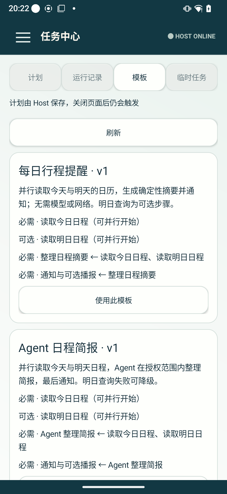
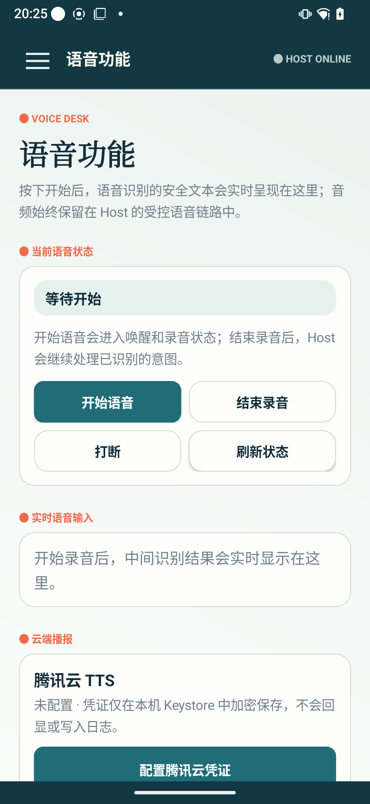
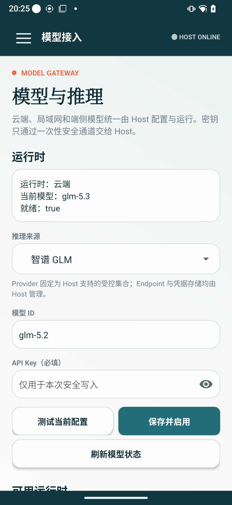
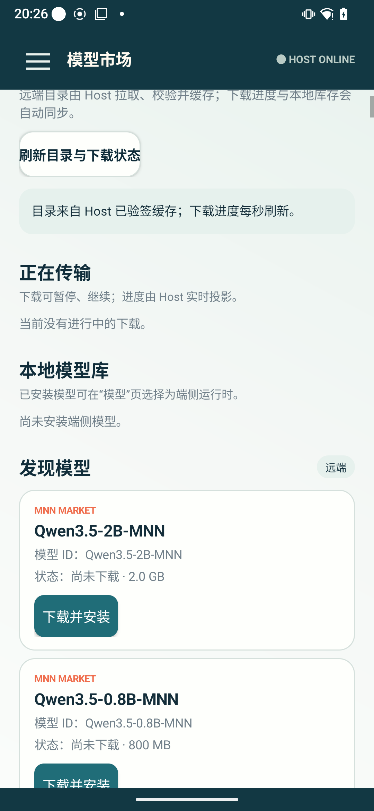
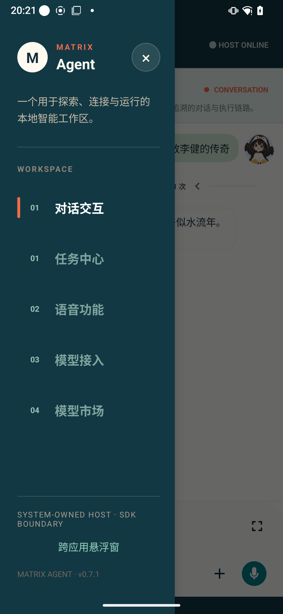
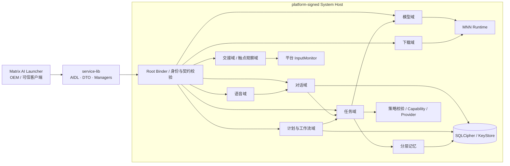

<div align="center">

# MatrixAgent

### 面向 Android 系统镜像的本地智能 Agent 运行时

在可信系统进程中统一执行任务、管理模型、记忆与语音，<br>
通过稳定 SDK 连接应用，通过 **Matrix AI** 工作区和雪乃悬浮角色与用户交互。

<p>
  
  
  
  
  
</p>

[能力概览](#overview) · [真机界面](#screenshots) · [雪乃与悬浮窗](#overlay) · [定时任务](#scheduling) · [对话与媒体](#conversation) · [模型与语音](#model-voice) · [分层记忆](#memory) · [架构](#architecture) · [构建运行](#quickstart) · [SDK](#sdk) · [验证与边界](#verification)

</div>

> [!IMPORTANT]
> MatrixAgent 面向定制 Android ROM。Host 依赖匹配的 platform 签名、system UID、framework 接口与系统权限，不能作为普通 APK 在任意手机上独立运行。

本文按 **2026-09-27 的 v0.7.1 开发基线**整理：`versionCode 7001`、Room schema **16**、Parcel schema **13**。验证设备为 **Mi 9 SE（grus）/ LineageOS 22.2 / Android 15（API 35）**。同一开发版本包含多次构建，复验时以[对应 APK 摘要和测试日志](docs/verification/yukino-interaction-2026-09-27/README.md)为准；Host、SDK 消费端和 Launcher 应配套升级。

<a id="overview"></a>
## 能力概览

Host 是唯一执行权威：调用方身份、用户与音区、策略、执行状态和持久化事实均在系统进程中确定。Launcher 和可信客户端只通过 SDK 使用能力。

| 能力 | 当前实现 |
|---|---|
| 任务与对话 | 自然语言任务、同一会话串行执行、订阅、取消、补充输入、历史分页、加密草稿、消息引用与分支 |
| 跨应用交互 | QQ 音乐 / B 站搜索、候选确认、雪乃角色入口与会话小窗；拖动跑步、全屏触点注视和返回问候 |
| 定时任务 | 一次性、相对延迟、每天、每周、日历实例绑定；计划预览、控制、运行记录与两个固定工作流模板 |
| 模型与下载 | 云端、局域网与 MNN 端侧统一接入；目录缓存、断点续传、下载控制、校验与原子安装 |
| 语音 | Vosk / Sherpa 端侧识别、PTT、唤醒、VAD、实时转写、打断；腾讯云 / Piper / Android TTS 路由 |
| 分层记忆 | Working、Preference、Semantic、Episodic；按用户与音区隔离，受控召回、精确读取与删除 |
| 数据与契约 | Room + SQLCipher、Android KeyStore、清除 epoch、签名权限、逐事务身份校验、AIDL / DTO 版本协商 |

车辆控制目前使用 emulator / demo Provider，真实 OEM/VHAL 集成范围见[当前边界](#boundaries)。

<a id="screenshots"></a>
## 真机界面

以下工作区图片于 **2026-09-27** 从上述 v0.7.1 设备重新采集，均为原始截屏。点击可查看完整图片；页面中的会话、模型和资源状态是采集时的实际状态。

<table>
  <tr><th align="center">对话交互</th><th align="center">任务中心 · 模板</th><th align="center">语音功能</th></tr>
  <tr>
    <td align="center"><a href="docs/images/2026-09-27/launcher-conversation.png"></a></td>
    <td align="center"><a href="docs/images/2026-09-27/launcher-workflows.png"></a></td>
    <td align="center"><a href="docs/images/2026-09-27/launcher-voice.png"></a></td>
  </tr>
  <tr><td align="center"><sub>搜索候选 · 独立确认 · 模型状态</sub></td><td align="center"><sub>计划 · 运行记录 · 模板 · 临时任务</sub></td><td align="center"><sub>录音控制 · 实时转写 · 播报配置</sub></td></tr>
  <tr><th align="center">模型接入</th><th align="center">模型市场</th><th align="center">工作区导航</th></tr>
  <tr>
    <td align="center"><a href="docs/images/2026-09-27/launcher-models.png"></a></td>
    <td align="center"><a href="docs/images/2026-09-27/launcher-downloads.png"></a></td>
    <td align="center"><a href="docs/images/2026-09-27/launcher-drawer.png"></a></td>
  </tr>
  <tr><td align="center"><sub>运行时事实与待提交表单分开显示</sub></td><td align="center"><sub>下载进度 · 本地库存 · 模型目录</sub></td><td align="center"><sub>五个入口 · 悬浮窗设置 · 当前版本</sub></td></tr>
</table>

模型图中实际启用的是 `glm-5.3`，表单中的 `glm-5.2` 是尚未提交的配置值，API Key 为空。截图不代表默认模型、已完成语音认证或已安装端侧模型。完整图片清单、采集来源及历史截图见[截图说明](docs/images/README.md)。

<a id="overlay"></a>
## 雪乃角色与跨应用悬浮窗

### 桌面图标与拖动

Launcher 的桌面名称为 **Matrix AI**。图标使用深青背景、薄荷绿立体矩阵和**实心中心**，包含独立前景、背景与单色图层，适配系统桌面裁切。跨应用入口采用透明雪乃角色，画布为 **96 × 104dp**。

<table>
  <tr><th align="center">Matrix AI 桌面图标</th><th align="center">向左拖动</th><th align="center">向右拖动</th></tr>
  <tr>
    <td align="center"><a href="docs/verification/matrix-ai-icon-solid-2026-09-27/home.png"></a></td>
    <td align="center"><a href="docs/verification/matrix-ai-drag-2026-09-27/screenshots/01-drag-left.png"></a></td>
    <td align="center"><a href="docs/verification/matrix-ai-drag-2026-09-27/screenshots/02-drag-right.png"></a></td>
  </tr>
</table>

以上图片均采集于 2026-09-27；左右拖动图已使用实心图标版本。静态截图展示动作中的一帧，连续动画与手势恢复由[真机测试](docs/verification/yukino-interaction-2026-09-27/README.md)验证。

### 动作在什么场景出现

| 场景 | 雪乃的表现与恢复规则 |
|---|---|
| 任务排队、取消处理中或非执行等待 | `waiting`；非终态断线时显示离线角标 |
| 任务规划或执行中 | `running` 工作动作，角标与状态始终来自真实任务 |
| 任务完成 / 失败 | 完成播放一次 `jumping` 后回待机并保留完成角标；失败停留 `failed` 末帧并保留错误角标 |
| 执行结果不确定 | `review` 对应 `EXECUTION_UNKNOWN`，提示需要核查实际结果；媒体选曲的确认消息与此状态分别处理 |
| 拖动角色 | 越过拖动阈值后切换 `running-left` / `running-right`；方向防抖，上下拖动沿用最近朝向；松手恢复任务动作 |
| 在屏幕其他位置触碰或滑动 | `look` 按角色头部到触点的方向选择 16 个静态姿态；头部附近 12dp 内使用中立帧；第一指抬起后保留 **800ms**，再恢复任务动作 |
| 会话首次可见，或离开至少 5 分钟后返回 | `waving` 播放一次后恢复；仅在没有结果角标且不抢占重要结果提示时问候；短暂切换和展开 / 收起不重复问候 |

触碰可打断挥手，拖动角色优先播放跑步；新的完成、失败或结果不确定状态会打断注视和挥手。拖动期间到达的新状态在松手后展示，已结束的完成 / 失败动作不会因恢复而重播。多指操作始终跟随第一指，第一指抬起后不转向剩余手指。问候历史保留于当前 Launcher 进程，最多记录 64 个会话。

<table>
  <tr><th align="center">看向上方触点</th><th align="center">跟随向下滑动</th><th align="center">挥手问候</th></tr>
  <tr>
    <td align="center"><a href="docs/verification/yukino-interaction-2026-09-27/screenshots/01-look-before-swipe.png"></a></td>
    <td align="center"><a href="docs/verification/yukino-interaction-2026-09-27/screenshots/02-look-after-swipe.png"></a></td>
    <td align="center"><a href="docs/verification/yukino-interaction-2026-09-27/screenshots/04-wave.png"></a></td>
  </tr>
</table>

### 会话小窗

Agent 打开或操作外部应用前，Host 与 Launcher 完成交接，在屏幕边缘保留角色入口。点击角色可展开**同一会话**，阅读消息、查看执行过程、发送补充内容、取消当前任务或返回全屏。

<table>
  <tr><th align="center">完整会话</th><th align="center">展开执行过程</th><th align="center">草稿与输入法</th></tr>
  <tr>
    <td align="center"><a href="docs/images/2026-09-27/overlay-conversation.png"></a></td>
    <td align="center"><a href="docs/images/2026-09-27/overlay-process.png"></a></td>
    <td align="center"><a href="docs/images/2026-09-27/overlay-editing.png"></a></td>
  </tr>
</table>

这三张图片来自 2026-09-27 最新一轮 47 项真机测试。执行过程区由项目级 `matrix.debugTraceUi` 开关控制，当前基线已开启；debug 与 release 都遵循该显式开关，构建类型不会自动关闭轨迹。

- 小窗与全屏共享消息渲染器，先加载最近 30 条，更早记录按需翻页；阅读历史时新回复不会强制跳到底部。
- 标题栏可拖动，角色与面板分别记住位置。收起、再次展开保留草稿；返回同一会话页时隐藏重复浮层，并提供小窗草稿恢复入口。
- 横屏或高度不足时采用紧凑布局，发送靠近输入框，返回与取消收进“更多”；输入法弹出后按可用区域约束位置。
- 关闭窗口不会取消 Host 任务。自动操作时暂不允许新取得输入焦点，已经开始编辑的草稿和焦点保持；输入本身不会暂停 Agent。

### 权限与生命周期

在导航抽屉的“跨应用悬浮窗”入口开启悬浮窗访问；QQ 音乐 / B 站 UI 操作还需启用 Host 的“媒体搜索与选曲”无障碍服务。全屏触点注视额外依赖 **API 35+、匹配 framework 和平台 `MONITOR_INPUT` 权限**，不能由普通悬浮窗权限替代。

Host 通过 `InputMonitor` 观察输入副本，使用 `finishInputEvent(event, false)`，不调用 `pilferPointers`；底层应用继续接收原始事件。观察只面向同用户的可信 Launcher，采用 30 秒租约、10 秒续约和 Binder 死亡释放。坐标不写入日志、数据库或模型请求。

只有角色处于可见收起状态时才订阅触点；面板展开、主动隐藏、锁屏、切换用户、断线或关闭时停止。系统主动禁止悬浮窗的页面遵循 Android 显示限制。图片在后台按动作解码，使用 3MiB 共享 LRU；该额度是缓存预算，不是全部活跃位图的内存上限。

当前只支持单浮层、默认显示屏与 conversation 主轮次；进程死亡后通过返回 Launcher 恢复会话，不自动冷启动重建窗口。交接预算、状态机与实现细节见[浮层方案](docs/Agent跨应用悬浮球与小窗模式技术执行方案.md)、[角色接入](docs/雪乃悬浮入口接入与验证.md)和[注视 / 挥手验证](docs/verification/yukino-interaction-2026-09-27/README.md)。

<a id="scheduling"></a>
## 定时任务与工作流

侧边栏“任务中心”提供 **计划、运行记录、模板、临时任务** 四个页签。Host 使用单个物理业务闹钟、加密持久化和稳定执行请求 ID 管理计划；关闭页面不会停止计划管理。

| 能力 | 当前行为 |
|---|---|
| 时间与绑定 | 一次性、相对延迟、每天、每周，以及具体日历实例绑定 |
| 计划控制 | 创建前预览、编辑、暂停、恢复和删除；列表分页，展示阻塞原因，支持编辑草稿恢复 |
| 执行授权 | 触发时使用独立会话，继承创建时授予的能力、网络与播报权限 |
| 工作流 | 两个固定模板；支持依赖、并行只读步骤、共享父预算、有界重试与取消，历史保留模板版本 |
| 运行追踪 | 运行记录、步骤状态、输入摘要、耗时、重试和交付结果，通知可跳转到详情 |
| 通知与播报 | 分别记录两个渠道的事实；通知不可用时新建为阻塞草稿，恢复权限后需显式启用；播报被抑制时呈现部分交付 |

“每日行程提醒”并行查询今天与明天的日历，生成确定性摘要，再通知与可选播报，无需模型或网络；“Agent 日程简报”使用授权范围内的 Agent 生成摘要。两个模板的明日日程查询均为可选步骤，失败可降级。模板界面见[上方截图](#screenshots)，计划入口见[真机计划页](docs/images/2026-09-27/launcher-plans.png)。

系统时钟通过标准 Intent 委托，回执标记为未核验，不提供 ROM 私有闹钟数据库的增删改查。当前首期范围为已解锁且处于前台的 Android user 0。设计、迁移与设备边界见[定时任务专题](docs/Agent定时任务与子任务编排专题.md)和[实施记录](docs/Agent定时任务实施记录.md)。

<a id="conversation"></a>
## 对话与媒体操作

### 统一输入与可恢复状态

文字、按住说话（PTT）与唤醒后的最终转写统一进入 `ConversationCoordinator`，完成校验和持久化后按会话串行执行。语音 partial 仅用于实时 UI；只有最终接受的文本成为用户消息并触发 Agent。

| 状态 | 含义 |
|---|---|
| `ACCEPTED` / `RUNNING` | 已持久化，或已进入该会话执行通道 |
| `COMPLETED` / `FAILED` / `CANCELLED` / `REJECTED` | 可确定的终态 |
| `EXECUTION_UNKNOWN` | 中断、超时或取消后无法确认写操作结果，需要核查实际状态 |

用户消息、顺序号、幂等键和任务关联原子写入；重启时对账未收敛记录。正文和草稿保存在 SQLCipher 中并纳入用户数据清除；日志与审计投影保持脱敏。输入支持多行、全屏编辑、模型胶囊和文本附件；消息可引用、复制，已完成的用户消息可创建分支。草稿保存与提交按会话排序，防止迟到保存恢复已提交内容。

### 搜索之后，由用户确认播放

新媒体请求交给当前配置模型规划，QQ 音乐与 B 站的标题、歌手和查询词不再依赖固定话术拆分。模型理解用于搜索，实际播放仍须经过候选核对和用户的下一轮确认。

1. 用户提出请求，例如“播放李健的传奇”。
2. Host 调用目标应用的搜索能力，等待查询与真实候选稳定；QQ 音乐按结构化歌名 / 歌手核对实际条目，歧义或多版本返回候选供选择。
3. 对话展示“是否播放这首”或候选列表。**同一搜索轮次不能直接播放，也不能通过恢复旧队列绕过确认。**
4. 用户在下一轮确认或选择后，执行播放并回读结果；新搜索会清理旧的待选上下文，搜索失败不会留下可误确认的旧候选。

2026-09-27 已验证 QQ 音乐的模型搜索、独立确认与 `media_session` 播放回读；B 站已成功搜索并返回候选，该次验证未打开视频。详细输入、工具耗时和范围见[媒体语义理解验证](docs/verification/media-model-understanding-2026-09-27/README.md)。

<a id="model-voice"></a>
## 模型与语音

### 模型接入与资源管理

| 运行位置 | 仓库已提供的接入入口 |
|---|---|
| 云端 | 智谱 GLM、DeepSeek、通义千问、Moonshot Kimi、火山方舟 / 豆包、Anthropic Claude、Google Gemini |
| 局域网 | Ollama、LM Studio、vLLM |
| 自定义 | OpenAI-Compatible Endpoint |
| 端侧 | 已下载并安装的 MNN-LLM 模型，当前为 arm64 CPU 路径 |

Host 统一管理协议、端点、凭据和运行时生命周期，支持 OpenAI Chat、Anthropic Messages、Gemini、Ollama 与 MNN 端侧协议。配置入口的存在不等于所有厂商、模型与 ROM 组合都已完成真机认证。

模型市场支持目录缓存、Range 断点续传、暂停 / 恢复 / 取消 / 删除与原子安装。Vosk、Sherpa 与 Piper 语音资源同样由 Host 管理，首次使用前需显式下载；启动录音不会隐式拉取大文件。只有校验完成并切换有效版本指针后才标记“已安装”，失败保留回滚能力。

### 识别、唤醒与播报

- PTT 松手冲刷 ASR final，取消则终止本轮；endpoint 和手动冲刷共享幂等保护，避免重复提交。唤醒、PTT、文字最终进入同一对话任务链。
- 录音使用按需 microphone 前台服务；未授权、模型未就绪或服务启动失败均返回明确状态。音频焦点、打断和播报由 Host 语音控制器统一管理。
- 语音会话按 `voiceSessionId`、task 和响应 token 关联；订阅丢失、执行超时或进程死亡会收敛状态，`THINKING` 有独立 watchdog。
- TTS 按“已配置腾讯云 → 已安装 Piper → Android 系统 TTS”选择。云端失败时同一 utterance 回退本地；云端及本地均失败才报告 `VOICE_OUTPUT_UNAVAILABLE`。

API Key 和腾讯云凭证通过一次性 Binder 管道交给 Host，由 Android KeyStore 加密保存；配置投影和日志不返回密钥。云端可达性、回退与真实扬声器输出需在目标设备完成闭环验证。

<a id="memory"></a>
## 分层记忆

对话正文提供连续交流所需的上下文；记忆模块按当前问题，从用户与音区所属范围内选取可复用的信息。所有持久化入口在 Host 内校验请求身份，`zone` 统一使用小写规范值。

### 四层各自保存什么

| 层 | 写入来源与内容 | 召回与保留范围 |
|---|---|---|
| **Working · 会话状态** | 仅由成功且经过核验的工具回读更新空调温度，绑定会话、用户与音区 | 温控相关问题最多召回 1 条；内存会话默认 30 分钟 TTL、最多 32 个会话 |
| **Preference · 长期偏好** | 用户明确指定要记住的偏好及值，例如温度、座椅加热与媒体音量 | 按当前问题相关性排序；每用户 / 音区最多 1024 条，达到上限仍可更新已有条目 |
| **Semantic · 长期事实** | 用户明确要求保存的事实，key 使用 `family.*`、`allergy.*`、`work.*` 或 `fact.*` 命名空间 | 无相关匹配时不召回；每用户 / 音区最多 1024 条，正文通过 `memory.semantic.get` 精确读取 |
| **Episodic · 事件摘要** | 自动记录 `SUCCEEDED` / `FAILED` 任务的终态与有限事实；每条最多 3 个已核验事实 | 仅历史意图触发召回；每用户 / 音区保留最近 100 条、30 天内事件，每条摘要最多 2048 UTF-8 字节 |

Episodic v2 的事实范围包括导航目的地、空调温度、座椅加热、媒体音量与屏幕亮度；目的地还必须字面出现于当轮用户请求。事件摘要不保存用户原文、模型回复、工具参数或完整轨迹，旧版摘要也无法还原这些细节。

### 召回、读取与忘记

- **相关性与预算**：Router 优先为偏好保留名额，分别限制 Working、Semantic 和 Episodic 的数量；Prompt 记忆区最多 8 条、1024 UTF-8 字节。
- **统一投影**：`MemoryKeyCatalog` 集中管理 key 规范、意图词、匹配规则和安全投影。Prompt 仅直接展示受控范围内的温度、座椅、音量偏好值及 Working 温控状态；Semantic 只展示 key，Episodic 展示类别、终态与事件编号，详情按工具读取。
- **逐条控制**：Preference 提供 `save / get / list / delete`，Semantic 提供 `save / get / delete`，Episodic 提供 `get / delete`。历史非法 Preference key 可通过分页目录中的稳定别名读取、删除，原始 key 不进入 Prompt。
- **明确删除目标**：保存和删除均校验用户意图及指定内容；事件删除要求用户明确选择完整事件编号。模型发现某条历史事件不意味着获得删除授权。
- **清除与恢复**：记忆表删除和 epoch 自增在同一事务完成，旧请求不能写回已清除的数据。数据库不可用时保留待清理标记；恢复完成前使用易失存储，避免旧持久化数据重新进入业务域。

实现入口：[记忆模块](matrix-agent-service/src/main/java/com/matrix/agent/data/memory)、[事件摘要](matrix-agent-service/src/main/java/com/matrix/agent/task/persistence/EpisodicSummary.java)。

<a id="architecture"></a>
## 系统架构


```mermaid
flowchart LR
    Clients["Matrix AI Launcher<br/>OEM / 可信客户端"] --> SDK["service-lib<br/>AIDL · DTO · Managers"]
    SDK --> Root
    subgraph Host["platform-signed System Host"]
        Root["Root Binder / 身份与契约校验"]
        Root --> Conversation[对话域]
        Root --> Task[任务域]
        Root --> Schedule[计划与工作流域]
        Root --> Voice[语音域]
        Root --> Model[模型域]
        Root --> Download[下载域]
        Root --> Overlay["交接域 / 触点观察域"]
        Voice --> Conversation
        Conversation --> Task
        Schedule --> Task
        Task --> Memory[分层记忆]
        Task --> Policy["策略校验 / Capability / Provider"]
        Task --> Model
        Model --> Native[MNN Runtime]
        Download --> Native
        Overlay --> Monitor[平台 InputMonitor]
        Conversation --> Data[(SQLCipher / KeyStore)]
        Schedule --> Data
        Memory --> Data
    end
```

Root Binder 通过系统 `ServiceManager` 发布，同时保留签名权限保护的显式绑定入口。客户端取得对应域 Manager；SDK 处理 Binder 死亡、重连和受支持的活动订阅恢复。记忆通过 Host 内部任务链和 Capability 使用，身份从当前请求派生，不暴露数据库访问给客户端。

| 模块 | 交付物与职责 |
|---|---|
| `matrix-agent-service` | `com.matrix.agent` APK；system UID Host、任务 / 对话 / 调度、模型 / 语音 / 下载、交接 / 输入观察、记忆、存储与审计 |
| `matrix-agent-service-lib` | AAR；AIDL、Parcelable DTO、错误码、版本协商、`MatrixAgent` 门面与类型安全 Manager |
| `matrix-agent-launcher` | `com.matrix.agent.launcher` APK；Java + XML + MVVM 工作区、窗口和角色呈现，仅依赖 SDK 使用 Host 能力 |
| `matrix-agent-test` | trusted / untrusted APK；跨 APK 权限、身份、契约与 Binder 验证 |
| `ondevice` | Android Library + JNI；MNN-LLM Java 边界与 native 生命周期，不直接暴露给客户端 |

Host 管事实，SDK 管契约，Launcher 管呈现。权限、版本、模型与执行失败必须成为可解释状态，客户端不能伪造用户、音区、车辆状态或绕过 Host 策略。

<a id="quickstart"></a>
## 构建与运行

### 环境与系统材料

| 项目 | 当前配置 |
|---|---|
| 工具链 | macOS / Linux；JDK 17+，源码级别 Java 17；最近门禁使用 JDK 21 |
| Android | compile / target SDK 36，min SDK 28；系统功能支持范围需另看目标 ROM，触点观察要求 API 35+ |
| 构建 | Gradle Wrapper 9.3.1、AGP 9.0.1、Android NDK、CMake 3.22.1 |
| 目标架构 | `arm64-v8a` |
| 系统集成 | 与目标 ROM 一致的 platform 证书、framework compile stub、权限与 SELinux 配置 |

Host 声明 `android:sharedUserId="android.uid.system"` 并使用系统 API。普通 `android.jar` 或另一套 ROM 的证书不能替代匹配的系统构建材料。

### 获取与配置

```bash
git clone --recurse-submodules https://github.com/Zcorpius/MatrixAgentProject.git
cd MatrixAgentProject
# 已有工作区需要补齐子模块时执行：
git submodule update --init --recursive
```

MNN 子模块 `ondevice/src/main/cpp/MNN` 固定为 `18759c835f7c36d3fcaec25f6d9a029386e802f8`。根目录 `local.properties` 配置本机 SDK，不提交本机路径：

```properties
sdk.dir=/absolute/path/to/Android/sdk
```

Service、Launcher 和 Test 三个 APK 模块各自的 `tools/key/` 需要 `platform.p12`、`platform.x509.pem` 与 `signing.properties`。生产私钥不得提交仓库。Service 还使用目标 ROM 的编译桩 `matrix-agent-service/tools/framework/framework-lineage-grus.jar`，仅作 `compileOnly`；更新方式见[编译桩说明](matrix-agent-service/tools/framework/README.md)。

### 构建、安装与首次使用

```bash
./buildTool.sh all debug
# 也可选择模块与变体：
./buildTool.sh service release
./buildTool.sh launcher debug
./buildTool.sh test release
```

脚本执行 clean、构建、签名指纹校验并原子归档到 `outputs/`。版本统一来自根目录 `gradle.properties`。以下直接使用 debug 构建的确定路径安装，设备须与 APK 签名匹配：

```bash
adb install -r matrix-agent-service/build/outputs/apk/debug/matrix-agent-service-debug.apk
adb install -r matrix-agent-launcher/build/outputs/apk/debug/matrix-agent-launcher-debug.apk
adb shell am start -n com.matrix.agent.launcher/.LauncherActivity
```

1. 等待顶部显示 `HOST ONLINE`，在“模型接入”配置并启用可用运行时。
2. 先用文字对话验证请求与回复。使用语音前授权麦克风并下载所需识别资源。
3. 使用跨应用能力时授予悬浮窗访问和 Host 无障碍服务权限，并安装目标媒体应用。
4. 在“任务中心”预览计划或选择模板；确认通知可用和授权范围后再启用。

ROM 集成通过 `android_app_import` 将 release APK 预埋为 `priv-app`，同步维护产品包、默认权限与 SELinux。预埋 APK、平台证书、framework stub 与设备 ROM 应属于同一构建基线。

<a id="sdk"></a>
## SDK 接入

SDK 坐标为 `com.matrix.agent:matrix-agent-service-lib:0.7.1`。开发时发布到本机 Maven，再在客户端仓库配置中启用 `mavenLocal()`：

```bash
./gradlew :matrix-agent-service-lib:publishToMavenLocal
```

```kotlin
dependencies {
    implementation("com.matrix.agent:matrix-agent-service-lib:0.7.1")
}
```

可信客户端需使用受允许的签名并声明权限；仅写入权限声明不会获得调用资格：

```xml
<uses-permission android:name="com.matrix.agent.permission.ACCESS_AGENT" />
```

### 连接与调用线程

连接可异步开始，但取得 Manager 与业务方法仍可能执行同步 Binder 调用，应放到组件持有的后台执行器。生命周期回调可能因重连重复出现，不应在每次 `CONNECTED` 时自动提交新任务。

```java
// 组件初始化时保存这两个对象；连接回调仅更新连接状态。
ExecutorService sdkCalls = Executors.newSingleThreadExecutor();
MatrixAgent agent = MatrixAgent.createAsyncHandle(context, (client, state) -> {
    // 将 state 投影到界面状态。
});

// 以下由一次用户操作触发；重试同一次操作时复用此 requestId。
String requestId = UUID.randomUUID().toString();
AgentRequest request = new AgentRequest(
        requestId, "example-session", "查询当前屏幕亮度",
        AgentRequest.INPUT_TEXT, "zh-CN");

sdkCalls.execute(() -> {
    MatrixAgentManager tasks = agent.getAgentManager();
    if (tasks == null) {
        // 尚未连接：向界面报告不可用，保留原请求供显式重试。
        return;
    }
    AgentTaskHandle handle = tasks.submit(request, event -> {
        // SDK 投递到事件 Handler；按 taskId 更新组件状态。
    });
    if (handle.errorCode != MatrixErrorCode.SUCCESS) {
        // 处理稳定错误码；不能把返回句柄等同于任务已成功执行。
        return;
    }
    // 保存 handle.taskId，用于查询、订阅或取消。
});
```

示例省略 import 和业务 UI。组件结束时停止接收新调用、关闭所持订阅、释放 `agent.release()` 并关闭后台执行器；不要在主线程等待正在执行的 Binder 调用结束。

### 域接口

| Manager 入口 | 用途 |
|---|---|
| `getAgentManager()` | 提交、查询、订阅和控制任务 |
| `getConversationManager()` | 会话、消息分页、文字提交、草稿与语音绑定 |
| `getScheduleManager()` | 就绪检查、计划预览与控制、运行 / 步骤、模板与日历绑定 |
| `getModelManager()` / `getDownloadManager()` | 模型配置、运行时、目录、下载和安装事实 |
| `getVoiceManager()` | 识别、会话、唤醒与播报 |
| `getHandoffManager()` / `getAttachmentManager()` | 跨应用交接与受控附件 staging |
| `getOverlayInteractionManager()` | 全屏输入副本订阅，Host 限制为同用户可信 Launcher，并要求租约管理 |
| `getDebugTraceManager()` | 内部调试轨迹，受 `matrix.debugTraceUi` 构建开关限制 |

返回 `AutoCloseable` 的订阅需按生命周期关闭；输入观察域使用独立的订阅、续约与退订协议，不能照搬普通订阅的使用方式。服务未通告的扩展域可能返回 `null`。

对话通过 `createConversation()`、`sendText()` 等接口使用；创建与发送分别保存稳定 `clientOperationId`，检查创建返回值与提交结果。PTT 先通过 `createVoiceBinding()` 建立一次性关联，再开始语音会话。计划修改使用稳定 `operationId` 和当前 revision；回执不确定时重试原编号，分页按返回游标继续读取。客户端不得直接读取 Host 数据库或模型文件。

<a id="verification"></a>
## 质量验证

### 最新完整回归：2026-09-27

以下是当前代码基线已有的验证记录；本次 README 整理重新采集工作区图片并核对文档，没有把截图采集算作新一轮功能回归。

| 验证范围 | 结果 |
|---|---|
| 根 `verifyArchitecture` | 五模块 `check` 与 SDK 发布依赖检查通过 |
| JVM 全项目 | **1,516 项通过**，0 失败 / 错误 / 跳过：Host 1,414、SDK 20、Launcher 70、独立测试 APK 两变体合计 4、ondevice 8 |
| 最新真机联合套件 | **47 项通过，96.081 秒**；Host、Launcher 与 Launcher androidTest 配套安装 |
| 全屏触点与问候 | 5 项跨进程输入测试，15 项角色组件测试；覆盖真实输入链路、方向、800ms 恢复、多指、优先级和租约释放 |
| 拖动与窗口 | 3 项方向拖动测试，22 项控制器与窗口测试 |
| 真实外部应用流程 | 2 项 QQ 音乐交接、会话、草稿、输入法、返回与已有应用内搜索流程 |

设备手势通过 UiAutomation 注入真实 InputDispatcher；5 分钟问候边界使用确定性 JVM 时钟验证，并未让设备等待 5 分钟。详细结果见[最新验证报告](docs/verification/yukino-interaction-2026-09-27/README.md)、[JVM 汇总](docs/verification/yukino-interaction-2026-09-27/jvm-tests.json)、[真机日志](docs/verification/yukino-interaction-2026-09-27/device-tests.txt)和[APK SHA-256](docs/verification/yukino-interaction-2026-09-27/apk-sha256.json)。

### 其他专项证据

各专项分批执行，不与上表相加，也不代表在每次改动后全部重新认证。

| 专项 | 已记录结果与范围 |
|---|---|
| [定时任务 v0.7.1](docs/Agent定时任务实施记录.md) | 13 项核心真机测试；通知权限变化；system UID 下深度 Doze 的 100 + 10 个计划交付；130% / 200% 字体与草稿检查 |
| [媒体语义理解](docs/verification/media-model-understanding-2026-09-27/README.md) | 配置模型驱动 QQ 音乐 / B 站搜索；QQ 独立确认后真实播放回读，B 站仅核验搜索候选 |
| [实心桌面图标](docs/verification/matrix-ai-icon-solid-2026-09-27/README.md) | 覆盖安装、Matrix AI 名称、实心中心、圆形裁切和启动检查 |
| [方向拖动截图](docs/verification/matrix-ai-drag-2026-09-27/README.md) | 新版图标背景下重新采集左右跑步，并复验手势 |
| [跨应用基础阶段](docs/Agent跨应用悬浮窗实现与真机验证记录.md) | 2026-09-26 的消息、历史、窗口与 Binder 验证；旧结果按原日期保留 |

### 如何复验

无需连接设备的完整门禁：

```bash
./gradlew verifyArchitecture
```

该任务包含五模块单元测试、lint 与架构边界检查，并核对发布 SDK 元数据不携带 Kotlin runtime。Launcher 的 47 项设备套件按[复现命令](docs/verification/yukino-interaction-2026-09-27/README.md#复现及证据)安装并执行，需要匹配的系统签名、在线 Host、悬浮窗权限、QQ 音乐及对应中文桌面。

跨 APK 独立测试入口为 `:matrix-agent-test:connectedLocalHostIntegrationAndroidTest`。Host 的语音与端侧认证任务涉及带 system UID 的 instrumentation，构建脚本对可能影响 Host 数据的 connected test 设有显式保护；应在准备好的专用测试设备上按任务前置条件运行，见[Host 构建配置](matrix-agent-service/build.gradle.kts)。

<a id="boundaries"></a>
## 当前边界

- **设备范围**：当前主要真机基线为 Mi 9 SE / Android 15 / LineageOS 22.2；min SDK 不代表所有系统功能在旧 API 或其他 ROM 上可用。多 ROM、分屏及长时压力尚未完成完整矩阵。
- **车辆能力**：默认使用 emulator / demo Provider。接入真实车辆需实现 OEM/VHAL Provider，并复用策略、参数校验与 readback 契约。
- **媒体自动化**：仍受目标 App 的页面、版本、权限和网络影响；B 站本轮搜索成功不等于视频播放闭环已认证。
- **角色交互**：输入观察依赖平台能力，系统主动隐藏悬浮窗时不能绕过；挥手历史按进程保留，角色动画不改变 Host 的任务状态或授权。
- **计划与工作流**：首期为已解锁前台 user 0 与两个固定模板；ROM 私有时钟桥未实现，磁盘满、密钥失效、多用户切换和部分精确崩溃窗口尚未完成专项设备认证。
- **记忆**：Working 仅支持已核验温控状态；Episodic 仅保存事实白名单，无联系人或拨号历史。检索使用受控词表与关键词评分，尚无向量检索或可视化记忆管理页；事件逐条删除需完整 32 位十六进制编号。
- **端侧资源与供应链**：MNN 当前启用 arm64 CPU，GPU 后端关闭。缺少发布者签名或逐文件摘要的上游目录，只能提供固定 HTTPS 来源、大小 / 结构限制与缓存，不能视为独立可信根；页面中的目录提示不扩大这一保证。
- **语音与资源认证**：JVM 通过不替代麦克风、唤醒、音频焦点、云端返回、TTS 回退、实际扬声器输出和模型峰值内存的目标设备验证。

## 设计与维护文档

| 文档 | 内容 |
|---|---|
| [Matrix AI 桌面图标](docs/Matrix-AI-桌面图标.md) | 自适应资源、实心中心、素材与验证 |
| [雪乃悬浮入口接入与验证](docs/雪乃悬浮入口接入与验证.md) | 状态映射、后台解码、缓存与拖动恢复 |
| [触点注视与挥手](docs/verification/yukino-interaction-2026-09-27/README.md) | 输入观察、租约、动作优先级和最新回归证据 |
| [定时任务与子任务编排](docs/Agent定时任务与子任务编排专题.md) | 时间语义、事务、授权、工作流预算与验收矩阵 |
| [定时任务实施记录](docs/Agent定时任务实施记录.md) | v0.7.1 交付与专项设备验证 |
| [跨应用浮层方案](docs/Agent跨应用悬浮球与小窗模式技术执行方案.md) | 交接协议、所有权、窗口与输入规则 |
| [对话与统一语音架构](MatrixAgent对话交互与统一语音架构设计.md) | 持久化、语音 ingress、TTS 回注与恢复 |
| [对话输入交互增强](Matrix对话输入交互增强任务设计.md) | 全屏编辑、草稿、模型胶囊和附件 |
| [界面截图说明](docs/images/README.md) | 当前与历史图片、来源、更新和检查方法 |

---

<div align="center">
  <sub>MatrixAgent · System-owned intelligence for Android</sub>
</div>
