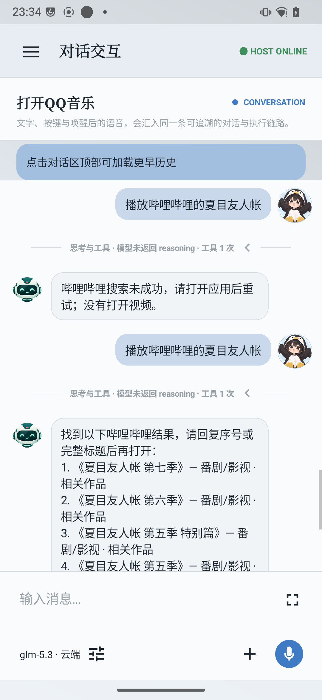
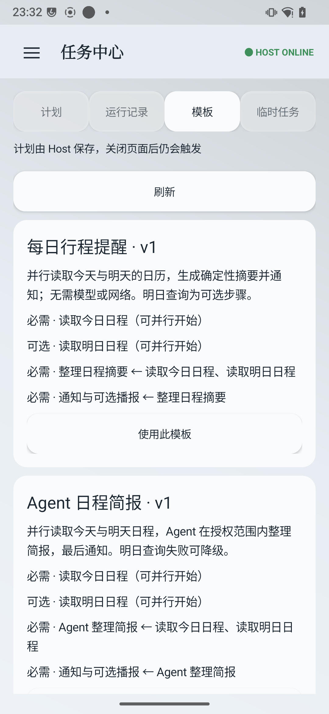
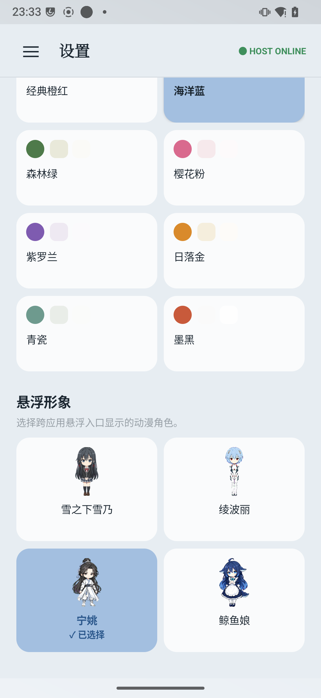
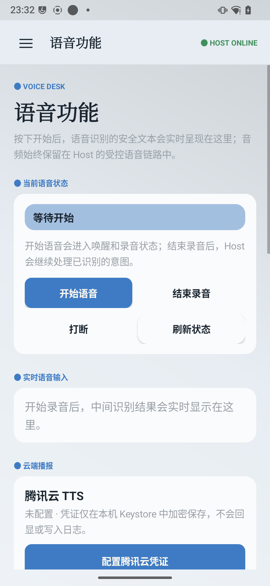
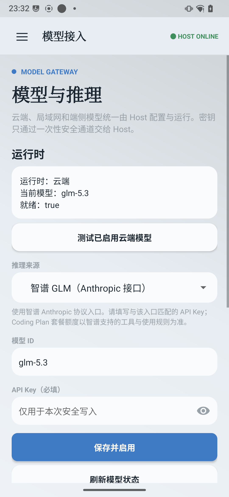
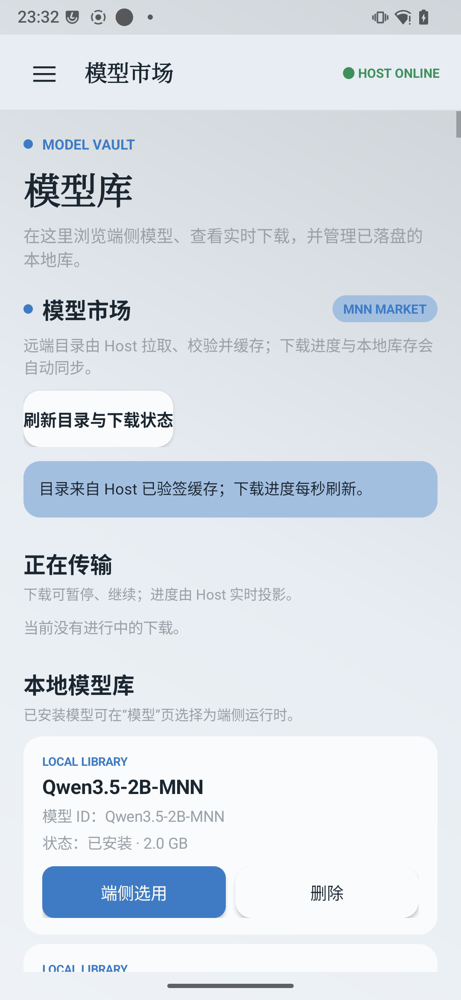
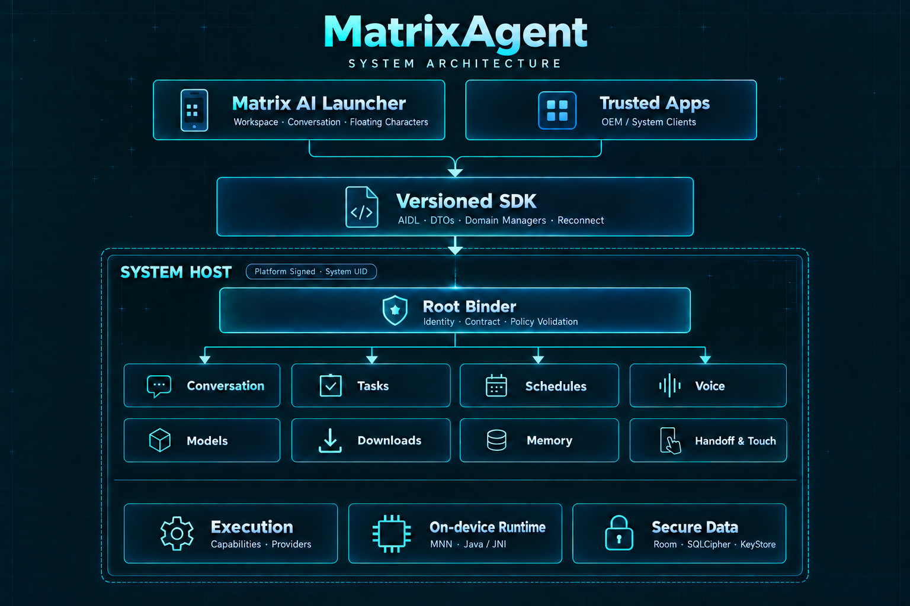

<div align="center">
  
  <h1>MatrixAgent</h1>
  <p><strong>让 Agent 在系统中执行，让会话在应用间延续。</strong></p>
  <p>Matrix AI 工作区连接对话、计划、语音与模型；<br />可切换的悬浮角色，让同一会话跟随你进入其他应用。</p>
  <p>
    
    
    
    
  </p>
  <p>
    <a href="#experience">界面体验</a> &nbsp;·&nbsp;
    <a href="#capabilities">核心能力</a> &nbsp;·&nbsp;
    <a href="#characters">悬浮角色</a> &nbsp;·&nbsp;
    <a href="#architecture">系统架构</a> &nbsp;·&nbsp;
    <a href="#quickstart">开始使用</a>
  </p>
</div>

> **适用环境** · MatrixAgent 面向定制 Android ROM。System Host 依赖与目标系统匹配的 platform 签名、system UID、framework 接口和系统权限，不能作为普通 APK 在任意手机上独立运行。

<a id="experience"></a>

## 从对话到行动

在 Launcher 中发起请求、安排计划、选择角色；执行跨应用任务时，悬浮入口可打开同一会话。下图均为 **2026-09-28** 从 Mi 9 SE / LineageOS 22.2 真机采集的当前界面。

<p align="center">
  <a href="docs/images/2026-09-28/launcher-refresh/conversation.png"></a>
  &nbsp;
  <a href="docs/images/2026-09-28/launcher-refresh/tasks-templates.png"></a>
  &nbsp;
  <a href="docs/images/2026-09-28/launcher-refresh/settings-pets.png"></a>
</p>
<p align="center"><sub>对话交互 &nbsp;&nbsp; / &nbsp;&nbsp; 任务中心 &nbsp;&nbsp; / &nbsp;&nbsp; 悬浮形象</sub></p>

<details>
<summary><strong>展开查看语音、模型接入和模型市场</strong></summary>

<br />

<p align="center">
  <a href="docs/images/2026-09-28/launcher-refresh/voice.png"></a>
  &nbsp;
  <a href="docs/images/2026-09-28/launcher-refresh/models.png"></a>
  &nbsp;
  <a href="docs/images/2026-09-28/launcher-refresh/market.png"></a>
</p>
<p align="center"><sub>语音功能 &nbsp;&nbsp; / &nbsp;&nbsp; 模型接入 &nbsp;&nbsp; / &nbsp;&nbsp; 模型市场</sub></p>

</details>

<sub>点击截图查看原图。会话、模型和下载状态是采集时的真实状态；[外观模式](docs/images/2026-09-28/launcher-refresh/settings-theme.png)、[导航抽屉](docs/images/2026-09-28/launcher-refresh/navigation.png)与[采集记录](docs/images/README.md)另有原图。</sub>

<a id="capabilities"></a>

## 一个工作区，贯穿完整任务

**对话与跨应用。** 文字、按住说话和唤醒后的最终转写进入同一会话链路。Host 保存消息、草稿与执行状态；全屏页面和悬浮小窗共享历史。输入支持引用、分支和文本附件；涉及媒体播放时，搜索候选后需要用户明确确认。

**计划与工作流。** 任务中心提供计划、运行记录、模板和临时任务。一次性、延迟、每天、每周及日历实例绑定由 Host 管理，关闭 Launcher 后仍可按计划触发。内置“每日行程提醒”和“Agent 日程简报”两个模板。

**模型与语音。** Host 统一管理云端 API、局域网服务和已安装的 MNN 端侧模型。模型市场展示目录、下载进度与本地库；语音页提供 Vosk / Sherpa 识别资源、实时转写以及腾讯云、Piper、系统 TTS 播报路径。可用性取决于已配置的运行时、资源和权限。

<a id="characters"></a>

## 四位角色，随会话同行

在 **设置 → 外观 → 悬浮形象** 中选择角色。选择会保存，并立即切换已显示的悬浮入口；设置页保留当前滚动位置。默认角色为雪之下雪乃。

<table align="center">
  <tr>
    <td align="center"><br /><strong>雪之下雪乃</strong></td>
    <td align="center"><br /><strong>绫波丽</strong></td>
  </tr>
  <tr>
    <td align="center"><br /><strong>宁姚</strong></td>
    <td align="center"><br /><strong>鲸鱼娘</strong></td>
  </tr>
</table>

<sub>上图为随 Launcher 打包的待机帧。角色可以拖动、点击展开小窗，并根据任务、结果和触碰状态播放动作。[了解悬浮窗与权限](docs/功能与交互.md#overlay)</sub>

设置页还提供 **跟随系统 / 浅色 / 深色**三种外观模式，以及经典橙红、海洋蓝、森林绿、樱花粉、紫罗兰、日落金、青瓷和墨黑八套颜色主题。

<a id="architecture"></a>

## 系统架构

[](docs/architecture/matrix-agent-architecture-dark-2026-09-28.png)

Launcher 呈现状态，SDK 定义调用契约，Host 持有执行权威。图中 Host 内的业务域与支撑模块按职责分组，具体调用依赖见[架构与 SDK 接入说明](docs/开发与验证.md#architecture)。仓库主要模块为 [Launcher](matrix-agent-launcher)、[Host](matrix-agent-service)、[SDK](matrix-agent-service-lib)、[端侧推理](ondevice)和[设备验证](matrix-agent-test)。

<a id="quickstart"></a>

## 开始使用

需要 JDK 17+、Android SDK 36、NDK、CMake 3.22.1，以及与目标 ROM 匹配的 platform 证书和 framework 编译桩。[准备构建材料](docs/开发与验证.md#quickstart)

```bash
git clone --recurse-submodules https://github.com/Zcorpius/MatrixAgentProject.git
cd MatrixAgentProject
# 在 local.properties 中配置 sdk.dir，准备签名和 framework 编译桩
./buildTool.sh all debug
```

在签名匹配的开发设备上安装并启动：

```bash
adb install -r matrix-agent-service/build/outputs/apk/debug/matrix-agent-service-debug.apk
adb install -r matrix-agent-launcher/build/outputs/apk/debug/matrix-agent-launcher-debug.apk
adb shell am start -n com.matrix.agent.launcher/.LauncherActivity
```

确认顶部显示 `HOST ONLINE`，再到“模型接入”启用可用运行时。语音需要麦克风权限和离线资源；跨应用操作需要悬浮窗权限，部分媒体操作还需要 Host 无障碍服务。

## 文档与当前范围

| 想了解 | 阅读 |
| --- | --- |
| 对话、角色、计划、模型、语音和记忆的具体行为 | [功能与交互](docs/功能与交互.md) |
| 构建、ROM 集成、SDK 与复验 | [开发与验证](docs/开发与验证.md) |
| 每张真机图片的时间、状态与来源 | [截图与来源](docs/images/README.md) |
| 最近的智能层评估和未完成项 | [智能层验证记录](docs/verification/intelligence-2026-09-28/README.md) |

当前联调基线为 Mi 9 SE / Android 15；端侧 MNN 路径面向 `arm64-v8a`，车辆控制默认使用 demo Provider，计划首期面向已解锁的前台 user 0。其他 ROM 和应用组合请参阅[支持边界](docs/开发与验证.md#boundaries)。
