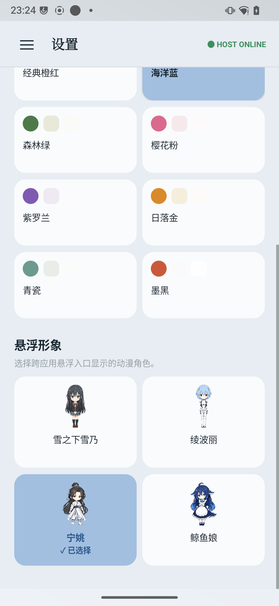

# MatrixAgent

MatrixAgent 是集成到定制 Android 系统中的 Agent。**Matrix AI Launcher** 提供对话、任务、语音、模型和外观设置；**System Host** 负责执行、状态保存与权限控制。离开 Launcher 后，可以通过悬浮角色展开同一条会话。

> 项目面向匹配 platform 签名和 framework 接口的定制 ROM，不是可直接安装在任意 Android 手机上的普通应用。当前联调设备为 Mi 9 SE / LineageOS 22.2 / Android 15，源码版本由 [`gradle.properties`](gradle.properties) 定义。

## 界面一览

<p align="center">
  <a href="docs/images/2026-09-27/launcher-conversation.png"></a>
  <a href="docs/images/2026-09-27/launcher-workflows.png"></a>
  <a href="docs/images/2026-09-28/launcher-settings-appearance.png"></a>
</p>

对话和任务截图采集于 2026-09-27；设置截图采集于 2026-09-28 的已连接真机。截图是当时的页面状态，不代表当前模型、计划或会话内容。[查看截图来源与完整图集](docs/images/README.md) · [查看跨应用会话小窗](docs/images/2026-09-27/overlay-conversation.png)

## 在 Launcher 中可以做什么

点击左上角菜单进入各页面；顶部的 `HOST ONLINE` 表示 Launcher 已连接 System Host。

| 页面 | 当前提供的入口 |
| --- | --- |
| **对话交互** | 发送文字或按住说话；查看历史、执行状态与当前模型；引用、分支和添加文本附件。全屏页面与跨应用小窗使用同一会话。 |
| **任务中心** | 管理计划、查看运行记录、使用“每日行程提醒”和“Agent 日程简报”模板，以及查看临时任务。计划由 Host 持续管理。 |
| **语音功能** | 开始或结束语音会话、查看实时转写与状态；管理离线识别和播报模型，可选择 Vosk 或 Sherpa 识别引擎。 |
| **模型接入** | 配置云端、局域网或已安装的端侧模型，保存并启用运行时；可测试当前启用的云端模型。凭据由 Host 安全保存。 |
| **模型市场** | 浏览受控的 MNN 模型目录、下载和管理本地模型，再跳转到模型接入页选用。 |
| **设置** | 选择跟随系统、浅色或深色外观；切换 8 套颜色主题和 4 个悬浮形象。 |

具体的交互规则、权限和数据范围见[功能与交互](docs/功能与交互.md)。页面提供接入入口；模型、语音和跨应用操作还取决于实际配置、资源与设备权限。

## 悬浮形象与外观

在 **设置 → 外观 → 悬浮形象** 中选择角色。选择会保存，并立即更新已经显示的悬浮入口；设置页保持当前滚动位置。默认角色为雪之下雪乃。

<table>
  <tr><th align="center">雪之下雪乃</th><th align="center">绫波丽</th><th align="center">宁姚</th><th align="center">鲸鱼娘</th></tr>
  <tr>
    <td align="center"></td>
    <td align="center"></td>
    <td align="center"></td>
    <td align="center"></td>
  </tr>
</table>

上图是随 Launcher 打包的待机帧。悬浮角色可拖动；点击后展开会话小窗，并根据执行、结果和触碰状态切换动作。跨应用显示需要 Android 悬浮窗权限；全屏触点注视还依赖匹配 ROM 提供的平台输入观察能力。[查看动作与小窗说明](docs/功能与交互.md#overlay)

外观模式有**跟随系统、浅色、深色**三种；颜色主题有**经典橙红、海洋蓝、森林绿、樱花粉、紫罗兰、日落金、青瓷、墨黑**八种。模式与主题会保存，主题切换后应用到 Launcher 和会话小窗。

## 项目结构

| 模块 | 职责 |
| --- | --- |
| [`matrix-agent-launcher`](matrix-agent-launcher) | Launcher 页面、会话小窗、悬浮角色与用户交互。 |
| [`matrix-agent-service`](matrix-agent-service) | System Host：对话、执行、计划、语音、模型、记忆与持久化。 |
| [`matrix-agent-service-lib`](matrix-agent-service-lib) | 客户端使用的版本化 AIDL、DTO 和 SDK 接口。 |
| [`ondevice`](ondevice) | MNN 端侧推理及原生构建。 |
| [`matrix-agent-test`](matrix-agent-test) | 设备端集成验证应用。 |

Launcher 通过 SDK 请求 Host；Host 校验调用身份，持有系统能力和持久化状态。实现分层、数据流与接入契约见[开发与验证](docs/开发与验证.md#architecture)。

## 构建与运行

需要 JDK 17+、Android SDK 36、NDK、CMake 3.22.1，以及与目标 ROM 匹配的 platform 证书和 framework 编译桩。Host 使用 system UID 和系统 API；构建材料、权限与 SELinux 配置见[构建指南](docs/开发与验证.md#quickstart)。

```bash
git clone --recurse-submodules https://github.com/Zcorpius/MatrixAgentProject.git
cd MatrixAgentProject
# 在 local.properties 中设置 sdk.dir，并准备目标 ROM 的签名与 framework 编译桩
./buildTool.sh all debug
```

在签名匹配的开发设备上安装并打开 Launcher：

```bash
adb install -r matrix-agent-service/build/outputs/apk/debug/matrix-agent-service-debug.apk
adb install -r matrix-agent-launcher/build/outputs/apk/debug/matrix-agent-launcher-debug.apk
adb shell am start -n com.matrix.agent.launcher/.LauncherActivity
```

启动后先确认 `HOST ONLINE`，再到“模型接入”启用可用模型。语音需要麦克风权限和相应离线资源；跨应用操作需要悬浮窗权限，部分媒体操作还需要 Host 无障碍服务。ROM 预装、签名文件位置和 SDK 接入示例均在[构建与开发文档](docs/开发与验证.md)。

## 支持范围与文档

当前端侧 MNN 路径面向 `arm64-v8a`；车辆控制默认使用 demo Provider。计划首期面向已解锁的前台 user 0。QQ 音乐的搜索、确认与播放回读已有真机验证，其他应用和 ROM 组合以各自验证记录为准。[查看完整边界](docs/开发与验证.md#boundaries)

- [功能与交互](docs/功能与交互.md)：对话、悬浮角色、计划、模型、语音与记忆。
- [开发与验证](docs/开发与验证.md)：系统架构、构建安装、SDK 接入与复验方法。
- [图片与来源](docs/images/README.md)：页面截图、采集时间和展示范围。
- [最近的智能层验证记录](docs/verification/intelligence-2026-09-28/README.md)：评估结果、真机证据和未完成项。
