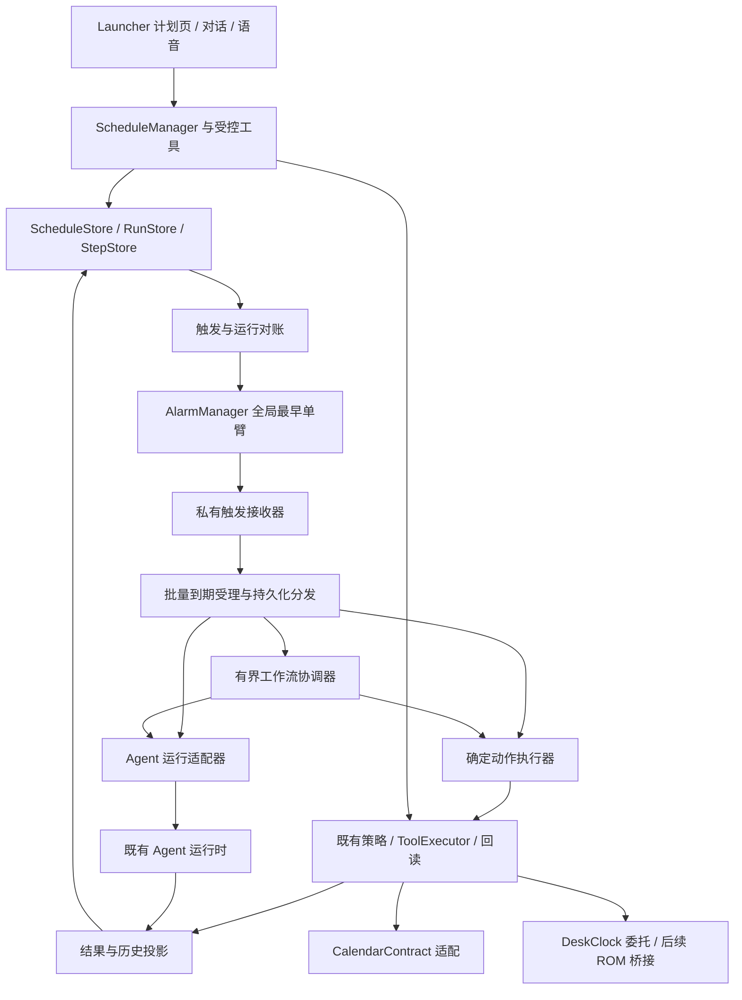
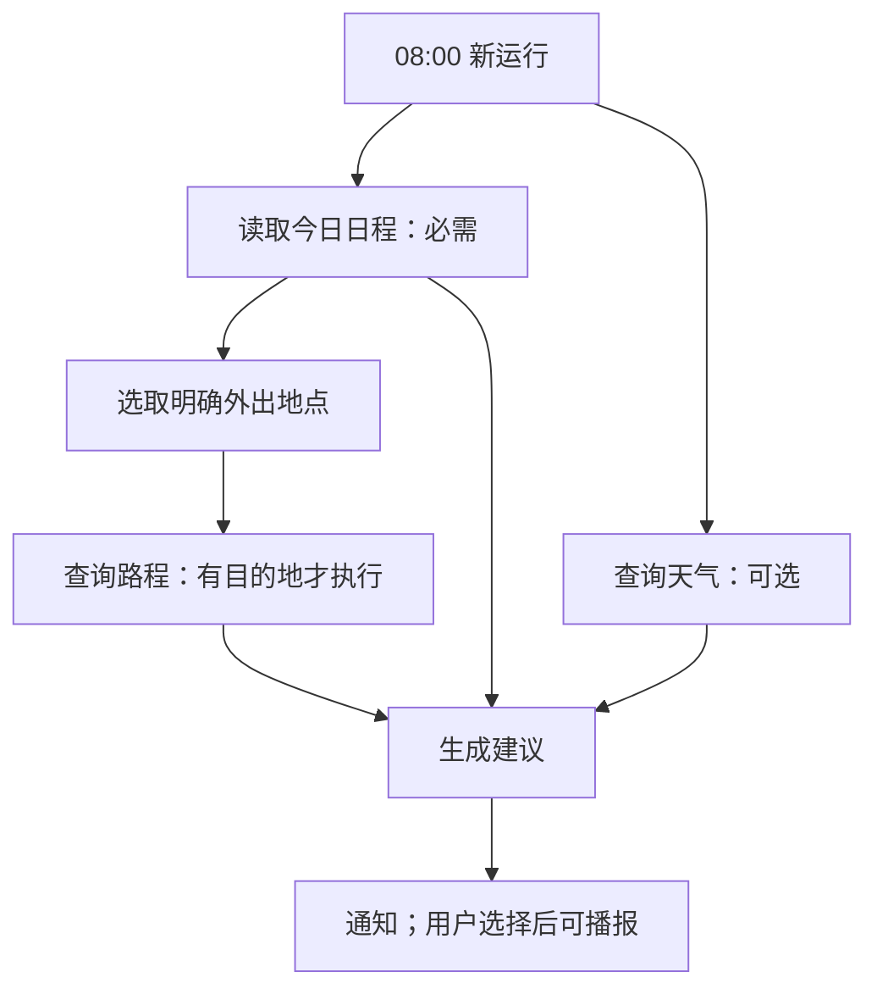

# Agent 定时任务与子任务编排专题

> 版本：v0.5.1 · 2026-09-27（首次续算规则与渠道引用勘误）<br>
> 状态：**已获实施授权，P1–P4 已进入实现与真机验收**。本文保留评审基线，实际交付、参数裁决与验收证据见[实施记录](Agent定时任务实施记录.md)。<br>
> 工程：MatrixAgentProject；代码核查基线：`13cc060`，同时参考当前工作区。<br>
> 目标设备：Mi 9 SE，Android 15 / API 35，LineageOS 22.2；面向平台签名、system UID 部署的 MatrixAgent。<br>
> 文档性质：需求与架构评审基线；实施记录单独维护，避免将设计目标误当成已验证事实。

**实施授权：2026-09-27，用户明确要求按照文档全部实现，并在已连接真机验证。**先前仅讨论方案的限制已由该指令解除；P5 的 ROM 私有时钟桥仍遵循本文“可选后续”范围。

建议评审顺序：先看 §1 的决策表与 §3 的范围，再看 §4–§9 的核心架构，最后审阅 §15 的工作包、§16 的验收和 §18 的待决议。§2 记录本次核查证据，§10–§14 展开应用适配、现有工程接入和用户流程。

## 1. 本次评审要解决什么

在 Agent 中提供可管理、可恢复、可解释的定时任务：用户用文字或语音表达时间和目标，Host 保存计划，到点产生一次执行；复杂执行可以拆为有依赖的子任务。日历负责日程数据及展示，原生时钟负责其拥有的闹钟，Agent 负责自己的计划、执行与结果。

建议批准的总体方向是：**定时计划 → 单次运行 → 确定动作 / Agent 执行 / 有界工作流**。时间触发是任务来源之一，后续可接入日历变化等事件来源。调度器不承担模型推理，工作流也不负责长期等待。

本专题不要求第一版同时交付通用工作流、全部闹钟管理与多 Agent 协作。建议按“可靠的定时核心 → 日历和时钟适配 → 单次 Agent 执行 → 模板化子任务编排”逐阶段开放。

### 1.1 单一决策记录索引

本表是推荐方案与裁决的唯一索引；§17 仅说明风险，§18 仅记录意见处理和实施准入，不再复制一套默认值。当前条目均为“已纳入修订建议、待最终裁决”，不代表功能已经实现或获准进入实施；具体参数以所引用正文为准。

| 编号 | 决定 | 推荐方案 | 影响 |
| --- | --- | --- | --- |
| D01 | 定时计划的事实来源 | Agent 加密数据库；AlarmManager 保存可重建的触发注册 | 避免依赖应用前台存活或时钟私有数据库 |
| D02 | 首期范围 | 一次性、相对延迟、每日、每周；本地通知与运行历史 | 先验证恢复和去重，再开放复杂任务 |
| D03 | 原生闹钟深度 | 标准 Intent 接入；完整 CRUD 后续使用 ROM 专用桥接 | 首期不能承诺列出并编辑设备全部闹钟 |
| D04 | 日历同步方向 | 先普通日程；展示副本单向，显式绑定以日历时间为准，见 §10 | 避免双向冲突和隐式授权 |
| D05 | 首次解锁前 | Agent 复杂任务解锁后恢复；原生响铃交给 DeskClock | 不在首期改造整个 Host 的 Direct Boot 存储 |
| D06 | 子任务范围 | 有界、版本化、无环模板；工具步骤优先 | 首期不引入递归子 Agent 或模型任意扩图 |
| D07 | 自动操作范围 | 仅执行创建计划时明确授权的能力和参数范围 | 定时触发不能提升身份或扩大授权 |
| D08 | 同计划重叠 | 默认跳过新一次并记录原因 | 防止后台积压和重复操作 |
| D09 | 时间承诺 | 区分期望触发、实际开始、动作完成时间 | 不把模型输出完成时间宣传为准点触发 |
| D10 | 通知与播报 | 通知优先；播报需明确选择且检查音频条件 | 避免夜间、通话中或不适宜场景自动出声 |
| D11 | 通知权限、渠道与勿扰 | 提醒/运行状态分渠道；尊重 DND 和用户设置，见 §14.4 | 无通知权限不能声称已提醒；不绕过勿扰 |
| D12 | P1 执行与认证范围 | 接收器内有界受理并发布本地通知；FGS 认证延后到 P3 前，见 §6.3、§15 | P1 不依赖长任务执行服务 |
| D13 | Android 多用户 | 首期仅 user 0，拒绝其他 Android user，见 §12.1 | 与 ActorUsers 语义乘员隔离分别建模 |
| D14 | 父子预算 | 独立 AgentRequest 上限叠加父预算，见 §12.2 | 两个串行满额步骤无重试余量，模板需显式分配 |
| D15 | 文本长度 | 所有计划目标同时满足 4096 UTF-16 code units 和 8 KiB UTF-8，见 §12.2 | 各入口统一校验，超限拒绝、不截断 |
| D16 | 执行身份与受理键 | 显式 runtimeRequestId、Actor/zone、独立会话，见 §11.1 | 禁止复用硬编码调用或自动 steer |
| D17 | 修订与时间变化 | 按 §5.2 字段分类；时间广播只触发受限对账，见 §6.1 | 不因重注册、恢复或改标题重做已消费发生 |
| D18 | 自动来源表示 | 首期 SYSTEM + 受信任 triggerKind；SCHEDULED 枚举留作契约评估，见 §11.1 | 不混用内部枚举与 SDK wire 常量 |
| D19 | Launcher 接入 | ViewModel → ScheduleRepository → LauncherHostGateway → SDK，见 §11.2 | UI 不直接接触 Binder |
| D20 | 默认策略与外部数据 | 时区/补跑见 §5，配额见 §12.2，清除边界见 §10.5，指标见 §16.2 | 统一引用正文，不在多个决策表重复定义 |
| D21 | 注册侧合并 | user 0 调度域只武装一条闹钟，目标为未来发生与到期积压续算 nextAttemptAt 的最小值，见 §6.1、§8.2 | 两类候选分开入账、合并武装；不豁免 Doze 限流 |
| D22 | P1 冷路径依赖 | 调度接收器使用共享持久化/准入窄子图，见 §6.3 | 不调用 getContainer；保留密钥、迁移、清除与降级门禁 |
| D23 | 已入队未分发改期 | 固定发生身份原行重排，分发领取事务为冻结边界，见 §8.4 | 不放宽唯一索引；时间修改不更换执行请求 ID 或内容快照 |
| D24 | Launcher 主入口 | 复用侧边栏第二项“任务工作”，重构为任务中心；定时计划、运行记录、编排模板按阶段开放，见 §11.2 | 保留入口位置；建议显示名“任务中心”，文案待评审；即时任务迁至次级入口 |

## 2. 已核实的设备与工程基线

### 2.1 设备事实

核查方法为 ADB 只读查询、已安装 APK Manifest 检查以及源码读取。ADB 当前为 root；该身份只能作为诊断条件，不能作为产品权限设计依据。

本表为 v0.1 当时的设备观察。v0.2–v0.5.1 只复核仓库代码和相关文档，没有重新连接 ADB 复验 ROM、权限或白名单；设备事实的证据时点不随文档修订自动更新。

| 项目 | 核查结果 | 方案含义 |
| --- | --- | --- |
| 系统 | `22.2-20260918_222238-UNOFFICIAL-grus`，Android 15，SDK 35 | 以此 ROM 做首轮认证，不据此承诺所有 Android 设备行为 |
| 时区、用户 | `Asia/Shanghai`，当前 Android 用户 0 | 用例必须明确用户与时区 |
| Agent | `com.matrix.agent`，v0.6.14，appId 1000，updated system app，targetSdk 36 | 具备系统集成条件，但运行环境仍为 API 35 |
| 日历界面 | `org.lineageos.etar`，版本 15 | 创建事件 Intent 可解析到 `EditEventActivity` |
| 日历 Provider | `com.android.providers.calendar`，authority 为 `com.android.calendar` | 可采用 CalendarContract 适配 |
| 日历记录 | 用户 0 的 `Calendars` 查询无记录 | 必须处理首次使用无可写日历，不能硬编码 calendarId |
| 时钟 | `com.android.deskclock`，版本 15 | 标准 SET_ALARM、SET_TIMER、DISMISS、SNOOZE 等入口已声明 |
| 时钟内部数据 | APK 中 `ClockProvider` 为 `exported=false` | root 能读不等于稳定对外接口，Host 实际访问仍待独立验证 |
| 精确闹钟 | Agent 包/共享 UID 权限信息中可见 `SCHEDULE_EXACT_ALARM: granted=true` | 必须在 Host 身份下验证 `canScheduleExactAlarms()`，不能只看 dumpsys |
| 加密 | `ro.crypto.type=file` | 要区分普通锁屏与重启后首次解锁前 |
| 待机白名单 | 查询可见 Etar、DeskClock；本次结果未显示 MatrixAgent | system UID 的实际待遇与端到端后台执行仍需认证 |

本次没有创建闹钟或日程，没有强制 Doze、杀进程、重启、改权限或运行故障注入。因此“入口存在”“记录可读”“权限信息可见”不代表已经验证“Host 写入成功”“准点响铃”或“锁屏执行成功”。

### 2.2 代码事实与接入位置

下表 Host Java 路径相对 `matrix-agent-service/src/main/java/com/matrix/agent/`；SDK 路径相对 `matrix-agent-service-lib/src/main/java/com/matrix/agent/`。后续提及的 AndroidManifest 位于对应模块的 `src/main/` 下。

| 现有模块 | 已有职责 | 本专题的接入方向 |
| --- | --- | --- |
| `task/scheduler/TaskScheduler.java` | 会话/仲裁队列、主驾优先等即时任务调度 | 保留职责；新增时间调度模块，不将其改造成长期计时器 |
| `task/durable/PersistentTaskManager.java` | 持久化任务受理、立即提交、订阅、取消、恢复 | 复用状态与去重思想；不直接用它存未来计划 |
| `task/durable/PersistentTaskStore.java` | 事务化任务与事件；进程中断标记未知 | 保留现有恢复契约，新工作流恢复独立定义 |
| `conversation/ConversationCoordinator.java` | 对话输入受理、持久化、按对话串行执行 | 用于交互创建及结果展示；自动触发不能伪装为用户实时输入 |
| `task/conversation/ConversationTaskSubmitter.java` | 准备身份、分类与执行上下文；出队装配 | 提炼受信任的自动执行适配端口，保持原通道语义 |
| `task/scheduler/TaskRequestFactory.java` | 构造受控请求与运行时条件 | 每次自动执行重新检查运行条件，不复用过期物理状态 |
| `task/capability/CapabilityRegistry.java`、`task/policy/PolicyEngine.java` | 能力清单、参数和策略约束 | 新能力必须注册；固定动作和子任务同样经过策略与回读 |
| `task/tool/ToolExecutor.java` | 超时、取消、写操作结果未知 | 所有注册能力的调用复用此边界；P1 内置通知走 §6.3 专用短路径，不直接调用业务 Provider |
| `data/db/MatrixDatabase.java` | Room + SQLCipher，当前 schema 14 | 新表需正式迁移与清除覆盖；数据库不可用时拒绝激活计划 |
| `host/MatrixAgentBootReceiver.java` | BOOT_COMPLETED、MY_PACKAGE_REPLACED 后启动 Host | 增加计划对账；当前 directBootAware=false |
| `platform/MatrixExecutorRegistry.java` | 有界执行池与进程内定时线程 | 管理短期重试；不能替代跨进程死亡的时间触发 |
| `task/scheduler/UserDataResetCoordinator.java`、`host/di/PendingUserDataReset.java` | 清除流程、epoch 与待清理标记 | 纳入计划、运行、步骤、触发撤销与异步回写屏障 |

`AgentTaskEntity` 没有重复规则和下次触发字段；当前默认 Agent 单次执行预算为 60 秒。已有 WorkManager 用于下载准入，不能据此视为已经存在业务定时功能。

当前存在 conversation 和 durable task 两条通道，身份 ID、结果正文和恢复行为不同；本方案不要求先合并两者。SDK 当前 ParcelSchema 为 9；新域应按现有契约哈希、版本协商与 feature bit 规则发布，不复用未实现的保留方法。

特别是当前 durable `respondConfirmation` 不提供完整确认功能，不能将“已有 WAITING_CONFIRMATION 常量”视为已具备无人值守任务的人机交互能力。

本轮代码复核补充以下可定位证据（行号对应本次工作区）：

- `PersistentTaskManager.java:192` 在 durable 调用处传入 `Actor.DRIVER`。`AgentRuntimeRepository.java:214` 的 `executeForSession` 本身接受 Actor，但缺少显式 zone、持久化 runtimeRequestId 与受理查询契约；不能直接包装原 durable 路径作为自动执行端口。
- `ConversationCoordinator.java:431` 对规范化后长度 ≤512 的文本尝试 steer，`:519` 查询同会话运行中的宿主。命中时会将自动任务变成当前任务的追加指令；无运行宿主才回落到新轮次。此风险有确定代码路径，不应描述成仅有理论可能；也不能声称所有短文本必然并入。
- `ConversationTaskSubmitter.PreparedTask.runtimeRequestId` 与 `TaskRequestFactory.java:96` 已采用“提交时固定 ID、执行时注入”的模式。§11.1 按相同命名建立新的受理契约。
- `ConversationCoordinator.java:61` 的 `TEXT_MAX_CHARS=4096` 与 SDK `AgentRequest.TEXT_MAX` 对齐；`:894` 为 normalizeText 方法头，`:899` 才是超限抛错语句，不会自动截断。计划域须在更早阶段说明限制。
- `MatrixAgentApplication.java:18` 说明系统入口不做全量装配；`:26–38` 的 getContainer 首次调用仍会创建完整 AppContainer。其构造路径包含线程资源、HTTP、持久化、记忆与下载等图（`AppContainer.java:116–143`）；VoiceRuntime 本体在 createVoiceRuntime 中另行创建，不能把容器装配等同于 ASR 已启动。P1 冷路径必须单独约束这些依赖，见 §6.3。
- Launcher 的 `data/ConversationRepository.java` 明确要求 UI 不接触 Manager 或 Binder，经 `LauncherHostGateway` 中转；T05 沿用该模式。
- Launcher 侧边栏第二项为 `nav_tasks`，文案“任务工作”（`res/values/strings.xml:4`），当前点击进入 AgentTaskFragment（`LauncherActivity.java:83`）。该页是即时提交、当前运行状态、取消/刷新和事件日志；尚无 ScheduleRun/StepRun 展示。§11.2 以此现有入口为重构起点。

### 2.3 外部接口结论

CalendarContract 提供日历、事件、提醒与重复事件实例查询；循环日程应查询 `Instances`，而不是只看事件第一天的开始时间。[Android Calendar Provider](https://developer.android.com/identity/providers/calendar-provider)

AlarmClock 标准 Intent 支持时刻、星期重复、标签等，但不是带稳定返回 ID 的通用闹钟 CRUD 协议；指定任意年月日也不能仅用小时、分钟表达。[Android AlarmClock](https://developer.android.com/reference/android/provider/AlarmClock)

同分支 DeskClock 源码显示：创建 Alarm 后还要创建并注册实例；响铃开始/结束广播发送处没有附带具体闹钟 ID。因此不以直接写私有数据库或监听无关联信息的响铃广播作为正式调度基础。分支源码仅为行为参考，不等同于对已安装二进制每个分支的运行验证。[HandleApiCalls](https://github.com/LineageOS/android_packages_apps_DeskClock/blob/lineage-22.2/src/com/android/deskclock/HandleApiCalls.java)、[AlarmService](https://github.com/LineageOS/android_packages_apps_DeskClock/blob/lineage-22.2/src/com/android/deskclock/alarms/AlarmService.java)

## 3. 用户场景与范围

### 3.1 场景矩阵

| ID | 用户目标 | 计划/执行模型 | 交付阶段 |
| --- | --- | --- | --- |
| U01 | 30 分钟后提醒休息 | 相对延迟 + 本地通知 | P1 |
| U02 | 每周一至周五 08:00 提醒带工牌 | 周规则 + 本地通知 | P1 |
| U03 | 查看、暂停、改时间、取消定时任务 | 计划管理 | P1 |
| U04 | 明天下午 3 点开会，提前 10 分钟提醒 | 日历事件 + 原生提醒 | P2 |
| U05 | 每天 07:00 用系统闹钟叫醒 | DeskClock 原生闹钟委托 | P2 |
| U06 | 某个日历会议开始前 15 分钟生成准备清单 | 日历绑定 + Agent 单次运行 | P3 |
| U07 | 每天 08:00 整理今日日程 | 时间计划 + 有界 Agent 运行 | P3 |
| U08 | 30 分钟后暂停指定音乐来源 | 确定工具动作 + 当时会话检查 | P3；能力需先通过后台认证 |
| U09 | 结合日程、天气、路程生成出门建议 | 模板工作流 | P4；天气、路程为待提供的能力 |
| U10 | 日历变化后自动重新准备 | 事件触发 + 去抖/版本控制 | 后续扩展 |

场景不代表工具已存在。尤其天气、路况、材料检索等应先实现并认证能力，再开放依赖它们的模板。

### 3.2 首期明确不覆盖

- 通用 cron 表达式、任意 RRULE、法定工作日与调休数据、农历规则。
- 设备关机时执行 Agent；硬件关机闹钟能力需要单独验证。
- 完整管理 DeskClock 中所有历史闹钟，或把 Agent 计划自动显示成 DeskClock 闹钟。
- 任意代码、shell、外部 Intent 或模型生成脚本作为计划动作。
- 无限制嵌套工作流、递归创建子 Agent、跨设备分布式调度。
- 自动支付、任意发消息、未知目标的删除等扩大授权范围的行为。
- 依赖跨应用点击的无人值守通用任务；需用户解锁/选择/登录的能力必须明确等待或失败。
- 通用“等待用户确认后恢复整个工作流”。首期需要此能力的计划不允许激活；后续单独设计持久化交互与过期处理。

### 3.3 时间语言规则

“明天”按创建时设备日期与明确时区解释；保存绝对日期，回执展示年月日、星期、时刻、时区及下一次发生时间。指定过去时间应澄清或报错，不悄悄改成明天。

“工作日”有调休歧义时，要求选择“周一至周五”或将需求标为暂不支持。缺少执行对象、时间含糊或动作有歧义时，只生成待补充草案，不激活计划。对已经明确授权、参数完整的需求可以直接保存并返回可撤销的结果，不强制增加一次确认。

## 4. 领域划分与事实来源

### 4.1 三层对象

| 对象 | 生命周期 | 核心问题 |
| --- | --- | --- |
| ScheduleDefinition：计划 | 从创建到暂停、完成或删除，可持续数月 | 何时、以谁的身份、允许做什么 |
| ScheduleRun：单次运行 | 某一次发生从入队到收敛 | 这一次开始了吗、结果是什么 |
| StepRun：步骤实例 | 本次运行内的一步或其重试 | 依赖是否就绪、是否调用过外部能力、如何恢复 |

一条计划产生多个运行；一个运行可直接执行一个确定动作，也可关联一个 Agent 运行或多个步骤。子任务不必是子 Agent：查询日历属于工具步骤，生成摘要可能是一次模型步骤。

### 4.2 唯一权威

- 计划内容、启停状态和执行策略：ScheduleStore。
- 一次运行与步骤状态：RunStore / StepStore；底层运行适配器只报告事实，不独立决定计划下一次时间。
- 已有 conversation/durable 任务：继续由各自模块拥有；通过关联 ID 投影到定时运行，不创建第二份可独立控制的相同执行。
- 系统触发注册：AlarmManager，可由计划重建；“有注册”不能证明某次业务成功。
- 日历事件：Calendar Provider；Agent 仅拥有绑定和同步规则。
- 原生闹钟：DeskClock；未得到回读或稳定桥接回执时，Agent 仅拥有“委托请求记录”。

### 4.3 推荐结构



模块名称为建议命名，不代表目录或类已经存在。

图中日历/时钟是注册到 CapabilityRegistry 的能力适配器，业务读写均通过 PolicyEngine、ToolExecutor 与回读边界；调度域只拥有绑定、版本和对账意图。对账所需的源读取也使用受控、只读适配端口，不允许绕过身份与预算直接访问 Provider。P1 本地通知走 §6.3 的短接收器路径，图中的 Agent/工作流分发对应 P3/P4。

## 5. 定时语义与时间计算

### 5.1 首期时间规格

| 类型 | 保存内容 | 计算规则 |
| --- | --- | --- |
| ONCE_AT | 绝对时间、创建时区与原始本地时间 | 只发生一次 |
| AFTER_DELAY | 创建时 wall clock、elapsed realtime、boot 标识、延迟、推导的目标 wall clock | 同一次开机内按 elapsed；跨重启按目标 wall clock 恢复并记录恢复依据 |
| DAILY | 本地时刻、时区策略、开始/结束边界 | 每个符合条件的本地日期一次 |
| WEEKLY | DAILY 字段 + 星期集合 | 每个符合星期条件的本地日期一次 |
| CALENDAR_OFFSET（P3） | 绑定事件、选定实例范围、开始前偏移 | 从 Provider 实例计算触发时间 |

首期每日/每周建议固定到创建时区；界面明确显示“按 Asia/Shanghai”。跨时区跟随设备作为后续选项，避免旅行后静默改变用户意图。

即使首台设备无夏令时，也须定义固定时区下的缺失/重复时刻：建议缺失时刻移动至跳变后的第一个有效时刻；重复时刻仅采用较早偏移的一次。下一次发生时间应预览，测试不能只覆盖上海时区。

### 5.2 时间修改、版本与发生身份

`revision` 表示计划任何业务修改的版本；系统注册和健康对账的变化单独管理。`ruleGeneration` 只在时间规则或日历实例集合的含义改变时递增。只改标题、通知方式或动作文本不能让同一时间槽重新执行。

建议 occurrenceKey：一次性计划为固定槽；每日/每周为规则代数 + 本地日期 + 本地时刻 + 已选偏移；日历实例使用 §10.2 定义的绑定源身份与原始实例身份，移动后的 begin 仅决定新的触发时刻。run 对 `(scheduleId, occurrenceKey)` 设唯一约束。

`AFTER_DELAY` 与 `ONCE_AT` 均在创建事务内一次性分配固定 occurrenceKey 并持久化。AFTER_DELAY 跨重启只按已保存的目标 wall clock 对账触发时刻，绝不根据恢复时刻重新推导发生身份。尚未消费的一次性发生被显式改期仍保留该身份；已经消费后要求再执行，应新建计划/运行，不能靠修改重新激活同一个槽。

计划使用独立 `registrationGeneration` 标记其逻辑注册投影是否过期；物理单闹钟另有全局 `armGeneration`，见 §6.1。权限变化、Host 重启或重新注册只更新相关注册代数，不创建新的业务发生。唤醒后从数据库读取最新计划版本、注册投影和发生身份，不按旧回调载荷直接执行计划。

修改事务设置 `effectiveFrom`：新的时间规则只生成生效点之后的发生；已受理运行的动作/授权快照不变。仅对固定身份、尚未分发领取的运行允许修改调度时间，按 §8.4 原行重排；一旦领取，时间也冻结。禁止通过“修改后算出过去时间立即触发”造成隐式补跑。同一时刻改规则属于明确重排操作，不能悄悄生成两次。

以下为字段修改的统一分类。`effectiveFrom` 表示最近一次业务修改的生效边界；仅运行健康/注册变化不改此边界。表内“现在”指 Host 事务中采样的修改时间，而非客户端自报时间。

| 变更字段/事件 | revision | ruleGeneration | effectiveFrom | 已有 occurrence / 注册 |
| --- | --- | --- | --- | --- |
| 标题、显示备注 | +1 | 不变 | 现在，仅元数据生效 | 身份不变；按新 revision 刷新受影响注册 |
| 动作目标、参数、授权、模板版本、交付渠道 | +1 | 不变 | 现在，仅未受理发生采用新快照 | 已受理运行保留旧快照；不重做相同槽 |
| 补跑窗口、重叠策略 | +1 | 不变 | 现在 | 不追溯重新执行已跳过/已消费发生 |
| DAILY/WEEKLY 的类型、时刻、星期、边界或时区策略 | +1 | +1 | 现在 | 仅生成生效后新规则的槽；撤销旧未受理注册 |
| ONCE_AT/AFTER_DELAY 尚未消费的时间/延迟 | +1 | +1 | 现在 | 固定 occurrenceKey 不变；无 run 时改下一发生，已有 QUEUED 且未领取时原行转 WAITING_TRIGGER，更新 scheduledAt/期限并重排全局闹钟，见 §8.4 |
| 切换绑定日历源、实例范围或提前量 | +1 | +1 | 现在 | 同一源实例消费记录仍有效，不能借换提前量重跑 |
| 同一已绑定日历实例改期/例外调整 | +1 | 不变 | 源变化被 Host 核验的时间 | 原始实例身份不变；已有未领取 run 复用 §8.4 原行重排，已领取按源核验/停止规则处理 |
| pause/resume/delete/skipNextOccurrence | +1 | 不变 | 现在 | 明确控制指定发生；恢复按补跑规则，不重放历史 |
| 系统改时间/时区、开机、权限恢复、重新注册 | 不变 | 不变 | 不变 | 只更新计算游标、健康和 registrationGeneration |

相同 operationId 的控制重放不再次递增版本。改变计划注册投影时递增 registrationGeneration，并请求全局重新计算；只有全局武装目标需要更新时递增 armGeneration。一次性与日历发生的去重不能只依赖 ruleGeneration，必须遵守上表固定身份规则；MISSED、SKIPPED、已取消或已消费发生均不能借改期复活。

### 5.3 补跑与重叠

| 策略 | 含义 | 建议适用 |
| --- | --- | --- |
| SKIP | 超过允许迟到窗口就记录 MISSED | 音乐控制、对时刻敏感的动作 |
| RUN_ONCE_WITHIN_GRACE | 宽限期内补跑一次，超过则跳过 | 简单提醒 |
| COALESCE_LATEST | 多次错过仅保留最近一次，仍受最大迟到限制 | 周期摘要 |

建议 P1 提醒默认宽限 10 分钟，P3 摘要默认 30 分钟；均属于待评审默认值，不是系统承诺。不提供“无限补跑全部历史”。计算大量错过时间使用游标和汇总，不逐条无限插入。

默认同计划只允许一个未收敛运行，新的发生记录 `SKIPPED_OVERLAP`，不排成无界队列。`EXECUTION_UNKNOWN` 也视为未解决占用，要求核验；不能在副作用未知时继续每天重复执行同类写操作。

到点受理先计算下一发生并请求全局重排，下一次到来再执行重叠策略；不能等本次永远不返回时才安排后续触发。

## 6. Android 触发与执行生命周期

### 6.1 系统接口选择

用户指定时刻的精确任务使用适合其语义的 AlarmManager 单次触发；待机期间需执行的任务评估 `setExactAndAllowWhileIdle()`，真正的闹钟语义才使用 `setAlarmClock()`。重复精确计划采用“计算下一次 + 单次注册”，不依赖 repeating alarm 的精度。权限检查、重启重建和待机限流均为功能组成部分。[Android AlarmManager 指南](https://developer.android.com/develop/background-work/services/alarms)

WorkManager 用于容忍延迟的修复、网络就绪后的有界重试、周期对账。周期任务最小间隔 15 分钟且可受系统优化延迟，不能替代准点提醒。[PeriodicWorkRequest](https://developer.android.com/reference/androidx/work/PeriodicWorkRequest)

**采用全局最早到期单臂闹钟。**每个计划只在数据库维护下一发生；user 0 的本调度域在 AlarmManager 中最多保留一条待触发注册，覆盖可准入计划、WAITING_TRIGGER 运行及到期积压的续算意图。触发时批量读取已到期候选与到期续算意图，按各自迟到/重叠策略受理，再重算最早值。100 个计划的物理注册数由最多 100 压至 1；代价是创建、编辑、暂停、删除、权限/用户状态变化、续算进度变化及触发后都必须重算。T03 比较逐计划注册与该方案的成本后实现此推荐方案；如实测不满足约束，回到 D21 裁决，不隐式退回 N 条注册。

wall clock 计划在每次武装时转换到当前 elapsed 时间轴，与同次开机 AFTER_DELAY 的原 elapsed deadline 比较，统一使用 ELAPSED_REALTIME_WAKEUP 注册最早值；开机重建投影，调时广播重算 wall clock 计划。不能直接比较不同时间基准的原始数值。已到期候选走正常受理，积压交付走持久化修复，不能把过期最小值反复注册成“立即唤醒”忙循环。

频率限制需区分出处：Doze/Standby 指南写明 allow-while-idle 闹钟每应用不能频于九分钟一次；当前 setExactAndAllowWhileIdle API 文档则说明正常运行时约一分钟，低功耗待机时可能显著更长，例如十五分钟。九分钟并非该 API 文档给出的固定常量，也不是交付延迟上界。[Doze 与 App Standby 指南](https://developer.android.com/training/monitoring-device-state/doze-standby)、[setExactAndAllowWhileIdle API](https://developer.android.com/reference/android/app/AlarmManager#setExactAndAllowWhileIdle(int,%20long,%20android.app.PendingIntent))

单臂解决注册侧的同刻分散唤醒，不保证连续分钟到期、冷启动或通知批量交付准点；本机 system UID、共享 UID 与省电豁免的实际行为仍需 T00/T03 测量，不能据身份默认放行。Doze 下允许有证据的系统迟到、窗口内补跑或超窗 MISSED；默认十分钟宽限可能小于实际待机延后时间。不能把程序漏注册、遗漏续算候选或漏受理算作系统限流。

**时间变化是主动对账来源。**Manifest 静态注册 `Intent.ACTION_TIME_CHANGED`（action 为 `android.intent.action.TIME_SET`）和 `Intent.ACTION_TIMEZONE_CHANGED`（`android.intent.action.TIMEZONE_CHANGED`）。两者均在 Android 官方隐式广播例外清单中，targetSdk 26+ 的静态注册限制不禁止接收；这是平台文档支持的路径，剩余工作是在目标 ROM 复核冷/热进程交付与来源检查。广播只触发可合并、有界分页的对账，不直接执行提醒、模型或外部动作。[官方隐式广播例外清单](https://developer.android.com/develop/background-work/background-tasks/broadcasts/broadcast-exceptions)

对账重新计算 nextDueAt、补跑候选、AFTER_DELAY 的展示/恢复 wall clock 与系统注册，已消费身份保持不变。AFTER_DELAY 在同次开机仍以原 elapsed deadline 为准，不因改 wall clock 提前或推后；固定时区计划不因设备时区改变而换时区。到期且允许补跑的候选通过正常受理入口/重新注册触发，仍执行 §8.3 去重与策略，广播处理本身不直接产生业务效果。时间回拨不能令游标倒退并复活历史发生。

同刻多计划按 `(scheduledAt, scheduleId)` 对本次已到期受理集合确定排序；调时样本单独标记。一个物理广播的入口 receivedAt 可对应多个运行，不能伪造每计划独立唤醒。分批处理、执行资源上限和通知分组分别控制；超过短接收器时限的积压转持久化修复，未处理候选不推进游标，不能为了处理全部通知无限延长接收器。AC37 分清醒与 Doze 两组验收。

到期积压写入可合并的持久化“继续受理”意图（CONTINUE_ADMISSION），由同一私有接收器唤起有界分页入口。**单臂目标 = min(未来最早候选, 有效积压续算意图的最早 nextAttemptAt)**；两类候选分开入账、转换到同一 elapsed 时间轴后合并取最小，仍只有一条物理闹钟。一类为空时取另一类，仅两类均为空才撤销；不能让积压必须等待周期 WorkManager 或下一次自然发生。仅限本次到期提醒的有界续算/交付恢复纳入此候选，普通后台维护、模型网络重试仍走原修复策略，不借此扩张精确唤醒用途。

开始分页前先持久化续算意图及 nextAttemptAt，并优先完成单臂重排以覆盖该续算时刻，确认后才在剩余窗口内处理分页；注册失败则保留异常与修复意图，不假称已有续算唤醒。每页提交时原子更新受理结果、扫描进度和续算/全局重排意图，确认没有剩余候选后才完成续算意图。已受理但未交付的 P1 通知也保留自己的交付 outbox，其可重试 nextAttemptAt 同样参与上述积压最小值。未来候选只含尚未到期的发生，已到期未处理集合归续算意图；已尝试、进入退避的候选不能又以原过期 scheduledAt 加入最小值绕过退避。扫描进度与本轮截止点仅是有界处理依据；计划改期/新到期仍由最新计划查询与去重兜底，未处理发生不推进业务游标。

**未尝试过的候选首次续算不引入退避，nextAttemptAt 即原到期时刻**，表示请求尽快处理，不代表系统保证立即交付。已经尝试后仍需重试的候选使用正的、有上限的退避；首次/重试依据按候选持久化，在领取尝试时原子更新，合并意图或重启不得重置，也不能让批次内其他候选的失败给尚未尝试项统一加退避。重启只恢复时钟投影，不把全部积压重置为“立即重试”；不得硬编码九分钟为所有 ROM 的必达间隔。每轮重查授权、用户、epoch 和原宽限，不延长 expiresAt；超窗按 MISSED/既定交付失败规则收敛，阻塞项等待对应恢复来源，不制造唤醒忙循环。续算意图提交后至 AlarmManager 重排仍存在 §8.5 的非原子窗口，死亡后靠启动/持久化修复恢复，不能承诺该窗口内准点；已有单臂则保持可唤醒。无法持久化时保留未消费事实并显示异常，不假报已安排。

### 6.2 注册与实际执行分开

计划保存成功后先处于“已保存，正在安排”。只有最新注册投影被全局单臂覆盖且外部调用回执落库，才显示“已安排”；后续计划的 ARMED 表示纳入持续重排的调度集合，不表示每个计划各有 OS 闹钟。全局注册失败时传播对应健康状态。无法验证系统将来的交付，不能把注册成功描述为一定准时完成。

精确权限不可用时显示 `BLOCKED_EXACT_ALARM_PERMISSION`，不静默改成不精确任务。可由用户选择允许延迟后使用另一规格保存。Manifest 应明确需要的日历、SET_ALARM、精确闹钟与通知权限，不能依赖共享 UID 中其他包偶然声明的权限。

P1 同时检查 `POST_NOTIFICATIONS`、应用级通知开关和提醒渠道的实际 importance。无权限或渠道关闭时仅保存为 `DRAFT + BLOCKED_NOTIFICATION_PERMISSION / BLOCKED_NOTIFICATION_CHANNEL`，不激活、不回执“已安排提醒”。已激活后撤权保持用户原 ACTIVE 意愿但设 BLOCKED，停止后续通知注册；来不及撤销的到期回调记录 `deliveryStatus=BLOCKED`、deliveredAt=null。仅通知动作的运行判为 FAILED；P3 内容已生成但通知失败可为 PARTIAL。权限恢复通过受控准入重新激活/对账，不自动补发所有历史通知。DND 不等于无权限，行为见 §14.4。[通知运行时权限](https://developer.android.com/develop/ui/views/notifications/notification-permission)

PendingIntent 必须指向 Host 私有接收器，使用不可变标志和本模块/user 0 固定唯一 data URI，与其他功能隔离。重排替换同一身份，不为每个 scheduleId、revision 或 armGeneration 新建 PendingIntent；代数只作校验信息，extras 不承担身份区分。载荷仅含域 ID、dataEpoch、armGeneration 等非敏感信息，不含任务正文、凭证或任意可执行 Intent。旧代数唤醒只请求对最新数据库状态的受限扫描/重排，不能执行旧载荷，也不能仅丢弃后留下未武装缺口；旧 epoch 禁止业务准入，当前域的恢复另按新 epoch 进行。

取消时只撤销本模块记录的注册，禁止笼统调用全 UID/全部闹钟清理，避免影响共享 UID 的其他功能。

### 6.3 到点后的生命期

**P1 本地提醒不依赖执行服务或 FGS。**接收器在受限异步窗口内完成读取计划、原子受理、通知权限复查、`NotificationManager.notify()` 和交付落库；Room/SQLCipher I/O 不在主线程进行。`goAsync()` 的 PendingResult 必须在 finally 中结束，建议从接收器入口起内部 5 秒截止，覆盖依赖初始化、密钥/数据库打开、清除恢复、准入与通知落库，不能等容器初始化后才开始计时。进程创建/Application 初始化到接收器入口的冷启动成本另计入端到端延迟。超时若已落库则保留交付意图；若数据库尚不可用则不声称受理，后续按原计划未消费游标修复。结束接收器而不无限等待；不得在无可信持久化受理记录时先发通知。单纯发布本地通知无需启动前台服务。

**T04 提供调度所需的窄依赖图，不经 MatrixAgentApplication.getContainer() 取数据库。**触发和 P1 修复入口按需取得共享持久化门禁、必要的有界 DB 执行资源、用户/授权校验和通知端口；不装配 HTTP、模型、下载、记忆召回或 VoiceRuntime。现有 PersistenceRuntimeGraph 可作为拆分依据，但它本身未包含 AppContainer 中的 PendingUserDataReset.databaseAfterRecovery，不能直接拿来绕过清除恢复。需抽出两条入口共享的权威持久化/准入组件，保留 SQLCipher/Keystore、Room 迁移、pending reset、dataEpoch 和现有降级拒绝写入规则；后续全量 AppContainer 必须复用同一数据库与门禁，线程资源各有唯一生命周期所有者，不重复开库、重复清除或相互误关闭。影响持久化准入的既有迁移/检查若当前依赖记忆图，也须纳入共享门禁；无法安全抽离则 T04 阻塞，不静默改为容器全装配或降级内存提醒。

P1 冷路径验收分别记录进程/Application、窄图初始化、密钥/迁移/清除恢复、数据库、受理和通知成本，并断言未构建 AppContainer/无关运行时；若联调出现意外 getContainer 调用，其完整装配耗时也必须计入且判为依赖边界失败。这项工程验证属于 T04/AC47，不把 FGS 认证重新塞回 P0。

**通知渠道初始化属于该窄图。**T04 在首次计划通知准入/发布前幂等创建 §14.4 的 schedule_reminders、schedule_execution_status、schedule_attention 三个稳定渠道，不等 Launcher 或全量 AppContainer 装配；创建与查询成本计入冷路径截止。随后读取实际渠道及应用通知设置；渠道缺失、创建失败或被关闭时不得调用 notify 后假报成功，按渠道阻塞/错误落库且 deliveredAt 留空。重复初始化保留用户选择，不删除重建、不换 ID、不强改 importance/声音。[通知渠道创建规则](https://developer.android.com/develop/ui/views/notifications/channels)

首次受理仍写固定 notification tag/id 的交付意图；崩溃恢复以同 ID、onlyAlertOnce 等机制避免重复提醒，不新建第二条通知，无法确认的窗口保留未知事实。P1 不经过通用任务 worker，也不需要获取现有 Agent 仲裁锁；所有 owner/epoch、授权、去重与通知规则仍生效。P0 环境专项认证收敛到精确/通知权限及 Doze 唤醒；存储、重启、时间广播、清除和故障恢复仍是 P1 验收，不能随 FGS 一起推迟。

**P3 前另行完成长任务执行认证 T09a。**模型请求、网络访问、TTS 不进入短接收器路径；`goAsync()` 不作为长任务保活方案。新增执行服务/准入适配需要：

1. 在目标 ROM 中验证后台启动资格及合适的 FGS 类型；`systemExempted` 只是针对系统集成候选，不可仅凭名称认为自动可用。
2. 受理后持久化分发记录，在适用的服务生命周期内执行；服务未能启动时保存明确原因，不把任务留在伪 RUNNING。
3. CPU 保持使用有界 lease；短接收器与执行服务之间明确交接、超时和释放。普通 executor 工作不自带进程保活或 CPU 唤醒保证。
4. 长时间依赖等待写成持久化状态并结束当前执行资源占用；在满足条件后重新准入，仍遵守本次过期时间。
5. 通知展示执行状态和停止入口；没有必要时不拉起 Launcher 或抢占当前界面。

Android 14+ FGS 类型、后台启动限制、Android 15 开机广播限制需要分别满足。不能把下载用 dataSync 服务或麦克风服务借用成通用 Agent 保活服务。[FGS 类型](https://developer.android.com/develop/background-work/services/fgs/service-types)、[后台启动限制](https://developer.android.com/develop/background-work/services/fgs/restrictions-bg-start)

### 6.4 重启、锁屏与关机

- 普通锁屏：用户在本次开机已解锁，凭据保护存储通常仍可访问；是否运行取决于动作与锁屏策略。
- 重启后首次解锁前：当前 Host 不具备 Direct Boot 方案；Agent 计划待解锁后恢复并执行补跑策略，UI 在创建时说明。
- 原生闹钟：由 DeskClock 自己恢复，不能以此推导 Agent 数据同样可用。
- 完全关机：不承诺执行 Agent，也不以源码出现 poweroffalarm 广播推断本机硬件关机闹钟已可用。
- force-stop 与普通进程死亡不同：不承诺绕过强行停止；用户重新启动后按状态对账。

后续若增加首次解锁前提醒，只在 device-protected storage 中保存必要的最小数据，并增加专用 directBootAware 接收器；任务正文与模型密钥继续留在凭据保护存储。[Direct Boot](https://developer.android.com/privacy-and-security/direct-boot)

## 7. 数据模型与状态

### 7.1 建议持久化实体

| 实体 | 关键字段 | 约束 |
| --- | --- | --- |
| ScheduleDefinition | scheduleId、ownerUserId/ownerUid/ownerPackage、签名身份、zone、revision、ruleGeneration、registrationGeneration、时间规格、动作规格、授权范围、state、registrationState、nextDueAt、processedOccurrenceCursor、misfire/overlap、dataEpoch | 身份由 Host 派生；时间与动作保存规范化版本 |
| SchedulerArmState | ownerUserId、dataEpoch、armGeneration、desiredDueAt/elapsedDueAt/bootId、appliedGeneration、state、lastError | 本调度域/user 0 单行；全局物理闹钟的期望与已应用状态，不替代每计划逻辑投影 |
| ScheduleRun | runId、scheduleId、occurrenceKey、definitionRevision、timingRevision、dispatchGeneration、dispatchClaim、动作/授权快照、scheduledAt、receivedAt、admittedAt、startedAt、completedAt、deliveredAt、expiresAt、state、deliveryStatus、triggerKind、resultRef、runtimeRequestId、requestHash | `(scheduleId, occurrenceKey)` 无条件唯一；动作/授权快照不变，未领取的调度时间仅按 §8.4 修改；runtimeRequestId 唯一 |
| StepRun（P4） | runId、stepId、模板版本、依赖、输入/输出引用、state、attempt、operationKey、lease/fence、externalReceipt、errorCode | `(runId, stepId)` 唯一；重试不换副作用幂等键 |
| DispatchOutbox | effectId、effectType、聚合 ID、revision、dispatchGeneration/armGeneration、dataEpoch、payloadRef、state、attempt、nextAttemptAt、lastError；续算附候选尝试记录、本轮截止点/扫描进度与恢复时钟依据 | 注册、分发、结果投影及 CONTINUE_ADMISSION 意图；本域/epoch 的待续算意图可合并，不跳过未处理发生或重置候选尝试状态；分发前与 run 的代数/领取状态一起 CAS |
| ExternalBinding | bindingId、owner、type、calendarId/eventId/instanceKey 或 alarmId、mode、externalRevision、lastVerifiedAt、syncState | 不可仅凭显示标题关联；外部 ID 可能失效 |
| ScheduleEvent | scheduleId/runId、sequence、eventType、safeCode、createdAt、timingRevision、必要的阶段时间戳 | 有序增量订阅与审计投影；改期前的时间事实留档，不保存敏感原始参数 |
| ScheduleControlOperation | owner、operationId、requestHash、stableResult | 创建/修改/暂停等接口重放，不重复变更 |

`receivedAt` 由接收器入口采样并在首次有效投递受理时保存，重复投递不得覆盖；从纯对账恢复、未实际收到业务广播的运行留空并标明 triggerKind，不能补造广播到达时间。`deliveredAt` 记录选定交付路径的真实回执时间；未交付、被权限阻止或结果未知时为空。通知的语义为发布 API 在权限/渠道检查后无异常返回，TTS 为完成回调，均不表示用户已感知。多渠道按交付明细分别保存时间和状态，run 的 deliveredAt 仅在全部必需交付完成时取最后时间。

原行改期是上述时间戳“不覆盖”的唯一受控例外：先将旧 timingRevision 的 scheduledAt/receivedAt/admittedAt 写入 RESCHEDULED 事件，再清空当前 receivedAt/admittedAt；新触发重新采样，重复广播不更新。当前 run 的六点指标始终对应同一 timingRevision，历史受理事实保留在事件中，不把第一次旧触发与第二次新 scheduledAt 拼成负延迟。

时间戳同时保存必要的 elapsed realtime、boot 标识和时间变化标记；同次开机内的阶段耗时用单调时钟计算。调时/跨重启样本单独分类，不直接把两个 wall clock 相减后纳入正常延迟指标。

新增实体纳入 SQLCipher、正式 Room 迁移、备份策略和用户数据清理。具体 schema 编号以实施时基线分配，不提前把 15 视为已经占用。

`ScheduleControlOperation` 与 `ScheduleEvent` 优先复用 durable 域的事务模式和校验工具，不合并两条执行通道或直接共用记录：参考 `PersistentTaskStore.recordOperation`（当前实现始于 :268）的同 hash 回放/异 hash 冲突，以及 `beginResume`（:181）的“状态变更、事件、操作回执在同一受理事务内提交”。Schedule outbox 额外承担跨边界分发，不能认为已有 operation 表已提供该能力。

### 7.2 计划状态与健康状态

生命周期：`DRAFT / ACTIVE / PAUSED / COMPLETED / DELETED`。`COMPLETED` 表示没有待触发发生，且不会再产生新运行，不表示最后一次业务成功。一次性计划的固定发生已领取或已按 MISSED/SKIPPED 等收敛后才可完成；QUEUED 且仍可改期、WAITING_TRIGGER 均不提前完成。

注册/可用性另设：`PENDING / ARMED / BLOCKED / ERROR`，附结构化原因，例如权限缺失、无日历、身份失效、数据不可用。不要用一个 enabled 布尔值同时代表用户意愿、系统注册和执行成功。

### 7.3 运行状态

主路径为 `QUEUED → RUNNING → SUCCEEDED / PARTIAL / FAILED / CANCELLED / EXECUTION_UNKNOWN`；未领取的固定发生改期进入 `WAITING_TRIGGER → QUEUED`，只有新时刻到期并通过准入才能恢复队列。需要延后条件时可进入 `WAITING_CONDITION`，取消处理中用 `CANCEL_REQUESTED`。`MISSED / SKIPPED` 用于尚未开始执行就因过期、重叠或源变化收敛的运行，不用于掩盖已经产生的副作用。

`dispatchClaim=NONE / CLAIMED` 独立于展示状态。领取事务早于任何通知发布、工具调用或 RuntimeExecutionPort.accept；CLAIMED 后即便进程死亡且仍显示 QUEUED，也不能当作可改期。lease 超时只允许恢复原分发，不将 CLAIMED 自动退回 NONE。

`WAITING_CONDITION → QUEUED` 必须重新检查过期时间与授权；取消未开始的运行可直接进入 CANCELLED，取消 RUNNING 则先记 CANCEL_REQUESTED，再根据工具事实收敛。除有审计记录的结果核验外，不允许改写已收敛运行。

`EXECUTION_UNKNOWN` 不可自动视为可以重试的终态。只有有凭据的回读或显式核验可以修订；用户主动再次执行产生新的运行并展示风险，不能改写原历史。

### 7.4 步骤状态与父状态汇总

步骤：`PENDING / READY / RUNNING / RETRY_WAIT / SUCCEEDED / FAILED / SKIPPED / CANCELLED / EXECUTION_UNKNOWN`。

| 条件 | 父运行结果 |
| --- | --- |
| 必要步骤完成，所有选中交付也完成 | SUCCEEDED |
| 必要步骤完成，可选分支失败或允许降级，且已交付有效结果 | PARTIAL |
| 必要步骤失败且无未知副作用 | FAILED |
| 任一相关步骤副作用未知 | EXECUTION_UNKNOWN，优先于“取消成功/失败” |
| 取消后仍有已完成动作 | CANCELLED + 已完成效果清单；不声称撤销 |
| 尚未执行且已过期 | MISSED |

内容生成与通知/播报交付分别记录。通知发布成功只证明系统接受发布；TTS 完成回调只证明引擎报告完成，均不证明用户看见或听见。

## 8. 事务、幂等与崩溃恢复

### 8.1 交付保证

目标是“发生记录唯一、可重放分发、具备幂等条件时副作用不重复”。不承诺跨数据库与任意外部应用的 exactly-once。无法核验的外部写操作必须保留未知状态。

### 8.2 创建与注册

1. Host 校验身份、时间、动作、能力和额度；相同 operationId + 相同请求回放原结果，不同请求返回冲突。
2. 数据库事务写计划、授权快照、下一发生、逻辑 registrationGeneration 和全局重算 outbox/事件。
3. 注册消费器合并重算意图，读取未来发生与有效积压 nextAttemptAt，按 §6.1 合并取最小，写 SchedulerArmState 的期望目标与 armGeneration，再以固定 PendingIntent 调用 AlarmManager；两类候选均为空才取消本域单臂。
4. 全域物理 set/cancel 使用同一串行所有者；调用后按 dataEpoch/armGeneration CAS 提交 appliedGeneration，并标记被覆盖的计划投影为 ARMED。旧版本不得 ACK 新状态；若调用期间计划改变，立即重算/应用最新目标。仅 CAS 数据库不足以避免旧系统调用最后覆盖新闹钟，因此不允许多个 worker 并行 set/cancel。
5. 注册成功但落库前死亡时，以同一身份重放最新期望状态；DB 成功但注册前死亡时，启动/修复对账补注册。重放旧 outbox 只请求重新计算，不照搬过期 dueAt。

外部调用不能放在长数据库事务里。outbox 提供恢复能力，不能让外部 API 获得数据库事务原子性。

outbox 本身不会唤醒进程。首次启用调度域时应建立持久化的修复工作，结合 Host 启动、解锁、权限恢复和受控周期对账消费积压；修复工作也可能被系统延后。在“落库成功但首次系统注册尚未成功”的窗口死亡，不能保证该次准点触发，因此必须保留 PENDING 状态并在恢复后应用补跑策略。后续认证需分别测量注册完成与业务触发可靠性。

### 8.3 到点受理与分发

1. 接收器采样 receivedAt，校验当前 user/dataEpoch 与全局武装来源；有界读取最新已到期计划/WAITING_TRIGGER 候选及 nextAttemptAt 已到的续算/通知恢复意图，按 §6.1 先持久化续算依据再分页处理。逐项验证生命周期、revision、逻辑注册代数与 occurrenceKey，不从广播载荷还原旧业务内容。
2. 事务内利用唯一索引创建/读取运行，检查重叠、迟到、授权有效性，并生成稳定 runtimeRequestId/dispatch outbox。WAITING_TRIGGER 按 §8.4 复用原行并转 QUEUED，不分配新请求 ID；重复唤醒已 QUEUED 的行仅确保现有分发意图可恢复。
3. 同一事务推进已处理发生游标、计算下一发生并写全局重算意图；副作用尚未发生。游标表示已建档，不等于已分发消费；固定身份的 WAITING_TRIGGER 必须独立纳入候选，不能被旧游标过滤，也不与自身判为重叠。
4. 分发器先在事务中以 dispatchGeneration/state/当前准入 CAS 将 dispatchClaim 从 NONE 改为 CLAIMED，冻结本次时间与执行载荷；然后 P3/P4 调用 `accept(runtimeRequestId, runId, executionSpec, authorizationSnapshot, executionIdentity)`，以 `getAcceptance(runtimeRequestId)` 查询并幂等重投。不能每次投递随机创建一次执行。P1 本地通知同样先领取，再按 §6.3 在短接收器窗口消费交付意图，不依赖长任务端口。
5. 子执行的事件通过有序结果投影更新本次运行；重放结果不重复发通知。

新增 `RuntimeExecutionPort` 的受理记录与 run/outbox 若处于同一个数据库，优先在受控事务中关联；若不能同事务，必须通过稳定请求 ID + 查询回执恢复。只调用 `executor.execute()` 后设置一个布尔值不满足此要求。

### 8.4 暂停、编辑、删除与并发

暂停/删除首先提交状态和新版本，旧回调即使在系统取消前到达也被拒绝。取消注册是随后执行的外部动作。

**固定发生改期采用更新原运行行，不采用“作废旧行再插入同 key”。**ONCE_AT/AFTER_DELAY（以及同一已绑定日历实例）已有 QUEUED 或 WAITING_TRIGGER 运行，且 dispatchClaim=NONE 时，纯时间改期事务锁定计划/run/outbox：保留 runId、occurrenceKey、runtimeRequestId、requestHash 和动作/授权快照；更新 scheduledAt、按既定宽限重算 expiresAt、timingRevision、dispatchGeneration；旧代数分发意图作废，运行转 WAITING_TRIGGER，写全局重排意图和 RESCHEDULED 事件。新触发重新准入原行，再创建带新 dispatchGeneration 的交付意图。唯一索引保持无条件约束，无须允许作废态复用。

definitionRevision 继续表示已受理的内容快照版本，timingRevision 指向本次改期版本；调度时间/宽限是调度域准入门槛，不借时间修改改变已持久化的执行内容 hash。目标必须是未来合法时刻。已经存在 run 时若请求同时修改时间和动作/授权，首期拒绝组合修改并说明需分开操作；不能让用户误以为本次内容也已更新。内容编辑按 §5.2 仅作用于未受理发生。

领取与改期竞争同一事务条件：改期先提交，旧 worker 的代数 CAS 失败，不得调用任何执行/交付端口；领取先提交，即便 accept 尚未调用或回执未知，也返回“本次已进入分发，不能改期”，保留原运行，提供独立停止/新建计划操作。不得以运行表仍为 QUEUED、lease 过期或暂时查询不到受理为理由撤回 CLAIMED。P1 的 NotificationManager.notify 也受此边界约束。

固定一次性发生在仍可改期时保留计划 ACTIVE；WAITING_TRIGGER 计入下一到期候选，不能因曾推进游标或建过 run 而被提前标为 COMPLETED/漏注册。已终态/消费的槽不复活。周期计划改变规则产生不同 key 时，可将旧的未领取发生按策略收敛为 SKIPPED，但不得据此重用相同 key。已领取运行保持原快照，界面明确“本次仍按原计划执行”。

暂停计划默认不取消正在运行的一次；提供显式组合操作 `pauseAndCancelCurrent`。删除默认保留运行历史至保留期结束，且不自动删除日历事件/原生闹钟，外部资源处理另见 §10。

### 8.5 故障窗口

| 故障点 | 恢复动作 | 禁止行为 |
| --- | --- | --- |
| 计划提交后、系统注册前 | 重放注册 outbox | 对用户永久显示“已安排”而不修复 |
| 系统注册后、ACK 落库前 | 使用相同身份重新注册/对账 | 生成第二条计划 |
| 运行创建后、提交执行前 | 重放分发，使用同一 runtimeRequestId | 换新 ID 重跑 |
| 原行改期提交后、重排前 | 恢复 WAITING_TRIGGER 与全局武装；旧 dispatchGeneration 失效 | 插入同 key 替代行或放行旧 outbox |
| 分发领取后、accept/notify 前 | 按原冻结载荷恢复；未知受理先查询 | 将领取重置为 NONE 后允许改期 |
| 执行已受理、回执丢失 | 先查询受理记录 | 认为未执行并再投一次新请求 |
| 步骤读操作中断 | 预算与期限内重试 | 无上限重试 |
| 写动作发出、结果未落库 | 核验 externalReceipt / 回读；否则未知 | 将“没记录成功”当作“没做过” |
| 旧 worker 在新 lease 后返回 | fence/epoch 拒绝过期回写 | 旧结果覆盖新状态 |
| 通知发布后进程死亡 | 相同通知 ID 更新；独立交付状态核对 | 重复弹出多个等价通知 |
| 开机存储不可用 | 保留阻塞状态，关闭执行准入 | 降级内存计划并声称已持久化 |

内部 lease/fence 只能阻止过期写回；对不支持 fencing 的外部系统，旧 worker 仍可能已产生效果。不能因为 lease 过期就立即并发重做外部写操作。

## 9. 子任务编排方案

### 9.1 三种执行规格

| 类型 | 执行方式 | 适用 |
| --- | --- | --- |
| DETERMINISTIC_ACTION | 已验证工具 + 固定参数；本地提醒为内置受控动作 | 提醒、指定来源暂停等 |
| AGENT_RUN | 保存明确目标和能力边界，到点进行一次有界推理 | 日程摘要、需动态组织内容的任务 |
| WORKFLOW_TEMPLATE | 固定版本模板 + 参数，协调器处理 DAG | 多来源查询、部分失败、分步骤恢复 |

简单提醒到点不需要再次调用模型。模型在创建时解析用户语言，Host 对规范化结果负责。

### 9.2 首期工作流规则（P4）

- 模板为有版本、经过评审的无环图；运行冻结模板与参数快照。升级模板不改变正在运行的图。
- 节点类型限于工具动作、受约束 Agent 步骤和必要的结果变换；不执行模型生成代码。
- 必需/可选依赖、失败分支、输出字段、重试与超时在模板中声明；模型不能运行中随意新增边或增加权限。
- 每步输入来自已授权参数或已验证的前序输出；模型输出与外部日历文本都需要 schema 校验。
- 并发只开放给已声明可并行的读步骤。对同一媒体来源、前台界面或音区的操作使用资源键串行。
- 父协调器不占用 worker 同步等待所有子任务；通过完成事件推进，避免与子任务共用池时死锁。
- 子任务共享父预算、取消与授权边界，不为每一步重新获得无限 60 秒预算。

### 9.3 示例：日程出门建议

此模板为规划示例；天气、路程能力未在本专题中实现。



| 情况 | 正确结果 |
| --- | --- |
| 日历成功且确实无事件 | 输出“今天没有已查询到的日程”，注明范围 |
| 日历查询失败 | 必需步骤失败，不能当作日程为空 |
| 天气失败 | 可降级生成日程摘要，标记未获得天气，父任务 PARTIAL |
| 无明确地点 | 路程步骤 SKIPPED，不猜目的地，不声称已算出出门时间 |
| 路程查询失败 | 说明未算出路程；按模板必要性判为 PARTIAL 或 FAILED |
| 摘要成功、播报失败 | 保存摘要，交付部分失败；不能重新执行全部前序查询来“修复播报” |

### 9.4 重试与外部效果

读操作重试需同时满足错误可重试、依赖仍新鲜、父任务未过期、次数和总预算未超限。指数退避由持久化重试时间管理；不能睡眠占用线程。

写操作按能力明确分类：纯本地幂等、目标支持幂等键、可可靠回读、不具备核验能力。后三者分别采用目标幂等键、回读后决策、未知停机；禁止统一用网络超时自动重试所有动作。

`operationKey` 对同一步的重试保持稳定，attempt 只用于观测；如果业务确实要求再做一次，则是新的用户操作或新运行。

### 9.5 子 Agent 的位置

首期工作流不创建自主子 Agent。后续只有需要独立上下文、独立推理目标的节点才使用子 Agent，并继承父权限、预算和取消；禁止子 Agent 默认创建更多子 Agent 或未来计划。完整多 Agent 协议不作为本次定时核心上线的前置条件。

## 10. 日历与原生闹钟适配

### 10.1 日历基础能力（P2）

建议能力为 `calendar.list_calendars / list_events / create_event / update_event / delete_event`，查询循环事件时用实例接口。字段至少覆盖标题、开始/结束、时区、全天、首期支持的重复、提醒和所属日历。

先发现可写日历，校验 access level、允许的提醒方式与数量。当前无日历记录，应通过 Etar 的本地日历流程，或经验证的本地账户/同步适配器建立可写日历；不能假设普通 Events 写入就会自动创建日历，也不能直接使用未经验证的特权 Calendars 插入。

事件和 Reminders 尽可能在 Provider 的同一 applyBatch 中处理，再按返回 URI 回读。Provider 成功与 Agent 绑定落库不是同一事务：创建前保存外部操作意图；若回执丢失且不能唯一确定创建结果，标记未知，不能盲目创建第二条同名事件。

日历已有事件的更新/删除需明确目标；重复事件区分“本次”“本次以后”“整个系列”。首期只开放已实现且能验证的范围，未实现选项不展示。

### 10.2 三种日历关系

| 模式 | 时间权威 | 用户在 Etar 编辑后的行为 |
| --- | --- | --- |
| 普通日程 | 日历 | 仅日历提醒；不会自动产生 Agent 任务 |
| Agent 计划的展示副本 | Agent | 检测分歧并提示，首期不默默双向合并 |
| 明确绑定日程的 Agent 动作（P3） | 日历实例时间；动作授权在 Agent | 改期后重排未来运行；删除后阻塞/停用绑定 |

建议 P2 先做普通日程，展示副本按需开放；P3 再提供显式日程绑定。仅创建日历事件不自动授权 Agent 执行其描述中的内容。

绑定保存 owner、authority、calendarId、eventId、重复实例身份和最近核验信息。非重复事件的发生身份以已绑定事件为基础；重复系列还要保存原始实例时间，例外实例优先使用 Provider 的原系列/原实例关联字段，不能只把移动后的 begin 当作新的业务身份。源 ID 被同步替换且无法可靠关联时阻塞绑定并要求重新选择，不能按同名事件猜测。Observer 用于及时发现变化，但进程死亡期间通知可能丢失：启动/解锁对账、有限范围滚动实例扫描和到点前最终校验共同保证不基于旧事件直接执行。

若在计划触发后、分发领取前发现会议已经移动到未来，按 §8.4 重排同一运行行，不先标为 SKIPPED 再插入相同实例身份。领取前最终源校验发现删除则收敛并停止未来动作；已领取后才发现变化，按独立停止/源失效规则处理，不能重建同 key 运行，也不承诺撤回已发出的效果。对于先前已消费的实例，不因修改后重新扫描而重复执行。默认预取未来 30 天，长周期事件通过滚动补充；该窗口为可调参数。

日历编辑与执行存在并发窗口。最终源版本校验紧邻分发领取；外部 Provider 校验与本地领取无法跨库原子化，需保存源版本，并在动作前按能力再次检查；无法确认时关闭准入。编辑发生在动作发出后，不能承诺回滚已发生动作，需在历史中记录使用的源快照。

### 10.3 提醒责任

每个关联关系明确 `reminderOwner=CALENDAR / AGENT / BOTH_EXPLICIT`。默认只选一个，双提醒必须是用户有意选择。Agent 生成内容失败不应破坏日历已经安排的原生提醒。

全天事件按日期和日历时区解释，不能默认凌晨自动播报；必须显式选择提醒时刻。

### 10.4 原生时钟（P2）

`alarm.request_set / timer.request_set / alarm.open` 通过标准 Intent 委托。建议用 `request_` 表达结果边界；SKIP_UI 只是请求跳过界面，不是执行证明。

对于无稳定回执的标准调用，结果状态为 `DISPATCHED_UNVERIFIED` 或明确失败，展示“已交给系统时钟处理，请在时钟中核对”；不得映射成“已验证创建”。发送前后可以用合法可用的读接口补证，但下一闹钟时间无法唯一证明目标闹钟的完整内容。

原生闹钟交给 DeskClock 后不再额外注册一个 Agent 定时器模拟同一次响铃。Agent 计划页可以展示委托记录，必须标清“在系统时钟中管理”，不能假装已经与原生启停状态双向同步。

任意年月日闹钟、精确修改删除、设备闹钟列表、从时钟编辑回写 Agent 等，需 P5 的专用桥接。桥接要提供稳定 ID、版本、结构化回执、事件关联、调用方签名/UID/用户校验；优先新增窄接口，不开放整个 ClockProvider。

### 10.5 删除与清除边界

删除 Agent 计划默认只停止 Agent 自动执行。保留还是删除外部日历/闹钟，应在操作中明确；不能因为 Agent 清除数据就删除用户在外部应用继续使用的日程。

普通清除 Agent 数据时保留已创建的外部资源，并提前告知“日历和时钟中的项目需另行管理”；不再能核验的闹钟委托不能承诺一键撤销。若用户明确要求一并删除，只处理可证明归属且能核验的资源，失败需可见，不扩大到整个日历或闹钟库。

## 11. 与现有运行时、会话和 SDK 的集成

### 11.1 Host 内部执行端口

建议新增受信任内部端口：

```text
accept(runtimeRequestId, runId, executionSpec, authorizationSnapshot, executionIdentity)
getAcceptance(runtimeRequestId)
getExecution(runtimeRequestId)
cancel(runtimeRequestId, operationId)
subscribe(runtimeRequestId, afterSequence)
```

`runtimeRequestId` 在 §8.3 的运行创建事务内分配为稳定 UUID 并保存到 run 与 dispatch outbox。受理端持久化 `(runtimeRequestId, runId, requestHash, owner, acceptedSequence, executionHandle)`，同 ID 同 hash 返回原句柄，不再入队；同 ID 不同 run、hash 或 owner 返回冲突/拒绝。hash 覆盖动作、授权版本和身份快照，不能只 hash 文本。

`getAcceptance` 区分 FOUND、NOT_FOUND 和 SERVICE_NOT_READY / STORAGE_UNAVAILABLE；查询失败不能当作未受理。回执丢失后先查询，同 ID 幂等重投也必须返回同一执行。复用 `PreparedTask.runtimeRequestId → TaskRequestFactory.requestId(...)` 的惯例，将该 ID 注入真实 AgentRequest、审计与轨迹；它不同于控制请求的 operationId。P4 的每个 Agent 步骤按同一规则在步骤受理事务持久化自己的稳定请求 ID，并与父 runId/stepId 关联。

该端口不对外接受任意 CallerContext。`executionIdentity` 必须显式携带 Host 验证的 androidUserId、owner、Actor、VehicleZone、独立 sessionId、arbitrationKey 和来源；身份无法映射或 Actor/zone 不相容时拒绝，不能默认回落 DRIVER。物理状态与 runtime profile 由执行时重新采样。

T09 必须新增带显式 Actor/zone 和 runtimeRequestId 的受信任 prepared 执行入口及 RequestFactory 适配。现有 `PersistentTaskManager.java:192` 硬编码 `Actor.DRIVER`；`executeForSession` 虽接受 Actor，但现有工厂按 Actor 推导 zone，且未提供上述稳定受理契约。直接包装 durable execute 或原 executeForSession 不满足 T09；新入口可以复用底层 dispatch、策略与工具执行，不继承旧调用方的身份默认值。

首期建议内部 `InputSource.SYSTEM` 加受信任 `triggerKind=SCHEDULED`、scheduleId/runId 完成策略与审计区分；这些字段只由 Host 设置，不赋予额外权限。是否追加内部 `InputSource.SCHEDULED` 留在 D18 评估：内部枚举目前为 TOUCH/VOICE/SYSTEM，而 SDK AgentRequest 的 wire inputSource 只有 INPUT_TEXT=1、INPUT_VOICE=2，现有校验也仅接受这两值。追加内部枚举并不自动获得 Parcelable 兼容性；若扩展 wire 常量，必须一起审查映射、校验器、schema、contractHash 和旧客户端行为，禁止直接序列化 enum ordinal。

注册工具的确定动作仍走 CapabilityRegistry → PolicyEngine → ToolExecutor → Readback。P1 内置本地通知是 §6.3 专用短路径，保留 Host 的身份、授权、epoch、通知策略和交付记录检查，不借此开放任意 Provider 调用。Agent 运行复用既有预算、工具策略与模型通路；授权范围作为额外约束，不因工具名称在注册表中就自动放行。

P3 默认一条计划使用独立自动执行会话，结果可以链接回创建时的会话。**自动触发禁止调用 `submitTextOrAppend`，也不能先读“是否空闲”后再调用它。**规范化短文本 ≤512 会尝试 steer，同会话存在运行宿主时会写成其追加指令，改变用户正在执行的任务；先读空闲状态仍有竞态。没有运行宿主才回落为主轮次，超过 512 虽不 steer 也不能借此绕过独立通道约束。执行输入包含固定目标与当前授权数据，不自动携带整段持续变化的聊天历史。

### 11.2 Launcher 任务工作入口重构与结果展示

**复用侧边栏第二个“任务工作”入口，页面升级为定时任务与子任务编排的统一管理入口。**保持 nav_tasks 的位置和导航职责，建议侧栏及页面标题改为“任务中心”，副标题“定时任务与子任务编排”；显示文案待评审。主内容由当前的大块即时任务输入框转为计划列表与运行状态，已有即时任务功能迁到页内次级入口“临时任务”。这是页面组织调整，不改变 Host 对计划、运行和执行状态的所有权。

**页面结构与分期**

| 位置/页面 | 展示与操作 | 首次交付 |
| --- | --- | --- |
| 任务中心 → 定时计划（默认标签） | 下次执行、目标摘要、启停/阻塞状态、最近结果；按有效下次执行时间排序，支持全部/启用/暂停/需处理筛选；主按钮“新建计划” | P1 |
| 任务中心 → 运行记录 | 展示定时域各次运行，按实际受理/运行时间倒序；筛选运行中/成功/部分完成/失败/错过/待核验，显示来源计划、预计和实际时间；点击进入单次运行详情 | P1，Agent 结果 P3 |
| 任务中心 → 编排模板 | 已审核模板列表、版本、用途、所需能力、必需/可选步骤及依赖预览；选择模板、填写参数后创建定时计划 | P4 |
| 计划详情 | 时间规则与时区、下一三次预览、动作/模板、授权范围、交付方式、运行历史；修改、暂停/恢复、跳过下一次、删除 | P1，模板信息 P4 |
| 单次运行详情 → 子步骤 | 本次结果/交付状态、预计/实际时间、停止本次；P4 展开步骤状态、依赖、重试次数、失败原因与脱敏结果摘要 | P1，步骤 P4 |
| 次级入口“临时任务” | 现有即时任务输入、提交、当前状态、取消、刷新和事件日志 | P1 随入口重构迁移 |

P1 只开放“定时计划/运行记录”两个主标签，支持简单本地提醒；P3 在创建动作中开放受控 Agent 目标，P4 再开放“编排模板”和步骤详情。入口按 Host feature/readiness 与 SDK 兼容性展示；未支持的功能不提供可点击的空壳创建流程。已存在但当前能力不可用的计划仍可查看，并明确阻塞原因。模板页面用于选择、检查依赖和配置参数，任意节点拖拽、连线、自由代码和递归子 Agent 不在首期编排范围内。

运行记录首期指 ScheduleRun 历史，不承诺把 durable 即时任务与 conversation 全部历史自动合并。临时任务继续走现有 AgentTaskViewModel → AgentTaskRepository → LauncherHostGateway；既有 taskId/订阅不得因界面迁移丢失，离开页面只管理 UI 订阅，不取消 Host 任务，也不把已提交任务转换成计划。进入/返回页面恢复可用快照，不重新提交同一任务。

**创建流程与控制语义**

“新建计划”按“选择动作 → 设置时间 → 核对预览 → 保存”组织：P1 填提醒内容；P3 可选 Agent 目标与授权范围；P4 可从模板带入固定版本与参数。预览展示时区、下次时间、重复规则、允许迟到窗口和通知方式。字段错误就地显示，超长目标按 §12.2 拒绝；Host 回执为 PENDING 时显示“已保存，正在安排”，只有 ARMED 才显示“已安排”。不要在界面点击保存时直接显示已生效。

| 控件/场景 | 界面反馈与后端边界 |
| --- | --- |
| 暂停计划 | 文案“暂停后续执行”；当前有运行时注明本次继续，另提供“同时停止本次”组合操作 |
| 停止本次 | 只控制所选 runId；显示“正在停止/已停止/结果待核验”等真实回执，不改变重复规则 |
| 跳过下一次 | 展示明确日期时间，只跳过该发生，不通过临时开关计划模拟 |
| 改期 | 未领取时展示本次新时间；已领取时说明本次不能改期并提供停止/新建入口；时间与动作组合修改按 §8.4 显示具体限制 |
| 删除计划 | 说明停止后续执行及历史/外部日历和时钟的保留边界；不宣称撤回已执行效果 |
| 断连、权限阻塞、旧 Host 不支持 | 显示具体原因与连接/权限设置入口；缓存标注“上次同步”，禁用依赖实时状态的提交控制，不把未知显示为空列表或成功 |
| 双击、并发编辑、重连 | 操作待回执时抑制重复点击；Repository 重投复用 operationId，版本冲突显示最新值并要求重新核对，不自动覆盖 |

**子任务编排的可见性**

P4 在运行详情内用步骤列表和轻量依赖关系展示编排，例如“读取日历”和“查询天气”可并行，“生成摘要”等待前置步骤，“发布通知”等待内容完成。各步骤独立显示等待前置、排队、执行中、等待重试、成功、失败、跳过、已取消或待核验；并行步骤不能渲染为顺序已完成。父运行状态取 Host 汇总，子步骤失败是否导致父失败由必需/可选规则决定，不由 UI 猜测。

步骤详情展示必要输入摘要、脱敏输出、耗时、重试次数及可理解的失败原因；不展示模型内部思维、原始凭证或内部协议。首期 UI 只提供查看步骤与停止整个本次运行，不提供任意“重跑此步骤”按钮；自动重试仍受预算与幂等规则控制，未知写效果提供核验说明。模板升级不重画历史运行所冻结的版本；创建后修改模板选择只影响后续合法发生。

**结果到达与页面生命周期**

自动触发显示“由计划触发”，不伪造用户此刻发送的消息。当前 conversation channel 只有 TEXT/PTT/WAKE，若需要新增自动来源，必须演进契约；首期可先在计划运行页展示，再用系统消息链接回对话。

用户点击提醒/结果通知时定位到第二个侧栏入口下的对应计划/运行详情，已有任务中心时复用导航；身份、user/epoch 与对象存在性由 Host 重新校验。历史已清理、计划已删除或身份不符时显示明确落点，不按标题寻找另一个对象。通知到达本身不强制打开页面或抢焦点；Overlay 可提供摘要和“查看详情”，详细计划管理仍由任务中心承担。

列表分页、详情先取快照再订阅有序更新，重连按 sequence 回补/重同步。页面切换关闭对应订阅并保留筛选、滚动位置和创建草稿；返回沿“步骤 → 本次运行 → 计划/记录列表”退栈，不能重复创建计划或停止运行。加载中、空列表、查询失败、能力不支持分别呈现；小屏/字体放大时关键时间和控制说明可完整查看。

Launcher 沿用现有 `ConversationRepository` / `LauncherHostGateway` 模式：页面与 ViewModel → 新 `ScheduleRepository` → 扩展 `LauncherHostGateway` → SDK ScheduleManager。Repository 将订阅转为 Launcher 自有状态/监听器，统一连接、错误、取消订阅与生命周期；UI/Overlay 不直接获取 Binder、SDK Manager 或新增直连服务。T05 必须包含此边界的结构检查。

### 11.3 SDK 与工具建议

| 面向客户端的操作 | 关键语义 |
| --- | --- |
| previewSchedule | 解析后验证、展示未来三次发生与能力条件；不激活 |
| createSchedule | operationId 幂等，返回计划 ID、revision、注册状态 |
| updateSchedule | expectedRevision 防止覆盖并发编辑 |
| pause / resume / delete | 分离未来计划与本次执行控制 |
| list / get / listRuns / getRun | 分页、用户隔离、结构化失败原因 |
| cancelRun | 不取消整个重复计划；已发出动作按未知语义处理 |
| skipNextOccurrence | 记录明确跳过的发生，不靠临时关开计划模拟 |
| subscribe / unsubscribe | sequence 增量，重连可回放 |

模型工具建议暴露 `schedule.create / list / get / update / pause / resume / delete / list_runs`，复杂客户端控制由 SDK 提供；工具与 SDK 共享 Host 校验，不维护两套规则。

feature bit 按实际可用域开放：定时核心、日历、原生时钟委托、Agent 定时执行、工作流分别探测。数据库/权限/执行服务不可用时，静态 feature 与动态 readiness 分开返回。兼容旧客户端时不修改旧状态整数语义，按当前 contractHash 机制同步升级 Host、SDK、Launcher。

readiness 按执行类型计算：P1 通知不受 P3 执行服务未认证影响；需要模型/TTS 的 P3 动作在 T09a 通过之前不可激活。

### 11.4 错误与回执

建议定义语义明确的错误类别：时间歧义、过去时间、不支持的重复规则、无可写日历、精确权限缺失、通知不可用、需要解锁、执行启动受限、目标会话不可用、存储不可用、额度耗尽、版本冲突、幂等冲突、源日程变更、错过时间、执行结果未知。

错误码数值在实施时按 SDK 规则分配。用户消息展示可采取的具体操作；内部堆栈、参数和完整任务内容不写入日志或普通 Binder 错误文案。

## 12. 权限、预算与资源仲裁

### 12.1 授权不随触发扩大

首期仅支持 Android user 0，创建、读写、受理、恢复均对其他 Android user 返回 `UNSUPPORTED_ANDROID_USER`，不映射或转存为 user 0。Android 当前前台用户切离 0 时，暂停本专题的自动副作用准入并取消未发出的步骤；切回 0 且已解锁后按原补跑规则对账，不向其他用户投递 user 0 的提醒。每次动作前检查当前用户，并将系统用户切换事件接入受控准入失效/恢复，不仅依赖启动时检查。`ownerUserId` 在新调度域明确为 Android user ID；另存 Actor/语义 user key/zone。现有 `ActorUsers` 中 demo-driver、demo-passenger、demo-global 是语义乘员身份，不是 Android 用户编号；字段存在不代表支持多用户。跨用户扩展需单独评审 Provider、通知、存储、用户切换广播与密钥隔离。

T04 在窄准入组件存活期间动态注册 ACTION_USER_BACKGROUND / ACTION_USER_FOREGROUND，事件只让准入失效或触发恢复对账；处理时仍查询当前前台用户/解锁状态，不信任过时事件。官方定义这两类事件仅发送给 Context.registerReceiver 注册的接收器，不能照搬 §6.1 的 Manifest 例外方案。[Intent 用户切换广播定义](https://developer.android.com/reference/android/content/Intent#ACTION_USER_BACKGROUND)

每次冷唤醒、Host 启动、修复对账和副作用发出前都通过受信任系统适配器查询当前用户；状态未知则关闭准入。切离后不投递业务效果，但保留持久化修复来源；进程死亡期间切回的恢复由下一次冷入口/修复查询发现，不承诺动态广播能拉起已死进程。T04 须验证这一恢复时限及补跑窗口；若产品要求切回即刻恢复，须额外认证系统侧冷启动事件桥接，不能依赖动态监听补发历史事件。

计划保存授权依据、明确目标、能力 allowlist 和必要参数范围。触发时检查主体仍有效、用户已解锁、功能权限仍存在、计划版本仍激活；每个工具发出前再经过当前策略。修改动作范围需要对应的新用户意图，不继承旧计划的泛化许可。

规则主体只包括创建者授权；读取到的日历正文、网页、模型结果不允许新增任务、扩大工具范围或将结果发送给新的接收方。明确的计划授权持续有效时不反复询问用户；执行条件不满足则报告阻塞，而不是绕过条件。

后台写操作不能靠“用户创建过某个计划”就绕过现有显式意图规则。固定动作须保留可核验的意图约束；动态 Agent 运行的模板作用域同样进入 PolicyEngine。

### 12.2 建议初始限制

以下数值供评审与性能试验，尚未验证。

| 项目 | 建议初值 | 说明 |
| --- | --- | --- |
| 每用户 ACTIVE 计划 | 100 | 超限明确拒绝，不静默淘汰 |
| 每计划下一发生投影 | 1 | 数据库逻辑候选；改期中的 WAITING_TRIGGER 仍纳入候选 |
| 调度域待注册业务闹钟 | user 0 全域最多 1 | 未来发生与到期积压 nextAttemptAt 合并取最小；不含 DeskClock 自有闹钟，续算/交付恢复不得另建第二条精确闹钟 |
| 单计划相对延迟 | 最小 1 分钟 | 秒级倒计时交给系统时钟委托 |
| 同计划活动运行 | 1 | 默认跳过重叠 |
| P3 全局自动 Agent 运行 | 1 | 与交互任务共享有界模型资源 |
| P4 单工作流步骤 | 8 | 超限拒绝模板 |
| P4 只读并发步骤 | 2 | 不承诺现有串行仲裁器已支持此并发 |
| P3 单次 Agent 预算 | 默认 60 秒 | 沿用现有预算，排队另设过期时间 |
| P4 父执行预算 | 建议总活跃执行 120 秒、工具调用总数 16、单步不超过 60 秒 | 重试计入总预算；实施需新增父预算聚合 |
| 单步骤重试 | 最多 2 次重试 | 仅适用于明确可重试的操作 |
| 运行历史 | 每用户最多 1,000 次或 30 天 | 未解决的未知状态保留至核验或明确清除，不伪装解决 |
| 计划输入/步骤输出 | 采用统一字节上限及引用存储 | Binder 分页，不无限嵌套 JSON |

模板内容必须声明并校验具体输入/输出字节上限；计划目标的统一准入条件为 `text.length() ≤ 4096`（Java UTF-16 code units）且 `UTF8(text).length ≤ 8192 bytes`，两个条件同时满足。计划页、模型工具、SDK 及 RuntimeExecutionPort 统一使用同一校验；预览/保存时即返回 `TEXT_TOO_LONG`，不截断用户目标或到点才失败。

经聊天创建还先受整个用户消息 ≤4096 code units 的通道限制；时间指令和其他文本也占用该额度。合法的 4096 长度目标加上时间说明后可能超过聊天上限，此时提示使用结构化计划页填写，不能绕过对话校验。8 KiB 能容纳超过 4096 个 ASCII 字符，不意味着该目标可准入；4096 个常见汉字也可能超出 8 KiB。超长内容的附件/引用方案不在首期，不能无声分段成多计划。单步持久化输出建议不超过 32 KiB、单次累计不超过 128 KiB；输出截断须显式标注，目标输入绝不截断。

每个 Agent 子步骤使用独立 AgentRequest；纯工具步骤持有独立、等价的受控请求上下文。AgentBudget 当前默认 `maxToolCalls=8`、`maxIterations=8`、deadline=60 秒。保持原通道“出队构造请求时开始计 deadline，排队不烧该请求预算”的语义，新父预算在外层叠加，不修改既有通道的数学含义。

父预算 120 秒按处于执行中的步骤时间区间并集累计，并发重叠只计一次；普通进行中的 HTTP/模型调用耗时算执行时间。没有步骤在执行的排队、持久化 WAITING_CONDITION/RETRY_WAIT 不烧活跃预算，但仍受 expiresAt 绝对期限约束。任何单步可用时间不超过 `min(60 秒, 模板单步额度, 父剩余活跃时间, expiresAt 剩余时间)`；父计时器仍独立终止预算耗尽后的后续动作。耗时在同次开机内用单调时钟，崩溃窗口保守计费，不能恢复归零。

父工具调用总数上限 16，子 Agent 仍各自不超过 8；所有步骤、纯工具节点和重试均经原子计数/预占父剩余额度，不能每启动一个子 Agent 又获得不受父约束的 8 次。子 Agent 每次仍最多 8 轮迭代；另以总步骤数、重试次数及父时间限制整体成本。

**参数耦合需评审明确接受：两个串行步骤各用满 60 秒就耗尽 120 秒，连结果处理也没有余量，更没有重试时间；两个步骤各用满 8 次工具也会耗尽父 16 次。**“最多两次重试”只是上限，不保证一定能重试。当前建议保留父 120 秒/16 次为全局上限，在两步串行模板中将单步目标上限设为 40 秒并预留交付/重试额度；需要两个完整 60 秒步骤的模板须降低其他额度或单独评审提高父上限，不能带着零余量默认启用。

### 12.3 与现有仲裁的关系

交互任务优先于后台自动任务，但不强行中断已发出的写动作。P1 本地通知按 §6.3 走独立有界短路径，不等待现有 Agent 仲裁锁；P2/P3 涉及工具或 Agent 执行时复用现有仲裁；P4 对可并行纯读步骤增加专门有界执行入口，仍走策略、预算和资源限制。不能把同一串行会话里的 Future 数量增加当作已经获得并行能力。

不同计划访问同一媒体来源、显示屏或音区时使用共享资源锁；等待锁有截止时间。没有获得资源就过期的运行按 MISSED/条件失败收敛，不留在无界等待队列。

## 13. 恢复、数据清除与保留

### 13.1 启动对账顺序

1. 先检查待清除标记与数据 epoch；未完成清除时关闭计划、执行与外部写准入。
2. 打开加密数据库并完成迁移；失败时只返回持久化不可用。
3. 对运行中的步骤按事实分类：未发出、纯读、可核验写、不可核验写；逐项恢复，不把所有 RUNNING 统一重做。
4. 恢复分发/结果 outbox，按稳定 ID 查询既有执行；新调度代码不改变旧 durable task 的进程死亡语义。
5. 对日历绑定核验源状态，计算过期与补跑策略。
6. 重新注册未来触发；恢复完成后开放相应 readiness。

启动时有界分页，每页处理后让出线程；不能因计划多而长期阻塞主线程或 Binder。

### 13.2 清除流程

在现有 reset 协调器中扩展：关闭准入并持久化 reset-pending 标记 → 递增 epoch/作废计划版本 → 撤销可识别的触发、请求取消执行 → 事务删除计划、运行、步骤、outbox 和投影 → 对账确认后解除 pending。

数据库不可用时保持 pending；解锁/恢复后先清除再开放。所有异步 worker、回读与注册写回验证 epoch，防止清理后旧结果重新建回计划。

撤销 AlarmManager 与清库无法原子完成，因此接收器在数据缺失、旧 epoch 或 pending 时必须拒绝执行。已发出的外部动作不承诺撤销；用户可看到清除前已明确发生的外部影响，资源处理遵循 §10.5。

删除过期历史不删除仍用于 occurrence 去重、恢复和未知核验的必要标识；必要标识保留至不可能再次被系统/重试投递，或通过 generation 与单调游标明确拒绝历史发生。

## 14. 用户流程与回执范例

### 14.1 创建与修改

用户：“明天早上 8 点提醒我带工牌。”

解析与保存后的回执应类似：“已安排：2026 年 9 月 28 日（周一）08:00，按上海时间提醒带工牌。提醒一次。”同时提供查看、修改、取消入口。若仍在注册，只显示“已保存，正在安排”；无权限则明确显示原因。

用户：“改成每天 8 点。”只修改已明确选中的计划，生成新 revision，返回未来发生预览；如存在多个候选先要求选定。用户：“取消今天这一次。”只跳过对应 occurrence；“以后都不要提醒”停用整条计划。

### 14.2 日历与时钟

普通日程创建成功以 Provider 回读为证据，返回标题、起止时间、提醒方式和日历入口。原生闹钟无稳定回执时显示委托状态及“打开时钟”，不使用同样的成功文案。

无可写日历时显示初始化/选择入口；不将任务存成一个与日历无关的本地提醒却声称已加到日历。

### 14.3 定时 Agent 结果

创建时展示自动执行目标、频率、允许能力、是否联网及结果交付方式。第一次出现缺失工具、模型不可用或必须前台交互的要求，应在激活前发现；执行时变化则记录阻塞原因。

结果显示“计划：早间日程；预计 08:00；实际开始 08:00:02；完成 08:00:09”，并区分内容结果与交付状态。内容普通时可以只保留运行历史，失败和需要用户处理时通知；高频计划不得形成通知风暴。

### 14.4 通知渠道、勿扰与交付语义

| 用途 | 建议渠道/初始 importance | 规则 |
| --- | --- | --- |
| 用户明确设置的到点提醒 | `schedule_reminders` / IMPORTANCE_HIGH | 使用系统渠道声音/振动；不使用全屏 Intent；不承诺一定悬浮或出声 |
| 执行中与完成进度 | `schedule_execution_status` / IMPORTANCE_LOW | 静默更新；P3 若使用 FGS，其状态通知归此渠道，不复用提醒渠道 |
| 需要处理的失败/权限问题 | `schedule_attention` / IMPORTANCE_DEFAULT | 合并相同原因，设有界节流；应用通知全关时只存历史和页内状态 |

渠道由 §6.3 窄路径在准入/发布前幂等初始化，不依赖全量容器或界面启动。渠道 ID 稳定，用户降级 importance、静音、关渠道后不得删除重建或换 ID 规避；重复创建调用不重置用户设置。读取实际渠道设置，提供系统设置入口；默认值只在渠道首次创建时适用。[通知渠道](https://developer.android.com/develop/ui/views/notifications/channels)

DND/勿扰期间遵循系统策略，不请求绕过勿扰、强开提示音或改媒体音量来达成“提醒”。提醒可在系统允许时进入通知列表但保持静音；这是通知已发布，不是通知权限失败。若无法可靠查询系统对最终声音的抑制，只记录 policy 快照/未知，不声称已响铃。通知回执统一说“已发布通知”，不能声称用户已看到/听到。

TTS 属 P3，发送前检查用户播报选择、音频焦点、通话状态和当前勿扰条件；不具备可靠判断时保守停止自动出声，允许的通知交付独立处理。明确要求的播报被抑制时，记录 `SUPPRESSED_BY_POLICY` 与部分交付结果，不在 DND 结束后无条件补播过期提醒。原生 DeskClock 是否响铃遵循其原生渠道/闹钟与 DND 设置，Agent 不替它承诺。

POST_NOTIFICATIONS 未授予、应用级通知关闭、渠道 IMPORTANCE_NONE，与 DND 抑制声音必须分别呈现。前者按 §6.2 阻塞/失败并保持 deliveredAt=null；DND 下已实际发布的通知可以有 deliveredAt，同时 soundStatus=SUPPRESSED 或 UNKNOWN。权限/渠道关闭时不得静默切换到 TTS 补偿，也不能只检查 notify() 没抛异常就判定已提醒。

同分钟多个提醒用稳定分组摘要加逐项历史，单个 run 保持独立身份；通知容量/系统限流造成的未交付要可见。示例“通知权限未开启，计划已保存但尚未启用”“提醒已发布，声音由当前勿扰及渠道设置控制”。用户重新授权后展示恢复结果，不把受阻期间所有记录一口气通知。

## 15. 实施阶段与工作包

### 15.1 阶段门槛

| 阶段 | 交付 | 完成条件 | 不包含 |
| --- | --- | --- | --- |
| P0：提醒环境认证与契约 | 仅精确/通知权限、AlarmManager + Doze 唤醒的 Host 路径专项认证；冻结 P1 核心语义 | 提醒路径支持与阻塞矩阵明确 | FGS、模型与 TTS 认证；本次未运行认证 |
| P1：定时核心 | 定义、时间广播对账、全局单臂/outbox、原行改期、窄依赖通知路径、第二侧栏任务中心/计划和记录页、存储/恢复和清除 | U01–U03、通知渠道/DND、冷路径、用户切换、任务中心导航/控制与相关故障测试通过 | FGS、日历/原生时钟/动态 Agent |
| P2：应用适配 | 可写日历准备、日程 CRUD、提醒归属、DeskClock 委托及结果边界 | 日历回读与时钟委托 UI 验收通过 | 全部闹钟 CRUD、深度双向同步 |
| P3：Agent 定时执行 | 先过 T09a 长执行认证，再交付可信 RuntimeExecutionPort、授权快照、独立自动会话、结果关联、日历显式绑定 | 无 Launcher、锁屏/断网/模型错误时状态可解释；独立 FGS/服务生命周期验收通过 | 模型任意 DAG、多 Agent |
| P4：模板编排 | StepRun、依赖、可选分支、预算聚合、读并发、重试、步骤级恢复；任务中心模板选择/依赖预览和运行步骤详情 | 一个实际可用模板完成全链路、UI 状态投影与故障验收 | 无限图、自由 DAG 编辑、递归子 Agent |
| P5：ROM 深度集成 | 时钟专用桥、可选解锁前提醒、更多触发源 | 单独评审权限和跨版本兼容 | 不作为 P1–P4 的强制前置 |

每阶段依赖此前可靠性门槛，不因演示已能触发一次就跳过恢复与清除验收。开发工期在 §1.1 决策索引中对应条目裁决及 P0 结论确定后估算；P3 的 T09a 不阻塞 P1 发布。

### 15.2 可直接拆分的工程任务

| 工作包 | 内容 | 依赖 | 主要交付/验证 |
| --- | --- | --- | --- |
| T00 | 认证当前 ROM 的 P1 提醒 Host 路径 | 评审通过 | 精确/通知权限、AlarmManager、Doze 唤醒；FGS 移至 T09a |
| T01 | 时间规格与规范化解析 | D02、D09 | 纯时间计算器、下一三次预览、歧义错误 |
| T02 | Schedule/Run/ArmState/Outbox/Control/Event 数据模型 | T01 | 无条件发生/受理 ID 唯一约束、WAITING_TRIGGER、timingRevision/dispatchClaim/代数、改期事务与时间历史、全局武装状态；Room 迁移、owner/epoch；沿用 recordOperation/beginResume 模式 |
| T03 | AlarmManager 注册与时间变化对账 | T00、T02 | 对比 N 条与全局最早单臂，按 D21 实现固定 PendingIntent/串行重排/armGeneration；未来发生与积压 nextAttemptAt 合并武装、分页前续算注册与故障恢复；N=100 清醒及 Doze 验证；TIME_SET/TIMEZONE_CHANGED 静态接收与受限对账、AFTER_DELAY 时钟转换与改期恢复 |
| T04 | 运行准入与本地通知短路径 | T02、T03 | 共享持久化/准入窄子图，不走 getContainer；三个通知渠道在窄路径幂等创建并回读，不等待全容器；原行改期与分发领取竞态；分页续算/交付恢复、补跑/重叠、有限 goAsync、通知权限/渠道/DND；用户切换动态接收、冷入口校验及准入失效/恢复；冷路径端到端成本；不依赖 FGS |
| T05 | SDK/工具/Launcher 任务中心与计划管理 | T02、T04 | 复用第二侧栏 nav_tasks；计划/记录/详情/创建页，临时任务迁移，通知定位与返回栈，状态/控制/断连交互；扩展 ScheduleRepository/LauncherHostGateway，不直连 Binder；契约、长度、分页订阅 |
| T06 | 重启、清除与故障注入 | T03–T05 | 断点恢复矩阵、过期拒绝、无复活验证 |
| T07 | CalendarContract 适配与初始化 | T00、T05 | 可写日历发现、事件/提醒回读、重复事件范围 |
| T08 | DeskClock 标准委托 | T00、T05 | 参数适配、非验证回执、日期限制、管理入口 |
| T09a | P3 长任务环境认证 | T00、T06 | FGS 类型/后台启动、模型/TTS 生命周期、唤醒交接及锁屏/DND；不纳入 P0 |
| T09 | Agent 自动执行入口 | T04、T06、T09a | 新增显式 Actor/zone/runtimeRequestId prepared 入口与受理查询；禁止包装硬编码 durable 路径或走 submitTextOrAppend；独立会话、结果投影 |
| T10 | 日历绑定与变化对账 | T07、T09 | 实例身份、改期/删除、源核验、提醒归属 |
| T11 | 工作流模板与 StepRun | T09 | DAG 校验、固定版本、输入输出 schema；任务中心编排模板列表/依赖预览/参数表单与创建计划联动 |
| T12 | 步骤调度、预算、重试与取消 | T11 | 独立请求预算 + 父活跃区间并集/原子额度、零余量边界、读并发、资源锁、未知副作用处理；步骤订阅投影/详情/停止本次 |
| T13 | 真实模板与完整验收 | T10、T12、模板所需能力 | 可审核运行样例、部分失败、崩溃恢复；模板创建到父子状态和通知定位的 Launcher 全流程 |
| T14 | 可选 ROM 时钟桥接方案 | D03 的后续决定 | 窄接口、稳定 ID、签名权限、事件回调 |

## 16. 验收矩阵

以下 51 项均为**待实施验收项**；v0.1 完成设备只读核查，v0.2–v0.5.1 仅复核代码与修订方案，没有重新连接 ADB 或通过这些行为测试。

| 编号 | 场景 | 验收要求 | 阶段 |
| --- | --- | --- | --- |
| AC01 | 相同创建 operationId 重放 | 同内容返回同计划；不同内容冲突 | P1 |
| AC02 | 时间规则 | 一次性、延迟、每日、星期筛选及边界日期计算正确 | P1 |
| AC03 | 时间歧义 | 缺时区/过去时间/工作日歧义按规则处理，不静默猜测 | P1 |
| AC04 | 并发编辑 | expectedRevision 冲突可见，旧编辑不覆盖新计划 | P1 |
| AC05 | 注册故障窗口 | 在 §8.5 前两处杀进程，重启后恢复且无重复计划 | P1 |
| AC06 | 同一触发投递多次 | 唯一一个业务 run，动作不因广播重投重复 | P1 |
| AC07 | 暂停与触发竞态 | 暂停提交后未受理的旧发生被拒绝 | P1 |
| AC08 | 修改与触发竞态 | 不同版本不能执行两遍；已开始运行保持快照 | P1 |
| AC09 | 普通杀进程 | 无 Launcher 时仍可恢复/唤醒；状态不永久 RUNNING | P1 |
| AC10 | 正常重启并解锁 | 重建未来触发，补跑符合策略 | P1 |
| AC11 | 重启未首次解锁 | 不假称 Agent 已运行；解锁后处理宽限 | P1 |
| AC12 | Doze/熄屏/省电 | 记录实际唤醒、开始和完成延迟；不伪造准点结果 | P1 |
| AC13 | 精确/通知权限变化 | 状态转为阻塞并解释；恢复后重算，无隐式降级 | P1 |
| AC14 | 系统时间前移/后移 | 正确补跑或跳过，已消费发生不重复 | P1 |
| AC15 | 时区/DST | 固定时区不随设备漂移；缺失/重复时刻符合 §5 | P1 |
| AC16 | 连续错过与重叠 | 不补跑全部积压，未知写运行阻止重复写 | P1/P3 |
| AC17 | 清除并晚到回调 | 旧 epoch 的注册/结果/广播均不能恢复计划 | P1 |
| AC18 | 清除时数据库故障 | pending 保留，恢复后先清除再准入 | P1 |
| AC19 | 无可写日历 | 显示真实阻塞/初始化流程，不伪造创建成功 | P2 |
| AC20 | 日历事件及提醒 | 回读确认时间、时区、重复与提醒内容 | P2 |
| AC21 | Provider 成功但本地回执丢失 | 能核验则关联，不能核验则未知，不重复创建 | P2 |
| AC22 | 原生闹钟委托 | 正确参数与 UI；无回执时保留未核验状态 | P2 |
| AC23 | 原生日期限制 | 任意年月日要求不被误转成最近的同一时刻 | P2 |
| AC24 | 日程改期/删除/实例例外 | 未来关联运行更新，旧源不得继续触发动作 | P3 |
| AC25 | 分发前后进程死亡 | 稳定请求 ID 查询/恢复，不创建第二次执行 | P3 |
| AC26 | 模型不可用/断网/超时 | 明确失败或有界等待；简单提醒不依赖模型 | P3 |
| AC27 | 自动任务与用户交互同时到达 | 在同会话已有运行宿主时触发 1/512/513 长度自动文本，均不调用 submitTextOrAppend、不生成 steer；另覆盖宿主并发开始/结束 | P3 |
| AC28 | 子步骤依赖与只读并发 | 依赖未满足不得执行；并发不超过上限 | P4 |
| AC29 | 可选与必需步骤失败 | 正确 PARTIAL/FAILED，不把读取失败解释为空结果 | P4 |
| AC30 | 写动作发出后崩溃 | 回读或未知；不盲目重做，取消不假称撤销 | P3/P4 |
| AC31 | 父取消与子任务回调竞态 | 阻止后续步骤，保留已发生效果，拒绝过期覆盖 | P4 |
| AC32 | 模型输出越权/循环/超大图 | Host 拒绝，不能绕过 allowlist、DAG 或预算 | P4 |
| AC33 | Android user 与语义乘员边界 | 非 user 0 创建/读写/恢复/触发一律拒绝；热进程动态接收切换并失效/恢复准入；进程死亡期间切换后，冷唤醒/修复查询当前用户，切离不交付、切回按宽限恢复，记录恢复延迟；未知状态拒绝；ActorUsers 不作为 Android user；包/签名归属不越权 | P1–P4 |
| AC34 | 上限、迁移与存储错误 | 有界处理，无主线程长阻塞，失败不回退伪持久化 | P1–P4 |
| AC35 | 老 Host/SDK/Launcher 组合 | 按契约不兼容与 feature/readiness 正确呈现 | 每阶段 |
| AC36 | 日历/模型输出中的指令文本 | 作为数据处理，不自动新建计划或扩大动作 | P3/P4 |
| AC37 | 同刻多计划并发到期 | N=1/10/100，同秒/同分钟到期，分清醒与 Doze 两组并记录 UID/豁免状态；验证 OS 注册≤1、有界排序/分批、不漏候选、通知逐项可查且 P3 并发受限。强制单窗口处理不完，验证续算 nextAttemptAt 被单臂覆盖，不等待下一自然发生/周期任务。清醒正常条件按指标目标；Doze 测九分钟内再次到期及实际更长的限制，允许有证据的系统延后与按宽限补跑/MISSED；未将续算纳入最小值、重复效果、漏注册/漏受理或假报准点仍失败，不要求 100 次独立准点广播或五秒内发完 100 条 | P1/P3 |
| AC38 | DND、通知权限与渠道 | 覆盖权限拒绝/撤销、应用关闭、渠道 NONE/降级、DND 各模式和恢复；阻塞不假报交付，静音已发布与失败分开，不绕过设置或全量补发 | P1；TTS 扩展 P3 |
| AC39 | 时间广播主动对账 | 按官方豁免使用 Manifest 静态注册，目标 ROM 的 Host 冷/热进程分别接收真实 TIME_SET/TIMEZONE_CHANGED；不等重启/原到期即对账并重排单臂；不在广播中执行业务；补跑走常规准入，AFTER_DELAY elapsed 不漂移 | P1 |
| AC40 | AFTER_DELAY 跨重启与重投 | 创建时固定 occurrenceKey；重启恢复只变触发计算不变 ID，重复投递唯一；改期和消费后编辑按 §5.2 处理 | P1 |
| AC41 | 真实身份与稳定受理闭环 | DRIVER/PASSENGER 与对应 zone 原样且经校验进入新 AgentRequest；无效组合拒绝；受理成功丢回执后 getAcceptance 返回同句柄，同 ID 异参数冲突 | P3 |
| AC42 | 文本字符/字节双限制 | ASCII/汉字/补充平面字符覆盖 4096 code units、8192 UTF-8 bytes 边界；聊天总正文和计划目标分别校验，超限拒绝不截断，UI/SDK/工具一致 | P1/P3 |
| AC43 | 父子预算及重启计费 | 单步≤60 秒/8 工具/8 轮，父≤120 秒/16 工具；两步串行满额拒绝重试，并发只计区间并集；排队不烧请求预算但受 expiresAt；重启不归零 | P4 |
| AC44 | Launcher 架构边界 | 计划 UI/ViewModel/Overlay 不直接持有 Binder/SDK Manager；Repository/Gateway 负责连接、订阅与错误映射 | P1 |
| AC45 | 修订字段分类与回放 | 对 §5.2 每行验证 revision/ruleGeneration/effectiveFrom/注册代数；操作重放不再递增，改标题/交付方式不重跑同槽 | P1/P3 |
| AC46 | 固定发生已入队后改期 | ONCE/AFTER_DELAY 在 QUEUED 未领取时改期，数据库始终同一 run/key/runtimeRequestId，新时刻前不执行；旧 outbox 被代数拒绝，重启及重复改期不漏候选/撞唯一约束，旧时间事实保留且指标不混版本；领取先赢则拒绝改期，丢回执/lease 超时不解冻；P1 notify 与 P3 accept 均覆盖 | P1/P3；日历实例扩展 P3 |
| AC47 | 通知冷路径依赖与成本 | 无 Launcher/Host Service 的冷唤醒不构造 AppContainer/HTTP/下载/VoiceRuntime；渠道全缺失/部分缺失时由窄图补建三个稳定渠道，重复初始化保留用户降级/静音/关闭设置，创建失败/仍缺失不得假报交付；记录含渠道创建/回读的冷路径成本与五秒截止；超时不假报受理；与随后全容器并发初始化共用数据库/门禁，pending reset、降级、迁移失败和资源关闭不绕过 | P1 |
| AC48 | 全局单臂竞争与恢复 | 并发改计划/调时/撤权/清除及 set/cancel 前后杀进程，始终≤1 条本域闹钟；旧代数不能覆盖最新目标。覆盖仅未来、仅积压、两者同时存在及两者均空，验证合并最小值/撤销；续算注册确认后分页中杀进程、已受理未通知、ACK 丢失均可恢复且不重做，注册前死亡按 §8.5 保留异常窗口；未尝试候选首次 nextAttemptAt 为原到期时刻，已尝试候选正退避，混合批次分别处理，合并/重启不重置首次资格或退避；WAITING_TRIGGER 不漏、不饿死未来计划 | P1 |
| AC49 | 第二侧栏入口与旧功能迁移 | 原 nav_tasks 位置进入任务中心，P1 计划/记录、P4 模板按能力开放；临时任务提交/快照/取消保持现有通道，切页返回不重投、不丢当前 taskId、不取消 Host 运行；旧 Host 与无数据/失败/断连分别显示 | P1/P4 |
| AC50 | 计划管理与结果导航 | 创建预览/注册回执一致；暂停后续、停止本次、跳过下一次、改期和删除遵守 §11.2 控制表；双击幂等、版本冲突不覆盖；通知冷/热启动准确定位，已删除/清除对象有明确提示；重连更新、分页、返回栈/草稿及大字体可用 | P1，Agent 扩展 P3 |
| AC51 | 编排模板与子步骤 UI | 模板版本/参数/依赖可核对；覆盖并行、等待前置、重试、可选失败、必需失败、取消及未知效果，父子状态与 Host 一致；只展示允许的脱敏结果；无未授权单步重跑，历史保持冻结模板版本，重连无重复步骤 | P4 |

### 16.1 验证方法

时间规则、状态机和事务去重用确定性时钟及故障注入测试；Android 适配用真实 Host UID 的 instrumentation 或等价受控路径验证，不能用 root shell 调用成功代替。集成测试记录 ROM、APK 版本、权限、设备电量状态和执行来源。

需写入真实日程/闹钟、修改时间、强制待机或重启的验证放在获准的测试阶段，使用独立命名数据并清理。模型与外部服务使用可控失败响应覆盖错误路径，再对真实服务验证关键主路径。

### 16.2 指标与候选目标

每次记录 `scheduledAt → receivedAt → admittedAt → startedAt → completedAt → deliveredAt`，分别计算系统交付延迟、准入延迟、排队时间、执行时间与交付时间。正文与日程敏感信息不进入这些指标。

六个点均落在 ScheduleRun/交付明细中，来源和空值语义见 §7.1。补跑没有原广播时不伪造 receivedAt，权限阻塞不伪造 deliveredAt；相应样本不计入已交付分位数但单独报告未交付率。原行改期按 timingRevision 分组，历史时间留在事件中；调时/跨重启与正常样本分组，不能靠 wall clock 负耗时美化指标。另报告冷路径各装配阶段成本、全局武装重算/应用延迟、批次大小及持久化积压恢复时间；清醒/Doze、是否触及唤醒限额分别统计。

候选认证目标：正常开机、已解锁一次、精确权限可用、非强行停止、无人为调时且未触及待机频率限额的条件下，本地通知触发延迟 P95 ≤5 秒；接收至完成本地受理 P95 ≤1 秒。数值须由 P0/P1 实测校准，不能用于宣传所有省电/设备条件下的保证。

至少覆盖前台、后台熄屏、Doze 各 30 次，以及 24 小时跨日样本；这是首轮回归样本，不代表长期可靠性统计已经充分。副作用重复、越权和清除后复活要求测试观察为 0；模型任务只承诺有界运行和准确状态，不设统一内容完成时刻。

## 17. 风险、替代方案与发布

| 风险/方案 | 判断 | 应对 |
| --- | --- | --- |
| 用 Handler/线程池一直等到明天 | 无法覆盖进程死亡，长期占用和时间变化难处理 | 使用持久化计划 + 系统触发 |
| 用 WorkManager 承担全部定时 | 可延迟工作合适，准点语义不符 | 区分精确触发与后台修复 |
| 用 DeskClock 数据库作为任务中心 | 私有实现、身份和实例状态耦合 | 标准委托；深度功能走 ROM 窄桥 |
| 每个计划先建一个日历事件 | 会污染日历且混淆授权与提醒责任 | 日历关联为明确选择 |
| 定时触发直接把原话发到当前聊天 | 混入当前会话、可能发生 steer、授权不稳定 | 独立执行上下文与来源标识 |
| 每一步都创建子 Agent | 成本高、恢复与权限复杂 | 工具步骤优先，模板化有界编排 |
| System UID 当作无条件后台保证 | 权限、AppOps、服务类型与 ROM 行为仍需验证 | D12：P0 认证提醒路径，P3 前 T09a 认证长执行 |
| 计划/Provider/外部应用跨存储不原子 | 超时后重做可能重复副作用 | outbox、稳定受理键、回读或未知 |
| 高频模型任务造成耗电/费用/资源争用 | 与交互体验冲突 | 额度、并发、频率、预算和暂停入口 |

发布时按 feature 分阶段启用，默认不迁移用户既有闹钟或日历为 Agent 自动化。升级保留计划但遇到不支持的新动作规格时阻塞，不用旧代码解释新参数。

回滚先关闭新执行准入并撤销本模块触发，再部署兼容数据结构的版本；数据库 schema 不支持直接降级时，必须使用预先验证的恢复方案，不能以清空用户数据作为默认回滚。运行中的外部效果需要先核验，不因关闭 feature 而声称已经撤销。

## 18. 评审记录与实施准入

### 18.1 v0.2 评审意见处理记录

本节记录修改去向，不重复定义决策值；最终裁决统一写入 §1.1 对应 D 编号。以下“已修订”仅表示文档闭合，不代表行为测试通过。

| 意见 | 文档处理 | 工作包 / 验收 |
| --- | --- | --- |
| 补充观察：durable DRIVER 硬编码 | §2.2、§11.1 列出现实调用点，区分调用方硬编码与接受 Actor 的方法；要求新 Actor/zone 入口 | T09 / AC41 |
| 补充观察：短文本 steer | §2.2、§11.1 禁止自动触发调用统一聊天入口；明确 ≤512 + 运行宿主条件 | T09 / AC27 |
| R01：端口缺稳定 ID | §8.3、§11.1 显式 runtimeRequestId、受理查询、hash 与持久化关联 | T09 / AC25、AC41 |
| R02：AFTER_DELAY 身份 | §5.2 创建事务固定发生 ID，重启只对账时刻 | T01、T03 / AC40 |
| R03：时间变化来源 | §6.1 TIME_SET/TIMEZONE_CHANGED 主动受限对账 | T03 / AC14、AC39 |
| R04：通知与 DND | D11、§6.2、§14.4 权限、渠道、静音/失败与回执规则 | T04 / AC38 |
| R05：指标字段 | §7.1 receivedAt/deliveredAt、交付明细、单调时钟与空值；§16.2 对齐 | T02 / AC12、AC34、AC38 |
| R06：父子预算数学关系 | §12.2 独立请求与父区间并集/总次数，写明零余量并建议模板留预算 | T12 / AC43 |
| R07：8 KiB / 4096 | D15、§12.2 所有入口采用双条件，聊天总正文另受通道限制，拒绝不截断 | T05、T09 / AC42 |
| R08：字段修订分类 | §5.2 给出 revision/ruleGeneration/effectiveFrom/注册行为表 | T02、T03 / AC45 |
| R09：架构图边界 | §4.3 API 经策略到日历/时钟，图注覆盖受控对账读取 | T07、T08 / AC20、AC22、AC33 |
| R10：Android 多用户 | D13、§12.1 明确仅 user 0，与 ActorUsers 分离，定义切换行为 | T02、T04、T09 / AC33 |
| R11：P0 缩面 | D12、§6.3、§15 将 P1 本地通知与 T09a 长执行认证分离 | T00、T04、T09a / AC09、AC12、AC38 |
| R12：Launcher 模式 | D19、§11.2 点名 Repository/HostGateway，不准 UI 直连 | T05 / AC44 |
| 验收追加 | 新增 AC37–AC45；AC27、AC33 加强，原 AC14 保留结果要求并由 AC39 验证触发机制 | §16 |
| 决策分散 | §1.1 为唯一索引；本节只追踪修订，§17 只说明风险 | 文档一致性检查 |
| 复用 durable 范例 | §7.1 点名 recordOperation、beginResume；复用模式不混合两域记录 | T02 |
| 可选 SCHEDULED 来源 | D18、§11.1 暂留 SYSTEM + 可信 triggerKind；注明内部枚举与 wire 常量不等价 | T09；契约扩展另评 |

v0.2 核查范围：仓库代码、Android 官方时间广播/通知文档与文档内部一致性。未重验 §2.1 的设备 dump；未执行任何运行时验收。

### 18.2 v0.3 第二轮评审处理记录

本轮将 N1–N6 纳入方案，新增 D21–D23；仍待评审裁决，不代表进入实现。

| 意见 | 修订选择与边界 | 工作包 / 验收 |
| --- | --- | --- |
| N1：已建 run 改期撞唯一约束 | §5.2、§7、§8.4 原行重排；保留执行 ID/内容，WAITING_TRIGGER 与游标分离，领取事务冻结；不改部分唯一索引 | T02、T04 / AC46 |
| N2：Doze 注册侧风暴 | §6.1、§8.2、§12.2 全局最早单臂；比较/评估与实现归 T03；保留频率约束，清醒/Doze 预期分别定义 | T00、T03 / AC37、AC48 |
| N3：AppContainer 冷装配成本 | §2.2、§6.3 选择共享持久化窄图，保留清除/降级门禁；完整记录冷启动与依赖成本，VoiceRuntime 与容器装配区分 | T04 / AC47 |
| N4：用户切换工作包缺失 | §12.1、T04 点名动态 USER_FOREGROUND/BACKGROUND；冷入口/动作前查询补足进程缺席，不假定可静态接收 | T04 / AC33 |
| N5：行号 | §2.2 将 normalizeText 方法头 :894 与实际 throw :899 区分 | 文档核查 |
| N6：时间广播平台支持 | §6.1 引用官方豁免清单，升级为平台支持 + 目标 ROM 冷热复核 | T03 / AC39 |

v0.3 核查范围：上述源文件、Android 官方 Doze/隐式广播例外/用户切换定义及文档一致性。未重验设备 dump、未执行 ADB 或运行时验收。新增三个 AC，合计 48 项；增强 AC33/AC37/AC39。

### 18.3 v0.4 第三轮评审处理记录

| 意见 | 修订选择与边界 | 工作包 / 验收 |
| --- | --- | --- |
| M1：积压续算的唤醒来源 | D21、§6.1/§8.2/§12.2 明确 min(未来发生, 积压 nextAttemptAt)，单物理闹钟；分页前先持久化并武装续算，加入交付积压、正退避、原宽限与崩溃窗口约束 | T03、T04 / AC37、AC48 |
| m1：渠道创建缺失 | §6.3/§14.4 三个稳定渠道由窄图幂等创建、随后读取实际设置；失败不假报交付，不依赖 Launcher/全量容器 | T04 / AC47 |
| m2：引用与行号 | §6.1 并列指南与 API 原文依据：九分钟出自指南，API 举例待机可至十五分钟，不将其写成固定保证；getContainer 范围修正为 :26–38 | 文档核查 |

v0.4 仅修订方案并核查官方文档与源文件行号；未连接 ADB、未修改实现或运行行为测试。沿用 23 项决策、48 项验收，增强 AC37/AC47/AC48。

### 18.4 v0.5 Launcher 入口重构补充记录

依据用户建议，采用复用侧边栏第二项“任务工作”的方向，新增 D24；建议显示名“任务中心”，具体文案与布局待评审。§11.2 补齐计划/运行/模板三个主视图、详情层级、创建预览、控制文案、临时任务迁移、通知定位、断连与返回行为。P1 交付计划与记录，P4 开放模板和步骤详情；不扩大为自由工作流编辑器。

同步 T05、T11–T13 及阶段门槛，新增 AC49–AC51；总计 24 项决策、51 项验收。此次仅修改专题文档，代码仅用于核对现有入口与页面能力，未修改 Launcher/Host/SDK、未连接 ADB。用户已明确：收到“开始实施”的指令后才开始功能实现；继续评审、同意页面方向或补充文档均不视为实施指令。

v0.5.1 勘误：§6.1 区分未尝试候选的首次无退避续算与后续有界退避，§7.1/AC48 对齐候选尝试记录及合并/重启语义；§6.3 与 §14.4 的渠道链接统一为官方 /ui/views/notifications/channels 入口。决策与验收数量不变，仍仅修订文档。

### 18.5 评审通过后的进入条件

只有用户明确发出“开始实施”指令后，才进入功能实现。在 §1.1 裁决 D01–D24 中首期相关条目，尤其 D11/D12/D13/D15/D17/D19/D21/D22/D23/D24；为 P0 分配提醒路径认证；明确 SDK 兼容升级和数据迁移负责人；将 T00–T06 拆入实施计划。P1 通过恢复、通知、窄依赖冷路径、单臂注册、改期、清除及任务中心交互验收后可独立交付；P3 在 D16/D18 与 T09a 通过后进入，P4 在 D14 的模板预算分配明确后进入。

本专题中的引用支持平台接口和现有实现边界；新增架构、默认参数和验收目标均为项目设计建议。当前文档状态始终为“待评审、未实施”，评审结论应在本节及版本记录中更新，不能用讨论中的同意替代具体行为验收。
