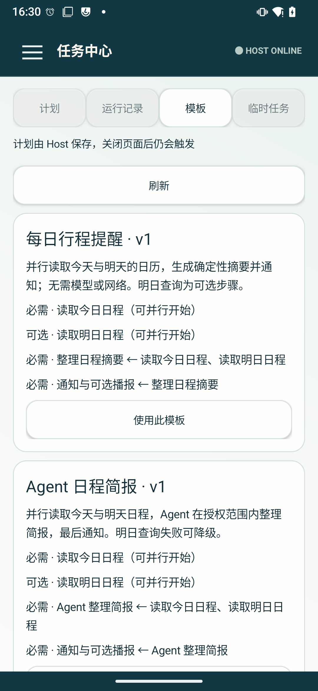

# Agent 定时任务实施与真机验证记录

版本：0.7.1（7001），Room schema 16、SDK schema 12。设计基线：[专题 v0.5.1](Agent定时任务与子任务编排专题.md)。用户于 2026-09-27 明确授权实施及真机验证。本文区分实现、自动化验证与尚未实测的故障组合，不能把设计矩阵的全部条目理解为已经逐项完成设备认证。

## 交付范围

- 侧栏第二项升级为“任务中心”：计划、运行记录、模板、临时任务。包含预览/创建/编辑、筛选、分页、计划控制、运行详情、子步骤与通知导航；既有即时任务仍走原通道。
- ONCE、AFTER_DELAY、DAILY、WEEKLY、具体日历实例提前提醒。固定发生身份、修订/注册代数、唯一运行约束、时间变化与重启对账、宽限补跑、重叠阻止均由 Host 管理。
- 全域单个 AlarmManager PendingIntent。目标取未来发生与持久积压 nextAttemptAt 的最小值；未尝试候选不退避，已尝试候选有界退避。广播消费、重启或系统条件变化会使物理注册状态失效，不能复用已经触发的“已注册”状态。
- Room 14→15 增加九张调度表，15→16 追加各渠道交付回执，共用既有 SQLCipher、密钥、epoch 与 reset-pending 门禁。提醒冷入口只装配持久化窄图与通知端口，三个渠道在窄图创建，不构造完整 AppContainer。
- 日历列表、本地日历初始化、事件/提醒查询与 CRUD、重复实例例外、回读校验、实例绑定与源变化对账。日历访问通过已注册能力、PolicyEngine 与 ToolExecutor；定时域不绕过该边界直接访问 Provider。
- 标准时钟 Intent 的闹钟/计时器/管理入口委托。没有可核验回执时明确返回 `EXECUTION_UNKNOWN / DELEGATED_UNVERIFIED`；任意日期不被转换为下一次同一时分。
- 持久化自动执行受理端口，稳定 runtimeRequestId、同参数重放/异参数冲突和受理查询。显式 Actor/zone 进入独立 AgentRequest，内部新增 `InputSource.SCHEDULED`，不调用 `submitTextOrAppend`，不包装硬编码 Driver 的 durable 路径。
- 两个固定 v1 模板：`daily_agenda`（确定性摘要）和 `daily_agenda_agent`（模型摘要）。今天/明天日历只读并行，摘要等待前置，最后通知与可选播报。没有伪造天气/路线数据，也没有开放任意代码或递归 Agent 图。
- 父预算 120 秒活跃区间并集、16 次工具，单步不超过 60 秒/8 次工具/8 轮；模板查询 10 秒、摘要 40 秒、交付 15 秒。只读重试最多两次并计入预算；排队不烧请求 deadline。进程中断后读操作有界恢复，未知写效果不盲重做。
- 自动模型与交互任务在同一车辆资源上仲裁，交互优先，可抢占后台只读请求；所有工具写入使用共享有界资源锁。能力 allowlist、网络授权、身份、epoch、取消和当前用户在执行边界复验。
- 通知与播报遵循渠道、勿扰、通话、音频焦点与夜间策略。播报有独立截止与撤销检查；通知发布不代表用户已经听到/读到。

P5/T14 的 ROM 私有时钟桥属于专题明确的可选后续范围，没有添加访问 DeskClock 私有数据库的旁路。首期仍仅支持前台、已解锁的 Android user 0。

## 工作包归属

| 工作包 | 实现落点 |
| --- | --- |
| T00、T03、T04 | 权限/渠道就绪、单臂、窄图、动态用户接收、真实冷唤醒与 Doze |
| T01、T02 | 时间规格、规范化、稳定发生、修订表语义、九表迁移与事务 |
| T05 | SDK、自然语言计划工具、Launcher 任务中心；Repository/Gateway 架构门禁 |
| T06 | 受理/交付恢复、epoch/reset-pending、保留清理、故障状态机；设备破坏性注入范围见 AC 表 |
| T07、T08 | 日历/重复实例/提醒回读，标准时钟 Intent 委托 |
| T09a、T09、T10 | specialUse FGS、显式 prepared 入口、持久受理查询、日历绑定核验 |
| T11、T12、T13 | 固定模板、步骤实体、依赖/预算/重试/取消、两个真实模板与步骤 UI |
| T14 | 可选 ROM 私有桥未启用，保留标准委托边界 |

## 关键文件与边界

| 层 | 入口 |
| --- | --- |
| 纯时间与规范化 | `schedule/domain/TimeRule`、`OccurrenceCalculator`、`ScheduleNormalizer`、`ScheduleCodec` |
| 事务与对账 | `schedule/store/ScheduleStore`、`ScheduleAdmissionStore`、`CalendarBindingStore` |
| 存储 | `data/schedule/*`、`MatrixDatabase` schema 16、`PersistenceRuntimeGraph` |
| Android 短路径 | `ScheduleWakeReceiver`、`ScheduleAlarmAdapter`、`ScheduleNotificationPort`、`ScheduleGraph` |
| 自动执行 | `DurableRuntimeExecutionPort`、`ScheduledExecutionGraph`、`PreparedAutomaticTask`、`AutomaticTaskExecutor` |
| 编排 | `WorkflowCatalog`、`WorkflowStore`、`WorkflowExecutionGraph`、`ActiveBudget` |
| 日历/时钟 | `CalendarClockCapabilities`、`CalendarClockProvider`、`CalendarBindingGateway` |
| IPC/SDK | `IScheduleService`、`ScheduleServiceStub`、`ScheduleManager`、schema 12 |
| Launcher | `ScheduleRepository → LauncherHostGateway`，`ScheduleViewModel`、`ScheduleFragment`、编辑/日历 Dialog |

实现中的补充裁决：

1. 通知批量风暴最多保留八条逐项通知，再按渠道合并为稳定摘要；每次发生仍单独入库并可查。短时间内复用已存在摘要，避免系统通知速率/数量限制导致假交付。只有系统可见通知确认后才记录交付。
2. 工作流历史按冻结模板版本与依赖次序投影步骤。输入/输出有界；模型结果做凭证脱敏，截断明确标记，不能对整段用户结果做审计散列。
3. 日历重复实例修改使用 `calendar.instance` 返回的 sourceRevision；第二次修改更新同一例外事件，不新增重复例外。原始系列/实例身份保持不变。
4. `ScheduleControlOperation` 的幂等标识保留；已解决运行按 30 天/1000 条有界清理，未知效果和未交付结果不清理。实际为 user 0 全域 1000 条上限，不把每个签名客户端当成独立 Android 用户。
5. 窄图不读取模型配置。完整图仅在 Agent/日历执行路径需要时懒构建；静态能力元数据的准入检查也只在非通知动作上初始化。
6. 清理增加 `ScheduleCommandFence`：命令入队时捕获代数，在与命令同一个数据库事务内检查；清除后即使 reset-pending 已移除，旧的排队创建也不能重建数据。JVM 用真实调度 store 验证旧请求被拒绝、新请求进入新 epoch。
7. 因 `AppContainer` 本身懒构建，测试必须区分“新进程但已装配全图”和“真正广播冷入口”；下表单独记录了严格冷入口。

## 0.7.1 继续实施与缺口修复

本轮重新逐项核查设计后，发现前版还存在功能缺口，而不只是测试覆盖不足；以下均为实际代码变更。

- **通知授权生命周期**：本地通知不可用时创建为 DRAFT/BLOCKED，回执明确“保存为草稿”；草稿必须恢复条件并显式启用。已启用计划保留 ACTIVE 意愿但标记 BLOCKED，从单臂候选中移除其未来通知及受理续算。真实通知渠道/应用开关广播和就绪查询触发重排，恢复不批量补发历史。注册健康变化写入有序事件，订阅可以看到阻塞与恢复。
- **各渠道交付事实**：Room 15→16 增加 `deliveryFactsJson`，历史记录默认为空，不能倒填过去未观察到的声音/播报事实。分别记录通知与播报状态、时间和通知渠道/importance/DND 快照；声音恒保守标为 UNKNOWN。请求播报但被抑制时为 PARTIAL/DELIVERY_PARTIAL，通知时间保留在明细，整体 deliveredAt 为空；不把通知成功冒充全部交付。失败通知使用 attention 渠道并合并节流。
- **冷入口稳健性**：三个渠道的创建失败转为明确阻塞，渠道缺失会在窄路径重新幂等创建并回读，保留用户配置。首次实际广播接收时间跨续算保留；纯修复受理为 RECONCILED 且 receivedAt 为空。
- **编排预算与步骤事实**：修复并发步骤耗尽父预算时活跃区间可能重复计费的问题；重试开始清除上一尝试的结束时间，恢复的终态步骤补齐完成时间。SDK schema 12 追加冻结模板 ID/版本、步骤安全输入摘要与累计活跃耗时，界面可核对历史版本而非读取当前计划替代历史。
- **任务中心生命周期**：按 scheduleId 独立读取并分页计划历史；刷新保留已加载窗口，订阅从最早页面序号回补；运行详情返回来源计划。页面离开关闭订阅，回来重同步；编辑草稿、筛选、滚动与选中对象可保存恢复。草稿最多保留八份；未确认保存回执优先重试原操作编号，不重新创建。固定发生的预览使用 Host 保存的 nextDueAt，AFTER_DELAY 不在查看时重新起算。
- **传输与状态呈现**：计划/运行分页同时限制数量和实际 Parcel 字节（256 KiB，另留 framing 余量），不截断目标与参数；界面区分“已保存，正在安排”“已安排”“需处理”，展示渠道交付明细。前台执行通知提供可点击的运行/历史入口，可进入停止本次操作。
- **回归覆盖**：新增事务写失败/回滚、受理回执失败、旧注册确认、通知阻塞草稿与恢复、首次接收时间、reset-pending、Android user/乘员身份、1/512/513 字符自动请求身份、并发预算和重试计费、分页去重/游标防循环测试。JVM 新增 17 项，原测试仍全部通过。

真机渠道三阶段已验证：关闭系统“计划提醒”后，已启用计划阻塞，新创建计划为草稿且恢复命令被拒绝；重新开启后显式启用草稿并改期，两个计划各交付一次。证据：[准备](verification/scheduling-v0.7.1/notification-policy-prepare.log)、[关闭渠道](verification/scheduling-v0.7.1/notification-policy-blocked.log)、[恢复交付](verification/scheduling-v0.7.1/notification-policy-restored.log)。这些阶段在本轮渠道修复后的 APK 上完成；最终产物另跑核心套件。

新增 Room 15→16 迁移后，真实 Host 正常读取既有记录并完成 11 项中间复测，其中包含勿扰下的播报抑制、分渠道回执及旧版 Parcel 读取。最终 APK 完成 13 项核心真机复测（90.305 秒）：包括 40 条长目标/大参数计划的实际 Parcel 分页、两类工作流、真实 Agent、日历、勿扰分渠道交付和 schema 10/11/12 的 Parcel 边界读取；全部通过，原有历史仍可读取。[最终核心套件](verification/scheduling-v0.7.1/core-suite-final.log)。

最终版本的深度 Doze 批量复测：到期前确认 `mState=IDLE`、模拟断电且本域活动闹钟恰为 1；100 个计划全部各一次成功交付，最大广播接收延迟 26 ms。该设备运行于 UID 1000，结论仍不外推为普通应用的 Doze 配额保证。[环境与单臂](verification/scheduling-v0.7.1/doze-before.txt)、[结果](verification/scheduling-v0.7.1/doze-verify.log)。

随后相隔约 203 秒的第二轮到期再次在目标前进入深度 Doze，N=10 全部各一次交付，最大接收延迟 25 ms；覆盖该 UID 的九分钟内再次到期。一次准备窗口过短的尝试在入 Doze 前已到期，未计为 Doze 证据。[第二轮环境](verification/scheduling-v0.7.1/doze-repeat-before.txt)、[第二轮结果](verification/scheduling-v0.7.1/doze-repeat-verify.log)。

Launcher 最终界面复核发现 130% 字体下编辑弹窗的长按钮文字换行并被裁切，已改为“放弃 / 返回 / 预览”，表单说明返回会保留本地草稿。修复后在 130% 和 200% 字体下三项操作完整可见、表单可以滚动；输入的测试草稿在返回、切换模板标签、重新打开及字体配置变化后仍保留。验证后放弃测试草稿，未创建 Host 计划。截图：[130%](verification/scheduling-v0.7.1/editor-large-font.png)、[200%](verification/scheduling-v0.7.1/editor-font-200.png)；[修复前](verification/scheduling-v0.7.1/editor-large-font-before.png)保留用于追溯。最后一次界面修复再次通过架构门禁并重新安装 Launcher，[门禁日志](verification/scheduling-v0.7.1/verifyArchitecture-ui-final.log)。这些检查不等同于 Android 真正回收进程后的状态恢复认证，该项仍待独立验证。

## 构建与设备

设备：`977d27c4`，Mi 9 SE / LineageOS 22.2 / Android 15 API 35；Host targetSdk 36，平台签名、shared system UID 1000。测试使用独立 `matrix-agent-test` trustedRelease APK，不安装 Host 的 androidTest APK，不清除 Host 私有数据。

JDK 21：`/Library/Java/JavaVirtualMachines/jdk-21.jdk/Contents/Home`。

```sh
JAVA_HOME=/Library/Java/JavaVirtualMachines/jdk-21.jdk/Contents/Home ./gradlew \
  verifyArchitecture \
  :matrix-agent-service:assembleDebug :matrix-agent-launcher:assembleDebug \
  :matrix-agent-test:assembleTrustedRelease :matrix-agent-test:assembleTrustedReleaseAndroidTest
```

`verifyArchitecture` 包含模块 check、lint、契约/SDK 发布约束与 JVM 测试。最近完整测试计数：Host 1399、SDK 20、Launcher 48、独立测试模块 4，共 1471，失败/错误/跳过均为 0。证据：[JVM 汇总](verification/scheduling-v0.7.1/jvm-summary.txt)、[构建门禁](verification/scheduling-v0.7.1/verifyArchitecture.log)。

本轮还修正了门禁暴露的三处 Android 最低版本不支持的 `Stream.toList()` 用法，以及 SDK Parcel 的 API 34 专用重载。两处原有平台签名权限 lint 使用精确注释说明，没有全局关闭检查。

## 0.7.0 真机证据（保留原始记录）

| 验证 | 结果与实际范围 |
| --- | --- |
| 公共签名 SDK 核心闭环 | 创建重放/异载荷冲突、revision 冲突、暂停/恢复/删除、精确提醒唯一运行 |
| 日历 CRUD | 创建、提醒回读、重放、冲突、更新、删除通过 |
| 日历改期 | 事件从三分钟后移至十二秒后，观察器重排，只有一个新时刻运行 |
| 重复实例 | 单实例连续两次改期，resolvedEventId 相同，没有重复例外 |
| 自动 Agent | 通过实际配置的在线模型取得指定验证回复并交付，独立 runtimeRequestId |
| 确定性工作流 | 四步骤实际执行并交付，结果可读，FGS 正常收束 |
| 模型工作流 | 真实模型完成 summary 子步骤，四步骤全部成功；冻结顺序/版本可查 |
| 原生时钟 | 打开真实时钟；回执保持未核验；不支持的 date 参数被拒绝 |
| 清醒 100 个同刻计划 | 100 个各一个成功运行；最大广播接收延迟 14 ms；[日志](verification/scheduling-v0.7.0/matrix-batch100-awake.log) |
| 深度 Doze 100 个同刻计划 | `mState=IDLE`，单个业务闹钟；100 个均交付，接收延迟最大 14 ms；[首轮日志](verification/scheduling-v0.7.0/matrix-batch100-doze.log)，批量路径复测同样通过，100 项全部成功、最大接收延迟 14 ms；[单闹钟/Doze 状态](verification/scheduling-v0.7.0/final-doze-before.txt)、[最终结果](verification/scheduling-v0.7.0/matrix-final-doze-verify.log) |
| 严格冷唤醒 | 提前停止 Host/Launcher 并临时移除自身无障碍绑定，确认 Host 无进程。16:03:33.668 由 ScheduleWakeReceiver 启动；接收延迟 925 ms；16:03:43.410 Launcher 重连才开始 AppContainer 装配，约耗时 5.1 s；[进程证据](verification/scheduling-v0.7.0/matrix-strict-cold-logcat.log)、[交付结果](verification/scheduling-v0.7.0/matrix-strict-cold-verify.log) |
| 真实重启 | 重启并解锁后恢复计划，一个成功运行，接收延迟 18 ms；[日志](verification/scheduling-v0.7.0/matrix-reboot-verify.log) |
| 真实时区广播 | Asia/Shanghai → Europe/Berlin，原绝对时刻不漂移，一个运行，接收延迟 11 ms；恢复原时区；[日志](verification/scheduling-v0.7.0/matrix-timezone-verify.log) |
| 真实时间前移 | 临时关闭自动校时，前移约两分钟，计划在宽限内补跑一次；完成后恢复真实时间与自动校时；[日志](verification/scheduling-v0.7.0/matrix-time-change-verify.log) |
| 完全勿扰 | 系统 `zen_mode=2` 下通知仍按渠道发布，未绕过静音；恢复原值 0；[日志](verification/scheduling-v0.7.0/matrix-dnd-verify.log) |
| 关闭提醒渠道 | 在系统设置关闭“计划提醒”，到期得到 FAILED/DELIVERY_BLOCKED/NOTIFICATION_CHANNEL_BLOCKED；没有假报投递；随后恢复渠道；[日志](verification/scheduling-v0.7.0/matrix-channel-blocked-verify.log) |
| Room 迁移 | 实际从既有版本数据库升级 14→15，保留原 Host 数据；生成 schema 与全部 27 张表结构比对通过 |
| Launcher | 从模板创建计划、确认、到期后记录/步骤详情可见；卡片点击问题在真机发现并修复；仅清理本轮测试计划 |

上面的毫秒值是这些样本的 `receivedAt - scheduledAt`，不是服务 SLA；时间前移样本的差值包含主动调整，不是 OS 延迟。100 计划测试运行于 system UID 1000，不能据此推断普通应用在 Doze 下能规避系统配额。AlarmManager 对 idle 唤醒的限制以[官方 API 文档](https://developer.android.com/reference/android/app/AlarmManager#setExactAndAllowWhileIdle(int,long,android.app.PendingIntent))与目标 ROM 实测为准，不把“约九分钟”当作所有版本的固定常量。

0.7.0 最终复测曾遇到一次真实网络故障：重启后设备 Wi-Fi 处于“已保存 / 无法自动连接”，没有默认网络。九项套件中七项通过，两项模型测试分别得到 `NETWORK_UNAVAILABLE` 与 `REQUIRED_STEP_FAILED`；[失败原始记录](verification/scheduling-v0.7.0/core-suite-network-unavailable.log)予以保留。通过系统设置重连原有已保存网络后，使用最终 APK 与相同断言重跑，九项全部通过；加入清理命令隔离后的最后复跑仍全部通过（71.537 秒）；[最终核心套件](verification/scheduling-v0.7.0/core-suite-final.log)。该故障也验证了本地提醒/日历功能不会因模型网络故障一起失效。

任务中心模板界面（实际设备截图）：



## 验收矩阵的覆盖范围

“JVM”表示确定性规则/状态机验证，“设备”表示已经实际运行；“部分”不等于完整 AC 通过。

| AC | 覆盖与仍需区分的范围 |
| --- | --- |
| 01、04、06、07 | 设备生命周期、重放/冲突/唯一运行；并发暂停竞态由事务和 JVM 验证 |
| 02、03、15、40、42 | 时间/DST/截止/重启身份及字符字节边界 JVM；时区变化另有设备测试；真实 DST 日期跳变未模拟 |
| 05、09、10、11、48 | 冷启动/杀进程/真实重启和单臂续算有证据；注册 set/cancel 的每个指令级崩溃窗口、未首次解锁的长期等待尚未逐一注入 |
| 08、45、46 | 原行改期、稳定 ID、旧代数拒绝、已领取不可改期、冻结载荷与时间历史 JVM；日历改期另有设备覆盖 |
| 12、37 | 清醒/深度 Doze 的 N=100 批量；0.7.1 另有约 203 秒后再次进入 Doze 的 N=10 样本；更长待机和各省电模式仍未形成长时间统计 |
| 13、38 | 真实渠道撤权草稿/阻塞/恢复、完全勿扰及播报抑制的分渠道回执；通知权限/精确闹钟权限撤销所有组合、通话与音频抢占未全部实测 |
| 14、39 | 真实时间前移、时区广播；后移与 AFTER_DELAY 单调时钟计算 JVM；冷/热所有组合未穷举 |
| 16、17、18 | 重叠、epoch、晚到回调和既有 reset 门禁测试；不为验收破坏设备上的用户数据，未在真机清空现有 Host |
| 19、20、21、24 | 真实本地日历初始化、CRUD/提醒/实例例外/改期，事务重放；Provider 写入后精确杀进程窗口未逐一注入 |
| 22、23 | 真实标准时钟管理入口与未知回执、非法 date 参数拒绝；未验证 ROM 私有闹钟列表与删除，因为不在标准委托接口范围 |
| 25、41 | 稳定受理 ID、查询/冲突、Actor/zone、过期受理 JVM；真实 Agent 执行；每个 accept/回执断点尚未逐一杀进程 |
| 26、27 | 实际模型执行；独立 prepared/dispatch、scope/取消/仲裁；1/512/513 字符在两种 Actor 下的稳定请求/会话/zone JVM 验证；真实活动会话的全部竞态组合未穷举 |
| 28、29、30、31、32、43 | DAG/父预算/依赖/可选失败/取消/晚回调/未知交付恢复 JVM，真实两个模板；未知写效果保持保守状态 |
| 33 | user 0 的动态接收、冷入口查询与拒绝逻辑已接入；没有在该用户设备创建/切换第二 Android 用户 |
| 34、35、44 | 实际升级、契约/架构/lint、分页/上限；未进行磁盘满、密钥失效等破坏性设备注入，旧契约被协商拒绝 |
| 36 | 调度能力拒绝自动来源，allowlist/网络/原始交互意图约束已落到边界；未构造完整多轮恶意日历红队语料 |
| 47 | 已验证严格冷广播与随后全图懒装配；全渠道删除、密钥失效与同时初始化的所有组合仍需专项故障注入 |
| 49、50、51 | Launcher 真实创建/详情/子步骤/导航与旧入口保留；130%/200% 编辑界面、跨标签草稿及字体配置变化恢复已验证；系统回收、断连和所有失败状态的 UI 全排列未做截图穷举 |

## 复验与运行

```sh
adb -s 977d27c4 shell am instrument -w -r \
  -e class com.matrix.agent.test.ScheduleHostInstrumentedTest,com.matrix.agent.test.CalendarWorkflowHostInstrumentedTest,com.matrix.agent.test.ScheduleDeliveryHostTest \
  com.matrix.agent.test.test/androidx.test.runner.AndroidJUnitRunner
```

批量/重启/Doze 使用 `ScheduleRecoveryHostInstrumentedTest#prepare` 与 `#verifyAndCleanup` 两阶段。必须等待 prepare 完成后再启动 verify；中途启动另一 instrumentation 会杀死准备进程，不能据此宣称完成 N=100。测试只删除 `[Matrix验证]` 本轮自建记录，日历事件在 finally 中按原 ID 清理。

默认任务中心的所有权按签名客户端 UID 隔离。独立测试 APK 的计划不会混入 Launcher 用户的列表；通知指向无权访问的对象时也不会按标题错误关联另一个计划。

工作区保留用户原有的两份文档删除；没有重置历史会话、模型配置或其他用户内容。临时 Doze/电池、时区/系统时间、勿扰、提醒渠道和自身无障碍绑定均恢复原状态；本轮字体恢复 1.0、输入法恢复搜狗，复查强制 Doze 已解除、zen_mode=0、自动校时启用、时区 Asia/Shanghai。新版本已按原签名升级安装到连接设备，不需要迁移用户的旧即时任务。[最终安装产物 SHA-256](verification/scheduling-v0.7.1/apk-sha256.txt)仅列实际安装的四个 APK。
