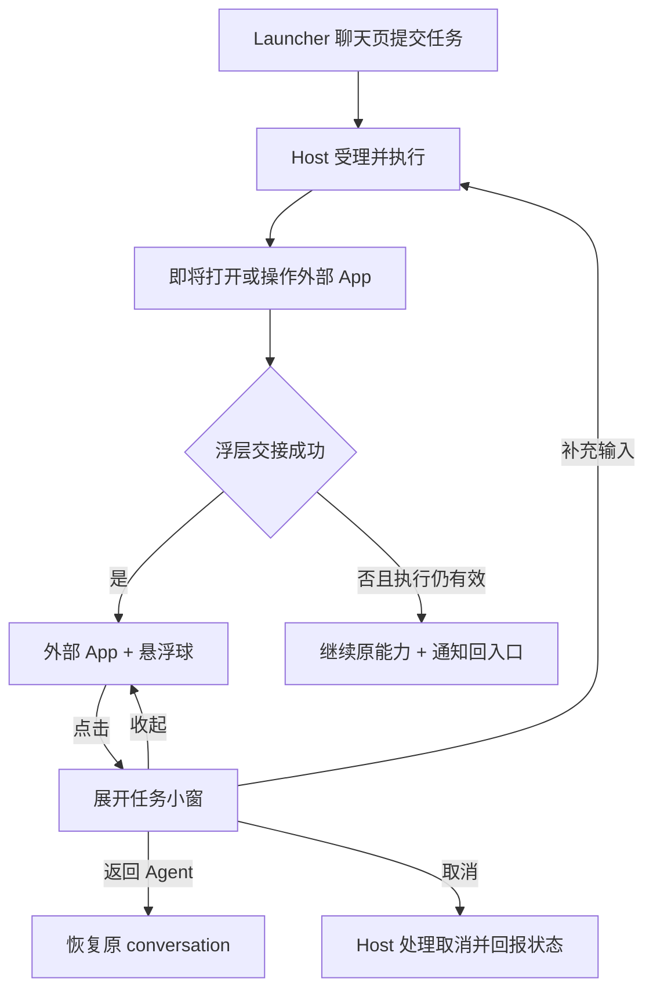
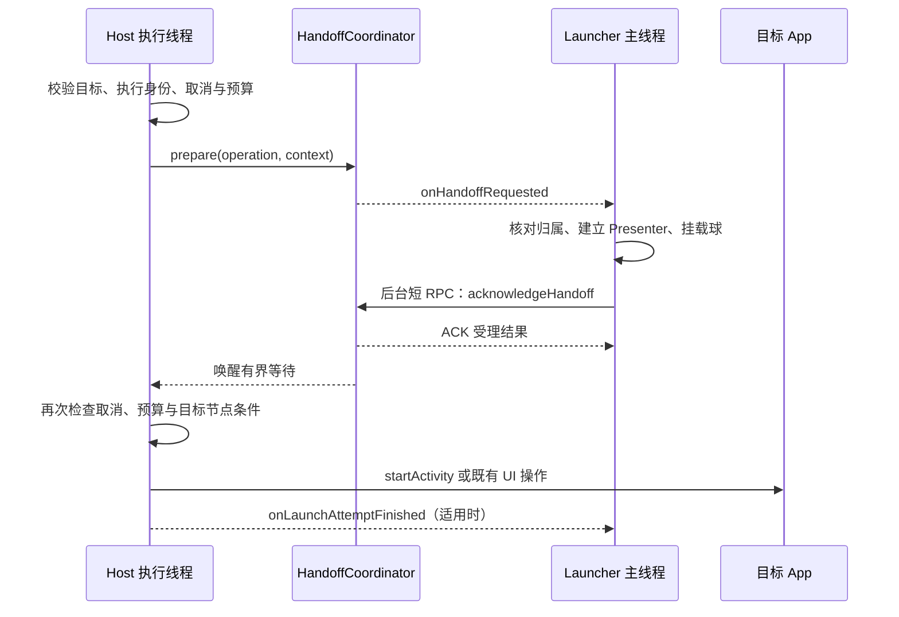

# Agent 跨应用悬浮球与小窗模式技术执行方案

> 版本：v2.5 · 2026-09-26（小窗与全屏共享完整会话内容）<br>
> 状态：主体、展开态拖动、分层配色与完整会话列表已实现并安装到真机，详见 [实现与真机验证记录](Agent跨应用悬浮窗实现与真机验证记录.md)。验收表保留完整要求，不代表所有设备组合均已验证。<br>
> 工程：MatrixAgentProject；目标环境为平台签名的 LineageOS 定制 ROM。<br>
> 核心交互：**Launcher 全屏 → 外部 App + 悬浮球 → 点击展开任务小窗 → 收起回悬浮球。**

## 1. 交付目标与设计决策

用户在 Launcher 中交给 Agent 一个任务，Agent 打开或操作其他应用时，屏幕边缘仍保留 Agent 入口。用户点击入口后可查看进度、阅读反馈、补充输入、取消当前任务或返回完整会话。悬浮球是收起态，小窗是展开态，两者属于同一套窗口与任务状态。

本方案优先接通聊天和语音使用的 `conversation` 执行通道。任务工作台使用独立的 `durable task` 通道，后续通过独立 Presenter 接入。文中“当前任务”默认指一个 conversation 主轮次，不等同于 durable `taskId`。

### 1.1 固定决策

| 决策 | 首期执行规则 |
| --- | --- |
| 显示数量 | 同一 Launcher 进程、默认显示屏上最多一个球或小窗，绑定一个主轮次 |
| 窗口归属 | Launcher application scope 控制 `TYPE_APPLICATION_OVERLAY`，不依赖 Activity View 存续 |
| 进程托管 | 首期不新增浮层 Service/FGS；进程死亡后窗口消失，用户返回 Launcher 时恢复会话 |
| 显示时机 | Host 在外部 Activity 启动前发交接请求；直接操作已打开的目标 App 时，也在 UI 操作前进入同一交接入口 |
| 交接顺序 | Launcher 按 §3.4 准备窗口或确认当前会话页承载状态；Host 收到对应结果后执行既有能力 |
| 等待上限 | 首次/重建/归属变化最多 1,200 ms；同任务复用目标 P95 <50 ms、等待上限 50 ms；均受操作剩余预算限制 |
| 浮层失败 | 未授权、无客户端、窗口失败、忙碌或交接超时，按原能力策略继续；提供 Host 通知回入口 |
| 执行取消 | 任务取消、工具预算耗尽、启动资格检查失败时停止后续动作；不适用“浮层失败继续”规则 |
| 输入策略 | 首期采用只读自动操作状态提示；不引入输入租约、续期或“打字即暂停”的承诺，已开始编辑按 §6.3 保持 |
| 同页显示 | Launcher 当前 conversation 页可见时不叠加球/小窗；授权的离页启动按 §3.4 显示 |
| 任务数据 | Host 持久化消息是事实来源；运行阶段是可丢失的内存提示 |
| 任务接管 | 旧任务活跃时保护归属；旧任务已确认终态时允许新任务替换 |
| 语音独立入口 | 没有在线 Launcher callback 时不自动冷启动浮层，使用 Host 通知和会话历史 |
| 部署授权 | ROM 可预置 overlay 特殊访问；每次创建窗口仍检查 `Settings.canDrawOverlays()` |

交接结果分别表达“可见窗口已挂载”“为即将离页预挂载但仍隐藏”“完整会话页正在承载”。这些都不能证明目标 App 已进入指定页面或工具操作成功，指标分别统计。

### 1.2 首期排除项

多任务并排展示、跨显示屏、进程死亡后自动重建浮层、自动冷启动 Launcher、逐 token 正文流、通用安全确认面板、完整输入租约/输入时暂停执行、PiP 聊天窗。后续增加这些能力时，应单独补齐数据源与生命周期设计。

## 2. 已核实的工程基线

### 2.1 两条执行通道

| 维度 | conversation：本期 | durable task：后续 |
| --- | --- | --- |
| 入口 | `ConversationRepository.submitTextOrAppend`；Host 语音桥也进入同一协调器 | `AgentTaskViewModel.submit` / `AgentTaskRepository` |
| 运行身份 | `runtimeRequestId`、`conversationId`、`conversationTaskId`、主用户 `messageId` | durable `taskId` |
| 进度 | `IConversationCallback` 消息更新、状态更新与 `onRuntimeStageChanged` | `subscribeTask` 状态事件 |
| 恢复 | 有界订阅快照、消息分页、锚点消息核对 | `getTaskSnapshot` 与 `afterSequence` 回放 |
| 补充输入 | `submitTextOrAppend`，Host 原子选择并入或新建主轮次 | `steerTask(REPROMPT)` |
| 取消 | `cancelMessage(conversationId, 主用户 messageId, operationId)` | `cancelTask(taskId, operationId)` |
| 回复正文 | 同一 `conversationTaskId` 的持久化 assistant 消息 | 当前发布链路只有状态文案，无正文 delta |

`ConversationTaskProgressBridge` 将已绑定的 `runtimeRequestId` 映射到 conversation 主轮次，发布 `QUEUED / PLANNING / EXECUTING` 和安全标签。阶段不持久化，Host 重启后不能重建过去的阶段序列。`VoiceConversationBridge` 可以在 Launcher 进程未启动时提交 conversation，因此“支持聊天数据协议”与“有显示客户端在线”是两个条件。

SDK 定义了 `TYPE_TEXT_DELTA`、确认相关常量和方法，但当前 durable Host 没有正文 delta 发布点，`respondConfirmation` 返回 `UNSUPPORTED_OPERATION`。媒体选曲的“是/第几首”通过下一轮聊天输入处理。本期 UI 只展示已实现的数据语义。

### 2.2 实施前基线与本次改造

| 实施前基线 | 本次改造 |
| --- | --- |
| `AndroidAppLaunchPort.dispatch()` 直接调用 `startActivity()` | 已在解析成功与真正启动之间插入交接 |
| `AppLaunchPort` 无 request 参数；两个 UI Port 只接收裸 deadline | 已用 LaunchContext 显式传播运行身份、操作 ID、取消信号和统一截止时间 |
| `LauncherViewModel.onCleared()` 调用 `gateway.disconnect()` | 已使用独立连接持有句柄，防止 Activity 销毁后中断浮层订阅 |
| `ConversationRepository` 尚未包装 `getMessagesAfter/getMessagesAround` | 已补齐新消息缺口和旧消息状态核对 |
| 媒体无障碍服务只调用 `getRootInActiveWindow()` | 已按目标包选择应用窗口，处理小窗改变活动窗口的情况 |
| Launcher Manifest 没有 overlay 声明 | 已添加特殊访问检查、窗口创建与撤权处理 |
| SDK 对 AIDL 和公开 API 计算 `contractHash`，连接时要求匹配 | 新接口必须同步发布 Host、SDK 和 Launcher；feature bit 不替代哈希校验 |

工程基线为 `minSdk=28`、`compileSdk=36`、`targetSdk=36`。Host 使用 system UID，Launcher 使用平台证书签名；签名不替代 overlay 的实际授权状态，也不授予任意会话访问权。

## 3. 用户体验与窗口状态

### 3.1 主流程

下图为实际切换到外部 App 的主路径；用户仍在同一聊天页的直接 UI 操作按 §3.4 由页面承载。



用户手动切换应用、按 Home、打开附件选择器或授权页，不单凭 Activity `onStop` 触发悬浮球。只有 §3.4 的有效离页启动准备可以用页面生命周期完成既有窗口显隐，其它情况等待下一次有效 handoff。

### 3.2 窗口形态与业务状态分离

窗口形态使用 `HIDDEN / PREPARING / BUBBLE / PANEL`；显示抑制原因单独保存，例如 `SAME_CONVERSATION_VISIBLE`、`USER_DISMISSED`。业务状态使用主用户消息状态与可选运行阶段；连接状态使用 `CONNECTED / RECONNECTING / UNAVAILABLE`。窗口未绘制不等于没有归属，也不代表任务终态。

| 当前形态与事件 | 处理 |
| --- | --- |
| HIDDEN 收到有效交接 | 获取临时连接租约，按 §3.4 决定创建可见球、预挂载隐藏球或仅由会话页承载 |
| BUBBLE 点击 | 展开 PANEL；继续使用同一 Presenter 和订阅 |
| PANEL 收起 | 保存草稿、隐藏 IME、释放输入焦点，回到 BUBBLE |
| BUBBLE/PANEL 收到当前任务终态 | 更新状态与正文，保留形态，允许用户关闭或后续任务接管 |
| 收到同一任务的新交接 | 按 §5.3 快路径复用，保持现有形态；已编辑时严格遵循 §6.3，不收起面板、不隐藏 IME，也不等待编辑结束 |
| 当前 conversation 完整页面可见 | 按 §3.4 隐藏浮层，保持会话数据可读；离页不会单凭 onStop 重弹 |
| 关闭浮层 | 进入 HIDDEN，退订并释放浮层租约；保留 Host 任务 |
| 返回 Agent | Activity 成功恢复目标 conversation 后移除浮层，避免空档和重复界面 |
| 锁屏、用户切换、权限撤销 | 隐藏并清理窗口和本地输入焦点；后续有效交接重新检查条件 |

终态球首期保留至用户关闭、返回 Agent 或被新任务替换，不设置强制自动消失计时器。用户主动关闭时，抑制同一 `runtimeRequestId` 的再次自动弹球，直到该轮次结束或用户主动重新打开；新的主轮次仍可申请显示。

### 3.3 球与小窗的内容

悬浮球显示 Agent 标识及运行、完成、失败/未知的状态标记。状态不能仅靠颜色区分，需配合可访问性描述。点击展开、拖动贴边；拖拽与点击使用 touch slop 区分。

小窗包含标题、当前任务阶段、完整会话消息列表、输入框和“返回 Agent / 取消任务 / 收起 / 关闭”操作。标题从会话元数据读取；阶段显示当前主轮次的真实状态与 `safeLabel`。消息列表按 conversationId 展示用户、助手和系统消息，包括当前问题及之前轮次，按 sequenceNo 排序；不能按当前 taskId 过滤正文，也不能用单条最近回复代替对话。

小窗与全屏共享 `ConversationMessageRenderer` 及 Host 消息投影，统一头像、角色位置、正文、用户执行状态与 steer 投递标识。启用 `matrix.debugTraceUi` 的构建中，两种模式也共用 `ConversationTraceRenderer` 展示已脱敏的“思考与工具”折叠过程；复用现有 debug 历史/订阅通道，旁路失败不影响正文与任务控制。最初加载最近 30 条，顶部“查看更早消息”继续分页，失败提供重试。历史读取不阻塞 handoff ACK。新回复到达时，用户在底部则跟随；用户正在浏览历史则保留消息锚点及像素偏移。长按消息复制正文。任务阶段和取消按钮仍只作用于当前绑定主轮次，不因浏览旧消息改变取消归属。

取消按钮提交后显示“正在取消”，由 Host 消息状态确认结果。终态禁用取消按钮；输入框仍可开始下一轮。媒体候选答复沿用聊天语义，不生成虚构的通用确认状态。

展开态的标题区域是独立拖动热区（最小高度 52dp），显示“按住标题栏移动”。使用与悬浮球相同的 touch slop 区分点击和拖动，以屏幕坐标的总位移更新窗口；多指介入或系统 CANCEL 结束手势，不误触点击。标题栏中的收起/关闭按钮是拖动区的兄弟节点，正文滚动、文字选择和输入框继续自行接收触摸。移动不结束编辑，也不改变连接、归属或操作状态。

球与小窗分别保存位置：球拖动后贴边，小窗自由移动且不自动贴边；第一次展开在水平方向居中，后续展开恢复小窗位置。横竖屏及 IME 变化按可用边界夹取绘制坐标；若用户在该边界内主动拖动，则保存实际夹取后的位置。仅刷新任务进度不会居中或回到球的位置。

当前小窗视觉为深蓝标题栏（`#172D40`）、雾白底（`#F3F6FA`）、按角色区分的聊天气泡与浅灰蓝输入区。青蓝进度条表示运行，绿色表示完成，暖红表示失败，琥珀色表示重连或未知，均保留明确状态文字。发送使用暖陶色（`#B7482C`）实心主按钮，返回为青蓝次操作，取消为红色文字操作，禁用态使用独立文字/底色。颜色与文案集中到 `overlay_colors.xml` / `overlay_strings.xml`。

初始视觉参数供原型使用：球的点击区域至少 48 dp，默认靠右；面板宽度取可用宽度约 88%，设置 420 dp 上限，高度不超过可用区域约 60%。小屏、横屏、大字体和 IME 下以可操作性为准。消息列表在面板内独立滚动，完整历史可原地分页读取。可用面板高度小于 320dp 时启用紧凑布局：隐藏拖动说明、发送按钮移到输入框旁、返回/取消置于标题栏“更多”菜单；输入框保留原实例，避免旋转丢失焦点和草稿。

### 3.4 浮层与完整会话页的显示优先级

Launcher 报告 `isConversationPageVisible(conversationId)`：Activity 在前台、目标 conversation 页面确实可见、当前未被其它功能页替换。不能只比较前台包名；分屏/窗口变化也更新此状态。该状态由主线程发布为不可变快照，交接和回调按当前值重新判断。

**同一 conversation 的完整页面可见时，不同时绘制悬浮球或小窗。** 这一显示抑制不等于用户关闭；页面上的任务进度和失败反馈继续更新。具体时序：

| 场景 | 窗口与交接结果 |
| --- | --- |
| `INTERACT_EXISTING_APP` 到达且同一会话页可见 | 返回 `PRESENTED_IN_LAUNCHER`，不创建球、不发重复通知；若之后用户手动离页，等下一次有效 handoff 再显示 |
| `LAUNCH_ACTIVITY` 到达且同一会话页可见 | 首次慢路径可预挂载不可见球并建好归属，返回 `OVERLAY_PREPARED`；当前页面仍不出现第二份入口 |
| 上一行启动已提交，且同一会话页随后不再可见 | 用该请求的一次性展示凭据显示已预挂载的球；无需第二次完整 handoff |
| 启动失败、执行前取消、离页未发生 | 清理该请求的预挂载窗口；失败反馈留在完整会话页，不留下空球 |
| 用户返回同一会话页 | 立即隐藏浮层；显式“返回 Agent”在页面接管后释放浮层资源 |
| 正在其它 App 或 Launcher 其它页 | 无同页抑制，按一般交接和归属规则处理 |

一次性展示凭据仅作用于匹配的 handoffRequestId/bindingVersion：要求 `onLaunchAttemptFinished(DISPATCHED)` 与页面离开两个条件同时成立，二者到达顺序不限。DISPATCHED 后最多保留 2 秒且不超过原操作截止时间；超期、失败、关闭、换归属或断线均作废。超期清理隐藏窗口，后续操作重新准备，不能因迟到的 onStop 突然弹球。该 2 秒是本地显隐关联期限，不延长 Host 的 1,200 ms ACK 等待。

预挂载阶段窗口不可见、不可触摸且不获取输入焦点，不能只把内容涂透明后留下可触摸区域。没有收到 DISPATCHED 时最多保留至原操作截止时间，避免 callback 丢失使隐藏窗口一直占有资源。

Host 提交 Activity 不保证它真正前台，因此两个条件缺一不可。onLaunchAttemptFinished 可以显示已准备且仍匹配的隐藏窗口，不能凭回调新建窗口或重放启动。P0 必测“未离页的已有 App 操作”“启动失败仍在聊天页”“正常打开目标 App”和“DISPATCHED/onStop 乱序”，确认正常切换仍能显示球且聊天页不闪现重复入口。

## 4. 模块职责与身份

### 4.1 组件划分

| 模块 | 已实现组件 | 职责 |
| --- | --- | --- |
| service-lib | Handoff DTO、`IExternalAppHandoffService`、callback、客户端 Manager | 窗口交接、ACK 和只读外部 UI 活动状态 |
| Host conversation | `HandoffContextRegistry` | 将运行 request 绑定到会话、主轮次、主用户消息和访问域 |
| Host presentation | `HandoffCoordinator` | 注册身份、待处理请求、超时、ACK、死亡清理与降级结果 |
| Host media | `LaunchContext`、`ExternalAppHandoffPort` | 显式传播执行身份与预算，在外部 UI 边界发交接 |
| Host media | `ExternalUiActivityTracker` | 按显示屏跟踪真实 UI 操作，发布 AUTOMATION/IDLE；不授予输入权、不阻塞 Agent |
| Host notification | `HandoffFallbackNotifier` | 浮层不可用时提供已有 conversation 的返回入口 |
| Launcher data | `HandoffClient`、连接租约、Repository 分页包装 | SDK 注册、订阅和操作分发 |
| Launcher overlay | `OverlayController`、`OverlayConversationPresenter` | 窗口形态、当前归属、消息状态与 UI 事件 |
| Launcher overlay | Controller 显示检查、Activity 授权入口、`OverlayDraftStore`、`OverlayWindow` | 授权、显示条件、窗口内位置与独立未发送文本 |

权限检查留在窗口事务的创建/显示边界，设置入口由 Activity 提供，无额外空壳 PermissionGate 类。Host 不引用 Launcher View，Launcher 不执行媒体 Tool；两端都通过 SDK 或进程内端口保持边界。

### 4.2 身份字段

| 字段 | 所有者与用途 |
| --- | --- |
| `runtimeRequestId` | Host Agent 执行身份，用于从运行请求找到会话 |
| `conversationId` | 用户可见会话；用于读取、输入和返回路由 |
| `conversationTaskId` | 当前主轮次；用于阶段与操作归属，不过滤会话消息 |
| `hostUserMessageId` / `hostUserSequence` | 原始 PRIMARY 用户消息；用于取消与锚点查询 |
| `operationId` | 本次工具调用身份；用于合并 UI Port 与 dispatch 的交接，不跨轮次复用 |
| `handoffRequestId` | 每次交接唯一；用于 ACK、幂等和临时窗口清理 |
| callback Binder | Host 可验证的注册身份；每次重连创建新 Stub |
| `connectionGeneration` | Launcher 本地连接轮次；过滤旧连接结果 |
| `bindingVersion` | Launcher 本地窗口归属版本；过滤旧任务回调 |
| stage `generation` | Host 同一主轮次的阶段次序；只用于阶段去重 |

上述计数器和 ID 各自使用，不互相替代。DTO 不传 Launcher 私有的 `connectionGeneration`。Host 在 pending 记录中绑定调用方 UID/Android 用户、会话访问域、callback Binder、request ID 和截止时间。

### 4.3 会话上下文注册

选定新增专用 `HandoffContextRegistry`，不复用进度桥的私有 Map。`ConversationCoordinator` 在主轮次持久化成功后、提交执行器之前注册完整身份；在拒绝调度、终态、取消收敛和清理路径统一移除。steer 继续归属宿主主轮次，不注册为独立执行。

上下文还需包含现有会话访问策略使用的 owner/zone。Host 发请求前检查注册客户端有权读取该会话；不能只检查两个 APK 同签名。无有效 conversation 绑定的 durable/debug 请求显式跳过浮层，但保留原能力执行和取消/预算规则。

## 5. SDK 契约与交接协议

### 5.1 接口与兼容规则

沿用根 Binder 的 `getMatrixService` 发现方式增加独立 handoff 子 Binder，并增加对应 feature bit。子 Binder 使用现有 `ACCESS_AGENT` 及调用方验证，并限制注册者为当前受信任 Launcher。不要把短暂窗口协议写进普通任务文本事件。

已落地的 AIDL 语义如下；错误值集中在 `HandoffProtocol`，只追加已发布枚举：

```text
registerCallback(callback) -> registrationResult
unregisterCallback(callback)
acknowledgeHandoff(callback, handoffRequestId, preparationResult, reason) -> ackReceipt

callback.onHandoffRequested(request)                 // oneway
callback.onLaunchAttemptFinished(requestId, result, elapsedRealtimeMs) // oneway，仅本次尝试结果
callback.onExternalUiActivityChanged(snapshot)       // oneway，只读快照/变化，见 §6.3
```

注册和 ACK RPC 只做鉴权、校验、短状态修改与唤醒。callback 不执行耗时工作；Launcher 将窗口操作投递到主线程，ACK 通过独立的短调用执行通道发出，不排在聊天分页、模型配置或文件操作后面。

**发布采用同一契约构建的 Host + SDK + Launcher 配套升级。** 当前 contractHash 不匹配会拒绝业务连接，追加 AIDL 方法或增加 feature bit 并不能让旧 APK 自动兼容。需区分：同契约且未注册 callback，可快速降级；契约不匹配，显示升级/连接错误。若以后要求独立滚动升级，应另行设计版本兼容，不能放宽现有哈希校验。

### 5.2 请求与结果

```text
ExternalAppHandoffRequest {
  schemaVersion
  handoffRequestId, operationId, runtimeRequestId
  // 本子协议固定用于 CONVERSATION，无冗余 lane 字段
  conversationId, conversationTaskId
  hostUserMessageId, hostUserSequence
  packageName
  reason = LAUNCH_ACTIVITY | INTERACT_EXISTING_APP
  preparationMode = CREATE_OR_REBIND | REUSE
  createdElapsedRealtimeMs, deadlineElapsedRealtimeMs
  operationDeadlineElapsedRealtimeMs
}
```

身份来自 Host 的受理记录；package 来自已校验能力。请求不携带用户全文、屏幕内容、模型推理、候选标题、任意 Intent 或工具参数。deadline 使用同设备 `elapsedRealtime` 时钟，进程重启后不重放旧请求。

`deadlineElapsedRealtimeMs` 控制本次交接 ACK；`operationDeadlineElapsedRealtimeMs` 控制整个工具操作，并约束 §3.4 的本地展示凭据。两者独立，隐藏窗口不会在短 ACK 窗口结束后立即误失效，也不会延长工具预算。当前 Parcelable schema 为 9；handoff feature 使用独立追加位，不修改已冻结的 Stage B feature 集合。

| 交接结果 | 含义 | 原能力后续 |
| --- | --- | --- |
| `RESULT_PRESENTATION_SKIPPED = 0` | Host 内部结果：durable/debug 无 conversation 绑定；不是 Launcher ACK，也不代表任务成功 | 跳过展示，继续有效能力 |
| `OVERLAY_READY` | 已有当前归属的可见浮层挂载，Host 接受 ACK | 重查取消和预算后继续 |
| `OVERLAY_PREPARED` | 同页可见，已预挂载隐藏球，等待本次有效离页启动 | 按 §3.4 完成显隐；不称为已可见 |
| `PRESENTED_IN_LAUNCHER` | 当前完整会话页正在承载，无需叠加球 | 继续能力，不发重复返回通知 |
| `OVERLAY_UNAVAILABLE` | 无权限、窗口错误、锁屏、状态无法核实等，附受限 reason code | 执行仍有效时继续并通知降级 |
| `OVERLAY_BUSY` | 另一活跃任务正在占用显示归属 | 保留旧球，当前任务通知降级 |
| `USER_DISMISSED` | 用户已主动隐藏本轮次浮层 | 保持隐藏；不为同轮次重复弹通知 |
| `LAUNCHER_NOT_CONNECTED` | 无可用注册 | 立即降级，不等待 1,200 ms |
| `HANDOFF_TIMED_OUT` | 仅交接等待到期 | 操作总预算仍有效时继续 |
| `EXECUTION_CANCELLED / OPERATION_DEADLINE_EXCEEDED` | 执行本身已失效 | 停止后续启动和 UI 写操作 |

ACK 回执另用 `ACCEPTED / EXPIRED / STALE_REGISTRATION / ALREADY_RESOLVED` 表达是否被 Host 接受，避免把“已发送 ACK”当成已达成双方一致。未知枚举作为不可用处理。

### 5.3 时序、截止时间与线程

下图表示首次创建/归属变化的慢路径；REUSE 按第 7–9 条直接读取快照并回 ACK，不经过主线程窗口准备。



1. 启动路径先完成目标包、启动资格和 Intent 解析；不可解析时不创建空球。
2. 首次创建、必要的窗口重建和归属变化使用 `min(nowElapsed + 1,200 ms, operationDeadline)`；同任务复用使用 `min(nowElapsed + 50 ms, operationDeadline)`。查询、队列等待与 ACK 均计入，不能把复用超时升级为一次新的 1,200 ms 等待。
3. 等待发生在实际执行工具的 worker：当前 `ToolExecutor` 使用 Host 的有界 network lane。上层 `matrix-task` 调度线程等待工具结果，会间接受影响；不能把 ACK 放入被阻塞的执行通道。两个交接可同时占用 worker，因此等待必须有硬上限。
4. ACK、超时、取消、注销、替换注册和 Binder death 竞争同一个原子完成点，只有一个结果生效。pending 锁内不调用远端、不等待，不占用 conversation 事务锁等待 UI。
5. ACK 处理、取消通知与定时唤醒不能排到正在等待的同一 task pool；Launcher UI 也不能同步等待 Host。
6. 显示成功不授权执行。真正的 `startActivity()` 或外部写动作前重查取消、总预算和原能力策略；发出后不能承诺回滚已经发生的副作用。
7. 同任务已有可用浮层且注册/身份/显示条件匹配时，**必须走 REUSE 快路径**：不 add/updateView、不重建 Presenter、不重新订阅、不读锚点，不排到主线程等布局；由短回调处理器读取主线程发布的不可变归属/显示快照并 ACK。窗口形态保持不变，编辑态按 §6.3 处理。只需同页承载时也可直接确认 `PRESENTED_IN_LAUNCHER`。
8. 快路径 prepare→结果的目标为目标设备正常负载 **P95 <50 ms**，等待策略上限为 50 ms（受剩余操作预算约束）。超时返回 HANDOFF_TIMED_OUT 并继续原能力，不重新排慢路径，不移除已有球；通知按已有入口可用性去重。极端线程调度延迟单独记录，不能把 50 ms 宣称为实时系统保证。
9. Host 用上次已确认身份及存活 callback 选择 REUSE；Launcher 若发现归属/可见性快照已失效，返回 UNAVAILABLE / REUSE_STATE_STALE，不在同一调用里悄悄创建窗口。清除 Host 复用记录，下一次操作根据实际需要走重建路径。已知用户关闭仍返回 USER_DISMISSED。
10. 每个 operation 的显示准备按单调状态复用。同类内部调用不重复交接；§3.4 的 `PRESENTED_IN_LAUNCHER` 不等同于“外部窗口已准备”。若内部发现需要真正 `LAUNCH_ACTIVITY`，允许在同一已冻结的 handoffDeadline 内把仅页内承载升级为一次隐藏球准备，不重新起算 50/1,200 ms。预算已用尽则降级，不能借升级延长等待；READY/PREPARED 已满足要求时不再等待。

已有同归属窗口仅因完整会话页可见而隐藏时，后续 LAUNCH 的 REUSE 不重建窗口：短回调直接回 PREPARED，仅向主线程投递一次性展示凭据的记账，不等待主线程。真正显示仍要求 ACK 接受、DISPATCHED 与页面离开均成立。

P0 分别测首次、归属变化、同任务复用，以及同一搜索→选曲链的交接累计耗时；对快路径注入主线程繁忙，验证其不依赖主线程窗口工作。复用时延统计包含超时请求，并同时报告 READY/页内承载成功率，不能通过把慢请求都降级来制造达标数据。

Host 的 ACK 等待上限与工具结束总耗时分别记录。线程调度可能使实际观测耗时略晚于 deadline，但任何超期 ACK 都不能获准，且执行线程醒来后必须重查预算。实现不增加无界线程池来掩盖等待。

### 5.4 注册、迟到 ACK 与临时窗口清理

每次 SDK 真正连接成功后新建 callback Stub。同一 Binder 重复注册幂等；新 Binder 替换旧注册时，立即作废旧 pending 并唤醒等待者。ACK 必须携带注册 callback，Host 同时核对 `asBinder()`、UID/用户、当前注册和 pending 绑定。

Launcher 为每次准备保存 `handoffRequestId + bindingVersion`。主线程开始准备、提交归属、发 ACK 前均检查截止时间和本地连接轮次。Host 拒绝 ACK 时，只撤销属于该请求的临时准备；不得移除已经被新任务接管的窗口。复用既有球时，交接超时也不能误关原球。

窗口归属另存 `committedAsPrepared`：候选以 `OVERLAY_PREPARED` 提交时置真，第一次满足有效展示凭据并 reveal 时清零，归属释放时重置。同页抑制仅改变可见性；给已有窗口武装新 ticket 不改变此标记。启动失败、ACK 拒绝、ticket 到期和断连只在该标记为真时销毁预挂载窗口及其 Presenter/连接句柄；对已展示过但被同页抑制的窗口只作废 ticket。断连保留窗口、归属与草稿，关闭旧订阅并在重连后重新订阅。旧 DISPATCHED 回调和普通离页均不能使失效 ticket 复活，下一次有效交接才能恢复显示。

新挂载候选窗口在归属提交前不可触摸，也不暴露可操作的无障碍子节点；提交后才启用按钮，防止新窗口命令误发给旧任务。已挂载候选在发 ACK 前发布只读快照，允许紧随的同任务操作复用，避免 Host 收到 ACK 与 Launcher 主线程收到回执之间的竞态。

ACK RPC 响应丢失时，以同一 request ID 在原 deadline 内查询式重发 ACK。Host 有界缓存完成结果，重复 ACK 返回原回执；不再次唤醒或执行工具。结果仍不明确时 Launcher 清理本次临时资源、保留已知会话事实。跨进程崩溃无法提供窗口始终可见的保证，不能据此重新执行媒体动作。

`onLaunchAttemptFinished` 区分 Intent 已提交、提交失败和执行前取消，更新匹配请求的提示，并按 §3.4 完成已预挂载窗口的显隐，不直接修改任务终态。callback 丢失时从 conversation 消息恢复；一次性展示凭据到期清理，该回调不能新建窗口或重试启动。

## 6. 媒体操作接线与焦点协调

### 6.1 LaunchContext 与触发覆盖

新增不可变 `LaunchContext`：`runtimeRequestId`、`operationId`、绝对 deadline、只读取消信号。由 `MediaCapabilityProvider` 在当前 ToolCall 边界创建，能力超时与请求剩余预算取较小值；锁等待、搜索、交接、点击和回读使用同一预算。

| 改造点 | 目标签名/行为 |
| --- | --- |
| `AppLaunchPort` | `openApp(MediaApp, ctx)`；`openBilibiliVideo(String, Integer, ctx)` |
| `AndroidAppLaunchPort` | 协调器注入实现内部；`dispatch(Intent, ctx)` 在解析后、启动前交接 |
| `QQMusicUiPort` | `search(String, ctx)`；`select(SearchPage, Candidate, ctx)` |
| `BilibiliUiPort` | `search(String, ctx)`；`open(SearchPage, Candidate, ctx)` |
| 两个 Android UI Port | search/select/open/searchLocked、根节点为空的启动兜底、轮询和回读全部传递 ctx |
| `MediaCapabilityProvider` | 六类入口一并迁移；直接操作已打开应用也调用 prepare，覆盖不经过 startActivity 的路径 |
| `AppContainer` / debug 装配 | 注入同一协调器；无 conversation 上下文时显式跳过显示 |
| 现有测试替身 | 同步迁移接口，记录 ctx，覆盖首次搜索与选择时重新搜索 |

同一次工具调用的内部重搜复用 ctx；用户下一轮选结果时创建新 ctx，不能把上一轮的 requestId/deadline 存在 SearchPage 中继续使用。原来的裸 `long deadlineElapsedMillis` 参数统一迁移，不保留自动伪造上下文的生产旧重载。

### 6.2 目标窗口选择

实施前 `QQMusicAccessibilityService.rootFor()` 只读取活动窗口。小窗被触摸或获得输入焦点后，活动窗口可能属于 Launcher，原实现便会返回空；将其误判为目标 App 未打开，会导致重复启动和搜索失败。

实施时增加 `flagRetrieveInteractiveWindows`，从可交互窗口中按目标 package、默认显示屏和可见窗口条件选择根节点，保留 `getRootInActiveWindow()` 的目标包校验兜底。排除 Launcher 浮层和 IME，回收节点/窗口引用，不扩大读取对象到任意应用。窗口枚举及配置要求见 [AccessibilityService.getWindows](https://developer.android.com/reference/android/accessibilityservice/AccessibilityService#getWindows())。

按 package 获取的节点可通过 `performAction` 定向操作；不能把“目标必须是 active window”作为通用前提，也不能假定浮层 IME 必然 resize 后方 Activity。返回空根不能直接推导为 App 未启动，更不能反复 openApp 抢焦点。

原适配器还有需要单独处理的动作：QQ 搜索调用 `ACTION_FOCUS`、`ACTION_IME_ENTER`，B 站返回使用 `performGlobalAction(GLOBAL_ACTION_BACK)`。后者不绑定目标节点，窗口枚举成功也不能证明 Back 会作用于目标 App。本次实现遵循：

- QQ 优先用目标节点 SET_TEXT + 搜索按钮/精确建议项提交；需要 IME_ENTER 的兼容分支，仅在目标输入确实具备适用焦点时使用，不以 ACTION_FOCUS 把浮层输入焦点抢走。
- 真机 QQ 版本需要重新进入搜索表单的兼容路径：仅在 QQ 当前拥有交互上下文时点击其输入节点，再使用精确建议或定向 IME_ENTER；小窗已持焦时禁止该分支。
- B 站优先点击目标页面自身的返回节点；全局 Back 兜底必须重新验证目标窗口为当前适用前台，无法确认或浮层/IME 占据交互上下文时返回现有受控 UI 错误，不能盲目发全局动作。
- P0 验证具体版本的 QQ/B 站、不同 IME 和展开面板下的动作结果；这一正确性工作由平台适配器完成，不依赖 §6.3 的异步状态提示提供互斥保证。

相关系统语义见 [ACTION_IME_ENTER](https://developer.android.com/reference/android/view/accessibility/AccessibilityNodeInfo.AccessibilityAction#ACTION_IME_ENTER) 与 [performGlobalAction](https://developer.android.com/reference/android/accessibilityservice/AccessibilityService#performGlobalAction(int))。

### 6.3 小窗输入：首期只读状态方案

首期采用评审 M1 的方案 1：**Host 只报告自动操作状态，Launcher 对“开始输入”做本地提示与门控。** 删除完整输入租约和 acquire/renew/release RPC，不实现 USER_EDIT 状态、TTL、续期、等待用户交还控制权或迟到 GRANTED 处理。§7.2 的 SDK **连接租约**仍保留，它与输入控制无关。

这一选择服务于“开始输入前先看到 Agent 正在操作”的产品体验。它不承诺打字会暂停 Agent，也不是外部 UI 动作正确性的依据；目标节点选择和具有焦点语义的动作按 §6.2 修复。

Host 新增轻量 `ExternalUiActivityTracker`，复用 handoff 的连接级 oneway callback 发布 `ExternalUiActivitySnapshot { displayId, generation, AUTOMATION | IDLE }`。每个注册先发送当前快照，之后仅在真实状态变化时发送；display 限当前用户默认屏。进入媒体 UI 操作时按 operationId 幂等登记，finally 退出，存在任一活动 operation 即为 AUTOMATION。嵌套 search/dispatch 不重复计数，由首次登记的最外层句柄负责退出，内层结束不能提前清除外层状态；并发操作不能被一个提前结束的操作误报为空闲。阶段 EXECUTING 可能对应其它工具且 safeLabel 是文案，因此不从它猜测占用状态。

Launcher 按当前 callback/connectionGeneration 与递增状态 generation 接收快照；重连后先置 UNKNOWN，收到新快照再恢复。UNKNOWN 是本地同步状态，不是 Host 新的执行状态。所有处理仅改变 UI，不回传 ACK、不阻塞工具线程。

| Launcher 当前交互 | 收到的状态/事件 | 首期规则 |
| --- | --- | --- |
| 未编辑 | AUTOMATION | 面板可阅读；点击输入框不取 IME 焦点，提示“正在操作应用，完成当前步骤后可输入” |
| 未编辑 | IDLE | 用户下一次点击可正常开始输入；不因 IDLE 到达自动弹键盘 |
| 未编辑 | UNKNOWN/断线 | 提示“正在同步状态”，保持草稿；不轮询申请输入权 |
| 已编辑 | 新 operation、AUTOMATION 或同任务 handoff | **保留面板、IME 和草稿，不收起、不强制失焦、不等待编辑结束**；Agent 可继续符合 §6.2 条件的定向操作 |
| 已编辑 | 状态更新迟到/断线 | 保留正在输入的内容；发送按现有连接规则处理，不设超时自动收键盘 |
| 任意 | 用户发送/收起/关闭 | 按显式动作冻结输入或收起键盘，不发送输入控制 RPC |

由于状态推送异步，用户可能在 IDLE→AUTOMATION 通知到达前已经开始编辑，必须走表中的“已编辑”分支。不能把本地门控升级为隐式互斥或自动暂停，也不为状态延迟新增轮询续约。

完整租约仅在 P0/后续真机观察证明用户需要“输入时暂停”，或适配器存在无法用定向动作处理的实质冲突时另行评估。届时必须先验证租约过期、IME 收起、草稿保留及再次点击恢复的体验，再决定协议，不把它列为首期 P1 前置工作。

## 7. Launcher 窗口宿主与连接生命周期

### 7.1 窗口创建

`OverlayController` 由 `LauncherApplication` 持有，仅保存显示所需 Context 和 View，不保存 Activity、Fragment 或 Activity ViewModel。API 30+ 为目标 display 创建匹配 `TYPE_APPLICATION_OVERLAY` 的 window context；API 28–29 使用 display 对应的 Context/WindowManager 并处理配置变化。View 主题使用该窗口 Context 包装，窗口类型需保持一致，参考 [Context.createWindowContext](https://developer.android.com/reference/android/content/Context#createWindowContext(int,%20android.os.Bundle))。

所有 add/update/remove 操作在主线程串行执行且幂等。窗口矩形只覆盖球或面板本体；不创建全屏透明可触摸外壳。

| 形态 | 焦点与触控规则 |
| --- | --- |
| 悬浮球 | `FLAG_NOT_FOCUSABLE`，仅球区域响应拖动和点击 |
| 阅读面板 | 默认不取键盘焦点，标题区可拖动，正文可滚动，按钮独立响应 |
| 用户开始编辑的面板 | 按 §6.3 本地规则去掉 NOT_FOCUSABLE；使用 `FLAG_NOT_TOUCH_MODAL` 让窗外事件到达后方窗口；正确处理 IME Insets |
| 收起/关闭 | 按用户动作保存草稿并隐藏 IME，再更新或移除 View；仅关闭释放浮层连接租约 |

窗外触控与面板内部触摸穿透是不同机制。不要依赖 `FLAG_NOT_TOUCHABLE` 把被浮层覆盖的点击透传给目标应用；系统对此有遮挡限制。窗口层级低于重要系统窗口，系统可改变其可见性和位置，参考 [WindowManager.LayoutParams](https://developer.android.com/reference/android/view/WindowManager.LayoutParams)。

位置使用可用 display bounds 与 Insets 约束，旋转、IME、大字体时重新测量。首期位置仅在进程内保存。Back 在编辑态优先收起键盘，再收起面板；对应事件接入须在目标 ROM 验证，保留显式“收起”按钮。

### 7.2 连接租约

将现有 Activity 直接 connect/disconnect 改为引用计数租约：Activity、准备中的交接、已显示浮层分别持有句柄。所有句柄释放后才断开 SDK。准备失败立即释放临时租约，成功则转为浮层租约；展开/收起不改变引用数。

callback 随真实 SDK 连接注册，与某一次消息订阅无关。Activity 销毁只释放自己的租约。关闭窗口只释放浮层订阅与租约，其它使用者仍在时 callback 保持在线。初始化失败、迟到的订阅句柄和重复关闭都必须幂等清理。

application scope 和 overlay 的进程重要性提升都不保证常驻。首期不自动冷启动或重建窗口；是否引入 FGS 由目标 ROM 的存活数据另行决定。Android 14+ 的 FGS 类型要求仍需满足，参考 [FGS 类型要求](https://developer.android.com/about/versions/14/changes/fgs-types-required)。

### 7.3 权限与用户选择

Launcher 增加 `SYSTEM_ALERT_WINDOW` 声明。ROM 预置机制由系统集成方配置并在安装/升级后实测；每次显示仍检查 `canDrawOverlays` 和真实 addView。不能仅凭平台签名、priv-app 或普通权限 XML 推断授权。

侧载/未授权版本在 Launcher 可见时提供一次用途说明和“开启跨应用悬浮窗”入口，用户主动进入系统设置。**handoff 的 1,200 ms 窗口内不等待用户授权，也不自动打开设置抢占目标 App。** 当前请求先返回 UNAVAILABLE，授权后从后续有效交接开始生效，不重放已启动的请求。授权和检查方式见 [SYSTEM_ALERT_WINDOW](https://developer.android.com/reference/android/Manifest.permission#SYSTEM_ALERT_WINDOW)。

撤权、锁屏、用户切换和系统移除窗口时清理焦点、订阅与租约；主会话结果保留在 Host。用户主动关闭与权限不可用使用不同 reason code，避免每次主动隐藏都触发通知骚扰。

## 8. 会话数据、输入与任务归属

### 8.1 Presenter 的事实来源

Presenter 持有当前归属、消息缓存、阶段 generation、订阅句柄和 bindingVersion。窗口形态变化不重建 Presenter。挂载前至少确认身份和订阅注册可用，正文允许在挂载后补齐；不能为读取全部历史占满交接预算。

1. 独立订阅 `subscribeConversation`，接收有界快照、upsert、状态事件和当前阶段。
2. `pageMessages(before=-1)` 读取最近 30 条，向前翻页使用连续页的最小 sequence 游标；锚点查询得到的更早消息不能提前移动分页游标，避免跳过中间历史。每次只允许一个历史分页请求，连接代际及查询代际共同丢弃迟到页。`getMessagesAfter` 补新增消息；`getMessagesAround(hostUserSequence)` 核对主用户消息状态。主消息可能不在最近快照中，必须保留 DTO 的锚点。
3. `sequenceNo` 是消息位置，不是更新版本。同一 sequence 的 ACCEPTED→RUNNING→终态更新必须应用，不能因“sequence 没变”而丢弃。
4. upsert 以 messageId 合并，结合 updatedAtMs、当前终态和订阅顺序防止旧页覆盖；状态 callback 不带版本，发生冲突时重新读锚点，不能从旧页恢复成运行中。
5. 阶段只接收当前 `conversationTaskId` 的递增 generation；跨 Host 重连重置阶段比较基线，避免新 Host 计数从头开始后全部被忽略。§6.3 的只读 UI 活动 generation 独立重置。已确认终态优先于迟到阶段。
6. 消息正文按 conversationId 合并，不过滤角色或历史 taskId。终态消息与正文可能先后到达，保留订阅直到关闭或替换。同一会话的新主轮次继承已加载历史与分页游标，同时重新绑定任务阶段和取消目标。列表采用虚拟化行视图；已加载历史不做静默条数截断。
7. 重连后重新订阅、刷新最近页、持续分页补齐断线期间新增消息并刷新主消息锚点。仅补 afterSequence 无法发现旧消息状态已变化。

断线显示“正在重新连接”和最后已知结果，不据此宣称任务失败。Launcher 进程死亡后，用户主动返回时从 Host 恢复页面；Host 重启后阶段可缺失，以持久化恢复结果为准。`EXECUTION_UNKNOWN` 保留未知语义，不自动重试外部写操作。

### 8.2 输入、取消与返回

| 用户动作 | 实施规则 |
| --- | --- |
| 发送文本 | 走 Repository 的 `submitTextOrAppend`；Host 选择 steer 或新主轮次 |
| STEER_ACCEPTED | 当前仅显示“已提交并入”；只有进一步确认投递状态 OFFERED 才可升级为“已并入”；取消目标仍为宿主主用户 messageId |
| PRIMARY_ACCEPTED | 登记新主轮次和原始主用户 messageId，按归属规则决定何时展示 |
| 投递失败/结果未知 | 保留草稿；同一次重试使用原 operationId，不把重复点击变成第二次提交 |
| 取消 | 捕获当前归属及 bindingVersion，调用 cancelMessage；不因 RPC 受理就显示已取消 |
| 返回 Agent | 显式 Intent 定位 conversationId/消息；Activity 从 Host 重新读取，不信任 Intent 中的正文或状态 |

小窗本期不附带附件。未发送文本使用 application scope、按 conversationId 分隔的独立浮层草稿；不直接覆盖完整聊天页已保存的 draft。提交走现有串行命令通道，未持久化的浮层草稿传 `null/0` draft 标识，避免误删聊天页草稿。返回 Launcher 时若两处都存在不同草稿，保留两份并提供恢复浮层草稿入口；不能静默覆盖。

一次发送冻结文本、归属与 clientOperationId；回执成功只清除对应版本草稿，用户在途继续输入的新内容保留。操作回执可能携带新主轮次身份；其展示绑定在首次 handoff 前允许 runtimeRequestId 暂缺，后续仅在 conversationTaskId 和主用户消息均匹配时补齐，不自行推导运行 ID。

### 8.3 终态球接管与在途结果

| 当前归属 | 新任务 B 的处理 |
| --- | --- |
| 无归属 | 准备并挂载 B |
| 同一主轮次 | 复用窗口与订阅，补齐经 Host 认证的运行身份 |
| A 已确认终态 | 原子替换为 B，handoff 触发时默认收起 |
| A 仍 ACCEPTED/RUNNING | 返回 BUSY，保留 A；B 通过通知返回 |
| A 状态未知 | 原 deadline 内核对主消息锚点；仍不明则 UNAVAILABLE / OWNER_STATE_UNAVAILABLE |

终态集合为 `COMPLETED / FAILED / CANCELLED / REJECTED / EXECUTION_UNKNOWN`。状态未知、阶段消失、超时和断线都不是终态。B handoff 可能先于 A 终态 callback 到达，锚点核对覆盖这个竞态。

**锚点查询只尝试一次，并共享原 handoff deadline。** `getMessagesAround` 在 SDK worker 调用，独立调度器负责等待超时；不能把超时任务排到同一个可能阻塞的 SDK worker。剩余预算不足、查询排队/调用超时、异常、空页或 anchorExists=false，统一结束本次准备，返回 UNAVAILABLE / OWNER_STATE_UNAVAILABLE，并保留 A 的归属；deadline 已由 Host 判为超时则保留其超时结果。只有读到 A 确实仍活跃，才返回 BUSY。

同步 Binder 调用不能被假定为可通过 Future.cancel 终止。超时只终止本次交接等待和重绑资格，迟到查询结果必须校验 requestId、deadline、bindingVersion；不得再 attach、再次 ACK 或接管。相同注册/锚点最多一个查询在途，未返回前不重复排队，不为卡住的调用创建额外线程；故障时宁可降级。

替换采用“准备 B → 主线程核对版本 → 提交 B → 释放 A”。准备期间保留 A 的订阅和草稿，B callback 进入有界临时缓冲。提交前检查 A 已终态、旧 bindingVersion 未变、连接仍有效和 deadline 未过；失败关闭 B 临时句柄，保留 A 数据。窗口已失效时如实清理，不声称旧球可见。

提交成功递增 bindingVersion，整体切换标题、正文、阶段、取消目标和订阅，再处理 B 缓冲。所有异步读取、操作结果和显示准备结果均捕获身份和版本；A 的迟到结果不能覆盖 B，迟到返回的旧订阅句柄立即关闭。

用户在小窗提交 B、而 A 仍活跃时，先展示“新一轮已受理”，保留 A 的取消目标，并跟踪该待展示轮次。A 终态后在同一浮层会话内核对并转向 B；用户已关闭则不自动重开。不同 conversation 的自动接管仅由新的有效 handoff 触发。多个待展示轮次按 Host 主消息 sequence 顺序选择，保留其余结果在完整会话，避免只记最后一个而漏掉用户输入。

## 9. 降级通知与故障恢复

`HandoffFallbackNotifier` 放在 Host，因为没有 Launcher 进程时仍需工作。通知携带 conversationId/主用户 messageId，以显式且不可变 PendingIntent 直接打开 Launcher Activity，按运行 request 合并；通知点击只恢复会话。

通知正文使用有限的通用状态，锁屏不显示任务全文。权限/渠道不可用、Launcher 未安装或契约不匹配时记录真实原因，保留 Host 消息。不能把 notify 调用成功当成用户已看到。用户主动关闭浮层后不为同轮次重弹通知；PRESENTED_IN_LAUNCHER 或同任务快路径超时但已有有效球时不重复通知；系统故障造成浮层失去入口时可补发一次。

| 故障或边界 | 必须实现的行为 |
| --- | --- |
| 独立语音、Launcher 未运行 | 无 callback 立即降级；目标能力按既有策略执行，Host 通知回入口 |
| overlay 未授权/撤权 | 不 attach 或安全移除，提供用户主动授权入口；不阻塞任务等授权 |
| 目标未安装/Intent 无法解析 | 发交接前返回能力错误，不留下新空球 |
| add/updateView 失败 | 清理本请求资源，回 UNAVAILABLE；通知降级 |
| 交接超时但工具预算尚有余量 | 一次性降级，继续前再查执行条件；迟到 ACK 不重放 |
| 任务取消或工具总预算到期 | 结束等待，禁止后续外部启动/写操作 |
| startActivity 提交失败且用户仍在原聊天页 | 清理隐藏准备，不显示球；完整会话页展示失败。用户已离页时更新仍匹配的既有球/通知 |
| 锚点核对 RPC 卡住/超时 | 单次有界等待后 UNAVAILABLE，或服从已完成的 HANDOFF_TIMED_OUT；不重试排队、不判 BUSY，迟到返回不改归属 |
| callback 被替换/死亡 | 作废其 pending 和复用记录，唤醒 worker；Launcher 活动状态置 UNKNOWN，新连接接收新快照 |
| Host 断开/重启 | 不推断终态；重连拉快照、锚点和新增消息，重置阶段代际 |
| Launcher 进程死亡 | 系统移除窗口；不自动重建，下一次主动进入读 Host 历史 |
| 显示被系统隐藏 | 不宣称始终可见，不抢系统焦点；按窗口事件清理或降级 |
| 用户锁屏/切换用户 | 清理窗口、本地焦点和显示准备凭据，新用户不能继承旧会话窗口 |

### 9.1 完整会话补充验收

- 小窗和全屏对同一消息使用相同角色、正文、执行状态及投递状态投影。
- 当前用户问题必须可见；等待助手回复期间仍保留已有对话。
- 超过 30 条历史可以继续向前翻页，锚点在旧页时不跳页；翻页失败可重试。
- 同会话新轮次、重连、迟到分页和订阅更新不能清空历史或覆盖较新的消息。
- 阅读历史时的新回复不抢滚动位置；在底部正常跟随。
- 真实 IME、标题拖动、收起重开与横屏紧凑布局不遮挡消息入口和操作控件。

## 10. 开发顺序与完成条件

以下保留实施顺序和完成标准。P1–P5 对应代码已落地，实际验证分层记录在配套验证文档；P0 中跨 IME、跨 API/机型等未完成矩阵不以单台真机结果代替。

| 阶段 | 必须完成的改动 | 阶段完成证据 |
| --- | --- | --- |
| P0 原型与部署核对 | 授权与目标窗口枚举；QQ FOCUS/IME_ENTER、B 站 Back；只读状态及编辑中新 operation；同页抑制和正常离页；首次/同任务交接测量 | 记录设备/API/IME、成功率和首帧；快路径 P95 <50 ms 且不等主线程，记录搜索→选曲累计耗时；聊天页无重复球，已编辑面板不被收起 |
| P1 SDK 与 Host 协调 | 子 Binder/DTO/feature/配套哈希；ContextRegistry；callback/ACK/快慢路径/死亡清理；只读 UI 活动快照 | 无输入控制 RPC；快照并发计数和代际正确；复用超时不退回慢路径；ACK 不依赖被阻塞 worker，异版本按现规则拒绝 |
| P2 媒体接线 | LaunchContext 全量迁移；dispatch/UI 双入口与重搜；定向动作及焦点前置检查；UI 活动 Tracker | 当前 ctx 和预算一致；同类准备不重复，页内承载到真实启动可有界升级；只读提示不承担互斥，取消/超时后不启动 |
| P3 Launcher 窗口 | Controller/WindowContext、权限 gate、连接租约、拖动/IME、本地输入门控；同页抑制与一次性展示凭据 | 编辑态不被新交接收起；已有球快路径不做窗口工作；同页不重复，失败/超期不因迟到 onStop 重弹；无资源泄漏 |
| P4 会话 Presenter | 分页/状态合并、阶段代际、取消目标、独立草稿、路由与归属替换；锚点查询单次超时与在途上限 | steer/主轮次正确；锚点卡住可降级，迟到读取不污染归属；旧状态可恢复 |
| P5 通知与发布 | Host 降级通知、锁屏/撤权/进程死亡、指标、配套升级和使用说明 | 第 11 节验收全部满足；记录可复现步骤与设备结果 |

核心修改路径如下，新增目录名称可随工程分包规范调整：

- `matrix-agent-service-lib/src/main/aidl/com/matrix/agent/api/`：新增 handoff 契约。
- `matrix-agent-service-lib/src/main/java/com/matrix/agent/api/`、`client/`：DTO、发现键、feature 和 Manager；契约哈希由现有构建任务生成。
- `matrix-agent-service/src/main/java/com/matrix/agent/conversation/ConversationCoordinator.java`：注册和清理执行身份。
- `matrix-agent-service/src/main/java/com/matrix/agent/platform/media/`：Port 签名、dispatch、双 App UI 路径、窗口选择、定向动作与只读活动跟踪。
- `matrix-agent-service/src/main/java/com/matrix/agent/host/di/AppContainer.java`：统一装配；debug `MediaProbeReceiver` 同步迁移。
- `matrix-agent-launcher/src/main/java/com/matrix/agent/launcher/data/`：Gateway 连接租约、Repository 分页、短 RPC 通道。
- `matrix-agent-launcher/src/main/java/com/matrix/agent/launcher/presentation/LauncherViewModel.java`：租约化连接使用。
- `matrix-agent-launcher/src/main/java/com/matrix/agent/launcher/LauncherApplication.java`、`LauncherActivity.java`：浮层宿主和会话返回路由。
- Launcher Manifest、浮层布局/字符串，以及 Host 的无障碍配置、通知入口。

`durable task` Presenter、FGS 和后台冷启动留到后续独立设计；首期不得为了接通浮层擅自降低会话鉴权、取消语义或 SDK 契约校验。

## 11. 验收与诊断

以下为完整验收标准。已执行 JVM、真实跨 APK Binder、真实窗口故障注入和聊天主流程验证；逐项证据与待覆盖范围见配套验证记录。

| 编号 | 场景 | 通过条件 |
| --- | --- | --- |
| AC-01 | 聊天页“打开 B 站” | 同页只预挂载隐藏球，DISPATCHED+离页后显示；乱序事件也正确，点击展开/收起正常 |
| AC-02 | 目标 App 已在前台 | 直接搜索/选曲仍经过 prepare；不依赖再次 startActivity 才有球 |
| AC-03 | 两 App 的搜索、选择重搜和兜底启动 | 当前轮次 ctx 全程一致，选择轮次不复用搜索 request，operation 内交接只一次 |
| AC-04 | 自动操作状态与小窗输入 | AUTOMATION 时未编辑者不新取 IME 焦点；已编辑者遇新 operation 保留面板/IME/草稿；验证迟到状态，定向节点正确，QQ 焦点动作/B 站全局 Back 不误作用浮层 |
| AC-05 | READY 后用户取消/预算耗尽 | 实际外部动作前重查并停止；已经发出的副作用如实报告 |
| AC-06 | 浮层授权首次拒绝/允许/撤销 | 当前交接不等待设置；不循环弹页；后续有效请求生效，无窗口异常 |
| AC-07 | callback A 被同 UID 的 B 替换 | A 的 ACK 无效，B 不能确认 A 请求；pending/复用记录失效，只读活动状态重新取快照，旧代际被丢弃 |
| AC-08 | 主线程忙、ACK 超时、迟到回执 | 截止判断严格，worker 有界释放；只清理本请求临时资源，不误关新窗口 |
| AC-09 | 两个 handoff 同时等待 | 不占 Binder/UI 线程、不死锁；第三任务排队影响可测，超时可释放资源 |
| AC-10 | A 终态球被 B 接管 | 原子替换归属/订阅/取消目标；A 终态事件晚到可锚点核实；旧回调无污染 |
| AC-11 | A 活跃、锚点 RPC 超时/卡住/返回异常 | 只有读到活跃才 BUSY；RPC 单次超时按原 deadline 降级，不重试排队、不误判 BUSY、不无界建线程；迟到锚点结果不能换归属或重弹 |
| AC-12 | 新 B 准备失败/两个 B 竞争 | 旧 A 数据保留，失败临时句柄关闭；只有一个成功提交，迟到结果不重建窗口 |
| AC-13 | steer 与新主轮次提交 | 根据 Host outcome 显示；取消一直指向被展示主轮次；同 operationId 不重复提交 |
| AC-14 | 草稿冲突与在途输入 | 成功只清除提交版本；聊天页与浮层草稿互不覆盖，返回可恢复 |
| AC-15 | 同 sequence 状态变化/旧分页迟到 | 正确应用更新；终态不退回运行态；assistant 只匹配当前主轮次 |
| AC-16 | Host 断线/重启 | 重订阅+新消息+锚点恢复，stage generation 基线更新，无虚构阶段或自动写重试 |
| AC-17 | 收起、关闭、返回、Activity 销毁 | 收起持续订阅；关闭不取消任务且抑制本轮重弹；返回恢复原 conversation |
| AC-18 | 独立语音无 Launcher / 通知被禁用 | 无球是预期，Host 通知或历史降级如实表达；不冷启动或补放过期交接 |
| AC-19 | 进程回收、锁屏、旋转、IME、大字体 | 无泄漏、旧用户正文或错位点击；进程死亡后仅主动返回恢复 |
| AC-20 | 升级与功能开关 | 配套契约正常；哈希不匹配拒绝业务；同契约无 callback/关闭 feature 正常降级 |
| AC-21 | 同任务连续搜索/选曲交接 | 正常负载快路径 P95 <50 ms，等待预算≤50 ms；主线程忙不触发窗口创建，超时不再等 1,200 ms，不误关已有面板；记录链路累计开销 |
| AC-22 | Launcher 同会话页与浮层重复 | INTERACT_EXISTING_APP 不建球；startActivity 失败仍在聊天页时无球且有反馈；返回后抑制，旧/超期 DISPATCHED/onStop 不重弹；正常离页仍显示 |

实施验证分三层：纯状态与协议单测；真实 Binder 的跨 APK instrumentation；目标 LineageOS ROM 和可侧载设备的窗口/无障碍真机检查。只靠 JVM 测试不能确认 overlay、IME、AppOps、焦点与系统回收行为。

完整验收的诊断目标包含交接结果与 reason、首次/重绑/复用的 prepare→ACK 时延和超期比例、搜索→选曲交接累计耗时、窗口失败率、只读状态到达延迟、同页抑制/显隐失败、锚点查询超时、目标 UI 操作结果及通知不可达原因。窗口 attach、用户可见首帧、Intent 提交和任务成功分别统计；不采集输入全文、回复正文或屏幕内容。日志关联使用受控 ID 摘要。

### 11.1 当前结构化采集实现

Host 和 Launcher 各自拥有一个 `HandoffDiagnostics`，通过 SDK 的非协议包复用纯 Java 实现。采集不新增 RPC、线程、磁盘写入或内容日志；导出方式和结果码见 [验证记录 §9](Agent跨应用悬浮窗实现与真机验证记录.md#9-本轮评审修订与结构化诊断)。

- 事件最多保存最近 256 条；按阶段与准备模式分别维护进程累计次数、成功次数、结果码分布，以及最近 256 个有耗时样本的 P50/P95/最大值。P95 为 nearest-rank，计时样本包含失败和超时。累计计数与滚动分位数的时间范围不同，不混用分母。
- `HANDOFF` 记录 Host 的交接结果；无会话绑定和无注册单独记在 mode=0，无伪造时延。同 operation 的缓存返回不重复计入一次真实 prepare→结果。
- `WINDOW_ATTACH` 单独记录窗口创建/挂载成功或失败，成功不等于 ACK 接受。`FIRST_DRAW` 在窗口首次非隐藏绘制时记录；预挂载等待不计入渲染耗时，同一窗口反复显隐不重复计数。
- `FIRST_DRAW` 使用 `OnDraw`，是应用绘制证据，不是合成器已呈现或用户实际看到的证明。没有绘制的窗口不能填零耗时；P0 的实际可见首帧仍需设备测量。
- `INTENT_DISPATCH` 只记录启动提交/失败/取消结果，不据此推导页面已打开或任务完成。`TASK_TERMINAL` 仅在主轮次终态成功落库后记录，覆盖 conversation 任务；按 task 摘要关联交接事件才能分析跨应用子集。
- 任务 `successes` 表示持久化 `COMPLETED`，包含现有领域映射中的部分成功；完整能力成功须进一步核对持久化能力轨迹。未测量的 Intent/任务耗时为 -1，不生成虚假 P95。
- 原始 ID 转 SHA-256 摘要，正文、查询词、包内页面文本及屏幕内容不进入采集。记录只驻留当前进程，退出即失；导出不代表长期监控平台，也不补造未采集的历史数据。

### 11.2 已知验证边界

完整会话页可见性目前来自 Fragment `onResume/onPause`。分屏、多窗口 multi-resume 或被其他窗口遮挡时，resume 不保证实际可见，可能错误抑制球；这部分未验收，后续需组合窗口可见区域/焦点建立独立可见性来源。不能将单屏 ROM 的通过结果推广到此场景。

活动状态 UNKNOWN 时保持保守门控：不允许新开始编辑，保留草稿；恢复 IDLE 后可输入，既有编辑不因活动状态切换强制收起。该行为不构成输入租约或 Agent 暂停承诺。

允许调整的原型参数集中为：首次/重建/重绑 ACK 上限 1,200 ms、同任务复用目标 P95 <50 ms/等待上限 50 ms、DISPATCHED 后本地展示凭据有效期最多 2 秒、球点击区 48 dp、面板宽度约 88%/上限 420 dp、高度约 60%。参数改变须重新核对相应验收项，不改变任务取消、归属和鉴权规则。

## 12. 依据与后续扩展条件

工程依据包括 `ConversationCoordinator`、`ConversationTaskProgressBridge`、`ConversationServiceStub`、`ConversationMessage/Submission/RuntimeStage`、`LauncherHostGateway`、`ConversationRepository`、`AndroidAppLaunchPort`、`QQMusicAccessibilityService`、`MatrixExecutorRegistry`，以及 SDK 的 `generateContractHash` 与 `MatrixAgent.negotiate()`。

Android 官方资料：

- [SYSTEM_ALERT_WINDOW 权限](https://developer.android.com/reference/android/Manifest.permission#SYSTEM_ALERT_WINDOW) 与 [Settings.canDrawOverlays](https://developer.android.com/reference/android/provider/Settings#canDrawOverlays(android.content.Context))。
- [TYPE_APPLICATION_OVERLAY](https://developer.android.com/reference/android/view/WindowManager.LayoutParams#TYPE_APPLICATION_OVERLAY) 与 [FLAG_NOT_TOUCH_MODAL](https://developer.android.com/reference/android/view/WindowManager.LayoutParams#FLAG_NOT_TOUCH_MODAL)。
- [Context.createWindowContext](https://developer.android.com/reference/android/content/Context#createWindowContext(int,%20android.os.Bundle))。
- [AccessibilityService.getWindows](https://developer.android.com/reference/android/accessibilityservice/AccessibilityService#getWindows())。
- [FGS 类型要求](https://developer.android.com/about/versions/14/changes/fgs-types-required) 与 [specialUse 声明](https://developer.android.com/develop/background-work/services/fgs/service-types#special-use)。

后续 durable task 适配需独立的数据 Presenter，并以 Host 实际发布的状态为限；正式确认面板需 Host 开放确认能力；FGS/自动冷启动需真实存活和系统限制数据；逐 token 回复需先建立流式发布与恢复契约；完整输入租约需先验证“输入时暂停”的需求与过期恢复体验。以上扩展均不改变已经确定的“悬浮球点击展开小窗”主交互。


## 13. M1–M5 评审处理记录

| 意见 | 本版决策 | 对应章节与验收 |
| --- | --- | --- |
| M1 首期输入租约必要性 | 采用方案 1：只读活动快照 + Launcher 开始输入门控；删除 3 个输入控制 RPC、TTL/续期及 USER_EDIT 状态。窗口枚举修复保留，QQ 焦点动作/B 站全局 Back 另做平台适配核对 | §5.1、§6.2–6.3、P0–P2、AC-04/07 |
| M2 同任务快路径时延 | 必须走无窗口创建/重订阅/锚点读取的快路径，目标 P95 <50 ms、等待≤50 ms；失败不升级到同次 1,200 ms 等待 | §5.3、P0/P1、AC-21 |
| M3 编辑中新交接管辖 | 统一由 §6.3 决定：保留既有编辑状态，不自动收起/失焦。由于首期删除租约，不再要求 Host 等待 USER_EDIT 释放 | §3.2、§6.3、AC-04 |
| M4 同页信息重复 | 当前 conversation 页优先承载；已有 App 操作无需球，真正启动可隐藏预挂载，DISPATCHED+离页后显示；失败或超期清理 | §3.4、§5.2/5.4、P0/P3、AC-01/22 |
| M5 锚点核对本身超时 | 单次查询共享原 deadline；独立定时释放交接等待，有界在途且无重试堆积；UNKNOWN/UNAVAILABLE 与 BUSY 严格区分 | §8.3、§9、P4、AC-11 |

## 14. P2/P3 实现评审处理

| 意见 | 处理 | 验证边界 |
| --- | --- | --- |
| P2-1 隐藏窗口误清理 | 独立 `committedAsPrepared` 管理生命周期，失败/拒绝/断连不误删同页抑制的既有球 | 新增启动失败、ACK 拒绝、断连恢复、未展示准备清理用例；本轮仅编译，真机待复跑 |
| P3-1 未命名结果 0 | 定义 Host-only `RESULT_PRESENTATION_SKIPPED`；客户端 ACK 范围仍从 1 起 | JVM 协议测试；契约 hash 改变，Host/Launcher 须配套安装 |
| P3-2 steer 提前承诺 | `STEER_ACCEPTED` 文案改为“已提交并入”，不把 PENDING 解释成 OFFERED | 不新增投递状态机 |
| P3-3 multi-resume | 登记 §11.2 的已知限制 | 暂不宣称分屏兼容 |
| P3-4 结构化诊断 | 实现有界记录、分阶段结果与 P95、JSONL 导出 | JVM 统计/并发/脱敏测试；设备导出和首次绘制新用例待复验 |
| 小屏 + IME 高度 | 可用高度和 60% 屏高为硬上限，移除突破上限的 220dp 下限 | 纯几何单测 |
| UNKNOWN 输入 | 保留保守门控并说明体验 | §11.2 |
| 内联恢复/权限 UI | 本轮保留；XML 风格统一列后续整理 | 不改变现有交互 |
| B 站提示匹配 | 注释明确适配 Bilibili 9.12.0 / zh-CN | 升级目标版本时复核 |
