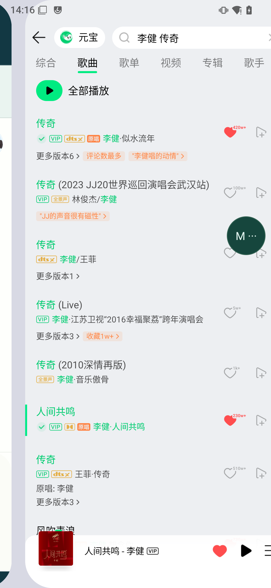
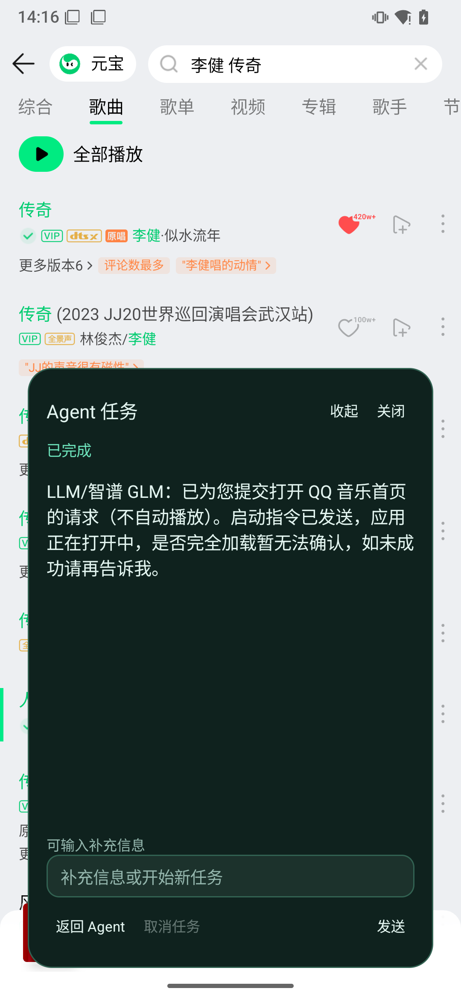
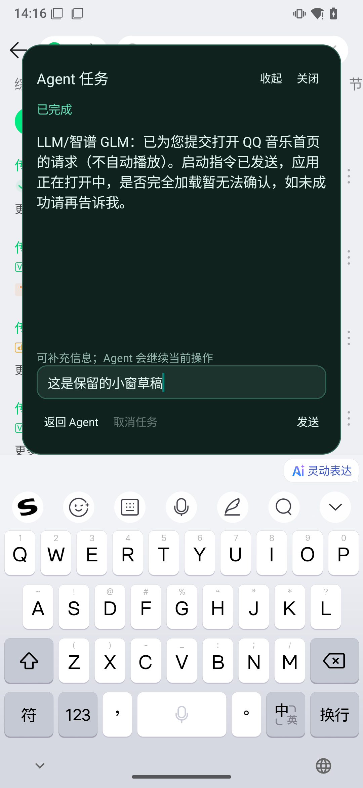
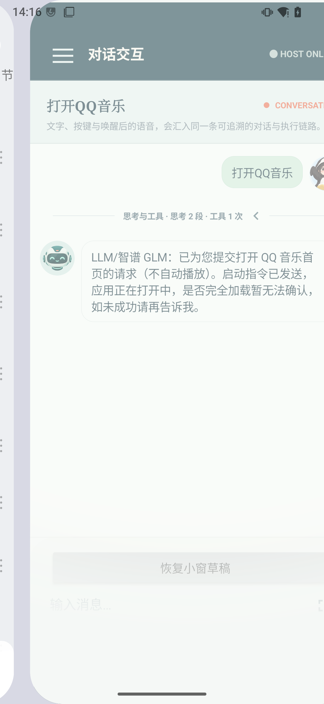
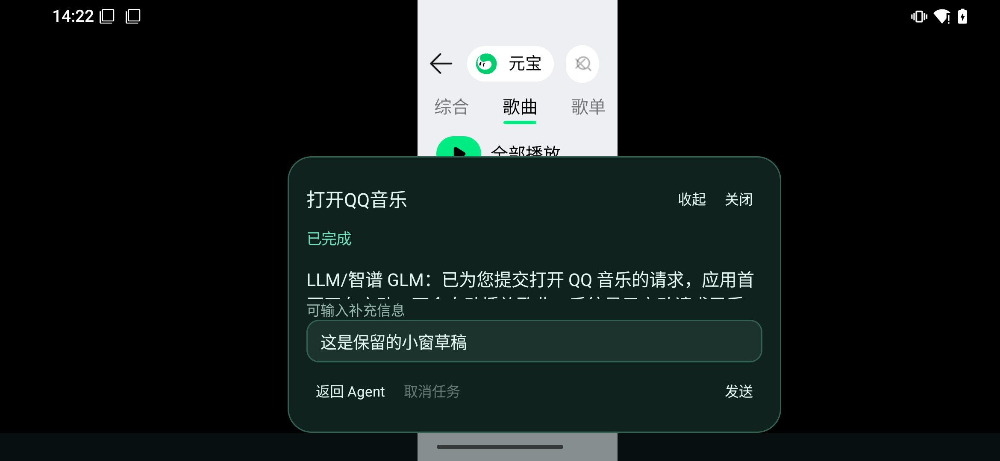
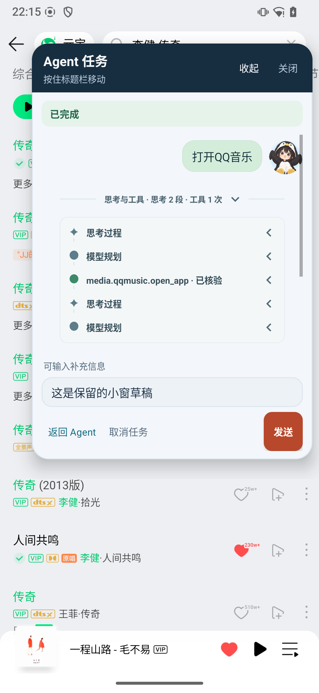
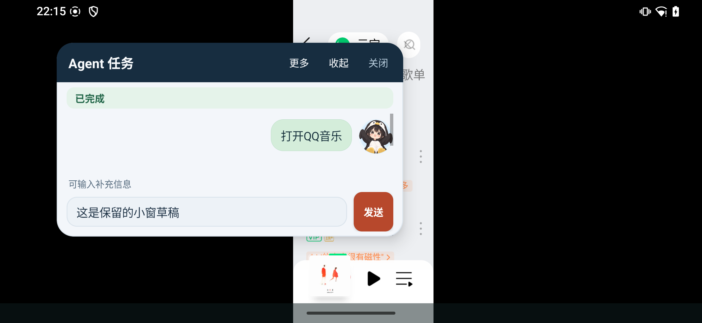

# Agent 跨应用悬浮窗：实现与真机验证记录

> 日期：2026-09-26<br>
> 对应设计：[技术执行方案 v2.5](Agent跨应用悬浮球与小窗模式技术执行方案.md)（落实 v2.1 的 M1–M5 决策）<br>
> 交付状态：Host / Launcher 已配套安装到真机。隐藏窗口生命周期、结构化诊断、标题拖动、分层配色、横屏紧凑布局和完整会话列表均已落实；最新验证见 §11–12。
> 验证口径：区分真实聊天流程、真实 Binder、真实窗口故障注入与 JVM 测试；单台设备通过不等同于完整兼容矩阵通过。

## 1. 已交付行为

- Agent 打开外部应用前准备浮层；直接搜索或选择已有应用的内容也经过同一交接入口。
- 默认显示可拖动、贴边的悬浮球；点击展开任务小窗，可查看阶段和与全屏一致的会话消息、翻阅历史、输入、取消、返回 Agent、收起或关闭。
- 收起保留订阅和草稿；关闭不取消 Host 任务，并抑制同一运行请求再次弹出。
- 完整会话页可见时隐藏重复入口。实际启动以“交接确认、启动已提交、页面离开”共同决定显示；失败、过期或迟到事件不创建空球。
- 自动操作期间阻止新取得 IME 焦点；已开始编辑时保持面板和草稿，不承诺暂停 Agent。
- 浮层草稿独立于完整会话草稿；返回后提供“恢复小窗草稿”，由用户选择合并。
- 权限拒绝、撤销、锁屏、窗口失败、连接中断和锚点核对超时都有明确的清理或降级路径。

首期范围仍为 conversation 主轮次、单个浮层和默认显示屏。未引入输入租约、FGS、后台冷启动或 durable task Presenter。

## 2. 实现结构与关键约束

| 层次 | 主要文件/组件 | 责任 |
| --- | --- | --- |
| SDK | `api/handoff` AIDL、Parcelable records、`HandoffProtocol`、`HandoffManager` | 独立子 Binder、只读活动快照、请求与 ACK；schema 9，追加 feature bit |
| Host 归属 | `HandoffContextRegistry`、`ConversationCoordinator` | 绑定已落库的主消息、主轮次和访问域，在执行结束时清理 |
| Host 协调 | `HandoffCoordinator`、`ExternalAppHandoffServiceStub` | 有界等待、取消竞争、幂等 ACK、注册替换、Binder death、复用缓存及鉴权 |
| Host 活动状态 | `ExternalUiActivityTracker` | 外层 operation 持有退出句柄，嵌套和并发操作不会提前报告 IDLE |
| 媒体适配 | `LaunchContext`、`ExternalAppHandoffPort`、两个 UI Port、`AndroidAppLaunchPort` | 一次工具调用共享身份、取消信号及绝对预算；跨轮次创建新上下文 |
| Launcher 数据 | `LauncherHostGateway`、`HandoffClient`、`OverlayConversationSource` | 独立连接持有句柄、短 RPC 通道、连接实例过滤、可替换会话数据源 |
| Launcher 展示 | `OverlayController`、`OverlayConversationPresenter`、`RevealTicket` | 归属事务、窗口生命周期、消息合并、终态优先、超时与显隐关联 |
| Launcher 窗口 | `OverlayWindow`、`OverlayDraftStore` | WindowContext、球/面板、触摸与无障碍点击、焦点/IME、独立版本化草稿 |
| 降级 | `HandoffFallbackNotifier` | Host 通知回入口、访问域检查、通用正文及去重 |

### 2.1 协议与执行边界

首次创建/重绑最多等待 1,200 ms，同归属复用最多等待 50 ms，且均受工具剩余预算限制。REUSE 读取不可变快照，不等待主线程创建窗口或读取会话。复用失败不会在同次调用重试为 1,200 ms。

Host 等待位于实际工具 worker；ACK 的 Binder 处理仅做鉴权和短状态更新。Launcher 的短 ACK 通道与普通 SDK 查询分开，锚点等待由独立定时器到期；同步 Binder 查询本身不能强制取消，因此对同锚点限制一个在途查询，禁止超时后无限加线程或排重试。

注册绑定 callback Binder、UID、Android 用户和会话访问域。生产装配必须显式传入交接端口：默认不交接的 Provider 便捷构造方法限制在包内测试使用，Android 启动适配器也要求显式注入。Host、SDK、Launcher 保持原有契约哈希校验，必须配套升级。

### 2.2 窗口事务与数据一致性

新候选在确认前保持不可操作，避免按钮命令发给旧任务；旧任务的订阅和草稿一直保留到新归属提交。已挂载候选在发送 ACK 前发布只读快照，处理“Host 已收到 ACK、Launcher 主线程尚未收到回执”的连续工具竞态。

状态合并按消息 ID、更新时间和终态优先规则处理，同一 sequence 的状态更新不会被丢弃。运行阶段、外部 UI 活动状态分别使用代际；重连重新订阅、补新消息并读主消息锚点。订阅错误不能被随后返回的非空句柄覆盖成成功。

### 2.3 平台适配

无障碍根节点按目标包、应用窗口类型和默认显示屏筛选。QQ 移除无条件 ACTION_FOCUS，优先定向节点操作；需要重新进入搜索表单时，只有 QQ 持有交互上下文才允许点击其输入节点及使用定向 IME_ENTER。B 站优先应用内返回节点，全局 Back 另验前台与 IME 条件。

输入法在浮层实际获得窗口焦点后唤起；布局按可见显示区域避让键盘。窗口仅覆盖球或面板本体。B 站明确的“网络尚未连接”页面映射为 `MEDIA_NETWORK_UNAVAILABLE`，不等待整个预算到期才笼统报超时。

## 3. 构建与 JVM 验证

| 模块 | 测试数 | 失败 / 错误 / 跳过 |
| --- | ---: | --- |
| Host | 1,353 | 0 / 0 / 0 |
| Launcher | 45 | 0 / 0 / 0 |
| service-lib | 20 | 0 / 0 / 0 |
| **合计** | **1,418** | **全部通过** |

累计新增 46 个状态、协议、诊断、手势、会话历史与生命周期用例，并扩展原媒体测试：覆盖快慢路径预算、ACK 幂等与过期、注册替换、取消唤醒、嵌套活动状态、展示凭据、版本化草稿、消息/阶段恢复、订阅拒绝，以及取消终态优先于迟到 RPC 失败。搜索与选曲断言同一次操作传递同一个 LaunchContext，下一轮使用新的运行身份和 operationId。

Host、Launcher、两端 instrumentation APK 均构建成功。Launcher / service-lib 的 lint 无 error；Launcher 仍有 35 条 warning，包括既有提示及浮层采用物理坐标贴边对应的 `RtlHardcoded` 提示。未将 lint 描述为零告警，未执行 Host 全量 lint。

可复现命令（仓库根目录）：

```bash
./gradlew :matrix-agent-service:testDebugUnitTest \
  :matrix-agent-launcher:testDebugUnitTest \
  :matrix-agent-service-lib:testDebugUnitTest \
  :matrix-agent-service:assembleDebug \
  :matrix-agent-launcher:assembleDebug \
  :matrix-agent-service:assembleDebugAndroidTest \
  :matrix-agent-launcher:assembleDebugAndroidTest \
  :matrix-agent-launcher:lintDebug \
  :matrix-agent-service-lib:lintDebug --console=plain
```

历史汇总：[summary.txt](verification/agent-overlay-2026-09-26/summary.txt)；当前结果：[local-validation.json](verification/agent-overlay-conversation-2026-09-26/local-validation.json)。

## 4. 真机环境

| 项目 | 本次环境 |
| --- | --- |
| 设备 | Xiaomi Mi 9 SE，连接标识 `977d27c4` |
| 系统 | LineageOS / Android 15 / API 35 |
| 屏幕 | 1080 × 2340；另验证实际横屏 2340 × 1080 |
| 输入法 | 搜狗输入法 `com.sohu.inputmethod.sogou/.SogouIME` |
| QQ 音乐 | `com.tencent.qqmusic`，20.8.0.8 |
| B 站 | `tv.danmaku.bili`，9.12.0 |
| 安装 | Host `com.matrix.agent`、Launcher `com.matrix.agent.launcher` 配套 debug APK |
| 前置条件 | 平台签名、浮层特殊访问允许、Host 媒体无障碍服务启用 |

未清空应用数据或模型配置。测试创建了专用验收会话；Binder 时延夹具直接落库为终态，避免中断测试后残留虚假的运行中任务。

## 5. 首次真机验证结果（历史基线）

本节保留首轮验收结果。后续窗口用例、重新安装与视觉修订的最终结果见 §11–12，不能将本节的“当时未复验”解读为当前状态。

### 5.1 真实聊天与实际搜索：2 个通过

测试：`OverlayDeviceTest`。日志：[e2e.txt](verification/agent-overlay-2026-09-26/e2e.txt)，最终返回 `OK (2 tests)`。

1. 真实聊天提交“打开 QQ 音乐”，经生产 Host 执行后显示球；触摸拖动贴边、点击展开、显示反馈、真实 IME 唤起、输入中文草稿、返回键隐藏 IME、收起再展开、实际横屏后按钮保持可见、返回原会话并提供恢复草稿入口。
2. QQ 已在前台时，从 SDK 提交独立测试主轮次，经过生产 workflow / Provider 的搜索路径显示浮层；从 Host 主消息的能力轨迹确认 `media.qqmusic.search_songs = SUCCESS / VERIFIED`。测试停在搜索结果，不提交选曲确认。

搜索验收使用持久化能力事实，避免依赖自然语言回复格式。调试过程中修正了测试分页首屏游标（应为 -1）和基于回复文案的脆弱断言；中间失败没有计入通过数量。用户同时操作手机期间的额外前台变化也未作为稳定性或性能样本。

测试代码已补充旋转策略和用户旋转设置的成对恢复。最后一次补充用户旋转设置恢复后，仅完成本地编译，未再占用设备重跑该清理步骤。

### 5.2 真实 WindowManager 边界：11 个通过

测试：`OverlayControllerDeviceTest`。使用真实窗口和系统 AppOps、锁屏状态，注入可控会话数据源；这部分不替代真实 Host 会话测试。日志：[window-boundaries.txt](verification/agent-overlay-2026-09-26/window-boundaries.txt)。

- 同页操作不创建重复球，手动离页不凭生命周期重弹。
- 启动失败清理隐藏准备；DISPATCHED 与离页任意顺序均可正确显隐。
- 旧任务锚点卡住时单次超时；不重复发查询，迟到结果不能换归属。
- 已知活跃归属返回 BUSY；用户关闭后同运行请求保持抑制。
- 主线程阻塞时 REUSE 快路径仍及时返回。
- AUTOMATION 阻止开始编辑，已有编辑内容和展开态保留。
- 权限拒绝、允许、撤销，以及锁屏后的清理与旧事件失效。
- 已存在隐藏窗口复用启动准备，不重新创建窗口。
- 新候选 ACK 归属提交前不可触摸，提交后才可展开和操作。

暂停真机后新增第 12 个用例：终态 A 被 B 接管时最多一个入口可见，B 的 ACK 被拒绝后恢复 A。对应实现先隐藏旧窗口、保留其数据与实例，失败时按版本与当前显示条件回滚。该用例只完成编译，未计入上述 11 个通过结果。

### 5.3 真实跨 APK Binder：100 / 100 成功

测试：`HandoffBinderDeviceTest`。真实 Host → Launcher → Host 请求与 ACK；使用同一主轮次、100 个不同 operation，计时包括外层活动句柄的进入和退出。

| 指标 | 结果 |
| --- | ---: |
| 样本 | 100 |
| OVERLAY_READY | 100 / 100 |
| P50 | 4 ms |
| P95 | **7 ms** |
| 最大值 | 17 ms |

超时未从分母剔除。该组是协议开销基准，不包含 QQ/B 站自身渲染、联网和播放回读耗时，不能等同于搜索→选曲整链延迟。日志：[binder.txt](verification/agent-overlay-2026-09-26/binder.txt)；统计值见 summary.txt。

### 5.4 B 站：确认受控失败，成功搜索受外部网络限制

真机能进入搜索页面并提交查询；目标 App 显示“网络尚未连接，请稍后再试”。适配器已能识别并返回 `MEDIA_NETWORK_UNAVAILABLE`。本次没有得到 B 站成功搜索与选择打开的完整真机结果，不将该路径写成已验证成功。

## 6. 验收覆盖与剩余矩阵

| 设计验收项 | 本次证据 | 范围限制 |
| --- | --- | --- |
| AC-01/02/17/22 | 真实 QQ 聊天打开、已有应用搜索、返回；真实窗口同页/失败/事件乱序 | B 站成功业务链尚未验证 |
| AC-03/05/07/08 | Provider 上下文断言、协议预算/取消/ACK/替换单测，真实快路径 | 未穷举每个系统副作用时刻的竞态 |
| AC-04 | 实际 IME 编辑；窗口状态注入验证新输入门控与已有编辑保留 | 未完成多 IME 及所有媒体页面组合 |
| AC-06/11/12 | 真实 AppOps；锚点挂起/迟到、活跃归属、提交前交互隔离 | 未完成系统级 Binder 长时卡死压力测试 |
| AC-10/13/14/15/16 | 归属实现、消息合并、主消息取消、草稿与订阅恢复单测；实际草稿返回 | 未完整实测 Host 杀进程恢复及所有在途提交竞争 |
| AC-18/20 | 无注册/访问域降级单测、配套契约连接成功、通知实现 | 独立语音、通知禁用及旧 APK 组合未全量真机复测 |
| AC-19 | 实际横屏、IME、拖动、锁屏 | API 28–29、其他机型、大字体、低内存回收和切换 Android 用户仍需覆盖 |
| AC-21 | 真实 Binder 100 次成功，P95 7 ms；主线程繁忙用例 | 未建立真实搜索→选曲累计耗时样本组及持续压力分布 |
| AC-09 | 有界 worker / 队列和锁边界，协议等待测试 | 尚未单独采集三个并发任务的真实调度压力数据 |

这些剩余项保留为后续设备兼容和压力验收。Host / Launcher 已配套安装，新增接管、隐藏窗口生命周期及诊断已在 §11 复验；B 站网络恢复后的搜索/选中、Host 重启恢复及多任务压力仍待补充。

## 7. 截图

以下为本次真机采集，不是效果图；均为专用测试会话。截图记录的是首次真机验收时的深绿色版本。§10–12 已将小窗改为深蓝标题栏、浅色分区及完整聊天列表；最新截图见 §12，以下图片只保留为历史基线。

| 悬浮球 | 展开小窗 |
| --- | --- |
|  |  |

| 编辑与 IME 避让 | 返回会话后的草稿恢复入口 |
| --- | --- |
|  |  |



## 8. 后续复验入口

下列命令只在设备交由自动化使用时执行。先配套安装 Host / Launcher APK，再安装对应 instrumentation APK；保持浮层和媒体无障碍访问可用。

```bash
adb shell am instrument -w -r \
  -e class com.matrix.agent.launcher.OverlayDeviceTest \
  com.matrix.agent.launcher.test/androidx.test.runner.AndroidJUnitRunner

adb shell am instrument -w -r \
  -e class com.matrix.agent.launcher.overlay.OverlayControllerDeviceTest \
  com.matrix.agent.launcher.test/androidx.test.runner.AndroidJUnitRunner

adb shell am instrument -w -r \
  -e class com.matrix.agent.handoff.HandoffBinderDeviceTest \
  com.matrix.agent.test/androidx.test.runner.AndroidJUnitRunner
```

结构化采集与 JSONL 导出见 §9。辅助日志标签：`MatrixHandoff`（mode / result / reason / elapsedMs）、`MatrixOverlay`（提交、显隐、清理）、`MatrixHandoffDevice`（基准统计）。应用日志不记录浮层输入全文；测试失败诊断仅针对该测试自行创建的会话。

## 9. 本轮评审修订与结构化诊断

### 9.1 代码修订

`committedAsPrepared` 区分“从未展示的预挂载窗口”和“已提交、因完整会话页可见而隐藏的窗口”。提交 PREPARED 置位，首次 reveal 清零；对既有窗口的快路径启动只武装 ticket，不修改生命周期状态。失败、ACK 拒绝、超时、断连共用这一清理判别。

对已展示过的隐藏球，启动失败保留窗口、Presenter、连接持有句柄和草稿，并更新失败提示；断连只使旧 ticket 失效，旧订阅关闭，重连重新订阅。迟到 DISPATCHED 与普通离页不能自动重弹；后续有效交接可以继续复用原窗口。真正未展示的准备则完整释放，避免后台空持有。

另外已命名 `RESULT_PRESENTATION_SKIPPED = 0`，将 steer 接受提示改为“已提交并入”，修复极小屏幕/IME 下的高度上限，并注明 B 站文字匹配针对 9.12.0 / zh-CN。UNKNOWN 状态仍阻止新取得输入焦点；分屏 multi-resume 可见性误判作为已知限制登记。恢复草稿与权限提示的内联 UI 风格本轮保留。

### 9.2 诊断字段与统计口径

| stage | 采集点与 result | successes / 时延 |
| --- | --- | --- |
| HANDOFF | Host prepare 得到结果；使用 HandoffProtocol 结果码，mode=1 首次/重绑、2 复用、0 未发请求 | READY/PREPARED/PRESENTED；真实请求从创建到结果的耗时，失败/超时不剔除 |
| WINDOW_ATTACH | Launcher 窗口构造至 addView；result=1 成功、0 失败 | 挂载成功；构造/挂载耗时；隐藏预挂载也属于挂载 |
| FIRST_DRAW | 窗口首次非隐藏 OnDraw；result=1 | 一次绘制；从本次变为可见到 OnDraw，排除隐藏等待，不代表合成器呈现 |
| INTENT_DISPATCH | Host 启动回调；result=DISPATCHED/FAILED/CANCELLED | 仅 DISPATCHED；没有计时样本，不推导业务成功 |
| TASK_TERMINAL | conversation 主轮次终态成功落库；result=持久化消息状态 | COMPLETED（现有映射包含部分成功）；没有计时样本，完整能力结果看持久化轨迹 |

每进程最近 256 条事件；固定阶段/mode 分桶，进程累计 count/successes/results 与最近 256 个计时样本的 P50/P95/max 分开导出。nearest-rank P95 包含计时失败和超时。未计时用 -1；没有首帧记录不等于零时延。task/request 为 SHA-256 ID 摘要，跨进程按 task/request 对齐，不包含用户文字。

`TASK_TERMINAL` 汇总范围是 conversation 任务，不能直接称为跨应用任务成功率；需用 task 摘要筛选对应交接的主轮次。累计汇总不带单任务明细，最近事件被淘汰后不能完整重建历史关联。数据在进程死亡后丢失，采样前后导出与原始持久化能力轨迹共同构成证据。

### 9.3 导出入口

以下是设备恢复交由自动化后执行的命令，本轮没有执行。Activity 需已有实例；不要为导出中断用户操作。

```bash
adb shell dumpsys activity service com.matrix.agent/.host.MatrixAgentManagerService --handoff
adb shell dumpsys activity com.matrix.agent.launcher/.LauncherActivity --handoff
```

`dumpsys` 外层可能含系统包装行；每行以 `{` 开始的部分为 JSONL：schema header、summary、event。导出在记录锁外排序/写入，不新增网络上传、文件持久化或 Binder 业务 API。设备侧导出路由与首帧采集仍需新 APK 复验。

### 9.4 新增验证与待办

- 本轮新增 8 个 JVM 用例：Host 交接/Intent 分列且缓存不重复计数；Launcher 普通/极小屏幕几何；SDK 分位数含超时、容量与累计计数、无耗时与脱敏导出、并发快照、禁用采集。原无会话绑定测试新增命名结果断言。
- 该轮新增 5 个设备用例（仅编译）：抑制中既有球 + 启动失败、断连/重连、ACK 拒绝；真正预挂载窗口断连清理；隐藏 attach 不计首帧且重复显隐只计一次。
- 该轮结束时设备测试类共 17 个用例：之前实测 11 个，上轮新增接管回滚 1 个，本轮新增 5 个；后 6 个尚未执行，不能纳入真机通过数量。
- 已有 Binder P95 7 ms 是此前样本；本轮没有新的真机性能数据。新增结构化采集本身的开销和 dumpsys 导出在恢复设备验证后测量。

## 10. 展开态拖动与小窗视觉调整

### 10.1 已实现

- 小窗标题区直接拖动，配合“按住标题栏移动”提示，无需先收起成球。标题区高度至少 52dp；收起/关闭按钮、正文滚动、文字选择和输入触摸与拖动区分离。
- 球与小窗各自记住位置；小窗只在首次展开时水平居中，后续任务反馈更新、收起再展开均保留位置。球继续保留贴边行为，小窗不自动吸边。
- 边界计算同时约束左右、上下与 IME 占用区域；修复负坐标被当成“未初始化”而跳回中心/右边的情况。拖动过程中保持现有编辑焦点和草稿，不主动隐藏 IME。
- 手势数学提取为独立 `OverlayDragGesture`，窗口层只处理事件路由与坐标写回。未超过 touch slop 的轻触不移动；拖动回到起点不会误变成点击；多指介入、取消事件不会延续旧拖动。
- 配色改为深蓝标题栏、雾白底、白色反馈卡、浅灰蓝输入框；运行/完成/失败/未知分别使用青蓝/绿/暖红/琥珀状态条及文字。发送为暖陶色实心按钮，返回/取消为次操作，按钮有按压反馈与独立禁用色。圆角、描边与标题/正文排版形成清晰层次。

### 10.2 当时本地验证（后续真机复验见 §11）

本轮新增 6 个 JVM 用例（5 个手势、1 个边界），Launcher 共 36 个通过；全仓本次涉及的三个模块共 1,409 个通过，失败/错误/跳过均为 0。应用与两端 instrumentation APK 已构建；最新 lint 结果见 summary.txt。

`OverlayControllerDeviceTest` 新增 2 个设备用例：展开态拖动、刷新与重新展开的位置保持/球位置独立；越界拖动夹取。已有编辑保留用例增加标题拖动后仍有焦点与草稿的断言。该测试类现有 19 个用例，本轮没有执行设备测试。需要恢复设备验证后检查实际触感、IME 拖动、正文滚动与按钮不误触，以及新配色在真机上的视觉效果；本地编译不视为这些体验已验收。


## 11. 恢复安装与面板真机复验

用户后续明确要求“安装到真机进行验证”后，恢复自动化设备操作，重新安装配套 Host / Launcher。

- `OverlayControllerDeviceTest`：19 个通过，包含隐藏已提交球在启动失败/断连后保留、接管失败回滚、窗口首帧、展开态拖动及边界。见 [窗口日志](verification/agent-overlay-panel-2026-09-26/window-boundaries.txt)。
- `OverlayDeviceTest`：2 个通过，包含真实标题拖动、IME 保持、收起重开位置、横屏按钮和返回草稿。见 [最终日志](verification/agent-overlay-panel-2026-09-26/e2e.txt)。
- 真实 Binder 基准：100 / 100 READY，P50 4ms、P95 7ms、最大 11ms。见 [指标](verification/agent-overlay-panel-2026-09-26/binder-metrics.txt)。此项是该轮数据，本次会话列表修订未重跑 Host 基准。
- 结构化 Launcher / Host dumpsys 已导出，见该目录 `launcher-diagnostics*.txt` 与 `host-diagnostics-compact.txt`。`host-diagnostics-final.txt` 返回 `No services match`，不作为有效诊断样本。

### 11.1 验证中发现并修复的问题

第一次横屏截图暴露发送按钮被父容器裁切、正文区域过小。修复为高度小于 320dp 时使用紧凑布局：标题保留拖动，发送移至输入旁，返回/取消进入“更多”，输入控件不销毁。设备断言升级为控件实际可见矩形等于自身尺寸，不能仅凭窗口坐标在屏幕内判定可用。修复前截图保留在 `rotation-clipping-before-fix.png`。

运行 Host instrumentation 后，系统将媒体无障碍服务记为 Crashed / Unbound；后续搜索返回 `UI_ACCESS_NOT_ENABLED`。保留失败日志及诊断，按原 enabled 列表重新绑定服务，确认 Bound 且 Crashed 为空后，两项真实流程复验通过。这是已观察到的测试进程退出影响，不将失败记录改写为业务通过，也未新增其他无障碍授权。

## 12. 小窗完整会话内容修订

### 12.1 原因与实现

旧小窗 Presenter 只取当前 taskId 的最近 assistant 文本，不绘制用户消息或历史轮次。任务尚无最终回复时，正文为空或停留在占位信息；该模型不能满足“小窗与全屏相同对话内容”。

本次改为：

1. `ConversationMessageRenderer` 由全屏和小窗共同使用，统一头像、角色气泡、正文、执行状态与 steer 投递标识。`UiMessage.from` 统一 Host DTO 投影。
2. `OverlayConversationPresenter` 按 conversationId 合并所有角色及历史轮次；当前任务阶段/取消归属独立管理。新轮次继承同会话已加载历史，不继承旧取消目标。
3. 最近 30 条首屏、向前翻页及失败重试；分页游标只来自连续页，不能被旧主消息锚点带偏。每次一个在途页，连接/查询代际过滤迟到结果；重连补齐新增区间。
4. `OverlayConversationList` 使用 ListView 回收消息行，已加载数据不静默截断。在底部跟随新回复，阅读历史时维持消息锚点与偏移，长按复制。
5. 当前构建开启的“思考与工具”区也通过共享 `ConversationTraceRenderer` 展示。沿用原 `matrix.debugTraceUi` 开关及已脱敏 debug 通道，恢复历史并订阅后续事件；消息正文不依赖该旁路成功，旧连接事件不会污染新会话。全屏与小窗均按 USER → 过程 → ASSISTANT 排列。
6. 保留标题拖动、独立位置、IME 草稿、分层配色和横屏紧凑操作布局。

### 12.2 验证范围

新增 9 个 JVM 用例覆盖历史游标、过期页、重连、新轮次、状态更新、150 条历史保留、分页结束和过程事件去重/跨会话过滤/关闭订阅。当前三模块共 1,418 个 JVM 用例通过，无失败、错误或跳过。Launcher 与 SDK lint 无 error；Launcher 有 35 条 warning。

真实 WindowManager 用例新增完整历史验证：41 条消息先加载最近 30 条，向前翻页获得全部 41 条；实时第 42 条到达后保持历史阅读位置。数据投影逐条与共享 UiMessage 对比。该类 20 个用例通过，见 [日志](verification/agent-overlay-conversation-2026-09-26/window-boundaries.txt)。

真实聊天测试新增：当前用户提问可见；助手回复到达；小窗每条消息的 ID、正文、角色及状态与 Host 持久化页面一致；开启过程展示时，过程数据及折叠标题可见，并验证点击展开详情及再次收起。继续回归 QQ 已有应用搜索、IME、标题拖动、旋转和草稿返回。

最终已安装版本联合运行两个设备测试类，结果 **OK (22 tests)**，耗时 43.367s，见 [最终真机日志](verification/agent-overlay-conversation-2026-09-26/final-device-suite.txt)。安装后对 Host / Launcher 的 APK SHA-256 与本地构建逐一核对一致，见 [安装校验](verification/agent-overlay-conversation-2026-09-26/installed-apks.json)。测试结束返回 Launcher，媒体无障碍服务 Bound、Crashed 为空，旋转恢复为 `lock 0` / `default`。

### 12.3 最新真机截图





当前结果只覆盖上述 Android 15 设备；跨 ROM / API、分屏 multi-resume 可见性判定、大字体与长时压力仍属于 §6 的剩余矩阵。
