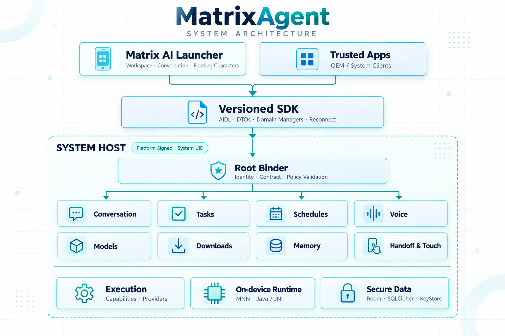

# README 白底系统架构图生成记录 · 2026-09-29

使用内置 `image_gen` 的 `style-transfer` 模式，以[深色版架构图](matrix-agent-architecture-dark-2026-09-28.png)作为结构参考，将图重新绘制为白底版本。最终资产为 [matrix-agent-architecture-light-2026-09-29.png](matrix-agent-architecture-light-2026-09-29.png)，1536 × 1024 PNG。保留客户端、SDK、Host、业务域与支撑模块的命名、位置和主要连线。更精确的域间依赖参见[技术架构图](../开发与验证.md#architecture)。



## 提示词

```text
Use case: style-transfer
Asset type: final light-theme system architecture infographic for the MatrixAgent GitHub README.
Input image: exact structural reference and edit target. Redraw the entire diagram as a NEW polished white-background illustration while preserving its information architecture exactly. This is a light-theme redesign, not a crude color inversion.

Art direction: luminous editorial engineering blueprint on true warm white (#FFFFFF to #FAFCFC), premium documentation aesthetic, generous negative space, exceptionally sharp dark navy typography (#173646), precise thin teal (#169C9B) connectors, balanced sea-glass mint and muted cobalt accents. Use subtly tinted pale aqua and icy blue cards, soft realistic paper-like elevation, refined micro-grid visible only faintly in the white background, sophisticated layered strokes and tiny tasteful icon details. Professional, elegant, visually exciting through hierarchy and craftsmanship rather than glow or clutter. No dark background, black panels, neon effects, harsh gradients, gray wash, fake 3D perspective, mascots, slogans, or marginal side text.

Preserve EXACT composition and routing from the input:
- top title "MatrixAgent" and subtitle "SYSTEM ARCHITECTURE"
- two client cards side by side: "Matrix AI Launcher" / "Workspace · Conversation · Floating Characters" and "Trusted Apps" / "OEM / System Clients"
- their two connectors merge into one downward arrow to the centered "Versioned SDK" card / "AIDL · DTOs · Domain Managers · Reconnect"
- a downward arrow from SDK enters one visibly enclosed "SYSTEM HOST" boundary, with tag "Platform Signed · System UID"
- inside Host, "Root Binder" gate with caption "Identity · Contract · Policy Validation"
- the Root Binder branches through a fine four-way horizontal bus and four downward arrowheads to the first row of domain cards, in order: "Conversation", "Tasks", "Schedules", "Voice"
- second aligned row of domain cards: "Models", "Downloads", "Memory", "Handoff & Touch"
- a thin plain divider, then three support cards INSIDE THE SAME Host boundary: "Execution" / "Capabilities · Providers"; "On-device Runtime" / "MNN · Java / JNI"; "Secure Data" / "Room · SQLCipher · KeyStore".
All quoted text must be reproduced VERBATIM, spelled correctly, large and readable at README width. No missing, added, or duplicated text. No arrows from domains to the three support cards, no direct client-to-Host bypass, no connectors between adjacent domain cards. Keep all panels within the image with safe white margins. Match the source layout and semantics, but draw the new light design from scratch with crisp intentional geometry. Output a complete landscape architecture infographic.
```
