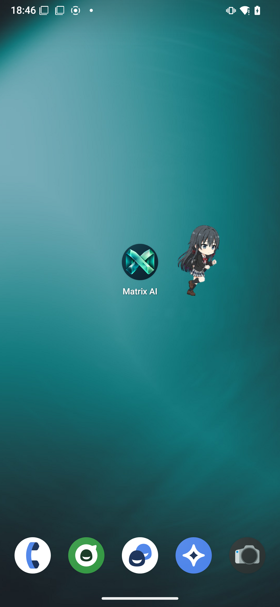
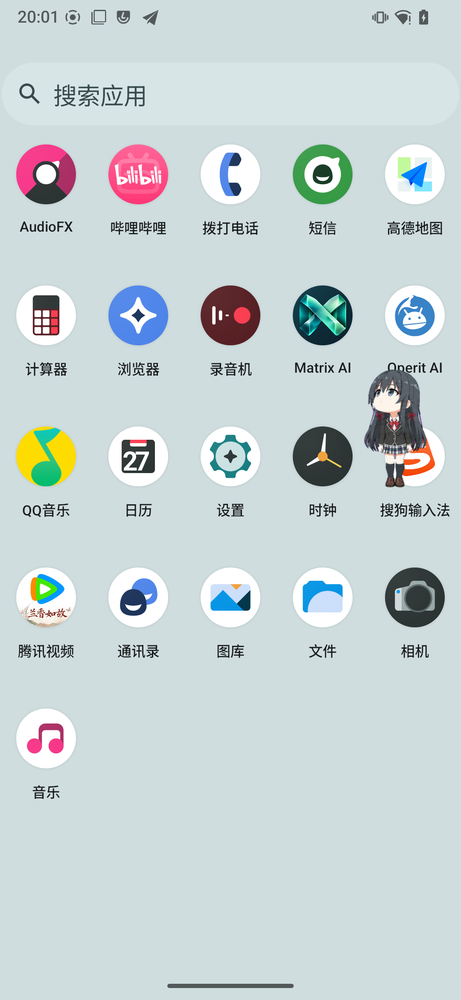
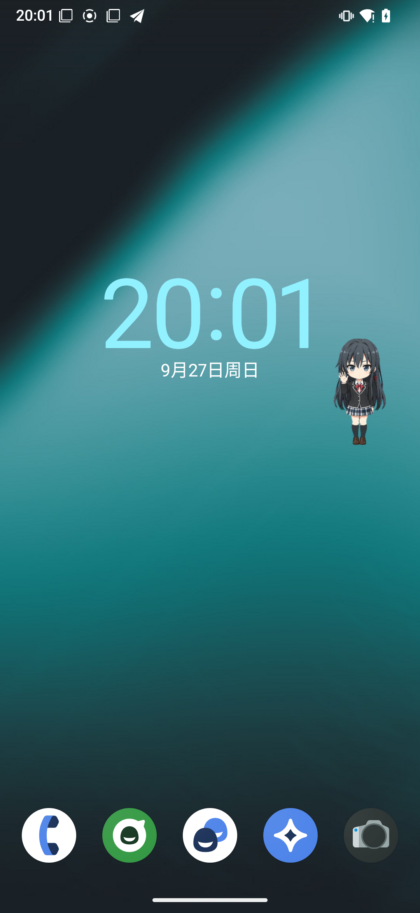
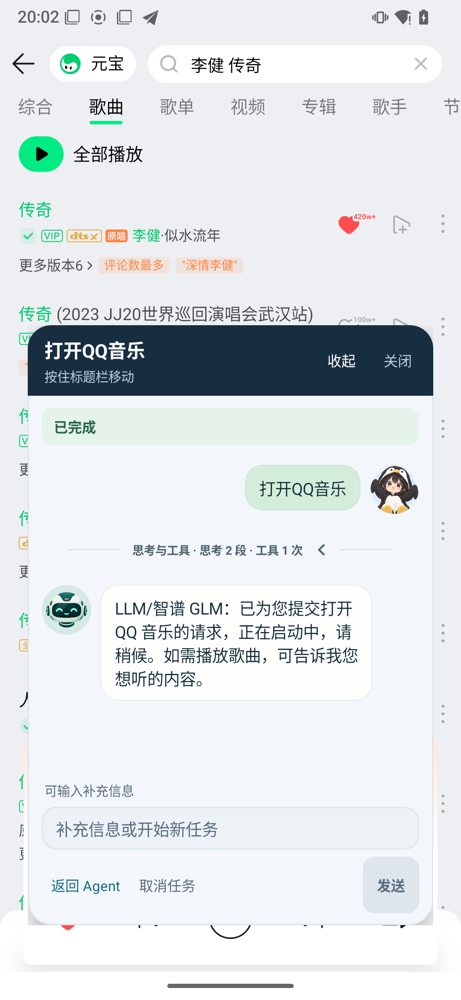
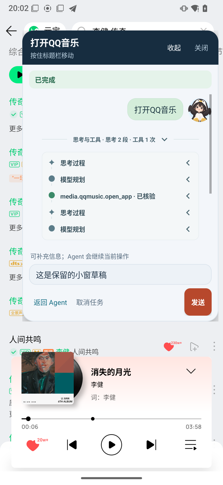
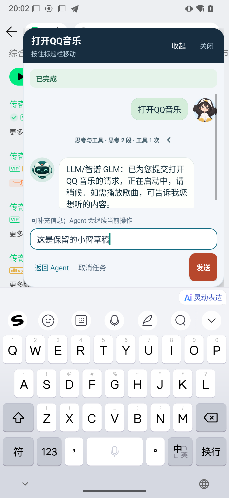

# 功能与交互

[返回首页](../README.md) · [开发与验证](开发与验证.md) · [真机图片](images/README.md)

本文保留当前版本的行为规则、权限边界与恢复语义。能力概览见首页；设备样本和测试日期以各验证记录为准。

[雪乃与小窗](#overlay) · [定时任务](#scheduling) · [对话与媒体](#conversation) · [模型与语音](#model-voice) · [分层记忆](#memory)

## 雪乃角色与跨应用悬浮窗

### 桌面图标与拖动

Launcher 的桌面名称为 **Matrix AI**。图标使用深青背景、薄荷绿立体矩阵和**实心中心**，包含独立前景、背景与单色图层，适配系统桌面裁切。跨应用入口采用透明雪乃角色，画布为 **96 × 104dp**。

悬浮形象可在 Launcher「设置 → 外观 → 悬浮形象」中选择雪之下雪乃、绫波丽、宁姚或鲸鱼娘。选择会持久保存；已有悬浮入口会立即切换，并延续当前任务状态。

<table>
  <tr><th align="center">Matrix AI 桌面图标</th><th align="center">向左拖动</th><th align="center">向右拖动</th></tr>
  <tr>
    <td align="center"></td>
    <td align="center"></td>
    <td align="center"></td>
  </tr>
</table>

以上图片均采集于 2026-09-27；左右拖动图已使用实心图标版本。静态截图展示动作中的一帧，连续动画与手势恢复由[真机测试](verification/yukino-interaction-2026-09-27/README.md)验证。

### 动作在什么场景出现

| 场景 | 雪乃的表现与恢复规则 |
|---|---|
| 任务排队、取消处理中或非执行等待 | `waiting`；非终态断线时显示离线角标 |
| 任务规划或执行中 | `running` 工作动作，角标与状态始终来自真实任务 |
| 任务完成 / 失败 | 完成播放一次 `jumping` 后回待机并保留完成角标；失败停留 `failed` 末帧并保留错误角标 |
| 执行结果不确定 | `review` 对应 `EXECUTION_UNKNOWN`，提示需要核查实际结果；媒体选曲的确认消息与此状态分别处理 |
| 拖动角色 | 越过拖动阈值后切换 `running-left` / `running-right`；方向防抖，上下拖动沿用最近朝向；松手恢复任务动作 |
| 在屏幕其他位置触碰或滑动 | `look` 按角色头部到触点的方向选择 16 个静态姿态；头部附近 12dp 内使用中立帧；第一指抬起后保留 **800ms**，再恢复任务动作 |
| 会话首次可见，或离开至少 5 分钟后返回 | `waving` 播放一次后恢复；仅在没有结果角标且不抢占重要结果提示时问候；短暂切换和展开 / 收起不重复问候 |

触碰可打断挥手，拖动角色优先播放跑步；新的完成、失败或结果不确定状态会打断注视和挥手。拖动期间到达的新状态在松手后展示，已结束的完成 / 失败动作不会因恢复而重播。多指操作始终跟随第一指，第一指抬起后不转向剩余手指。问候历史保留于当前 Launcher 进程，最多记录 64 个会话。

<table>
  <tr><th align="center">看向上方触点</th><th align="center">跟随向下滑动</th><th align="center">挥手问候</th></tr>
  <tr>
    <td align="center"></td>
    <td align="center"></td>
    <td align="center"></td>
  </tr>
</table>

### 会话小窗

Agent 打开或操作外部应用前，Host 与 Launcher 完成交接，在屏幕边缘保留角色入口。点击角色可展开**同一会话**，阅读消息、查看执行过程、发送补充内容、取消当前任务或返回全屏。

<table>
  <tr><th align="center">完整会话</th><th align="center">展开执行过程</th><th align="center">草稿与输入法</th></tr>
  <tr>
    <td align="center"></td>
    <td align="center"></td>
    <td align="center"></td>
  </tr>
</table>

这三张图片来自 2026-09-27 最新一轮 47 项真机测试。执行过程区由项目级 `matrix.debugTraceUi` 开关控制，当前基线已开启；debug 与 release 都遵循该显式开关，构建类型不会自动关闭轨迹。

- 小窗与全屏共享消息渲染器，先加载最近 30 条，更早记录按需翻页；阅读历史时新回复不会强制跳到底部。
- 标题栏可拖动，角色与面板分别记住位置。收起、再次展开保留草稿；返回同一会话页时隐藏重复浮层，并提供小窗草稿恢复入口。
- 横屏或高度不足时采用紧凑布局，发送靠近输入框，返回与取消收进“更多”；输入法弹出后按可用区域约束位置。
- 关闭窗口不会取消 Host 任务。自动操作时暂不允许新取得输入焦点，已经开始编辑的草稿和焦点保持；输入本身不会暂停 Agent。

### 权限与生命周期

在导航抽屉的“跨应用悬浮窗”入口开启悬浮窗访问；QQ 音乐 / B 站 UI 操作还需启用 Host 的“媒体搜索与选曲”无障碍服务。全屏触点注视额外依赖 **API 35+、匹配 framework 和平台 `MONITOR_INPUT` 权限**，不能由普通悬浮窗权限替代。

Host 通过 `InputMonitor` 观察输入副本，使用 `finishInputEvent(event, false)`，不调用 `pilferPointers`；底层应用继续接收原始事件。观察只面向同用户的可信 Launcher，采用 30 秒租约、10 秒续约和 Binder 死亡释放。坐标不写入日志、数据库或模型请求。

只有角色处于可见收起状态时才订阅触点；面板展开、主动隐藏、锁屏、切换用户、断线或关闭时停止。系统主动禁止悬浮窗的页面遵循 Android 显示限制。图片在后台按动作解码，使用 3MiB 共享 LRU；该额度是缓存预算，不是全部活跃位图的内存上限。

当前只支持单浮层、默认显示屏与 conversation 主轮次；进程死亡后通过返回 Launcher 恢复会话，不自动冷启动重建窗口。交接预算、状态机与实现细节见[浮层方案](Agent跨应用悬浮球与小窗模式技术执行方案.md)、[角色接入](雪乃悬浮入口接入与验证.md)和[注视 / 挥手验证](verification/yukino-interaction-2026-09-27/README.md)。

## 定时任务与工作流

侧边栏“任务中心”提供 **计划、运行记录、模板、临时任务** 四个页签。Host 使用单个物理业务闹钟、加密持久化和稳定执行请求 ID 管理计划；关闭页面不会停止计划管理。

| 能力 | 当前行为 |
|---|---|
| 时间与绑定 | 一次性、相对延迟、每天、每周，以及具体日历实例绑定 |
| 计划控制 | 创建前预览、编辑、暂停、恢复和删除；列表分页，展示阻塞原因，支持编辑草稿恢复 |
| 执行授权 | 触发时使用独立会话，继承创建时授予的能力、网络与播报权限 |
| 工作流 | 两个固定模板；支持依赖、并行只读步骤、共享父预算、有界重试与取消，历史保留模板版本 |
| 运行追踪 | 运行记录、步骤状态、输入摘要、耗时、重试和交付结果，通知可跳转到详情 |
| 通知与播报 | 分别记录两个渠道的事实；通知不可用时新建为阻塞草稿，恢复权限后需显式启用；播报被抑制时呈现部分交付 |

“每日行程提醒”并行查询今天与明天的日历，生成确定性摘要，再通知与可选播报，无需模型或网络；“Agent 日程简报”使用授权范围内的 Agent 生成摘要。两个模板的明日日程查询均为可选步骤，失败可降级。模板界面见[上方截图](../README.md#screenshots)，计划入口见[真机计划页](images/2026-09-27/launcher-plans.png)。

系统时钟通过标准 Intent 委托，回执标记为未核验，不提供 ROM 私有闹钟数据库的增删改查。当前首期范围为已解锁且处于前台的 Android user 0。设计、迁移与设备边界见[定时任务专题](Agent定时任务与子任务编排专题.md)和[实施记录](Agent定时任务实施记录.md)。

## 对话与媒体操作

### 统一输入与可恢复状态

文字、按住说话（PTT）与唤醒后的最终转写统一进入 `ConversationCoordinator`，完成校验和持久化后按会话串行执行。语音 partial 仅用于实时 UI；只有最终接受的文本成为用户消息并触发 Agent。

| 状态 | 含义 |
|---|---|
| `ACCEPTED` / `RUNNING` | 已持久化，或已进入该会话执行通道 |
| `COMPLETED` / `FAILED` / `CANCELLED` / `REJECTED` | 可确定的终态 |
| `EXECUTION_UNKNOWN` | 中断、超时或取消后无法确认写操作结果，需要核查实际状态 |

用户消息、顺序号、幂等键和任务关联原子写入；重启时对账未收敛记录。正文和草稿保存在 SQLCipher 中并纳入用户数据清除；日志与审计投影保持脱敏。输入支持多行、全屏编辑、模型胶囊和文本附件；消息可引用、复制，已完成的用户消息可创建分支。草稿保存与提交按会话排序，防止迟到保存恢复已提交内容。

### 搜索之后，由用户确认播放

新媒体请求交给当前配置模型规划，QQ 音乐与 B 站的标题、歌手和查询词不再依赖固定话术拆分。模型理解用于搜索，实际播放仍须经过候选核对和用户的下一轮确认。

1. 用户提出请求，例如“播放李健的传奇”。
2. Host 调用目标应用的搜索能力，等待查询与真实候选稳定；QQ 音乐按结构化歌名 / 歌手核对实际条目，歧义或多版本返回候选供选择。
3. 对话展示“是否播放这首”或候选列表。**同一搜索轮次不能直接播放，也不能通过恢复旧队列绕过确认。**
4. 用户在下一轮确认或选择后，执行播放并回读结果；新搜索会清理旧的待选上下文，搜索失败不会留下可误确认的旧候选。

2026-09-27 已验证 QQ 音乐的模型搜索、独立确认与 `media_session` 播放回读；B 站已成功搜索并返回候选，该次验证未打开视频。详细输入、工具耗时和范围见[媒体语义理解验证](verification/media-model-understanding-2026-09-27/README.md)。

## 模型与语音

### 模型接入与资源管理

| 运行位置 | 仓库已提供的接入入口 |
|---|---|
| 云端 | 智谱 GLM、DeepSeek、通义千问、Moonshot Kimi、火山方舟 / 豆包、Anthropic Claude、Google Gemini |
| 局域网 | Ollama、LM Studio、vLLM |
| 自定义 | OpenAI-Compatible Endpoint |
| 端侧 | 已下载并安装的 MNN-LLM 模型，当前为 arm64 CPU 路径 |

Host 统一管理协议、端点、凭据和运行时生命周期，支持 OpenAI Chat、Anthropic Messages、Gemini、Ollama 与 MNN 端侧协议。配置入口的存在不等于所有厂商、模型与 ROM 组合都已完成真机认证。

模型市场支持目录缓存、Range 断点续传、暂停 / 恢复 / 取消 / 删除与原子安装。Vosk、Sherpa 与 Piper 语音资源同样由 Host 管理，首次使用前需显式下载；启动录音不会隐式拉取大文件。只有校验完成并切换有效版本指针后才标记“已安装”，失败保留回滚能力。

### 识别、唤醒与播报

- PTT 松手冲刷 ASR final，取消则终止本轮；endpoint 和手动冲刷共享幂等保护，避免重复提交。唤醒、PTT、文字最终进入同一对话任务链。
- 录音使用按需 microphone 前台服务；未授权、模型未就绪或服务启动失败均返回明确状态。音频焦点、打断和播报由 Host 语音控制器统一管理。
- 语音会话按 `voiceSessionId`、task 和响应 token 关联；订阅丢失、执行超时或进程死亡会收敛状态，`THINKING` 有独立 watchdog。
- TTS 按“已配置腾讯云 → 已安装 Piper → Android 系统 TTS”选择。云端失败时同一 utterance 回退本地；云端及本地均失败才报告 `VOICE_OUTPUT_UNAVAILABLE`。

API Key 和腾讯云凭证通过一次性 Binder 管道交给 Host，由 Android KeyStore 加密保存；配置投影和日志不返回密钥。云端可达性、回退与真实扬声器输出需在目标设备完成闭环验证。

## 分层记忆

对话正文提供连续交流所需的上下文；记忆模块按当前问题，从用户与音区所属范围内选取可复用的信息。所有持久化入口在 Host 内校验请求身份，`zone` 统一使用小写规范值。

### 四层各自保存什么

| 层 | 写入来源与内容 | 召回与保留范围 |
|---|---|---|
| **Working · 会话状态** | 仅由成功且经过核验的工具回读更新空调温度，绑定会话、用户与音区 | 温控相关问题最多召回 1 条；内存会话默认 30 分钟 TTL、最多 32 个会话 |
| **Preference · 长期偏好** | 用户明确指定要记住的偏好及值，例如温度、座椅加热与媒体音量 | 按当前问题相关性排序；每用户 / 音区最多 1024 条，达到上限仍可更新已有条目 |
| **Semantic · 长期事实** | 用户明确要求保存的事实，key 使用 `family.*`、`allergy.*`、`work.*` 或 `fact.*` 命名空间 | 无相关匹配时不召回；每用户 / 音区最多 1024 条，正文通过 `memory.semantic.get` 精确读取 |
| **Episodic · 事件摘要** | 自动记录 `SUCCEEDED` / `FAILED` 任务的终态与有限事实；每条最多 3 个已核验事实 | 仅历史意图触发召回；每用户 / 音区保留最近 100 条、30 天内事件，每条摘要最多 2048 UTF-8 字节 |

Episodic v2 的事实范围包括导航目的地、空调温度、座椅加热、媒体音量与屏幕亮度；目的地还必须字面出现于当轮用户请求。事件摘要不保存用户原文、模型回复、工具参数或完整轨迹，旧版摘要也无法还原这些细节。

### 召回、读取与忘记

- **相关性与预算**：Router 优先为偏好保留名额，分别限制 Working、Semantic 和 Episodic 的数量；Prompt 记忆区最多 8 条、1024 UTF-8 字节。
- **统一投影**：`MemoryKeyCatalog` 集中管理 key 规范、意图词、匹配规则和安全投影。Prompt 仅直接展示受控范围内的温度、座椅、音量偏好值及 Working 温控状态；Semantic 只展示 key，Episodic 展示类别、终态与事件编号，详情按工具读取。
- **逐条控制**：Preference 提供 `save / get / list / delete`，Semantic 提供 `save / get / delete`，Episodic 提供 `get / delete`。历史非法 Preference key 可通过分页目录中的稳定别名读取、删除，原始 key 不进入 Prompt。
- **明确删除目标**：保存和删除均校验用户意图及指定内容；事件删除要求用户明确选择完整事件编号。模型发现某条历史事件不意味着获得删除授权。
- **清除与恢复**：记忆表删除和 epoch 自增在同一事务完成，旧请求不能写回已清除的数据。数据库不可用时保留待清理标记；恢复完成前使用易失存储，避免旧持久化数据重新进入业务域。

实现入口：[记忆模块](../matrix-agent-service/src/main/java/com/matrix/agent/data/memory)、[事件摘要](../matrix-agent-service/src/main/java/com/matrix/agent/task/persistence/EpisodicSummary.java)。
