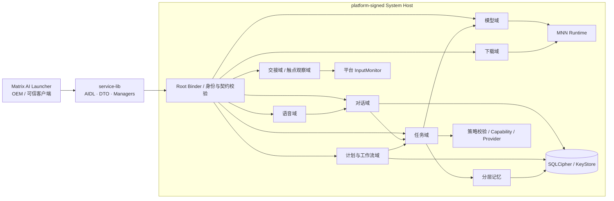

# 开发与验证

[返回首页](../README.md) · [功能与交互](功能与交互.md) · [图片来源](images/README.md)

开发基线：2026-09-27 · v0.7.1 / 7001 · Room schema 16 · Parcel schema 13。Host、SDK 消费端和 Launcher 应配套升级；同版本的不同开发构建以验证记录中的 APK SHA-256 区分。

除获取源码外，以下构建与设备命令均从仓库根目录执行。

[架构](#architecture) · [构建运行](#quickstart) · [SDK 接入](#sdk) · [质量验证](#verification) · [当前边界](#boundaries)

<a id="architecture"></a>
## 系统架构

下图维护域之间的主要依赖；首页的[图像版架构](architecture/matrix-agent-architecture-dark-2026-09-28.png)用于展示逻辑分层，两者不表示所有扩展接口或全部回调路径。



Root Binder 通过系统 `ServiceManager` 发布，同时保留签名权限保护的显式绑定入口。客户端取得对应域 Manager；SDK 处理 Binder 死亡、重连和受支持的活动订阅恢复。记忆通过 Host 内部任务链和 Capability 使用，身份从当前请求派生，不暴露数据库访问给客户端。

| 模块 | 交付物与职责 |
|---|---|
| `matrix-agent-service` | `com.matrix.agent` APK；system UID Host、任务 / 对话 / 调度、模型 / 语音 / 下载、交接 / 输入观察、记忆、存储与审计 |
| `matrix-agent-service-lib` | AAR；AIDL、Parcelable DTO、错误码、版本协商、`MatrixAgent` 门面与类型安全 Manager |
| `matrix-agent-launcher` | `com.matrix.agent.launcher` APK；Java + XML + MVVM 工作区、窗口和角色呈现，仅依赖 SDK 使用 Host 能力 |
| `matrix-agent-test` | trusted / untrusted APK；跨 APK 权限、身份、契约与 Binder 验证 |
| `ondevice` | Android Library + JNI；MNN-LLM Java 边界与 native 生命周期，不直接暴露给客户端 |

Host 管事实，SDK 管契约，Launcher 管呈现。权限、版本、模型与执行失败必须成为可解释状态，客户端不能伪造用户、音区、车辆状态或绕过 Host 策略。

<a id="quickstart"></a>
## 构建与运行

### 环境与系统材料

| 项目 | 当前配置 |
|---|---|
| 工具链 | macOS / Linux；JDK 17+，源码级别 Java 17；最近门禁使用 JDK 21 |
| Android | compile / target SDK 36，min SDK 28；系统功能支持范围需另看目标 ROM，触点观察要求 API 35+ |
| 构建 | Gradle Wrapper 9.3.1、AGP 9.0.1、Android NDK、CMake 3.22.1 |
| 目标架构 | `arm64-v8a` |
| 系统集成 | 与目标 ROM 一致的 platform 证书、framework compile stub、权限与 SELinux 配置 |

Host 声明 `android:sharedUserId="android.uid.system"` 并使用系统 API。普通 `android.jar` 或另一套 ROM 的证书不能替代匹配的系统构建材料。

### 获取与配置

```bash
git clone --recurse-submodules https://github.com/Zcorpius/MatrixAgentProject.git
cd MatrixAgentProject
# 已有工作区需要补齐子模块时执行：
git submodule update --init --recursive
```

MNN 子模块 `ondevice/src/main/cpp/MNN` 固定为 `18759c835f7c36d3fcaec25f6d9a029386e802f8`。根目录 `local.properties` 配置本机 SDK，不提交本机路径：

```properties
sdk.dir=/absolute/path/to/Android/sdk
```

Service、Launcher 和 Test 三个 APK 模块各自的 `tools/key/` 需要 `platform.p12`、`platform.x509.pem` 与 `signing.properties`。生产私钥不得提交仓库。Service 还使用目标 ROM 的编译桩 `matrix-agent-service/tools/framework/framework-lineage-grus.jar`，仅作 `compileOnly`；更新方式见[编译桩说明](../matrix-agent-service/tools/framework/README.md)。

### 构建、安装与首次使用

```bash
./buildTool.sh all debug
# 也可选择模块与变体：
./buildTool.sh service release
./buildTool.sh launcher debug
./buildTool.sh test release
```

脚本执行 clean、构建、签名指纹校验并原子归档到 `outputs/`。版本统一来自根目录 `gradle.properties`。以下直接使用 debug 构建的确定路径安装，设备须与 APK 签名匹配：

```bash
adb install -r matrix-agent-service/build/outputs/apk/debug/matrix-agent-service-debug.apk
adb install -r matrix-agent-launcher/build/outputs/apk/debug/matrix-agent-launcher-debug.apk
adb shell am start -n com.matrix.agent.launcher/.LauncherActivity
```

1. 等待顶部显示 `HOST ONLINE`，在“模型接入”配置并启用可用运行时。
2. 先用文字对话验证请求与回复。使用语音前授权麦克风并下载所需识别资源。
3. 使用跨应用能力时授予悬浮窗访问和 Host 无障碍服务权限，并安装目标媒体应用。
4. 在“任务中心”预览计划或选择模板；确认通知可用和授权范围后再启用。

ROM 集成通过 `android_app_import` 将 release APK 预埋为 `priv-app`，同步维护产品包、默认权限与 SELinux。预埋 APK、平台证书、framework stub 与设备 ROM 应属于同一构建基线。

<a id="sdk"></a>
## SDK 接入

SDK 坐标为 `com.matrix.agent:matrix-agent-service-lib:0.7.1`。开发时发布到本机 Maven，再在客户端仓库配置中启用 `mavenLocal()`：

```bash
./gradlew :matrix-agent-service-lib:publishToMavenLocal
```

```kotlin
dependencies {
    implementation("com.matrix.agent:matrix-agent-service-lib:0.7.1")
}
```

可信客户端需使用受允许的签名并声明权限；仅写入权限声明不会获得调用资格：

```xml
<uses-permission android:name="com.matrix.agent.permission.ACCESS_AGENT" />
```

### 连接与调用线程

连接可异步开始，但取得 Manager 与业务方法仍可能执行同步 Binder 调用，应放到组件持有的后台执行器。生命周期回调可能因重连重复出现，不应在每次 `CONNECTED` 时自动提交新任务。

```java
// 组件初始化时保存这两个对象；连接回调仅更新连接状态。
ExecutorService sdkCalls = Executors.newSingleThreadExecutor();
MatrixAgent agent = MatrixAgent.createAsyncHandle(context, (client, state) -> {
    // 将 state 投影到界面状态。
});

// 以下由一次用户操作触发；重试同一次操作时复用此 requestId。
String requestId = UUID.randomUUID().toString();
AgentRequest request = new AgentRequest(
        requestId, "example-session", "查询当前屏幕亮度",
        AgentRequest.INPUT_TEXT, "zh-CN");

sdkCalls.execute(() -> {
    MatrixAgentManager tasks = agent.getAgentManager();
    if (tasks == null) {
        // 尚未连接：向界面报告不可用，保留原请求供显式重试。
        return;
    }
    AgentTaskHandle handle = tasks.submit(request, event -> {
        // SDK 投递到事件 Handler；按 taskId 更新组件状态。
    });
    if (handle.errorCode != MatrixErrorCode.SUCCESS) {
        // 处理稳定错误码；不能把返回句柄等同于任务已成功执行。
        return;
    }
    // 保存 handle.taskId，用于查询、订阅或取消。
});
```

示例省略 import 和业务 UI。组件结束时停止接收新调用、关闭所持订阅、释放 `agent.release()` 并关闭后台执行器；不要在主线程等待正在执行的 Binder 调用结束。

### 域接口

| Manager 入口 | 用途 |
|---|---|
| `getAgentManager()` | 提交、查询、订阅和控制任务 |
| `getConversationManager()` | 会话、消息分页、文字提交、草稿与语音绑定 |
| `getScheduleManager()` | 就绪检查、计划预览与控制、运行 / 步骤、模板与日历绑定 |
| `getModelManager()` / `getDownloadManager()` | 模型配置、运行时、目录、下载和安装事实 |
| `getVoiceManager()` | 识别、会话、唤醒与播报 |
| `getHandoffManager()` / `getAttachmentManager()` | 跨应用交接与受控附件 staging |
| `getOverlayInteractionManager()` | 全屏输入副本订阅，Host 限制为同用户可信 Launcher，并要求租约管理 |
| `getDebugTraceManager()` | 内部调试轨迹，受 `matrix.debugTraceUi` 构建开关限制 |

返回 `AutoCloseable` 的订阅需按生命周期关闭；输入观察域使用独立的订阅、续约与退订协议，不能照搬普通订阅的使用方式。服务未通告的扩展域可能返回 `null`。

对话通过 `createConversation()`、`sendText()` 等接口使用；创建与发送分别保存稳定 `clientOperationId`，检查创建返回值与提交结果。PTT 先通过 `createVoiceBinding()` 建立一次性关联，再开始语音会话。计划修改使用稳定 `operationId` 和当前 revision；回执不确定时重试原编号，分页按返回游标继续读取。客户端不得直接读取 Host 数据库或模型文件。

<a id="verification"></a>
## 质量验证

### 最新完整回归：2026-09-27

以下是当前代码基线已有的验证记录；工作区图片采集与文档排版调整不计入功能回归。

| 验证范围 | 结果 |
|---|---|
| 根 `verifyArchitecture` | 五模块 `check` 与 SDK 发布依赖检查通过 |
| JVM 全项目 | **1,516 项通过**，0 失败 / 错误 / 跳过：Host 1,414、SDK 20、Launcher 70、独立测试 APK 两变体合计 4、ondevice 8 |
| 最新真机联合套件 | **47 项通过，96.081 秒**；Host、Launcher 与 Launcher androidTest 配套安装 |
| 全屏触点与问候 | 5 项跨进程输入测试，15 项角色组件测试；覆盖真实输入链路、方向、800ms 恢复、多指、优先级和租约释放 |
| 拖动与窗口 | 3 项方向拖动测试，22 项控制器与窗口测试 |
| 真实外部应用流程 | 2 项 QQ 音乐交接、会话、草稿、输入法、返回与已有应用内搜索流程 |

设备手势通过 UiAutomation 注入真实 InputDispatcher；5 分钟问候边界使用确定性 JVM 时钟验证，并未让设备等待 5 分钟。详细结果见[最新验证报告](verification/yukino-interaction-2026-09-27/README.md)、[JVM 汇总](verification/yukino-interaction-2026-09-27/jvm-tests.json)、[真机日志](verification/yukino-interaction-2026-09-27/device-tests.txt)和[APK SHA-256](verification/yukino-interaction-2026-09-27/apk-sha256.json)。

### 其他专项证据

各专项分批执行，不与上表相加，也不代表在每次改动后全部重新认证。

| 专项 | 已记录结果与范围 |
|---|---|
| [定时任务 v0.7.1](Agent定时任务实施记录.md) | 13 项核心真机测试；通知权限变化；system UID 下深度 Doze 的 100 + 10 个计划交付；130% / 200% 字体与草稿检查 |
| [媒体语义理解](verification/media-model-understanding-2026-09-27/README.md) | 配置模型驱动 QQ 音乐 / B 站搜索；QQ 独立确认后真实播放回读，B 站仅核验搜索候选 |
| [实心桌面图标](verification/matrix-ai-icon-solid-2026-09-27/README.md) | 覆盖安装、Matrix AI 名称、实心中心、圆形裁切和启动检查 |
| [方向拖动截图](verification/matrix-ai-drag-2026-09-27/README.md) | 新版图标背景下重新采集左右跑步，并复验手势 |
| [跨应用基础阶段](Agent跨应用悬浮窗实现与真机验证记录.md) | 2026-09-26 的消息、历史、窗口与 Binder 验证；旧结果按原日期保留 |

### 如何复验

无需连接设备的完整门禁：

```bash
./gradlew verifyArchitecture
```

该任务包含五模块单元测试、lint 与架构边界检查，并核对发布 SDK 元数据不携带 Kotlin runtime。Launcher 的 47 项设备套件按[复现命令](verification/yukino-interaction-2026-09-27/README.md#复现及证据)安装并执行，需要匹配的系统签名、在线 Host、悬浮窗权限、QQ 音乐及对应中文桌面。

跨 APK 独立测试入口为 `:matrix-agent-test:connectedLocalHostIntegrationAndroidTest`。Host 的语音与端侧认证任务涉及带 system UID 的 instrumentation，构建脚本对可能影响 Host 数据的 connected test 设有显式保护；应在准备好的专用测试设备上按任务前置条件运行，见[Host 构建配置](../matrix-agent-service/build.gradle.kts)。

<a id="boundaries"></a>
## 当前边界

- **设备范围**：当前主要真机基线为 Mi 9 SE / Android 15 / LineageOS 22.2；min SDK 不代表所有系统功能在旧 API 或其他 ROM 上可用。多 ROM、分屏及长时压力尚未完成完整矩阵。
- **车辆能力**：默认使用 emulator / demo Provider。接入真实车辆需实现 OEM/VHAL Provider，并复用策略、参数校验与 readback 契约。
- **媒体自动化**：仍受目标 App 的页面、版本、权限和网络影响；B 站本轮搜索成功不等于视频播放闭环已认证。
- **角色交互**：输入观察依赖平台能力，系统主动隐藏悬浮窗时不能绕过；挥手历史按进程保留，角色动画不改变 Host 的任务状态或授权。
- **计划与工作流**：首期为已解锁前台 user 0 与两个固定模板；ROM 私有时钟桥未实现，磁盘满、密钥失效、多用户切换和部分精确崩溃窗口尚未完成专项设备认证。
- **记忆**：Working 仅支持已核验温控状态；Episodic 仅保存事实白名单，无联系人或拨号历史。检索使用受控词表与关键词评分，尚无向量检索或可视化记忆管理页；事件逐条删除需完整 32 位十六进制编号。
- **端侧资源与供应链**：MNN 当前启用 arm64 CPU，GPU 后端关闭。缺少发布者签名或逐文件摘要的上游目录，只能提供固定 HTTPS 来源、大小 / 结构限制与缓存，不能视为独立可信根；页面中的目录提示不扩大这一保证。
- **语音与资源认证**：JVM 通过不替代麦克风、唤醒、音频焦点、云端返回、TTS 回退、实际扬声器输出和模型峰值内存的目标设备验证。
